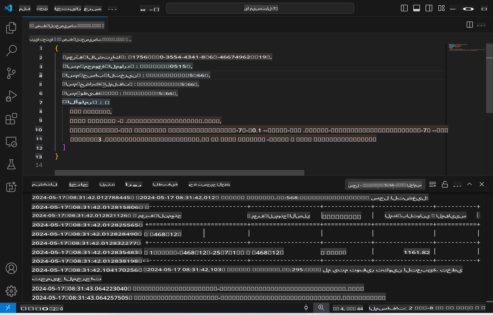
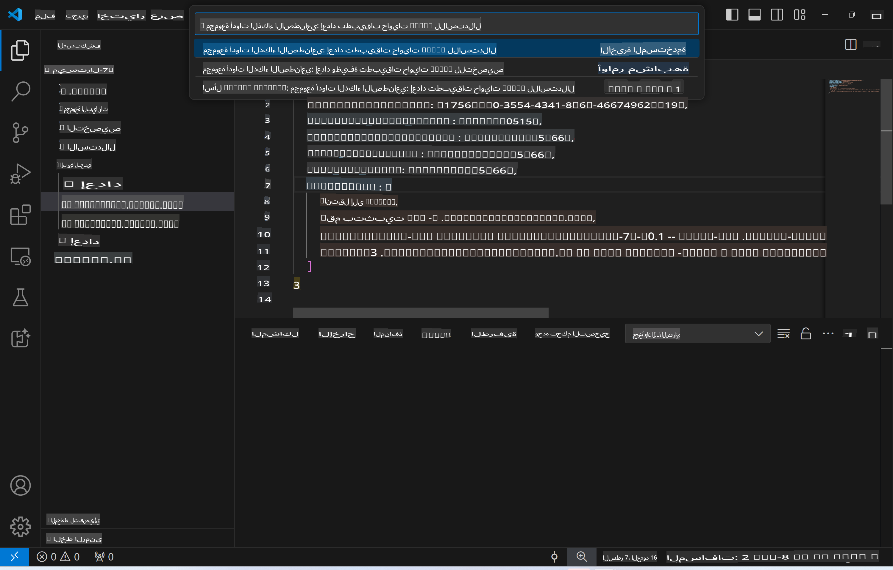
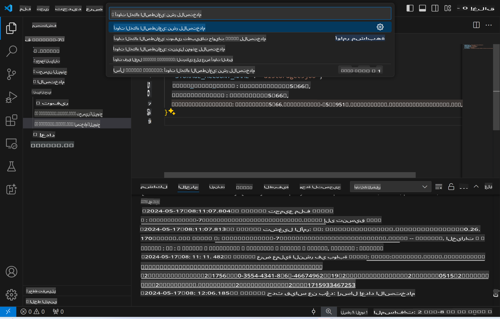
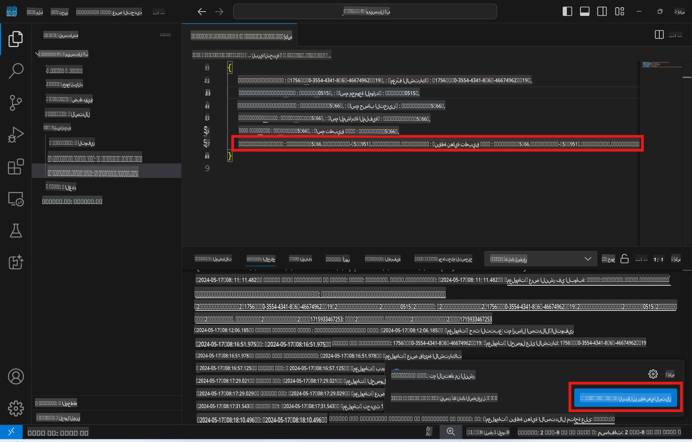

# الاستدلال عن بُعد باستخدام النموذج المُخصص

بعد تدريب المحولات في البيئة البعيدة، يمكنك استخدام تطبيق بسيط يعتمد على Gradio للتفاعل مع النموذج.



### إعداد موارد Azure
يجب عليك إعداد موارد Azure للاستدلال عن بُعد عن طريق تنفيذ `AI Toolkit: Provision Azure Container Apps for inference` من لوحة الأوامر. خلال هذه العملية، سيتم سؤالك عن اختيار اشتراك Azure ومجموعة الموارد الخاصة بك.  


بشكل افتراضي، يجب أن يتطابق الاشتراك ومجموعة الموارد للاستدلال مع تلك المستخدمة في التخصيص. سيستخدم الاستدلال نفس بيئة Azure Container App وسيصل إلى النموذج ومحولات النموذج المخزنة في Azure Files، والتي تم إنشاؤها خلال مرحلة التخصيص.

## استخدام AI Toolkit

### نشر النموذج للاستدلال  
إذا كنت ترغب في تعديل كود الاستدلال أو إعادة تحميل نموذج الاستدلال، قم بتنفيذ الأمر `AI Toolkit: Deploy for inference`. سيقوم هذا بمزامنة الكود الأخير الخاص بك مع ACA وإعادة تشغيل النسخة.



بعد إكمال النشر بنجاح، يصبح النموذج جاهزًا للتقييم باستخدام هذا النقطة النهائية.

### الوصول إلى واجهة برمجة تطبيقات الاستدلال

يمكنك الوصول إلى واجهة برمجة تطبيقات الاستدلال بالنقر على زر "*الانتقال إلى نقطة نهاية الاستدلال*" الذي يظهر في إشعار VSCode. بدلاً من ذلك، يمكن العثور على نقطة النهاية الخاصة بواجهة الويب في `ACA_APP_ENDPOINT` داخل `./infra/inference.config.json` وفي لوحة الإخراج.



> **ملاحظة:** قد يستغرق الأمر بضع دقائق لتصبح نقطة نهاية الاستدلال جاهزة بالكامل.

## مكونات الاستدلال المضمنة في القالب

| المجلد | المحتويات |
| ------ |--------- |
| `infra` | يحتوي على جميع التكوينات اللازمة للعمليات البعيدة. |
| `infra/provision/inference.parameters.json` | يحتوي على معلمات قوالب Bicep المستخدمة في توفير موارد Azure للاستدلال. |
| `infra/provision/inference.bicep` | يحتوي على قوالب لتوفير موارد Azure للاستدلال. |
| `infra/inference.config.json` | ملف التكوين، الذي يتم إنشاؤه بواسطة الأمر `AI Toolkit: Provision Azure Container Apps for inference`. يُستخدم كمدخلات لأوامر أخرى في لوحة الأوامر البعيدة. |

### استخدام AI Toolkit لتكوين توفير موارد Azure
قم بتكوين [AI Toolkit](https://marketplace.visualstudio.com/items?itemName=ms-windows-ai-studio.windows-ai-studio)

قم بتوفير تطبيقات Azure Container للاستدلال` command.

You can find configuration parameters in `./infra/provision/inference.parameters.json` file. Here are the details:
| Parameter | Description |
| --------- |------------ |
| `defaultCommands` | This is the commands to initiate a web API. |
| `maximumInstanceCount` | This parameter sets the maximum capacity of GPU instances. |
| `location` | This is the location where Azure resources are provisioned. The default value is the same as the chosen resource group's location. |
| `storageAccountName`, `fileShareName` `acaEnvironmentName`, `acaEnvironmentStorageName`, `acaAppName`,  `acaLogAnalyticsName` | These parameters are used to name the Azure resources for provision. By default, they will be same to the fine-tuning resource name. You can input a new, unused resource name to create your own custom-named resources, or you can input the name of an already existing Azure resource if you'd prefer to use that. For details, refer to the section [Using existing Azure Resources](../../../../../md/01.Introduction/03). |

### Using Existing Azure Resources

By default, the inference provision use the same Azure Container App Environment, Storage Account, Azure File Share, and Azure Log Analytics that were used for fine-tuning. A separate Azure Container App is created solely for the inference API. 

If you have customized the Azure resources during the fine-tuning step or want to use your own existing Azure resources for inference, specify their names in the `./infra/inference.parameters.json` file. ثم قم بتشغيل الأمر `AI Toolkit: Provision Azure Container Apps for inference` من لوحة الأوامر. سيؤدي ذلك إلى تحديث الموارد المحددة وإنشاء أي موارد مفقودة.

على سبيل المثال، إذا كان لديك بيئة حاويات Azure موجودة، يجب أن يبدو ملف `./infra/finetuning.parameters.json` الخاص بك كما يلي:

```json
{
    "$schema": "https://schema.management.azure.com/schemas/2019-04-01/deploymentParameters.json#",
    "contentVersion": "1.0.0.0",
    "parameters": {
      ...
      "acaEnvironmentName": {
        "value": "<your-aca-env-name>"
      },
      "acaEnvironmentStorageName": {
        "value": null
      },
      ...
    }
  }
```

### التوفير اليدوي  
إذا كنت تفضل تكوين موارد Azure يدويًا، يمكنك استخدام ملفات Bicep المتوفرة في الملف `./infra/provision` folders. If you have already set up and configured all the Azure resources without using the AI Toolkit command palette, you can simply enter the resource names in the `inference.config.json`.

على سبيل المثال:

```json
{
  "SUBSCRIPTION_ID": "<your-subscription-id>",
  "RESOURCE_GROUP_NAME": "<your-resource-group-name>",
  "STORAGE_ACCOUNT_NAME": "<your-storage-account-name>",
  "FILE_SHARE_NAME": "<your-file-share-name>",
  "ACA_APP_NAME": "<your-aca-name>",
  "ACA_APP_ENDPOINT": "<your-aca-endpoint>"
}
```

**إخلاء المسؤولية**:  
تمت ترجمة هذا المستند باستخدام خدمات الترجمة الآلية القائمة على الذكاء الاصطناعي. بينما نسعى لتحقيق الدقة، يرجى العلم بأن الترجمات الآلية قد تحتوي على أخطاء أو معلومات غير دقيقة. يجب اعتبار المستند الأصلي بلغته الأصلية هو المصدر الموثوق. للحصول على معلومات حاسمة، يُوصى باللجوء إلى ترجمة بشرية احترافية. نحن غير مسؤولين عن أي سوء فهم أو تفسير خاطئ ينشأ عن استخدام هذه الترجمة.