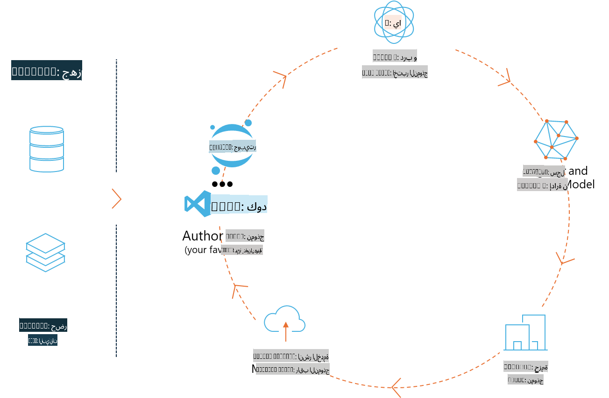
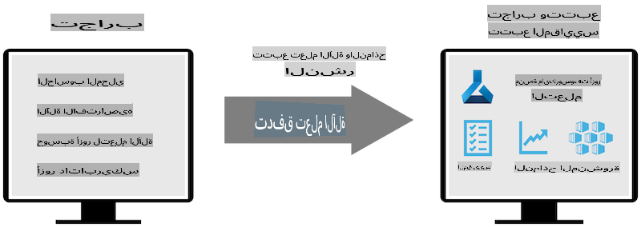
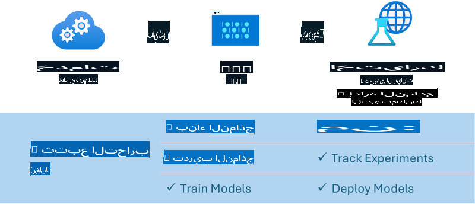

# MLflow

[MLflow](https://mlflow.org/) هي منصة مفتوحة المصدر مصممة لإدارة دورة حياة تعلم الآلة من البداية إلى النهاية.



يُستخدم MLFlow لإدارة دورة حياة تعلم الآلة، بما في ذلك التجارب، وإعادة الإنتاج، والنشر، وسجل النماذج المركزي. يقدم MLFlow حاليًا أربعة مكونات:

- **MLflow Tracking:** تسجيل واستعلام التجارب، الكود، إعدادات البيانات والنتائج.
- **MLflow Projects:** تغليف كود علم البيانات بتنسيق يمكن تشغيله على أي منصة.
- **MLflow Models:** نشر نماذج تعلم الآلة في بيئات تقديم متنوعة.
- **Model Registry:** تخزين، توضيح، وإدارة النماذج في مستودع مركزي.

يتضمن MLFlow ميزات لتتبع التجارب، وتغليف الكود لتشغيله بشكل يمكن إعادة إنتاجه، ومشاركة النماذج ونشرها. يتكامل MLFlow مع Databricks ويدعم مجموعة متنوعة من مكتبات تعلم الآلة، مما يجعله مستقلاً عن المكتبة المستخدمة. يمكن استخدامه مع أي مكتبة تعلم آلة وفي أي لغة برمجة، حيث يوفر واجهة REST API وCLI لسهولة الاستخدام.



الميزات الرئيسية لـ MLFlow تشمل:

- **تتبع التجارب:** تسجيل ومقارنة المعلمات والنتائج.
- **إدارة النماذج:** نشر النماذج على منصات تقديم واستدلال متنوعة.
- **سجل النماذج:** إدارة دورة حياة نماذج MLFlow بشكل تعاوني، بما في ذلك إصدار النماذج وإضافة التعليقات التوضيحية.
- **المشاريع:** تغليف كود تعلم الآلة للمشاركة أو الاستخدام في الإنتاج.

يدعم MLFlow أيضًا دورة حياة MLOps، والتي تشمل إعداد البيانات، تسجيل وإدارة النماذج، تغليف النماذج للتنفيذ، نشر الخدمات، ومراقبة النماذج. يهدف إلى تبسيط عملية الانتقال من النموذج الأولي إلى سير العمل الإنتاجي، خاصة في البيئات السحابية وعلى الأطراف.

## سيناريو شامل - بناء غلاف واستخدام Phi-3 كنموذج MLFlow

في هذا المثال الشامل، سنوضح طريقتين مختلفتين لبناء غلاف حول نموذج اللغة الصغيرة Phi-3 (SLM) ثم تشغيله كنموذج MLFlow إما محليًا أو في السحابة، مثل مساحة عمل Azure Machine Learning.



| المشروع | الوصف | الموقع |
| ------------ | ----------- | -------- |
| خط أنابيب المحول | خط أنابيب المحول هو الخيار الأسهل لبناء غلاف إذا كنت تريد استخدام نموذج HuggingFace مع نكهة المحولات التجريبية لـ MLFlow. | [**TransformerPipeline.ipynb**](../../../../../../code/06.E2E/E2E_Phi-3-MLflow_TransformerPipeline.ipynb) |
| غلاف بايثون مخصص | في وقت كتابة هذا النص، لم يدعم خط أنابيب المحول إنشاء غلاف MLFlow لنماذج HuggingFace بتنسيق ONNX، حتى مع حزمة بايثون التجريبية optimum. في الحالات مثل هذه، يمكنك بناء غلاف بايثون مخصص لوضع MLFlow. | [**CustomPythonWrapper.ipynb**](../../../../../../code/06.E2E/E2E_Phi-3-MLflow_CustomPythonWrapper.ipynb) |

## المشروع: خط أنابيب المحول

1. ستحتاج إلى حزم بايثون ذات الصلة من MLFlow وHuggingFace:

    ``` Python
    import mlflow
    import transformers
    ```

2. بعد ذلك، يجب أن تبدأ خط أنابيب المحول بالإشارة إلى نموذج Phi-3 المستهدف في سجل HuggingFace. كما يمكن ملاحظته من بطاقة نموذج _Phi-3-mini-4k-instruct_، فإن مهمته من نوع "توليد النصوص":

    ``` Python
    pipeline = transformers.pipeline(
        task = "text-generation",
        model = "microsoft/Phi-3-mini-4k-instruct"
    )
    ```

3. يمكنك الآن حفظ خط أنابيب المحول لنموذج Phi-3 بتنسيق MLFlow وتوفير تفاصيل إضافية مثل مسار المستودعات المستهدف، إعدادات تكوين النموذج المحددة ونوع API الاستدلال:

    ``` Python
    model_info = mlflow.transformers.log_model(
        transformers_model = pipeline,
        artifact_path = "phi3-mlflow-model",
        model_config = model_config,
        task = "llm/v1/chat"
    )
    ```

## المشروع: غلاف بايثون مخصص

1. يمكننا هنا استخدام [واجهة برمجة تطبيقات ONNX Runtime generate()](https://github.com/microsoft/onnxruntime-genai) من مايكروسوفت لاستدلال نموذج ONNX وترميز / فك ترميز الرموز. عليك اختيار حزمة _onnxruntime_genai_ للحوسبة المستهدفة، مع المثال أدناه الذي يستهدف وحدة المعالجة المركزية:

    ``` Python
    import mlflow
    from mlflow.models import infer_signature
    import onnxruntime_genai as og
    ```

1. تقوم فئتنا المخصصة بتنفيذ طريقتين: _load_context()_ لتفعيل **نموذج ONNX** الخاص بـ Phi-3 Mini 4K Instruct، **معلمات التوليد** و**الرمز المميز**؛ و_predict()_ لتوليد الرموز الناتجة للمطالبة المقدمة:

    ``` Python
    class Phi3Model(mlflow.pyfunc.PythonModel):
        def load_context(self, context):
            # Retrieving model from the artifacts
            model_path = context.artifacts["phi3-mini-onnx"]
            model_options = {
                 "max_length": 300,
                 "temperature": 0.2,         
            }
        
            # Defining the model
            self.phi3_model = og.Model(model_path)
            self.params = og.GeneratorParams(self.phi3_model)
            self.params.set_search_options(**model_options)
            
            # Defining the tokenizer
            self.tokenizer = og.Tokenizer(self.phi3_model)
    
        def predict(self, context, model_input):
            # Retrieving prompt from the input
            prompt = model_input["prompt"][0]
            self.params.input_ids = self.tokenizer.encode(prompt)
    
            # Generating the model's response
            response = self.phi3_model.generate(self.params)
    
            return self.tokenizer.decode(response[0][len(self.params.input_ids):])
    ```

1. يمكنك الآن استخدام وظيفة _mlflow.pyfunc.log_model()_ لإنشاء غلاف بايثون مخصص (بتنسيق pickle) لنموذج Phi-3، مع نموذج ONNX الأصلي والاعتماديات المطلوبة:

    ``` Python
    model_info = mlflow.pyfunc.log_model(
        artifact_path = artifact_path,
        python_model = Phi3Model(),
        artifacts = {
            "phi3-mini-onnx": "cpu_and_mobile/cpu-int4-rtn-block-32-acc-level-4",
        },
        input_example = input_example,
        signature = infer_signature(input_example, ["Run"]),
        extra_pip_requirements = ["torch", "onnxruntime_genai", "numpy"],
    )
    ```

## توقيعات نماذج MLFlow المُنشأة

1. في الخطوة 3 من مشروع خط أنابيب المحول أعلاه، قمنا بتعيين مهمة نموذج MLFlow إلى "_llm/v1/chat_". ينتج عن هذا الإعداد غلاف API للنموذج، متوافق مع واجهة برمجة التطبيقات Chat الخاصة بـ OpenAI كما هو موضح أدناه:

    ``` Python
    {inputs: 
      ['messages': Array({content: string (required), name: string (optional), role: string (required)}) (required), 'temperature': double (optional), 'max_tokens': long (optional), 'stop': Array(string) (optional), 'n': long (optional), 'stream': boolean (optional)],
    outputs: 
      ['id': string (required), 'object': string (required), 'created': long (required), 'model': string (required), 'choices': Array({finish_reason: string (required), index: long (required), message: {content: string (required), name: string (optional), role: string (required)} (required)}) (required), 'usage': {completion_tokens: long (required), prompt_tokens: long (required), total_tokens: long (required)} (required)],
    params: 
      None}
    ```

1. ونتيجة لذلك، يمكنك تقديم المطالبة بالتنسيق التالي:

    ``` Python
    messages = [{"role": "user", "content": "What is the capital of Spain?"}]
    ```

1. ثم، استخدم معالجة ما بعد متوافقة مع واجهة برمجة التطبيقات OpenAI، مثل _response[0][‘choices’][0][‘message’][‘content’]_، لتحسين الناتج ليبدو كالتالي:

    ``` JSON
    Question: What is the capital of Spain?
    
    Answer: The capital of Spain is Madrid. It is the largest city in Spain and serves as the political, economic, and cultural center of the country. Madrid is located in the center of the Iberian Peninsula and is known for its rich history, art, and architecture, including the Royal Palace, the Prado Museum, and the Plaza Mayor.
    
    Usage: {'prompt_tokens': 11, 'completion_tokens': 73, 'total_tokens': 84}
    ```

1. في الخطوة 3 من مشروع غلاف بايثون المخصص أعلاه، نسمح لحزمة MLFlow بإنشاء توقيع النموذج من مثال الإدخال المعطى. سيبدو توقيع غلاف MLFlow الخاص بنا كالتالي:

    ``` Python
    {inputs: 
      ['prompt': string (required)],
    outputs: 
      [string (required)],
    params: 
      None}
    ```

1. لذلك، ستحتاج المطالبة إلى احتواء مفتاح "prompt" في القاموس، مثل هذا:

    ``` Python
    {"prompt": "<|system|>You are a stand-up comedian.<|end|><|user|>Tell me a joke about atom<|end|><|assistant|>",}
    ```

1. سيتم تقديم إخراج النموذج بعد ذلك بتنسيق نصي:

    ``` JSON
    Alright, here's a little atom-related joke for you!
    
    Why don't electrons ever play hide and seek with protons?
    
    Because good luck finding them when they're always "sharing" their electrons!
    
    Remember, this is all in good fun, and we're just having a little atomic-level humor!
    ```

**إخلاء المسؤولية**:  
تم ترجمة هذا المستند باستخدام خدمات الترجمة الآلية المعتمدة على الذكاء الاصطناعي. بينما نسعى لتحقيق الدقة، يرجى العلم أن الترجمات الآلية قد تحتوي على أخطاء أو عدم دقة. يجب اعتبار المستند الأصلي بلغته الأصلية المصدر الموثوق. للحصول على معلومات حاسمة، يُوصى بالاستعانة بترجمة بشرية احترافية. نحن غير مسؤولين عن أي سوء فهم أو تفسير خاطئ ينشأ عن استخدام هذه الترجمة.