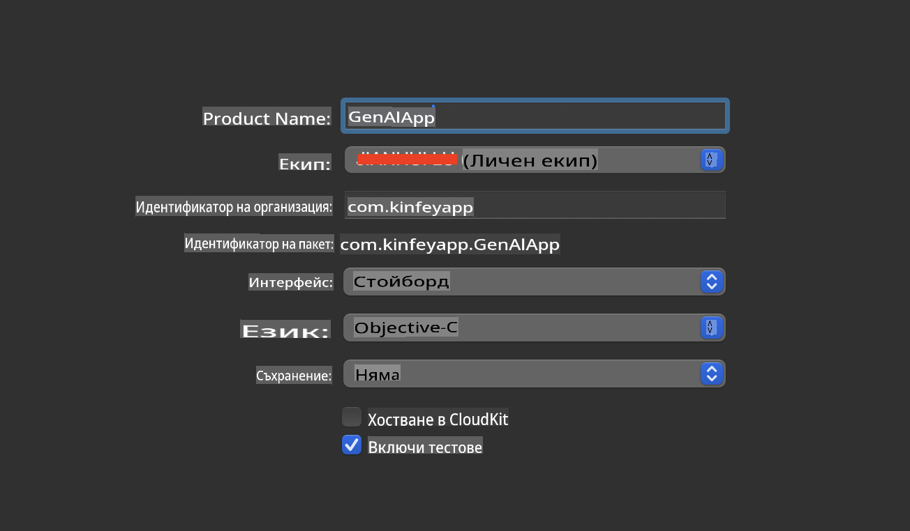
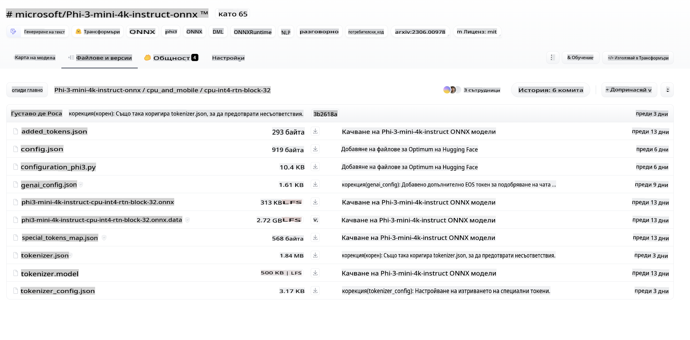
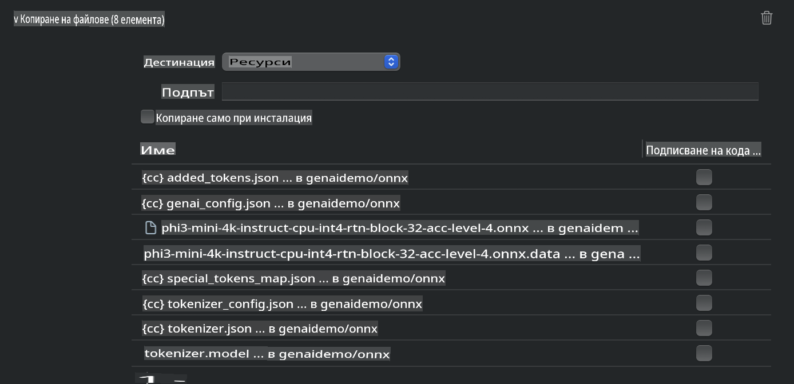
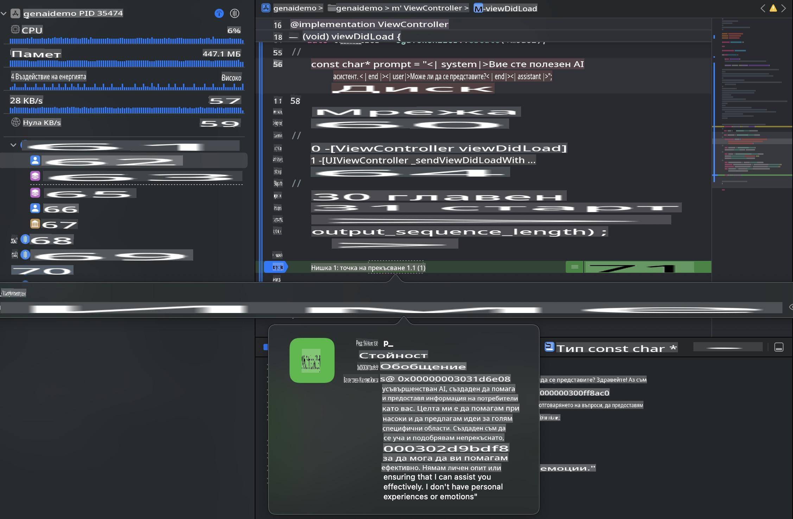

# **Inference Phi-3 в iOS**

Phi-3-mini е нова серия модели от Microsoft, която позволява внедряване на Големи Езикови Модели (LLMs) на edge устройства и IoT устройства. Phi-3-mini е наличен за iOS, Android и edge устройства, което позволява внедряване на генеративен AI в BYOD среди. Следният пример демонстрира как да внедрите Phi-3-mini на iOS.

## **1. Подготовка**

- **a.** macOS 14+
- **b.** Xcode 15+
- **c.** iOS SDK 17.x (iPhone 14 A16 или по-нов)
- **d.** Инсталирайте Python 3.10+ (Препоръчва се Conda)
- **e.** Инсталирайте Python библиотеката: `python-flatbuffers`
- **f.** Инсталирайте CMake

### Semantic Kernel и Инференция

Semantic Kernel е приложение-фреймуърк, който ви позволява да създавате приложения, съвместими с Azure OpenAI Service, OpenAI модели и дори локални модели. Достъпът до локални услуги чрез Semantic Kernel позволява лесна интеграция с вашия самостоятелно хостван Phi-3-mini сървър за модели.

### Извикване на Квантизирани Модели с Ollama или LlamaEdge

Много потребители предпочитат да използват квантизирани модели за локално изпълнение на модели. [Ollama](https://ollama.com) и [LlamaEdge](https://llamaedge.com) позволяват на потребителите да извикват различни квантизирани модели:

#### **Ollama**

Можете да стартирате `ollama run phi3` директно или да го конфигурирате офлайн. Създайте Modelfile с пътя към вашия `gguf` файл. Примерен код за стартиране на квантизирания модел Phi-3-mini:

```gguf
FROM {Add your gguf file path}
TEMPLATE \"\"\"<|user|> .Prompt<|end|> <|assistant|>\"\"\"
PARAMETER stop <|end|>
PARAMETER num_ctx 4096
```

#### **LlamaEdge**

Ако искате да използвате `gguf` както в облачни, така и в edge устройства едновременно, LlamaEdge е чудесна опция.

## **2. Компилиране на ONNX Runtime за iOS**

```bash

git clone https://github.com/microsoft/onnxruntime.git

cd onnxruntime

./build.sh --build_shared_lib --ios --skip_tests --parallel --build_dir ./build_ios --ios --apple_sysroot iphoneos --osx_arch arm64 --apple_deploy_target 17.5 --cmake_generator Xcode --config Release

cd ../

```

### **Забележка**

- **a.** Преди компилиране, уверете се, че Xcode е правилно конфигуриран и го задайте като активна разработваща директория в терминала:

    ```bash
    sudo xcode-select -switch /Applications/Xcode.app/Contents/Developer
    ```

- **b.** ONNX Runtime трябва да бъде компилиран за различни платформи. За iOS можете да компилирате за `arm64` or `x86_64`.

- **c.** Препоръчително е да използвате последната версия на iOS SDK за компилиране. Въпреки това, можете да използвате и по-стара версия, ако ви е необходима съвместимост с предишни SDK.

## **3. Компилиране на Генеративен AI с ONNX Runtime за iOS**

> **Забележка:** Тъй като Генеративният AI с ONNX Runtime е в предварителна версия, имайте предвид възможни промени.

```bash

git clone https://github.com/microsoft/onnxruntime-genai
 
cd onnxruntime-genai
 
mkdir ort
 
cd ort
 
mkdir include
 
mkdir lib
 
cd ../
 
cp ../onnxruntime/include/onnxruntime/core/session/onnxruntime_c_api.h ort/include
 
cp ../onnxruntime/build_ios/Release/Release-iphoneos/libonnxruntime*.dylib* ort/lib
 
export OPENCV_SKIP_XCODEBUILD_FORCE_TRYCOMPILE_DEBUG=1
 
python3 build.py --parallel --build_dir ./build_ios --ios --ios_sysroot iphoneos --ios_arch arm64 --ios_deployment_target 17.5 --cmake_generator Xcode --cmake_extra_defines CMAKE_XCODE_ATTRIBUTE_CODE_SIGNING_ALLOWED=NO

```

## **4. Създаване на приложение в Xcode**

Избрах Objective-C като метод за разработка на приложението, тъй като при използване на Генеративен AI с ONNX Runtime C++ API, Objective-C е по-съвместим. Разбира се, можете също така да извършите свързаните извиквания чрез Swift bridging.



## **5. Копиране на ONNX квантизирания INT4 модел в проекта на приложението**

Трябва да импортираме INT4 квантизационния модел във формат ONNX, който първо трябва да бъде изтеглен.



След изтегляне, трябва да го добавите в директорията Resources на проекта в Xcode.



## **6. Добавяне на C++ API във ViewControllers**

> **Забележка:**

- **a.** Добавете съответните C++ header файлове към проекта.

  

- **b.** Включете `onnxruntime-genai` dynamic library in Xcode.

  

- **c.** Use the C Samples code for testing. You can also add additional features like ChatUI for more functionality.

- **d.** Since you need to use C++ in your project, rename `ViewController.m` to `ViewController.mm`, за да активирате поддръжка на Objective-C++.

```objc

    NSString *llmPath = [[NSBundle mainBundle] resourcePath];
    char const *modelPath = llmPath.cString;

    auto model =  OgaModel::Create(modelPath);

    auto tokenizer = OgaTokenizer::Create(*model);

    const char* prompt = "<|system|>You are a helpful AI assistant.<|end|><|user|>Can you introduce yourself?<|end|><|assistant|>";

    auto sequences = OgaSequences::Create();
    tokenizer->Encode(prompt, *sequences);

    auto params = OgaGeneratorParams::Create(*model);
    params->SetSearchOption("max_length", 100);
    params->SetInputSequences(*sequences);

    auto output_sequences = model->Generate(*params);
    const auto output_sequence_length = output_sequences->SequenceCount(0);
    const auto* output_sequence_data = output_sequences->SequenceData(0);
    auto out_string = tokenizer->Decode(output_sequence_data, output_sequence_length);
    
    auto tmp = out_string;

```

## **7. Стартиране на приложението**

След като настройката е завършена, можете да стартирате приложението, за да видите резултатите от инференцията на модела Phi-3-mini.



За повече примерен код и подробни инструкции, посетете [Phi-3 Mini Samples repository](https://github.com/Azure-Samples/Phi-3MiniSamples/tree/main/ios).

**Отказ от отговорност**:  
Този документ е преведен с помощта на машинни AI услуги за превод. Въпреки че се стремим към точност, моля, имайте предвид, че автоматизираните преводи може да съдържат грешки или неточности. Оригиналният документ на неговия изходен език трябва да се счита за авторитетния източник. За критична информация се препоръчва професионален превод от човек. Ние не носим отговорност за каквито и да е недоразумения или погрешни интерпретации, произтичащи от използването на този превод.