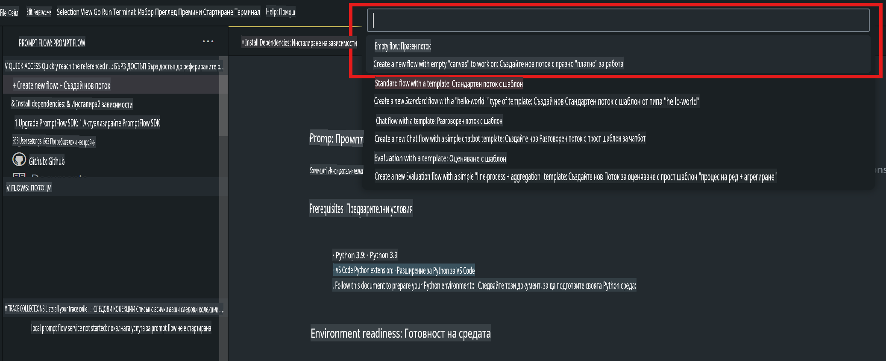

# **Лаборатория 2 - Стартиране на Prompt flow с Phi-3-mini в AIPC**

## **Какво е Prompt flow**

Prompt flow е набор от инструменти за разработка, създадени да улеснят целия цикъл на разработка на AI приложения, базирани на големи езикови модели (LLM) – от идея, прототипиране, тестване, оценка, до внедряване в производство и мониторинг. Това прави инженерството на промптове много по-лесно и ви позволява да създавате AI приложения с производствено качество.

С Prompt flow можете да:

- Създавате потоци, които свързват LLM, промптове, Python код и други инструменти в изпълним работен процес.

- Дебъгвате и усъвършенствате потоците си, особено взаимодействието с LLM, без усилия.

- Оценявате потоците си, изчислявате качествени и производствени метрики с по-големи набори от данни.

- Интегрирате тестването и оценяването в CI/CD системата си, за да гарантирате качеството на потока си.

- Внедрявате потоците си на избраната от вас платформа за обслужване или лесно ги интегрирате в кода на приложението си.

- (Опционално, но силно препоръчително) Сътрудничите с екипа си, използвайки облачната версия на Prompt flow в Azure AI.

## **Какво е AIPC**

AI PC разполага с CPU, GPU и NPU, всяко от които има специфични възможности за ускорение на AI. NPU (neural processing unit) е специализиран ускорител, който обработва задачи, свързани с изкуствен интелект (AI) и машинно обучение (ML), директно на вашия компютър, вместо да изпраща данни за обработка в облака. GPU и CPU също могат да обработват тези натоварвания, но NPU е особено добър при AI изчисления с ниска консумация на енергия. AI PC представлява фундаментална промяна в начина, по който работят компютрите ни. Това не е решение на проблем, който не е съществувал преди, а по-скоро огромно подобрение за ежедневната употреба на компютри.

Как работи това? В сравнение с генеративния AI и масивните големи езикови модели (LLM), обучени върху тонове публични данни, AI, който се изпълнява на вашия компютър, е по-достъпен на почти всяко ниво. Концепцията е по-лесна за разбиране и, тъй като е обучен върху вашите данни, без да се налага достъп до облака, ползите са по-непосредствено привлекателни за по-широка аудитория.

В близко бъдеще светът на AI PC включва лични асистенти и по-малки AI модели, които се изпълняват директно на вашия компютър, използвайки вашите данни, за да предлагат лични, частни и по-сигурни AI подобрения за неща, които вече правите всеки ден – водене на бележки от срещи, организиране на фентъзи футболна лига, автоматизиране на подобрения за редактиране на снимки и видеа или съставяне на перфектен маршрут за семейна среща въз основа на времето за пристигане и заминаване на всички.

## **Създаване на потоци за генериране на код в AIPC**

***Забележка***: Ако не сте завършили инсталацията на средата, моля, посетете [Лаборатория 0 - Инсталации](./01.Installations.md)

1. Отворете разширението Prompt flow в Visual Studio Code и създайте празен проект за поток.



2. Добавете входни и изходни параметри и добавете Python код като нов поток.


Можете да се позовете на тази структура (flow.dag.yaml), за да изградите своя поток:

```yaml

inputs:
  question:
    type: string
    default: how to write Bubble Algorithm
outputs:
  answer:
    type: string
    reference: ${Chat_With_Phi3.output}
nodes:
- name: Chat_With_Phi3
  type: python
  source:
    type: code
    path: Chat_With_Phi3.py
  inputs:
    question: ${inputs.question}


```

3. Добавете код в ***Chat_With_Phi3.py***.

```python


from promptflow.core import tool

# import torch
from transformers import AutoTokenizer, pipeline,TextStreamer
import intel_npu_acceleration_library as npu_lib

import warnings

import asyncio
import platform

class Phi3CodeAgent:
    
    model = None
    tokenizer = None
    text_streamer = None
    
    model_id = "microsoft/Phi-3-mini-4k-instruct"

    @staticmethod
    def init_phi3():
        
        if Phi3CodeAgent.model is None or Phi3CodeAgent.tokenizer is None or Phi3CodeAgent.text_streamer is None:
            Phi3CodeAgent.model = npu_lib.NPUModelForCausalLM.from_pretrained(
                                    Phi3CodeAgent.model_id,
                                    torch_dtype="auto",
                                    dtype=npu_lib.int4,
                                    trust_remote_code=True
                                )
            Phi3CodeAgent.tokenizer = AutoTokenizer.from_pretrained(Phi3CodeAgent.model_id)
            Phi3CodeAgent.text_streamer = TextStreamer(Phi3CodeAgent.tokenizer, skip_prompt=True)

    

    @staticmethod
    def chat_with_phi3(prompt):
        
        Phi3CodeAgent.init_phi3()

        messages = "<|system|>You are a AI Python coding assistant. Please help me to generate code in Python.The answer only genertated Python code, but any comments and instructions do not need to be generated<|end|><|user|>" + prompt +"<|end|><|assistant|>"


        generation_args = {
            "max_new_tokens": 1024,
            "return_full_text": False,
            "temperature": 0.3,
            "do_sample": False,
            "streamer": Phi3CodeAgent.text_streamer,
        }

        pipe = pipeline(
            "text-generation",
            model=Phi3CodeAgent.model,
            tokenizer=Phi3CodeAgent.tokenizer,
            # **generation_args
        )

        result = ''

        with warnings.catch_warnings():
            warnings.simplefilter("ignore")
            response = pipe(messages, **generation_args)
            result =response[0]['generated_text']
            return result


@tool
def my_python_tool(question: str) -> str:
    if platform.system() == 'Windows':
        asyncio.set_event_loop_policy(asyncio.WindowsSelectorEventLoopPolicy())
    return Phi3CodeAgent.chat_with_phi3(question)


```

4. Можете да тествате потока чрез Debug или Run, за да проверите дали генерираният код е правилен.


5. Стартирайте потока като API за разработка в терминала.

```

pf flow serve --source ./ --port 8080 --host localhost   

```

Можете да го тествате в Postman / Thunder Client.

### **Забележка**

1. Първото стартиране отнема много време. Препоръчва се да изтеглите модела phi-3 от Hugging Face CLI.

2. С оглед на ограничената изчислителна мощ на Intel NPU, препоръчва се използването на Phi-3-mini-4k-instruct.

3. Използваме ускорение с Intel NPU за квантоване в INT4 конверсия, но ако рестартирате услугата, трябва да изтриете кеша и папките nc_workshop.

## **Ресурси**

1. Научете Promptflow [https://microsoft.github.io/promptflow/](https://microsoft.github.io/promptflow/)

2. Научете за Intel NPU Acceleration [https://github.com/intel/intel-npu-acceleration-library](https://github.com/intel/intel-npu-acceleration-library)

3. Примерен код, изтеглете [Local NPU Agent Sample Code](../../../../../../../../../code/07.Lab/01/AIPC)

**Отказ от отговорност**:  
Този документ е преведен с помощта на машинни AI услуги за превод. Въпреки че се стремим към точност, моля, имайте предвид, че автоматичните преводи може да съдържат грешки или неточности. Оригиналният документ на неговия оригинален език трябва да се счита за авторитетен източник. За критична информация се препоръчва професионален превод от човек. Ние не носим отговорност за каквито и да било недоразумения или погрешни интерпретации, произтичащи от използването на този превод.