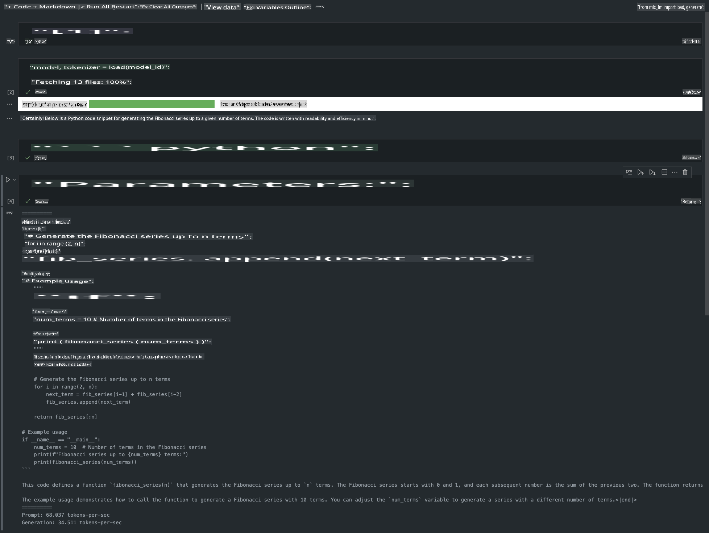

# **Извеждане на Phi-3 с Apple MLX Framework**

## **Какво представлява MLX Framework**

MLX е фреймуърк за машинно обучение, създаден за Apple Silicon, разработен от екипа за машинно обучение на Apple.

MLX е проектиран от изследователи в областта на машинното обучение за изследователи в областта на машинното обучение. Фреймуъркът е създаден да бъде удобен за потребителя, но същевременно ефективен за трениране и внедряване на модели. Дизайнът на самия фреймуърк е концептуално опростен. Нашата цел е да улесним изследователите в разширяването и подобряването на MLX, за да могат бързо да изследват нови идеи.

Големите езикови модели (LLMs) могат да бъдат ускорени на устройства с Apple Silicon чрез MLX, като моделите могат да се изпълняват локално изключително удобно.

## **Използване на MLX за извеждане на Phi-3-mini**

### **1. Настройте вашата MLX среда**

1. Python 3.11.x  
2. Инсталирайте MLX библиотеката  

```bash

pip install mlx-lm

```

### **2. Изпълнение на Phi-3-mini в Terminal с MLX**

```bash

python -m mlx_lm.generate --model microsoft/Phi-3-mini-4k-instruct --max-token 2048 --prompt  "<|user|>\nCan you introduce yourself<|end|>\n<|assistant|>"

```

Резултатът (моята среда е Apple M1 Max, 64GB) е:


### **3. Квантизация на Phi-3-mini с MLX в Terminal**

```bash

python -m mlx_lm.convert --hf-path microsoft/Phi-3-mini-4k-instruct

```

***Забележка:*** Моделът може да бъде квантизиран чрез mlx_lm.convert, като стандартната квантизация е INT4. Този пример квантизира Phi-3-mini до INT4.

Моделът може да бъде квантизиран чрез mlx_lm.convert, като стандартната квантизация е INT4. Този пример квантизира Phi-3-mini до INT4. След квантизацията моделът ще бъде запазен в стандартната директория ./mlx_model.

Можем да тестваме квантизирания модел с MLX от терминала:

```bash

python -m mlx_lm.generate --model ./mlx_model/ --max-token 2048 --prompt  "<|user|>\nCan you introduce yourself<|end|>\n<|assistant|>"

```

Резултатът е:


### **4. Изпълнение на Phi-3-mini с MLX в Jupyter Notebook**



***Забележка:*** Моля, прочетете този пример [кликнете на този линк](../../../../../code/03.Inference/MLX/MLX_DEMO.ipynb)

## **Ресурси**

1. Научете повече за Apple MLX Framework [https://ml-explore.github.io](https://ml-explore.github.io/mlx/build/html/index.html)

2. Apple MLX GitHub хранилище [https://github.com/ml-explore](https://github.com/ml-explore)

**Отказ от отговорност**:  
Този документ е преведен с помощта на услуги за машинен превод, базирани на изкуствен интелект. Въпреки че се стремим към точност, имайте предвид, че автоматизираните преводи може да съдържат грешки или неточности. Оригиналният документ на неговия оригинален език трябва да се счита за авторитетен източник. За критична информация се препоръчва професионален превод от човек. Не носим отговорност за каквито и да било недоразумения или погрешни тълкувания, произтичащи от използването на този превод.