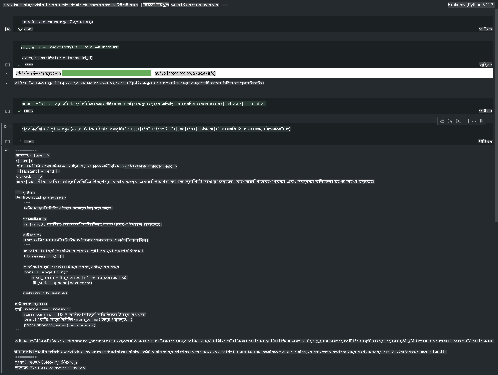

# **Apple MLX ফ্রেমওয়ার্ক দিয়ে Phi-3 ইনফারেন্স করা**

## **MLX ফ্রেমওয়ার্ক কী**

MLX হলো অ্যাপল সিলিকন ডিভাইসের জন্য মেশিন লার্নিং গবেষণার একটি ফ্রেমওয়ার্ক, যা অ্যাপলের মেশিন লার্নিং গবেষণা বিভাগ দ্বারা তৈরি।

MLX বিশেষভাবে মেশিন লার্নিং গবেষকদের জন্য ডিজাইন করা হয়েছে। এটি ব্যবহারকারী-বান্ধব হলেও মডেল ট্রেনিং এবং ডিপ্লয়মেন্টের ক্ষেত্রে দক্ষ। ফ্রেমওয়ার্কটির ডিজাইন নিজেই ধারণাগতভাবে সহজ। আমরা চাই গবেষকরা সহজেই MLX প্রসারিত করতে এবং উন্নত করতে পারেন, যাতে নতুন ধারণাগুলি দ্রুত পরীক্ষা করা যায়।

Apple Silicon ডিভাইসগুলোতে MLX ব্যবহার করে LLMs-কে দ্রুততর করা যায় এবং মডেলগুলো খুব সহজেই লোকালভাবে চালানো যায়।

## **MLX ব্যবহার করে Phi-3-mini ইনফারেন্স করা**

### **১. আপনার MLX পরিবেশ সেটআপ করুন**

1. Python 3.11.x
2. MLX লাইব্রেরি ইন্সটল করুন

```bash

pip install mlx-lm

```

### **২. টার্মিনালে MLX দিয়ে Phi-3-mini চালানো**

```bash

python -m mlx_lm.generate --model microsoft/Phi-3-mini-4k-instruct --max-token 2048 --prompt  "<|user|>\nCan you introduce yourself<|end|>\n<|assistant|>"

```

ফলাফল (আমার পরিবেশ হলো Apple M1 Max, 64GB) হলো 


### **৩. টার্মিনালে MLX দিয়ে Phi-3-mini কে কোয়ান্টাইজ করা**

```bash

python -m mlx_lm.convert --hf-path microsoft/Phi-3-mini-4k-instruct

```

***নোটঃ*** মডেলটি mlx_lm.convert এর মাধ্যমে কোয়ান্টাইজ করা যায়, এবং ডিফল্ট কোয়ান্টাইজেশন হলো INT4। এই উদাহরণে Phi-3-mini কে INT4 এ কোয়ান্টাইজ করা হয়েছে।

mlx_lm.convert এর মাধ্যমে মডেলটি কোয়ান্টাইজ করা যায়, এবং ডিফল্ট কোয়ান্টাইজেশন হলো INT4। এই উদাহরণে Phi-3-mini কে INT4 এ কোয়ান্টাইজ করা হয়েছে। কোয়ান্টাইজেশনের পরে এটি ডিফল্ট ডিরেক্টরি ./mlx_model এ সংরক্ষিত হবে।

আমরা টার্মিনাল থেকে MLX দিয়ে কোয়ান্টাইজ করা মডেলটি পরীক্ষা করতে পারি।

```bash

python -m mlx_lm.generate --model ./mlx_model/ --max-token 2048 --prompt  "<|user|>\nCan you introduce yourself<|end|>\n<|assistant|>"

```

ফলাফল হলো


### **৪. Jupyter Notebook এ MLX দিয়ে Phi-3-mini চালানো**



***নোটঃ*** এই নমুনাটি পড়ুন [এই লিঙ্কে ক্লিক করুন](../../../../../code/03.Inference/MLX/MLX_DEMO.ipynb)

## **উপকরণসমূহ**

1. Apple MLX ফ্রেমওয়ার্ক সম্পর্কে জানুন [https://ml-explore.github.io](https://ml-explore.github.io/mlx/build/html/index.html)

2. Apple MLX GitHub রিপো [https://github.com/ml-explore](https://github.com/ml-explore)

**অস্বীকৃতি**:  
এই নথিটি মেশিন-ভিত্তিক এআই অনুবাদ সেবার মাধ্যমে অনূদিত হয়েছে। আমরা যথাসাধ্য সঠিক অনুবাদ প্রদানের চেষ্টা করি, তবে দয়া করে মনে রাখুন যে স্বয়ংক্রিয় অনুবাদে ভুল বা অসঙ্গতি থাকতে পারে। মূল ভাষায় থাকা নথিটিকেই প্রামাণিক উৎস হিসেবে বিবেচনা করা উচিত। গুরুত্বপূর্ণ তথ্যের ক্ষেত্রে পেশাদার মানব অনুবাদ ব্যবহার করার পরামর্শ দেওয়া হচ্ছে। এই অনুবাদ ব্যবহারের ফলে সৃষ্ট কোনো ভুল বোঝাবুঝি বা ভুল ব্যাখ্যার জন্য আমরা দায়ী থাকব না।