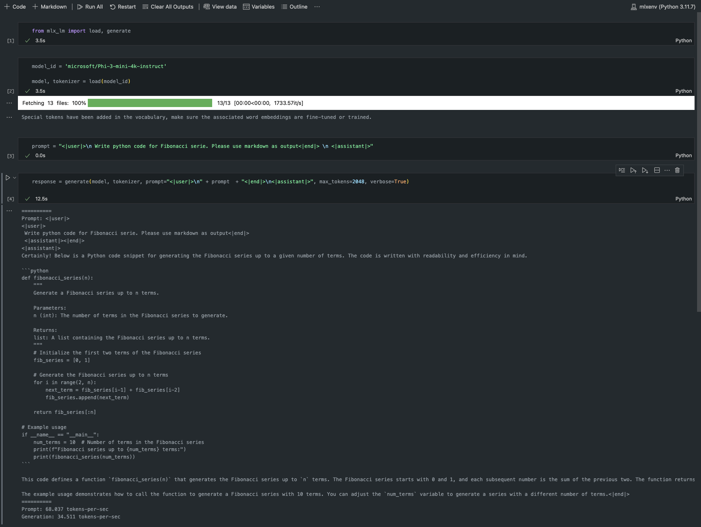

# **Inference Phi-3 s Apple MLX Frameworkem**

## **Co je MLX Framework**

MLX je framework pro práci s poli zaměřený na výzkum strojového učení na zařízeních s Apple Silicon, vyvinutý výzkumným týmem strojového učení společnosti Apple.

MLX je navržen výzkumníky strojového učení pro výzkumníky strojového učení. Framework je koncipován tak, aby byl uživatelsky přívětivý, ale zároveň efektivní pro trénování a nasazování modelů. Design frameworku je záměrně jednoduchý, aby umožnil snadné rozšiřování a vylepšování MLX, s cílem rychlého zkoumání nových nápadů.

LLM modely lze na zařízeních s Apple Silicon akcelerovat pomocí MLX a modely lze pohodlně spouštět lokálně.

## **Použití MLX pro inferenci Phi-3-mini**

### **1. Nastavení prostředí MLX**

1. Python 3.11.x  
2. Instalace knihovny MLX  

```bash

pip install mlx-lm

```

### **2. Spuštění Phi-3-mini v terminálu pomocí MLX**

```bash

python -m mlx_lm.generate --model microsoft/Phi-3-mini-4k-instruct --max-token 2048 --prompt  "<|user|>\nCan you introduce yourself<|end|>\n<|assistant|>"

```

Výsledek (mé prostředí je Apple M1 Max, 64 GB) je:


### **3. Kvantizace Phi-3-mini pomocí MLX v terminálu**

```bash

python -m mlx_lm.convert --hf-path microsoft/Phi-3-mini-4k-instruct

```

***Poznámka:*** Model lze kvantizovat pomocí mlx_lm.convert, přičemž výchozí kvantizace je INT4. Tento příklad ukazuje kvantizaci Phi-3-mini na INT4.

Model lze kvantizovat pomocí mlx_lm.convert, přičemž výchozí kvantizace je INT4. V tomto příkladu je Phi-3-mini kvantizován na INT4. Po kvantizaci bude model uložen do výchozího adresáře ./mlx_model.

Model kvantizovaný pomocí MLX můžeme otestovat z terminálu:

```bash

python -m mlx_lm.generate --model ./mlx_model/ --max-token 2048 --prompt  "<|user|>\nCan you introduce yourself<|end|>\n<|assistant|>"

```

Výsledek je:


### **4. Spuštění Phi-3-mini pomocí MLX v Jupyter Notebooku**



***Poznámka:*** Prostudujte si tento ukázkový příklad [kliknutím na tento odkaz](../../../../../code/03.Inference/MLX/MLX_DEMO.ipynb).

## **Zdroje**

1. Další informace o Apple MLX Frameworku [https://ml-explore.github.io](https://ml-explore.github.io/mlx/build/html/index.html)  

2. GitHub repozitář Apple MLX [https://github.com/ml-explore](https://github.com/ml-explore)  

**Upozornění**:  
Tento dokument byl přeložen pomocí strojových AI překladových služeb. I když se snažíme o přesnost, mějte na paměti, že automatické překlady mohou obsahovat chyby nebo nepřesnosti. Původní dokument v jeho původním jazyce by měl být považován za autoritativní zdroj. Pro důležité informace se doporučuje profesionální lidský překlad. Neodpovídáme za žádná nedorozumění nebo mylné interpretace vyplývající z použití tohoto překladu.