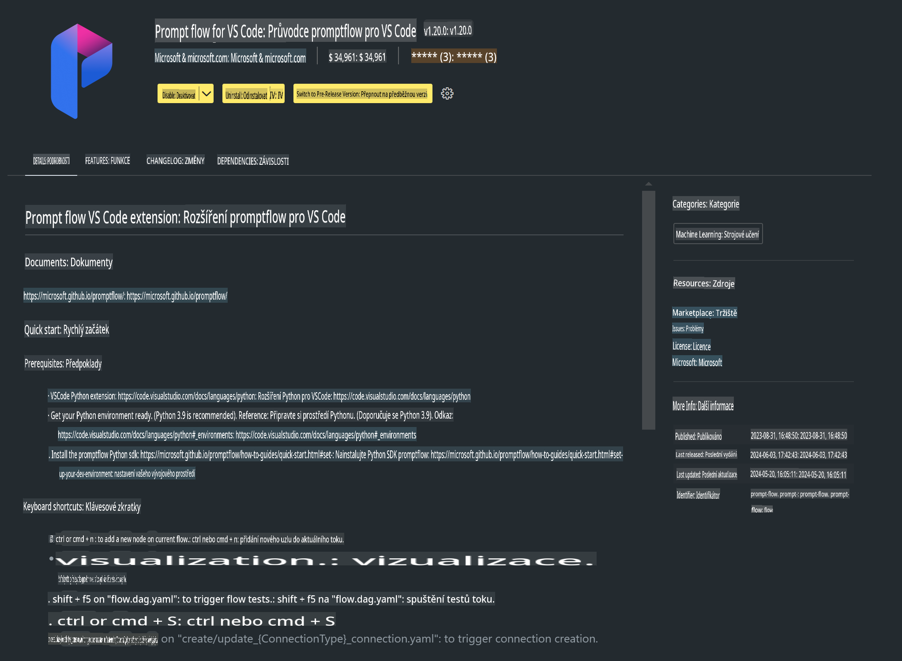

# **Lab 0 - Instalace**

Když vstoupíme do Labu, je potřeba nastavit odpovídající prostředí:

### **1. Python 3.11+**

Doporučuje se použít miniforge k nastavení vašeho Python prostředí.

Pro nastavení miniforge navštivte [https://github.com/conda-forge/miniforge](https://github.com/conda-forge/miniforge)

Po nastavení miniforge spusťte následující příkaz v PowerShellu:

```bash

conda create -n pyenv python==3.11.8 -y

conda activate pyenv

```

### **2. Instalace Prompt flow SDK**

V Labu 1 budeme používat Prompt flow, proto je potřeba nainstalovat Prompt flow SDK.

```bash

pip install promptflow --upgrade

```

Prompt flow SDK můžete ověřit tímto příkazem:

```bash

pf --version

```

### **3. Instalace rozšíření Prompt flow pro Visual Studio Code**



### **4. Apple's MLX Framework**

MLX je framework pro výzkum strojového učení na Apple Silicon, vytvořený týmem Apple Machine Learning Research. **Apple MLX framework** lze použít k akceleraci LLM / SLM na Apple Silicon. Více informací najdete na [https://github.com/microsoft/PhiCookBook/blob/main/md/01.Introduction/03/MLX_Inference.md](https://github.com/microsoft/PhiCookBook/blob/main/md/01.Introduction/03/MLX_Inference.md).

Nainstalujte knihovnu MLX framework v bash:

```bash

pip install mlx-lm

```

### **5. Další Python knihovny**

Vytvořte soubor requirements.txt a přidejte tento obsah:

```txt

notebook
numpy 
scipy 
scikit-learn 
matplotlib 
pandas 
pillow 
graphviz

```

### **6. Instalace NVM**

Nainstalujte nvm v PowerShellu:

```bash

brew install nvm

```

Nainstalujte nodejs verzi 18.20:

```bash

nvm install 18.20.0

nvm use 18.20.0

```

### **7. Instalace podpory vývoje pro Visual Studio Code**

```bash

npm install --global yo generator-code

```

Gratulujeme! Úspěšně jste nastavili SDK. Nyní přejděte k praktickým krokům.

**Upozornění**:  
Tento dokument byl přeložen pomocí strojových AI překladatelských služeb. Ačkoli se snažíme o přesnost, mějte prosím na paměti, že automatizované překlady mohou obsahovat chyby nebo nepřesnosti. Původní dokument v jeho rodném jazyce by měl být považován za autoritativní zdroj. Pro kritické informace se doporučuje profesionální lidský překlad. Nejsme odpovědní za jakékoli nedorozumění nebo mylné interpretace vyplývající z použití tohoto překladu.