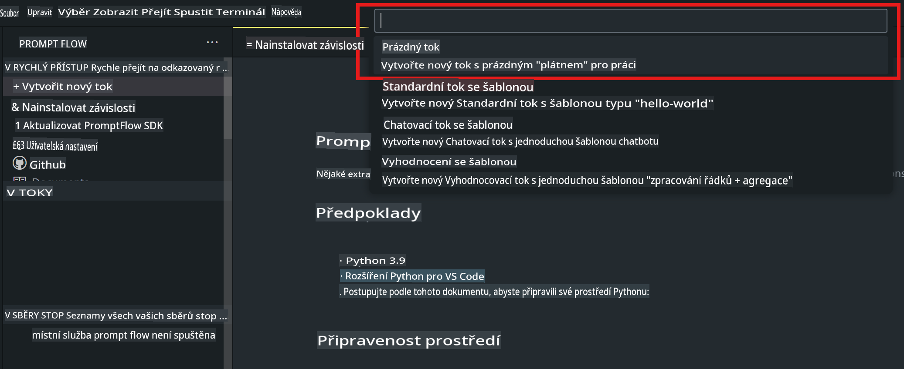

# **Lab 2 - Spuštění Prompt flow s Phi-3-mini v AIPC**

## **Co je Prompt flow**

Prompt flow je sada vývojářských nástrojů navržených k usnadnění kompletního vývojového cyklu AI aplikací založených na LLM, od nápadu, prototypování, testování, hodnocení až po nasazení do produkce a monitorování. Zjednodušuje práci s návrhem promptů a umožňuje vytvářet LLM aplikace s produkční kvalitou.

S Prompt flow můžete:

- Vytvářet toky, které propojují LLM, prompty, Python kód a další nástroje do spustitelného pracovního postupu.

- Snadno ladit a iterovat své toky, zejména interakci s LLM.

- Hodnotit své toky, vypočítávat metriky kvality a výkonu s většími datovými sadami.

- Integrovat testování a hodnocení do vašeho CI/CD systému pro zajištění kvality toku.

- Nasadit své toky na vámi zvolenou platformu nebo je snadno integrovat do kódu vaší aplikace.

- (Volitelné, ale důrazně doporučené) Spolupracovat se svým týmem pomocí cloudové verze Prompt flow v Azure AI.


## **Vytváření generativních kódových toků na Apple Silicon**

***Poznámka***: Pokud jste nedokončili instalaci prostředí, navštivte [Lab 0 - Instalace](./01.Installations.md)

1. Otevřete rozšíření Prompt flow ve Visual Studio Code a vytvořte prázdný projekt toku.



2. Přidejte vstupní a výstupní parametry a přidejte Python kód jako nový tok.


Můžete se řídit touto strukturou (flow.dag.yaml) pro sestavení svého toku:

```yaml

inputs:
  prompt:
    type: string
    default: Write python code for Fibonacci serie. Please use markdown as output
outputs:
  result:
    type: string
    reference: ${gen_code_by_phi3.output}
nodes:
- name: gen_code_by_phi3
  type: python
  source:
    type: code
    path: gen_code_by_phi3.py
  inputs:
    prompt: ${inputs.prompt}


```

3. Kvantizace phi-3-mini

Chceme lépe provozovat SLM na lokálních zařízeních. Obvykle kvantizujeme model (INT4, FP16, FP32).

```bash

python -m mlx_lm.convert --hf-path microsoft/Phi-3-mini-4k-instruct

```

**Poznámka:** Výchozí složka je mlx_model.

4. Přidejte kód do ***Chat_With_Phi3.py***

```python


from promptflow import tool

from mlx_lm import load, generate


# The inputs section will change based on the arguments of the tool function, after you save the code
# Adding type to arguments and return value will help the system show the types properly
# Please update the function name/signature per need
@tool
def my_python_tool(prompt: str) -> str:

    model_id = './mlx_model_phi3_mini'

    model, tokenizer = load(model_id)

    # <|user|>\nWrite python code for Fibonacci serie. Please use markdown as output<|end|>\n<|assistant|>

    response = generate(model, tokenizer, prompt="<|user|>\n" + prompt  + "<|end|>\n<|assistant|>", max_tokens=2048, verbose=True)

    return response


```

4. Tok můžete otestovat pomocí Debug nebo Run, abyste zkontrolovali, zda generování kódu funguje správně.


5. Spusťte tok jako vývojové API v terminálu.

```

pf flow serve --source ./ --port 8080 --host localhost   

```

Můžete jej otestovat v Postman / Thunder Client.


### **Poznámky**

1. První spuštění trvá dlouho. Doporučuje se stáhnout model phi-3 pomocí Hugging face CLI.

2. Vzhledem k omezenému výpočetnímu výkonu Intel NPU se doporučuje použít Phi-3-mini-4k-instruct.

3. Používáme Intel NPU akceleraci pro kvantizaci INT4 konverze, ale pokud znovu spustíte službu, je potřeba smazat složky cache a nc_workshop.


## **Zdroje**

1. Naučte se Promptflow [https://microsoft.github.io/promptflow/](https://microsoft.github.io/promptflow/)

2. Naučte se Intel NPU Acceleration [https://github.com/intel/intel-npu-acceleration-library](https://github.com/intel/intel-npu-acceleration-library)

3. Ukázkový kód, stáhněte si [Ukázkový kód místního NPU agenta](../../../../../../../../../code/07.Lab/01/AIPC/local-npu-agent)

**Upozornění**:  
Tento dokument byl přeložen pomocí strojových AI překladatelských služeb. I když se snažíme o přesnost, mějte na paměti, že automatizované překlady mohou obsahovat chyby nebo nepřesnosti. Původní dokument v jeho původním jazyce by měl být považován za závazný zdroj. Pro kritické informace se doporučuje profesionální lidský překlad. Nenese žádnou odpovědnost za nedorozumění nebo nesprávné interpretace vyplývající z použití tohoto překladu.