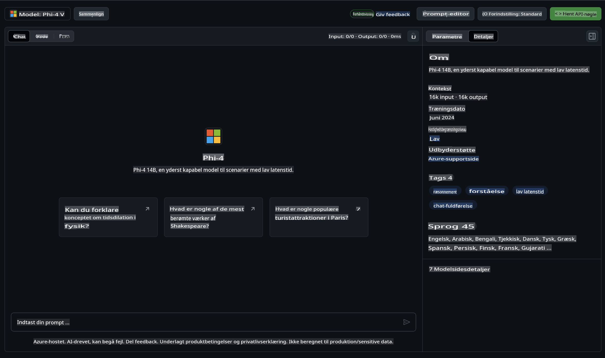
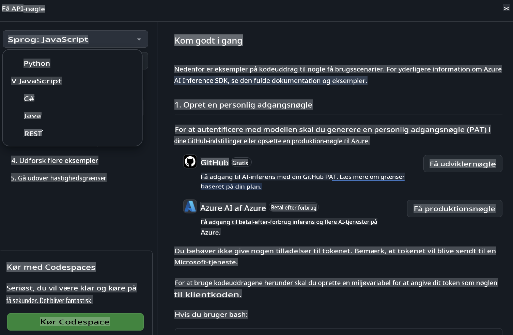

## Phi-familien i GitHub-modeller

Velkommen til [GitHub Models](https://github.com/marketplace/models)! Vi har gjort alt klart, så du kan udforske AI-modeller hostet på Azure AI.


For mere information om de modeller, der er tilgængelige på GitHub Models, kan du besøge [GitHub Model Marketplace](https://github.com/marketplace/models).

## Tilgængelige modeller

Hver model har en dedikeret playground og eksempel-kode.



### Phi-familien i GitHub Model Catalog

- [Phi-4](https://github.com/marketplace/models/azureml/Phi-4)

- [Phi-3.5-MoE instruct (128k)](https://github.com/marketplace/models/azureml/Phi-3-5-MoE-instruct)

- [Phi-3.5-vision instruct (128k)](https://github.com/marketplace/models/azureml/Phi-3-5-vision-instruct)

- [Phi-3.5-mini instruct (128k)](https://github.com/marketplace/models/azureml/Phi-3-5-mini-instruct)

- [Phi-3-Medium-128k-Instruct](https://github.com/marketplace/models/azureml/Phi-3-medium-128k-instruct)

- [Phi-3-medium-4k-instruct](https://github.com/marketplace/models/azureml/Phi-3-medium-4k-instruct)

- [Phi-3-mini-128k-instruct](https://github.com/marketplace/models/azureml/Phi-3-mini-128k-instruct)

- [Phi-3-mini-4k-instruct](https://github.com/marketplace/models/azureml/Phi-3-mini-4k-instruct)

- [Phi-3-small-128k-instruct](https://github.com/marketplace/models/azureml/Phi-3-small-128k-instruct)

- [Phi-3-small-8k-instruct](https://github.com/marketplace/models/azureml/Phi-3-small-8k-instruct)

## Kom godt i gang

Der er nogle grundlæggende eksempler, som er klar til at blive kørt. Du kan finde dem i samples-mappen. Hvis du vil springe direkte til dit foretrukne programmeringssprog, kan du finde eksemplerne på følgende sprog:

- Python
- JavaScript
- C#
- Java
- cURL

Der er også et dedikeret Codespaces-miljø til at køre eksempler og modeller.



## Eksempelkode

Nedenfor finder du kodeeksempler til nogle få brugsscenarier. For yderligere information om Azure AI Inference SDK, se den fulde dokumentation og eksempler.

## Opsætning

1. Opret en personlig adgangstoken  
Du behøver ikke give nogen tilladelser til tokenet. Bemærk, at tokenet vil blive sendt til en Microsoft-tjeneste.

For at bruge kodeeksemplerne nedenfor skal du oprette en miljøvariabel for at sætte dit token som nøgle til klientkoden.

Hvis du bruger bash:  
```
export GITHUB_TOKEN="<your-github-token-goes-here>"
```  
Hvis du bruger PowerShell:  

```
$Env:GITHUB_TOKEN="<your-github-token-goes-here>"
```  

Hvis du bruger Windows kommandoprompt:  

```
set GITHUB_TOKEN=<your-github-token-goes-here>
```  

## Python-eksempel

### Installer afhængigheder  
Installer Azure AI Inference SDK ved hjælp af pip (Kræver: Python >=3.8):  

```
pip install azure-ai-inference
```  

### Kør et grundlæggende kodeeksempel  

Dette eksempel demonstrerer et grundlæggende kald til chat completion API'en. Det bruger GitHub AI-modelens inference-endpoint og din GitHub-token. Kaldet er synkront.  

```python
import os
from azure.ai.inference import ChatCompletionsClient
from azure.ai.inference.models import SystemMessage, UserMessage
from azure.core.credentials import AzureKeyCredential

endpoint = "https://models.inference.ai.azure.com"
model_name = "Phi-4"
token = os.environ["GITHUB_TOKEN"]

client = ChatCompletionsClient(
    endpoint=endpoint,
    credential=AzureKeyCredential(token),
)

response = client.complete(
    messages=[
        UserMessage(content="I have $20,000 in my savings account, where I receive a 4% profit per year and payments twice a year. Can you please tell me how long it will take for me to become a millionaire? Also, can you please explain the math step by step as if you were explaining it to an uneducated person?"),
    ],
    temperature=0.4,
    top_p=1.0,
    max_tokens=2048,
    model=model_name
)

print(response.choices[0].message.content)
```  

### Kør en samtale med flere trin  

Dette eksempel demonstrerer en samtale med flere trin ved hjælp af chat completion API'en. Når du bruger modellen til en chatapplikation, skal du administrere historikken for samtalen og sende de seneste beskeder til modellen.  

```
import os
from azure.ai.inference import ChatCompletionsClient
from azure.ai.inference.models import AssistantMessage, SystemMessage, UserMessage
from azure.core.credentials import AzureKeyCredential

token = os.environ["GITHUB_TOKEN"]
endpoint = "https://models.inference.ai.azure.com"
# Replace Model_Name
model_name = "Phi-4"

client = ChatCompletionsClient(
    endpoint=endpoint,
    credential=AzureKeyCredential(token),
)

messages = [
    SystemMessage(content="You are a helpful assistant."),
    UserMessage(content="What is the capital of France?"),
    AssistantMessage(content="The capital of France is Paris."),
    UserMessage(content="What about Spain?"),
]

response = client.complete(messages=messages, model=model_name)

print(response.choices[0].message.content)
```  

### Stream outputtet  

For en bedre brugeroplevelse vil du gerne streame modellens svar, så det første token vises hurtigt, og du undgår at vente på lange svar.  

```
import os
from azure.ai.inference import ChatCompletionsClient
from azure.ai.inference.models import SystemMessage, UserMessage
from azure.core.credentials import AzureKeyCredential

token = os.environ["GITHUB_TOKEN"]
endpoint = "https://models.inference.ai.azure.com"
# Replace Model_Name
model_name = "Phi-4"

client = ChatCompletionsClient(
    endpoint=endpoint,
    credential=AzureKeyCredential(token),
)

response = client.complete(
    stream=True,
    messages=[
        SystemMessage(content="You are a helpful assistant."),
        UserMessage(content="Give me 5 good reasons why I should exercise every day."),
    ],
    model=model_name,
)

for update in response:
    if update.choices:
        print(update.choices[0].delta.content or "", end="")

client.close()
```  

## GRATIS brug og grænser for GitHub-modeller


[Grænserne for playground og gratis API-brug](https://docs.github.com/en/github-models/prototyping-with-ai-models#rate-limits) er designet til at hjælpe dig med at eksperimentere med modeller og prototype din AI-applikation. For brug ud over disse grænser og for at skalere din applikation skal du klargøre ressourcer fra en Azure-konto og autentificere derfra i stedet for din GitHub-personlige adgangstoken. Du behøver ikke ændre noget andet i din kode. Brug dette link til at lære, hvordan du kan gå ud over grænserne for gratis niveau i Azure AI.

### Oplysninger

Husk, når du interagerer med en model, at du eksperimenterer med AI, så fejl i indholdet kan forekomme.

Funktionen er underlagt forskellige begrænsninger (herunder anmodninger pr. minut, anmodninger pr. dag, tokens pr. anmodning og samtidige anmodninger) og er ikke designet til produktionsbrug.

GitHub Models bruger Azure AI Content Safety. Disse filtre kan ikke deaktiveres som en del af GitHub Models-oplevelsen. Hvis du beslutter dig for at bruge modeller gennem en betalt tjeneste, skal du konfigurere dine indholdsfiltre, så de opfylder dine krav.

Denne tjeneste er underlagt GitHubs Pre-release Terms.  

**Ansvarsfraskrivelse**:  
Dette dokument er blevet oversat ved hjælp af maskinbaserede AI-oversættelsestjenester. Selvom vi bestræber os på nøjagtighed, skal du være opmærksom på, at automatiserede oversættelser kan indeholde fejl eller unøjagtigheder. Det originale dokument på dets oprindelige sprog bør betragtes som den autoritative kilde. For kritisk information anbefales professionel menneskelig oversættelse. Vi påtager os intet ansvar for misforståelser eller fejltolkninger, der måtte opstå som følge af brugen af denne oversættelse.