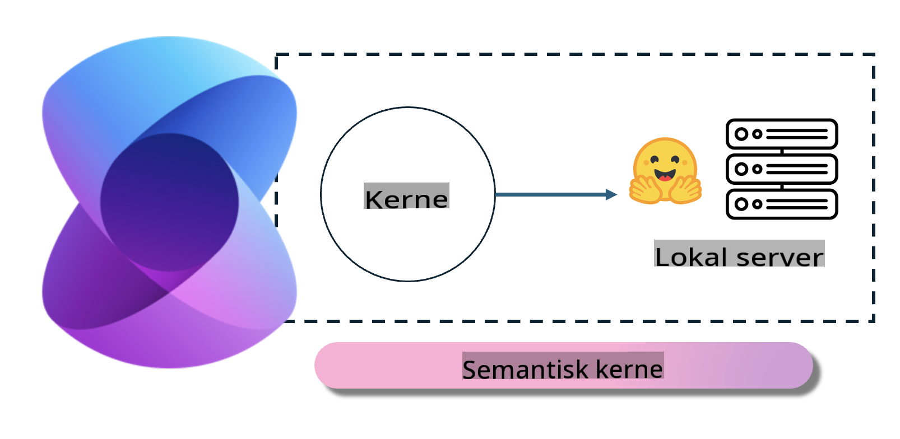
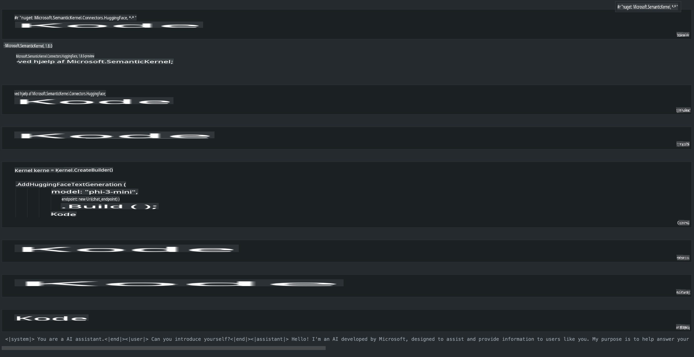

# **Inference Phi-3 på lokal server**

Vi kan implementere Phi-3 på en lokal server. Brugere kan vælge [Ollama](https://ollama.com) eller [LM Studio](https://llamaedge.com) løsninger, eller de kan skrive deres egen kode. Du kan forbinde Phi-3's lokale tjenester via [Semantic Kernel](https://github.com/microsoft/semantic-kernel?WT.mc_id=aiml-138114-kinfeylo) eller [Langchain](https://www.langchain.com/) for at bygge Copilot-applikationer.

## **Brug Semantic Kernel til at tilgå Phi-3-mini**

I Copilot-applikationen skaber vi applikationer gennem Semantic Kernel / LangChain. Denne type applikationsramme er generelt kompatibel med Azure OpenAI Service / OpenAI-modeller og kan også understøtte open source-modeller på Hugging Face samt lokale modeller. Hvad gør vi, hvis vi ønsker at bruge Semantic Kernel til at tilgå Phi-3-mini? Ved at bruge .NET som eksempel kan vi kombinere det med Hugging Face Connector i Semantic Kernel. Som standard kan det matche model-id'et på Hugging Face (den første gang du bruger det, bliver modellen downloadet fra Hugging Face, hvilket tager lang tid). Du kan også forbinde til den opsatte lokale tjeneste. Sammenlignet med de to anbefaler vi at bruge den lokale løsning, da den giver en højere grad af autonomi, især i virksomhedsapplikationer.

Fra figuren kan vi se, at adgang til lokale tjenester gennem Semantic Kernel nemt kan forbinde til den selvbyggede Phi-3-mini modelserver. Her er resultatet af kørsel:

***Eksempelkode*** https://github.com/kinfey/Phi3MiniSamples/tree/main/semantickernel

**Ansvarsfraskrivelse**:  
Dette dokument er blevet oversat ved hjælp af maskinbaserede AI-oversættelsestjenester. Selvom vi bestræber os på nøjagtighed, bedes du være opmærksom på, at automatiserede oversættelser kan indeholde fejl eller unøjagtigheder. Det originale dokument på dets oprindelige sprog bør betragtes som den autoritative kilde. For kritisk information anbefales professionel menneskelig oversættelse. Vi påtager os intet ansvar for misforståelser eller fejltolkninger, der måtte opstå som følge af brugen af denne oversættelse.