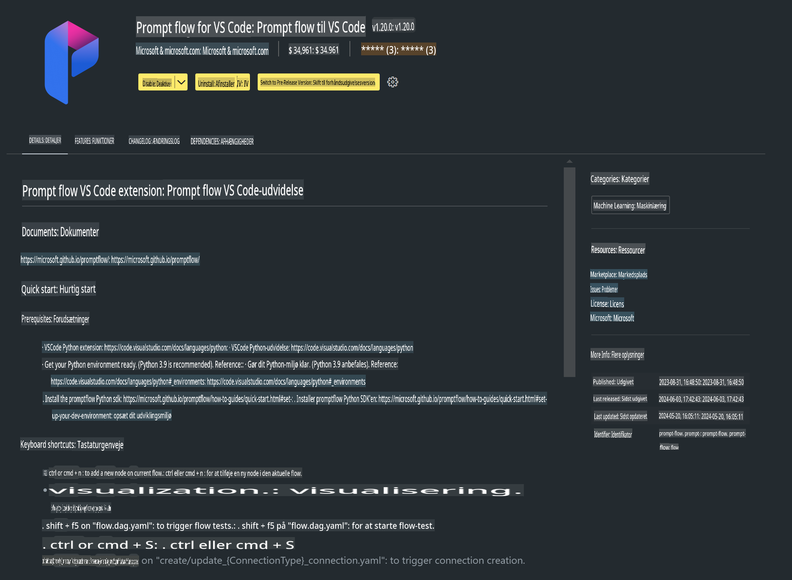

# **Lab 0 - Installation**

Når vi går i gang med Lab, skal vi konfigurere det relevante miljø:

### **1. Python 3.11+**

Det anbefales at bruge miniforge til at konfigurere dit Python-miljø.

For at konfigurere miniforge, henvis til [https://github.com/conda-forge/miniforge](https://github.com/conda-forge/miniforge)

Efter at have konfigureret miniforge, kør følgende kommando i PowerShell:

```bash

conda create -n pyenv python==3.11.8 -y

conda activate pyenv

```

### **2. Installer Prompt flow SDK**

I Lab 1 bruger vi Prompt flow, så du skal konfigurere Prompt flow SDK.

```bash

pip install promptflow --upgrade

```

Du kan tjekke Prompt flow SDK med denne kommando:

```bash

pf --version

```

### **3. Installer Visual Studio Code Prompt flow Extension**



### **4. Apple's MLX Framework**

MLX er et array-framework til maskinlæringsforskning på Apple Silicon, udviklet af Apple Machine Learning Research. Du kan bruge **Apple MLX framework** til at accelerere LLM/SLM med Apple Silicon. Hvis du vil vide mere, kan du læse [https://github.com/microsoft/PhiCookBook/blob/main/md/01.Introduction/03/MLX_Inference.md](https://github.com/microsoft/PhiCookBook/blob/main/md/01.Introduction/03/MLX_Inference.md).

Installer MLX framework-biblioteket i bash:

```bash

pip install mlx-lm

```

### **5. Andre Python-biblioteker**

Opret en requirements.txt-fil og tilføj dette indhold:

```txt

notebook
numpy 
scipy 
scikit-learn 
matplotlib 
pandas 
pillow 
graphviz

```

### **6. Installer NVM**

Installer nvm i PowerShell:

```bash

brew install nvm

```

Installer nodejs 18.20:

```bash

nvm install 18.20.0

nvm use 18.20.0

```

### **7. Installer Visual Studio Code Development Support**

```bash

npm install --global yo generator-code

```

Tillykke! Du har med succes konfigureret SDK. Gå nu videre til de praktiske trin.

**Ansvarsfraskrivelse**:  
Dette dokument er blevet oversat ved hjælp af maskinbaserede AI-oversættelsestjenester. Selvom vi bestræber os på nøjagtighed, skal du være opmærksom på, at automatiserede oversættelser kan indeholde fejl eller unøjagtigheder. Det originale dokument på dets oprindelige sprog bør betragtes som den autoritative kilde. For kritisk information anbefales professionel menneskelig oversættelse. Vi påtager os intet ansvar for misforståelser eller fejltolkninger, der måtte opstå som følge af brugen af denne oversættelse.