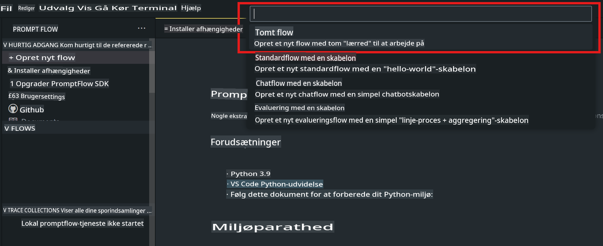

# **Lab 2 - Kør Prompt flow med Phi-3-mini i AIPC**

## **Hvad er Prompt flow**

Prompt flow er en samling af udviklingsværktøjer designet til at gøre hele udviklingscyklussen for LLM-baserede AI-applikationer lettere, fra idéudvikling, prototyper, test, evaluering til produktionsimplementering og overvågning. Det gør prompt engineering meget enklere og giver dig mulighed for at bygge LLM-applikationer med produktionskvalitet.

Med Prompt flow kan du:

- Oprette flows, der forbinder LLM'er, prompts, Python-kode og andre værktøjer i en eksekverbar arbejdsgang.

- Fejlfinde og iterere dine flows, især interaktionen med LLM'er, på en nem måde.

- Evaluere dine flows og beregne kvalitets- og ydeevnemetrikker med større datasæt.

- Integrere test og evaluering i dit CI/CD-system for at sikre kvaliteten af dit flow.

- Implementere dine flows på den serverplatform, du vælger, eller integrere dem nemt i din applikations kodebase.

- (Valgfrit, men stærkt anbefalet) Samarbejde med dit team ved at bruge cloud-versionen af Prompt flow i Azure AI.


## **Bygning af genereringskodeflows på Apple Silicon**

***Note*** ：Hvis du ikke har fuldført miljøinstallationen, bedes du besøge [Lab 0 -Installations](./01.Installations.md)

1. Åbn Prompt flow-udvidelsen i Visual Studio Code og opret et tomt flow-projekt



2. Tilføj Input- og Output-parametre og tilføj Python-kode som nyt flow


Du kan referere til denne struktur (flow.dag.yaml) for at konstruere dit flow

```yaml

inputs:
  prompt:
    type: string
    default: Write python code for Fibonacci serie. Please use markdown as output
outputs:
  result:
    type: string
    reference: ${gen_code_by_phi3.output}
nodes:
- name: gen_code_by_phi3
  type: python
  source:
    type: code
    path: gen_code_by_phi3.py
  inputs:
    prompt: ${inputs.prompt}


```

3. Kvantificer phi-3-mini

Vi ønsker at køre SLM bedre på lokale enheder. Generelt kvantificerer vi modellen (INT4, FP16, FP32)


```bash

python -m mlx_lm.convert --hf-path microsoft/Phi-3-mini-4k-instruct

```

**Bemærk:** standardmappen er mlx_model 

4. Tilføj kode i ***Chat_With_Phi3.py***


```python


from promptflow import tool

from mlx_lm import load, generate


# The inputs section will change based on the arguments of the tool function, after you save the code
# Adding type to arguments and return value will help the system show the types properly
# Please update the function name/signature per need
@tool
def my_python_tool(prompt: str) -> str:

    model_id = './mlx_model_phi3_mini'

    model, tokenizer = load(model_id)

    # <|user|>\nWrite python code for Fibonacci serie. Please use markdown as output<|end|>\n<|assistant|>

    response = generate(model, tokenizer, prompt="<|user|>\n" + prompt  + "<|end|>\n<|assistant|>", max_tokens=2048, verbose=True)

    return response


```

4. Du kan teste flowet via Debug eller Run for at tjekke, om genereringskoden fungerer korrekt 


5. Kør flowet som udviklings-API i terminalen

```

pf flow serve --source ./ --port 8080 --host localhost   

```

Du kan teste det i Postman / Thunder Client


### **Bemærk**

1. Første kørsel tager lang tid. Det anbefales at downloade phi-3-modellen fra Hugging Face CLI.

2. På grund af den begrænsede regnekraft i Intel NPU anbefales det at bruge Phi-3-mini-4k-instruct.

3. Vi bruger Intel NPU Acceleration til at kvantificere INT4-konvertering, men hvis du genstarter servicen, skal du slette cache- og nc_workshop-mapperne.


## **Ressourcer**

1. Lær Promptflow [https://microsoft.github.io/promptflow/](https://microsoft.github.io/promptflow/)

2. Lær Intel NPU Acceleration [https://github.com/intel/intel-npu-acceleration-library](https://github.com/intel/intel-npu-acceleration-library)

3. Eksempelkode, download [Local NPU Agent Sample Code](../../../../../../../../../code/07.Lab/01/AIPC/local-npu-agent)

**Ansvarsfraskrivelse**:  
Dette dokument er blevet oversat ved hjælp af maskinbaserede AI-oversættelsestjenester. Selvom vi bestræber os på nøjagtighed, bedes du være opmærksom på, at automatiserede oversættelser kan indeholde fejl eller unøjagtigheder. Det originale dokument på dets oprindelige sprog bør betragtes som den autoritative kilde. For kritisk information anbefales professionel menneskelig oversættelse. Vi påtager os ikke ansvaret for eventuelle misforståelser eller fejltolkninger, der opstår som følge af brugen af denne oversættelse.