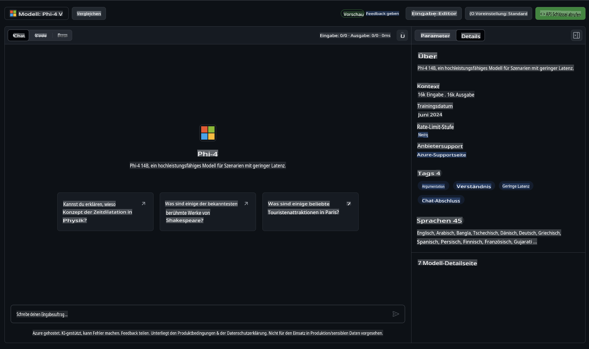
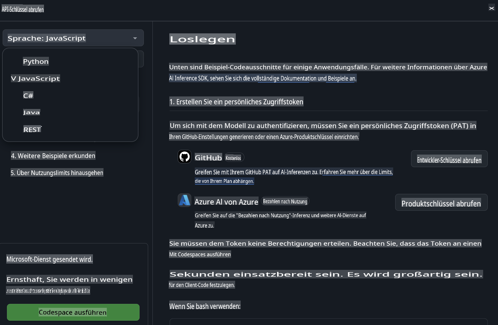
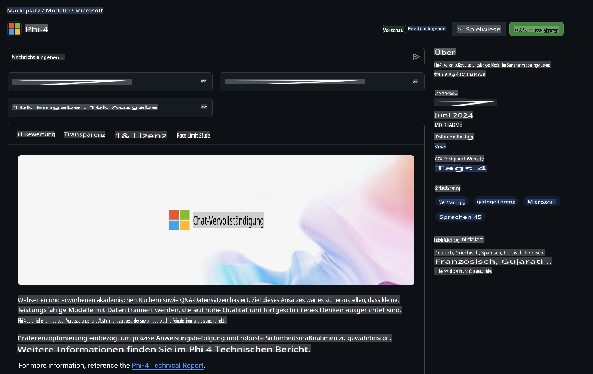

## Phi-Familie in GitHub-Modelle

Willkommen bei [GitHub-Modelle](https://github.com/marketplace/models)! Alles ist startklar, damit Sie die auf Azure AI gehosteten KI-Modelle erkunden können.


Für weitere Informationen zu den auf GitHub-Modelle verfügbaren Modellen besuchen Sie den [GitHub Model Marketplace](https://github.com/marketplace/models).

## Verfügbare Modelle

Jedes Modell verfügt über eine eigene Testumgebung und Beispielcode.



### Phi-Familie im GitHub-Model-Katalog

- [Phi-4](https://github.com/marketplace/models/azureml/Phi-4)

- [Phi-3.5-MoE instruct (128k)](https://github.com/marketplace/models/azureml/Phi-3-5-MoE-instruct)

- [Phi-3.5-vision instruct (128k)](https://github.com/marketplace/models/azureml/Phi-3-5-vision-instruct)

- [Phi-3.5-mini instruct (128k)](https://github.com/marketplace/models/azureml/Phi-3-5-mini-instruct)

- [Phi-3-Medium-128k-Instruct](https://github.com/marketplace/models/azureml/Phi-3-medium-128k-instruct)

- [Phi-3-medium-4k-instruct](https://github.com/marketplace/models/azureml/Phi-3-medium-4k-instruct)

- [Phi-3-mini-128k-instruct](https://github.com/marketplace/models/azureml/Phi-3-mini-128k-instruct)

- [Phi-3-mini-4k-instruct](https://github.com/marketplace/models/azureml/Phi-3-mini-4k-instruct)

- [Phi-3-small-128k-instruct](https://github.com/marketplace/models/azureml/Phi-3-small-128k-instruct)

- [Phi-3-small-8k-instruct](https://github.com/marketplace/models/azureml/Phi-3-small-8k-instruct)

## Erste Schritte

Es gibt einige grundlegende Beispiele, die direkt ausgeführt werden können. Sie finden sie im Verzeichnis "samples". Wenn Sie direkt zu Ihrer bevorzugten Programmiersprache springen möchten, finden Sie die Beispiele in den folgenden Sprachen:

- Python  
- JavaScript  
- C#  
- Java  
- cURL  

Es gibt auch eine dedizierte Codespaces-Umgebung, um die Beispiele und Modelle auszuführen.



## Beispielcode

Nachfolgend finden Sie Beispielcodeschnipsel für einige Anwendungsfälle. Weitere Informationen zur Azure AI Inference SDK finden Sie in der vollständigen Dokumentation und den Beispielen.

## Einrichtung

1. Erstellen Sie ein persönliches Zugriffstoken.  
   Sie müssen dem Token keine Berechtigungen zuweisen. Beachten Sie, dass das Token an einen Microsoft-Dienst gesendet wird.

Um die untenstehenden Codeschnipsel zu verwenden, erstellen Sie eine Umgebungsvariable, um Ihr Token als Schlüssel für den Clientcode festzulegen.

Wenn Sie Bash verwenden:  
```
export GITHUB_TOKEN="<your-github-token-goes-here>"
```  
Wenn Sie PowerShell verwenden:  

```
$Env:GITHUB_TOKEN="<your-github-token-goes-here>"
```  

Wenn Sie die Windows-Eingabeaufforderung verwenden:  

```
set GITHUB_TOKEN=<your-github-token-goes-here>
```  

## Python-Beispiel

### Abhängigkeiten installieren  
Installieren Sie das Azure AI Inference SDK mit pip (erforderlich: Python >=3.8):  

```
pip install azure-ai-inference
```  

### Ein einfaches Beispiel ausführen  

Dieses Beispiel zeigt einen grundlegenden Aufruf der Chat-Completion-API. Es nutzt den GitHub-KI-Modell-Inferenz-Endpunkt und Ihr GitHub-Token. Der Aufruf erfolgt synchron.  

```python
import os
from azure.ai.inference import ChatCompletionsClient
from azure.ai.inference.models import SystemMessage, UserMessage
from azure.core.credentials import AzureKeyCredential

endpoint = "https://models.inference.ai.azure.com"
model_name = "Phi-4"
token = os.environ["GITHUB_TOKEN"]

client = ChatCompletionsClient(
    endpoint=endpoint,
    credential=AzureKeyCredential(token),
)

response = client.complete(
    messages=[
        UserMessage(content="I have $20,000 in my savings account, where I receive a 4% profit per year and payments twice a year. Can you please tell me how long it will take for me to become a millionaire? Also, can you please explain the math step by step as if you were explaining it to an uneducated person?"),
    ],
    temperature=0.4,
    top_p=1.0,
    max_tokens=2048,
    model=model_name
)

print(response.choices[0].message.content)
```  

### Eine Multi-Turn-Konversation ausführen  

Dieses Beispiel zeigt eine Multi-Turn-Konversation mit der Chat-Completion-API. Wenn Sie das Modell für eine Chat-Anwendung nutzen, müssen Sie den Verlauf der Konversation verwalten und die neuesten Nachrichten an das Modell senden.  

```
import os
from azure.ai.inference import ChatCompletionsClient
from azure.ai.inference.models import AssistantMessage, SystemMessage, UserMessage
from azure.core.credentials import AzureKeyCredential

token = os.environ["GITHUB_TOKEN"]
endpoint = "https://models.inference.ai.azure.com"
# Replace Model_Name
model_name = "Phi-4"

client = ChatCompletionsClient(
    endpoint=endpoint,
    credential=AzureKeyCredential(token),
)

messages = [
    SystemMessage(content="You are a helpful assistant."),
    UserMessage(content="What is the capital of France?"),
    AssistantMessage(content="The capital of France is Paris."),
    UserMessage(content="What about Spain?"),
]

response = client.complete(messages=messages, model=model_name)

print(response.choices[0].message.content)
```  

### Ausgabe streamen  

Für eine bessere Benutzererfahrung sollten Sie die Antwort des Modells streamen, sodass das erste Token früh angezeigt wird und lange Wartezeiten vermieden werden.  

```
import os
from azure.ai.inference import ChatCompletionsClient
from azure.ai.inference.models import SystemMessage, UserMessage
from azure.core.credentials import AzureKeyCredential

token = os.environ["GITHUB_TOKEN"]
endpoint = "https://models.inference.ai.azure.com"
# Replace Model_Name
model_name = "Phi-4"

client = ChatCompletionsClient(
    endpoint=endpoint,
    credential=AzureKeyCredential(token),
)

response = client.complete(
    stream=True,
    messages=[
        SystemMessage(content="You are a helpful assistant."),
        UserMessage(content="Give me 5 good reasons why I should exercise every day."),
    ],
    model=model_name,
)

for update in response:
    if update.choices:
        print(update.choices[0].delta.content or "", end="")

client.close()
```  

## Kostenlose Nutzung und Nutzungslimits für GitHub-Modelle



Die [Nutzungslimits für die Testumgebung und die kostenlose API-Nutzung](https://docs.github.com/en/github-models/prototyping-with-ai-models#rate-limits) sollen Ihnen helfen, Modelle zu testen und Ihre KI-Anwendung zu prototypisieren. Für eine Nutzung über diese Limits hinaus und zur Skalierung Ihrer Anwendung müssen Sie Ressourcen über ein Azure-Konto bereitstellen und sich von dort aus authentifizieren, anstatt Ihr GitHub-Personal-Access-Token zu verwenden. Sie müssen sonst nichts an Ihrem Code ändern. Verwenden Sie diesen Link, um herauszufinden, wie Sie die kostenlosen Limits in Azure AI überschreiten können.

### Hinweise  

Denken Sie daran, dass Sie beim Interagieren mit einem Modell KI experimentell nutzen, sodass Fehler im Inhalt möglich sind.  

Die Funktion unterliegt verschiedenen Limits (einschließlich Anfragen pro Minute, Anfragen pro Tag, Tokens pro Anfrage und gleichzeitige Anfragen) und ist nicht für produktive Anwendungsfälle ausgelegt.  

GitHub-Modelle verwendet Azure AI Content Safety. Diese Filter können als Teil der GitHub-Modelle-Erfahrung nicht deaktiviert werden. Wenn Sie Modelle über einen kostenpflichtigen Dienst einsetzen, konfigurieren Sie bitte Ihre Inhaltsfilter gemäß Ihren Anforderungen.  

Dieser Dienst unterliegt den Vorabveröffentlichungsbedingungen von GitHub.  

**Haftungsausschluss**:  
Dieses Dokument wurde mithilfe von KI-basierten maschinellen Übersetzungsdiensten übersetzt. Obwohl wir uns um Genauigkeit bemühen, weisen wir darauf hin, dass automatisierte Übersetzungen Fehler oder Ungenauigkeiten enthalten können. Das Originaldokument in seiner ursprünglichen Sprache sollte als maßgebliche Quelle betrachtet werden. Für kritische Informationen wird eine professionelle menschliche Übersetzung empfohlen. Wir übernehmen keine Haftung für Missverständnisse oder Fehlinterpretationen, die sich aus der Nutzung dieser Übersetzung ergeben.