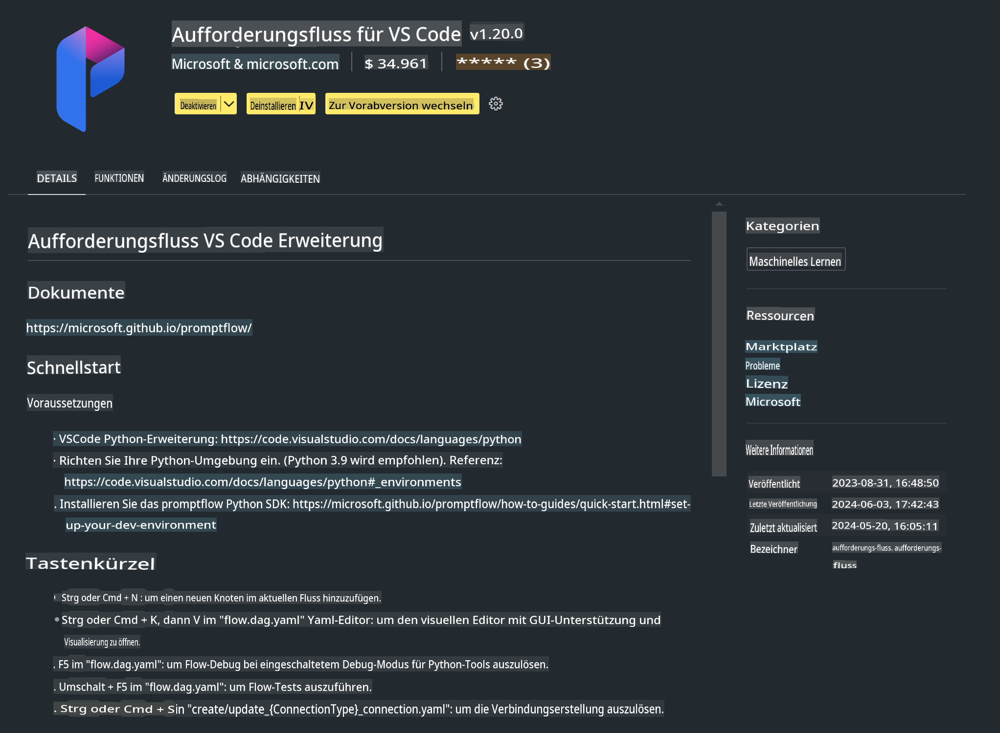

# **Lab 0 - Installation**

Wenn wir das Lab betreten, müssen wir die entsprechende Umgebung einrichten:

### **1. Python 3.11+**

Es wird empfohlen, Miniforge zu verwenden, um Ihre Python-Umgebung zu konfigurieren.

Um Miniforge zu konfigurieren, besuchen Sie bitte [https://github.com/conda-forge/miniforge](https://github.com/conda-forge/miniforge).

Nach der Konfiguration von Miniforge führen Sie den folgenden Befehl in PowerShell aus:

```bash

conda create -n pyenv python==3.11.8 -y

conda activate pyenv

```

### **2. Prompt flow SDK installieren**

Im Lab 1 verwenden wir Prompt flow, daher müssen Sie das Prompt flow SDK konfigurieren.

```bash

pip install promptflow --upgrade

```

Sie können das Prompt flow SDK mit diesem Befehl überprüfen:

```bash

pf --version

```

### **3. Visual Studio Code Prompt flow Erweiterung installieren**



### **4. Intel NPU-Beschleunigungsbibliothek**

Die neue Prozessorgeneration von Intel unterstützt NPU. Wenn Sie NPU verwenden möchten, um LLMs / SLMs lokal auszuführen, können Sie die ***Intel NPU-Beschleunigungsbibliothek*** nutzen. Weitere Informationen finden Sie unter [https://github.com/microsoft/PhiCookBook/blob/main/md/01.Introduction/03/AIPC_Inference.md](https://github.com/microsoft/PhiCookBook/blob/main/md/01.Introduction/03/AIPC_Inference.md).

Installieren Sie die Intel NPU-Beschleunigungsbibliothek in bash:

```bash

pip install intel-npu-acceleration-library

```

***Hinweis***: Bitte beachten Sie, dass diese Bibliothek ***Transformers 4.40.2*** unterstützt. Bitte überprüfen Sie die Version.

### **5. Weitere Python-Bibliotheken**

Erstellen Sie eine requirements.txt und fügen Sie diesen Inhalt hinzu:

```txt

notebook
numpy 
scipy 
scikit-learn 
matplotlib 
pandas 
pillow 
graphviz

```

### **6. NVM installieren**

Installieren Sie NVM in PowerShell:

```bash

winget install -e --id CoreyButler.NVMforWindows

```

Installieren Sie Node.js 18.20:

```bash

nvm install 18.20.0

nvm use 18.20.0

```

### **7. Entwicklungsunterstützung für Visual Studio Code installieren**

```bash

npm install --global yo generator-code

```

Herzlichen Glückwunsch! Sie haben das SDK erfolgreich konfiguriert. Fahren Sie nun mit den praktischen Schritten fort.

**Haftungsausschluss**:  
Dieses Dokument wurde mit KI-basierten maschinellen Übersetzungsdiensten übersetzt. Obwohl wir uns um Genauigkeit bemühen, weisen wir darauf hin, dass automatisierte Übersetzungen Fehler oder Ungenauigkeiten enthalten können. Das Originaldokument in seiner ursprünglichen Sprache sollte als maßgebliche Quelle betrachtet werden. Für kritische Informationen wird eine professionelle menschliche Übersetzung empfohlen. Wir übernehmen keine Haftung für Missverständnisse oder Fehlinterpretationen, die aus der Nutzung dieser Übersetzung entstehen.