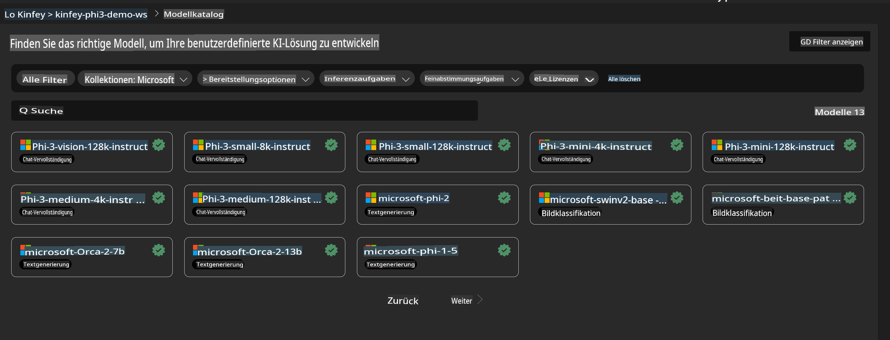
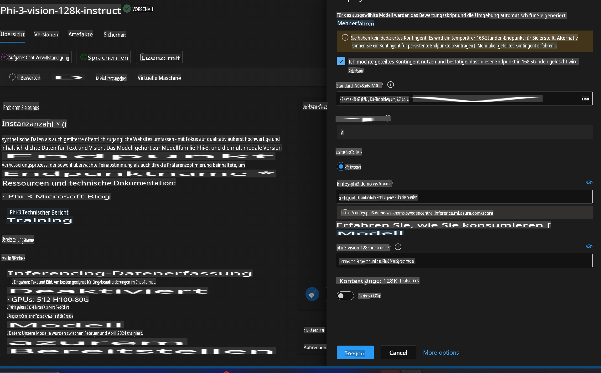
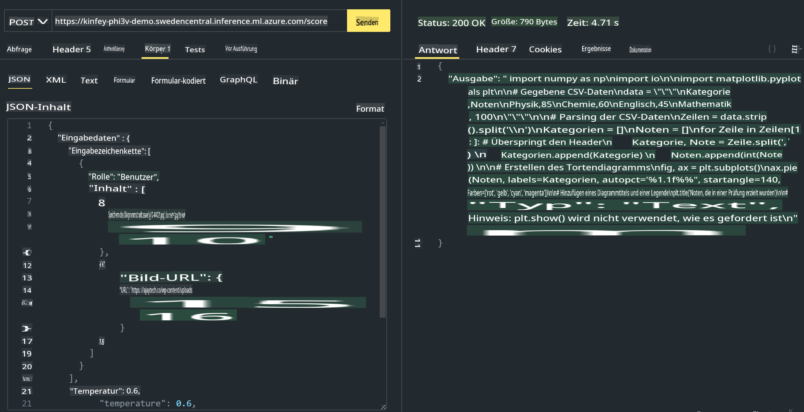

# **Lab 3 - Phi-3-Vision auf dem Azure Machine Learning Service bereitstellen**

Wir nutzen NPU, um die produktive Bereitstellung von lokalem Code abzuschließen, und möchten anschließend die Möglichkeit einführen, PHI-3-VISION zu integrieren, um Bilder in Code umzuwandeln.

In dieser Einführung können wir schnell einen Model-As-Service-Dienst für Phi-3 Vision im Azure Machine Learning Service erstellen.

***Hinweis***: Phi-3 Vision benötigt Rechenleistung, um Inhalte schneller zu generieren. Wir benötigen Cloud-Computing-Ressourcen, um dies zu ermöglichen.

### **1. Azure Machine Learning Service erstellen**

Wir müssen im Azure-Portal einen Azure Machine Learning Service erstellen. Wenn Sie erfahren möchten, wie das funktioniert, besuchen Sie bitte diesen Link: [https://learn.microsoft.com/azure/machine-learning/quickstart-create-resources?view=azureml-api-2](https://learn.microsoft.com/azure/machine-learning/quickstart-create-resources?view=azureml-api-2)

### **2. Phi-3 Vision im Azure Machine Learning Service auswählen**



### **3. Phi-3-Vision in Azure bereitstellen**



### **4. Endpoint in Postman testen**



***Hinweis***

1. Die zu übertragenden Parameter müssen Authorization, azureml-model-deployment und Content-Type enthalten. Sie müssen die Bereitstellungsinformationen prüfen, um diese zu erhalten.

2. Um Parameter zu übermitteln, benötigt Phi-3-Vision einen Bildlink. Bitte orientieren Sie sich an der Methode von GPT-4-Vision, um Parameter zu übermitteln, beispielsweise:

```json

{
  "input_data":{
    "input_string":[
      {
        "role":"user",
        "content":[ 
          {
            "type": "text",
            "text": "You are a Python coding assistant.Please create Python code for image "
          },
          {
              "type": "image_url",
              "image_url": {
                "url": "https://ajaytech.co/wp-content/uploads/2019/09/index.png"
              }
          }
        ]
      }
    ],
    "parameters":{
          "temperature": 0.6,
          "top_p": 0.9,
          "do_sample": false,
          "max_new_tokens": 2048
    }
  }
}

```

3. Verwenden Sie die Post-Methode, um **/score** aufzurufen.

**Herzlichen Glückwunsch**! Sie haben die schnelle PHI-3-VISION-Bereitstellung abgeschlossen und ausprobiert, wie Bilder zur Codegenerierung genutzt werden können. Als Nächstes können wir Anwendungen in Kombination mit NPUs und der Cloud entwickeln.

**Haftungsausschluss**:  
Dieses Dokument wurde mithilfe von KI-gestützten maschinellen Übersetzungsdiensten übersetzt. Obwohl wir uns um Genauigkeit bemühen, beachten Sie bitte, dass automatisierte Übersetzungen Fehler oder Ungenauigkeiten enthalten können. Das Originaldokument in seiner ursprünglichen Sprache sollte als maßgebliche Quelle betrachtet werden. Für kritische Informationen wird eine professionelle menschliche Übersetzung empfohlen. Wir übernehmen keine Haftung für Missverständnisse oder Fehlinterpretationen, die sich aus der Nutzung dieser Übersetzung ergeben.