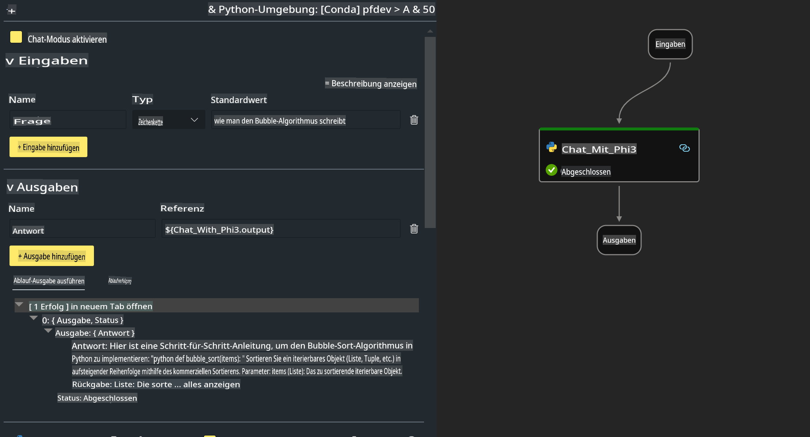

# **Lab 2 - Prompt flow mit Phi-3-mini in AIPC ausführen**

## **Was ist Prompt flow**

Prompt flow ist eine Sammlung von Entwicklungstools, die den gesamten Entwicklungszyklus von LLM-basierten KI-Anwendungen vereinfachen – von der Ideenfindung, Prototyping, Testen, Evaluierung bis hin zur Produktionseinführung und Überwachung. Es erleichtert das Prompt-Engineering erheblich und ermöglicht es Ihnen, LLM-Anwendungen in Produktionsqualität zu erstellen.

Mit Prompt flow können Sie:

- Flows erstellen, die LLMs, Prompts, Python-Code und andere Tools in einem ausführbaren Workflow verbinden.

- Ihre Flows debuggen und iterieren, insbesondere die Interaktionen mit LLMs, auf einfache Weise.

- Ihre Flows evaluieren und Qualitäts- sowie Leistungsmetriken mit größeren Datensätzen berechnen.

- Tests und Evaluierungen in Ihr CI/CD-System integrieren, um die Qualität Ihres Flows sicherzustellen.

- Ihre Flows auf der von Ihnen gewählten Plattform bereitstellen oder einfach in den Code Ihrer Anwendung integrieren.

- (Optional, aber sehr empfehlenswert) Mit Ihrem Team zusammenarbeiten, indem Sie die Cloud-Version von Prompt flow in Azure AI nutzen.


## **Code-Generierungs-Flows auf Apple Silicon erstellen**

***Hinweis***: Falls Sie die Umgebungsinstallation noch nicht abgeschlossen haben, besuchen Sie bitte [Lab 0 - Installationen](./01.Installations.md)

1. Öffnen Sie die Prompt flow-Erweiterung in Visual Studio Code und erstellen Sie ein leeres Flow-Projekt.


2. Fügen Sie Eingabe- und Ausgabeparameter hinzu und fügen Sie Python-Code als neuen Flow hinzu.



Sie können sich an dieser Struktur (flow.dag.yaml) orientieren, um Ihren Flow zu erstellen.

```yaml

inputs:
  prompt:
    type: string
    default: Write python code for Fibonacci serie. Please use markdown as output
outputs:
  result:
    type: string
    reference: ${gen_code_by_phi3.output}
nodes:
- name: gen_code_by_phi3
  type: python
  source:
    type: code
    path: gen_code_by_phi3.py
  inputs:
    prompt: ${inputs.prompt}


```

3. Phi-3-mini quantifizieren

Wir möchten SLM besser auf lokalen Geräten ausführen. Üblicherweise quantifizieren wir das Modell (INT4, FP16, FP32).

```bash

python -m mlx_lm.convert --hf-path microsoft/Phi-3-mini-4k-instruct

```

**Hinweis:** Der Standardordner ist mlx_model.

4. Code in ***Chat_With_Phi3.py*** hinzufügen.

```python


from promptflow import tool

from mlx_lm import load, generate


# The inputs section will change based on the arguments of the tool function, after you save the code
# Adding type to arguments and return value will help the system show the types properly
# Please update the function name/signature per need
@tool
def my_python_tool(prompt: str) -> str:

    model_id = './mlx_model_phi3_mini'

    model, tokenizer = load(model_id)

    # <|user|>\nWrite python code for Fibonacci serie. Please use markdown as output<|end|>\n<|assistant|>

    response = generate(model, tokenizer, prompt="<|user|>\n" + prompt  + "<|end|>\n<|assistant|>", max_tokens=2048, verbose=True)

    return response


```

4. Sie können den Flow über Debug oder Run testen, um zu überprüfen, ob der generierte Code korrekt ist.


5. Flow als Entwicklungs-API im Terminal ausführen.

```

pf flow serve --source ./ --port 8080 --host localhost   

```

Sie können es in Postman / Thunder Client testen.


### **Hinweise**

1. Der erste Lauf dauert lange. Es wird empfohlen, das phi-3-Modell über die Hugging Face CLI herunterzuladen.

2. Angesichts der begrenzten Rechenleistung der Intel NPU wird empfohlen, Phi-3-mini-4k-instruct zu verwenden.

3. Wir verwenden Intel NPU-Beschleunigung, um die INT4-Konvertierung zu quantifizieren. Wenn Sie den Dienst jedoch erneut ausführen, müssen Sie den Cache und die nc_workshop-Ordner löschen.


## **Ressourcen**

1. Lernen Sie Promptflow [https://microsoft.github.io/promptflow/](https://microsoft.github.io/promptflow/)

2. Lernen Sie Intel NPU Acceleration [https://github.com/intel/intel-npu-acceleration-library](https://github.com/intel/intel-npu-acceleration-library)

3. Beispielcode herunterladen [Local NPU Agent Sample Code](../../../../../../../../../code/07.Lab/01/AIPC/local-npu-agent)

**Haftungsausschluss**:  
Dieses Dokument wurde mithilfe von KI-gestützten maschinellen Übersetzungsdiensten übersetzt. Obwohl wir uns um Genauigkeit bemühen, beachten Sie bitte, dass automatisierte Übersetzungen Fehler oder Ungenauigkeiten enthalten können. Das Originaldokument in seiner ursprünglichen Sprache sollte als maßgebliche Quelle betrachtet werden. Für kritische Informationen wird eine professionelle menschliche Übersetzung empfohlen. Wir übernehmen keine Haftung für Missverständnisse oder Fehlinterpretationen, die sich aus der Nutzung dieser Übersetzung ergeben.