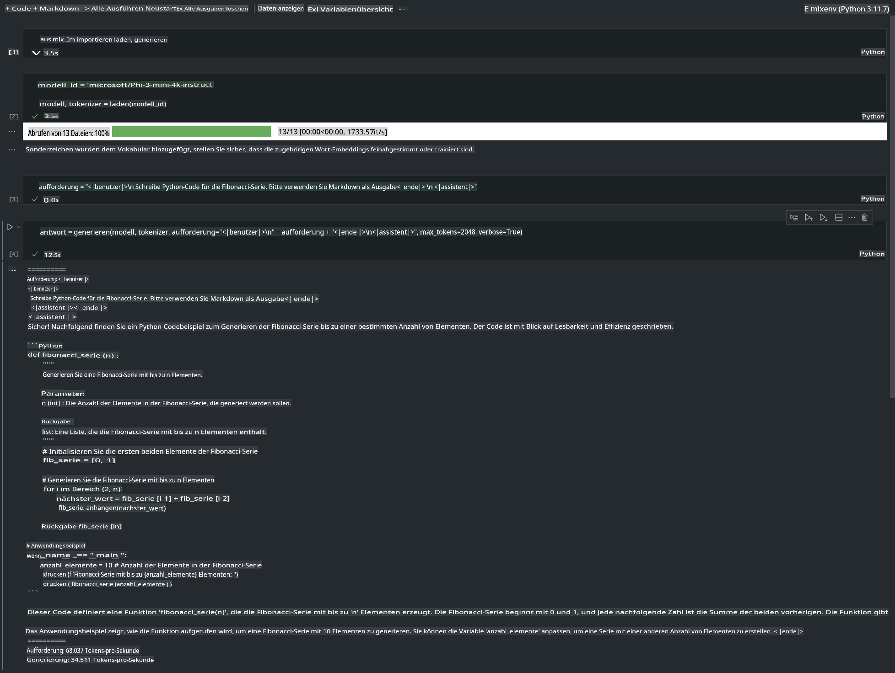

# **Inference Phi-3 mit dem Apple MLX Framework**

## **Was ist das MLX Framework**

MLX ist ein Framework für maschinelles Lernen auf Apple Silicon, entwickelt von der Apple Machine Learning Forschung.

MLX wurde von Forschern im Bereich maschinelles Lernen für Forscher im Bereich maschinelles Lernen entworfen. Das Framework soll benutzerfreundlich sein, dabei aber effizient bleiben, um Modelle zu trainieren und bereitzustellen. Auch das Design des Frameworks ist konzeptionell einfach gehalten. Unser Ziel ist es, Forschern die Möglichkeit zu geben, MLX leicht zu erweitern und zu verbessern, um neue Ideen schnell zu erkunden.

LLMs können auf Apple Silicon-Geräten durch MLX beschleunigt werden, und Modelle können lokal sehr bequem ausgeführt werden.

## **Verwendung von MLX zur Inferenz von Phi-3-mini**

### **1. Einrichtung deiner MLX-Umgebung**

1. Python 3.11.x  
2. Installation der MLX-Bibliothek  

```bash

pip install mlx-lm

```

### **2. Ausführen von Phi-3-mini im Terminal mit MLX**

```bash

python -m mlx_lm.generate --model microsoft/Phi-3-mini-4k-instruct --max-token 2048 --prompt  "<|user|>\nCan you introduce yourself<|end|>\n<|assistant|>"

```

Das Ergebnis (meine Umgebung ist Apple M1 Max, 64GB) ist:


### **3. Quantisierung von Phi-3-mini mit MLX im Terminal**

```bash

python -m mlx_lm.convert --hf-path microsoft/Phi-3-mini-4k-instruct

```

***Hinweis:*** Das Modell kann mit mlx_lm.convert quantisiert werden, wobei die Standardquantisierung INT4 ist. Dieses Beispiel quantisiert Phi-3-mini auf INT4.

Das Modell kann mit mlx_lm.convert quantisiert werden, wobei die Standardquantisierung INT4 ist. In diesem Beispiel wird Phi-3-mini auf INT4 quantisiert. Nach der Quantisierung wird es im Standardverzeichnis ./mlx_model gespeichert.

Wir können das mit MLX quantisierte Modell im Terminal testen:

```bash

python -m mlx_lm.generate --model ./mlx_model/ --max-token 2048 --prompt  "<|user|>\nCan you introduce yourself<|end|>\n<|assistant|>"

```

Das Ergebnis ist:


### **4. Ausführen von Phi-3-mini mit MLX im Jupyter Notebook**



***Hinweis:*** Bitte lies dieses Beispiel [klicke auf diesen Link](../../../../../code/03.Inference/MLX/MLX_DEMO.ipynb)

## **Ressourcen**

1. Erfahre mehr über das Apple MLX Framework [https://ml-explore.github.io](https://ml-explore.github.io/mlx/build/html/index.html)

2. Apple MLX GitHub Repo [https://github.com/ml-explore](https://github.com/ml-explore)

**Haftungsausschluss**:  
Dieses Dokument wurde mit KI-gestützten maschinellen Übersetzungsdiensten übersetzt. Obwohl wir uns um Genauigkeit bemühen, weisen wir darauf hin, dass automatisierte Übersetzungen Fehler oder Ungenauigkeiten enthalten können. Das Originaldokument in seiner ursprünglichen Sprache sollte als maßgebliche Quelle betrachtet werden. Für kritische Informationen wird eine professionelle menschliche Übersetzung empfohlen. Wir übernehmen keine Haftung für Missverständnisse oder Fehlinterpretationen, die sich aus der Nutzung dieser Übersetzung ergeben.