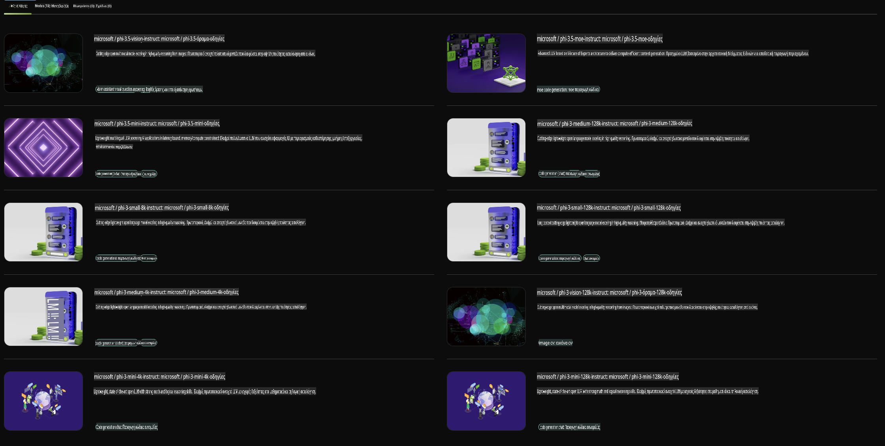

## Η οικογένεια Phi στο NVIDIA NIM

Το NVIDIA NIM είναι ένα σύνολο εύχρηστων μικροϋπηρεσιών που έχουν σχεδιαστεί για να επιταχύνουν την ανάπτυξη μοντέλων γεννητικής AI σε περιβάλλοντα cloud, data center και workstations. Τα NIMs κατηγοριοποιούνται ανά οικογένεια μοντέλων και ανά μοντέλο. Για παράδειγμα, το NVIDIA NIM για μεγάλα γλωσσικά μοντέλα (LLMs) φέρνει τη δύναμη των πιο σύγχρονων LLMs στις επιχειρηματικές εφαρμογές, προσφέροντας απαράμιλλες δυνατότητες επεξεργασίας και κατανόησης φυσικής γλώσσας.

Το NIM διευκολύνει τις ομάδες IT και DevOps να φιλοξενούν αυτόνομα μεγάλα γλωσσικά μοντέλα (LLMs) στα δικά τους διαχειριζόμενα περιβάλλοντα, παρέχοντας παράλληλα στους προγραμματιστές πρότυπα APIs της βιομηχανίας. Αυτά τα APIs τους επιτρέπουν να δημιουργούν ισχυρούς copilots, chatbots και AI assistants που μπορούν να μεταμορφώσουν την επιχείρησή τους. Χρησιμοποιώντας την αιχμή της τεχνολογίας GPU της NVIDIA και την κλιμακούμενη ανάπτυξη, το NIM προσφέρει τον ταχύτερο δρόμο για inference με ασύγκριτη απόδοση.

Μπορείτε να χρησιμοποιήσετε το NVIDIA NIM για inference μοντέλων της οικογένειας Phi.



### **Παραδείγματα - Phi-3-Vision στο NVIDIA NIM**

Φανταστείτε ότι έχετε μια εικόνα (`demo.png`) και θέλετε να δημιουργήσετε κώδικα Python που επεξεργάζεται αυτήν την εικόνα και αποθηκεύει μια νέα έκδοσή της (`phi-3-vision.jpg`).

Ο παραπάνω κώδικας αυτοματοποιεί αυτή τη διαδικασία μέσω:

1. Ρύθμισης του περιβάλλοντος και των απαραίτητων διαμορφώσεων.
2. Δημιουργίας ενός prompt που καθοδηγεί το μοντέλο να παράγει τον απαιτούμενο κώδικα Python.
3. Αποστολής του prompt στο μοντέλο και συλλογής του παραγόμενου κώδικα.
4. Εξαγωγής και εκτέλεσης του παραγόμενου κώδικα.
5. Εμφάνισης της αρχικής και της επεξεργασμένης εικόνας.

Αυτή η προσέγγιση αξιοποιεί τη δύναμη της AI για την αυτοματοποίηση εργασιών επεξεργασίας εικόνας, καθιστώντας την επίτευξη των στόχων σας ευκολότερη και ταχύτερη.

[Παράδειγμα Κώδικα Λύσης](../../../../../code/06.E2E/E2E_Nvidia_NIM_Phi3_Vision.ipynb)

Ας αναλύσουμε τι κάνει ολόκληρος ο κώδικας βήμα προς βήμα:

1. **Εγκατάσταση Απαραίτητου Πακέτου**:
    ```python
    !pip install langchain_nvidia_ai_endpoints -U
    ```
    Αυτή η εντολή εγκαθιστά το πακέτο `langchain_nvidia_ai_endpoints`, διασφαλίζοντας ότι είναι η τελευταία έκδοση.

2. **Εισαγωγή Απαραίτητων Modules**:
    ```python
    from langchain_nvidia_ai_endpoints import ChatNVIDIA
    import getpass
    import os
    import base64
    ```
    Αυτές οι εισαγωγές φέρνουν τα απαραίτητα modules για την αλληλεπίδραση με τα NVIDIA AI endpoints, την ασφαλή διαχείριση κωδικών, την αλληλεπίδραση με το λειτουργικό σύστημα και την κωδικοποίηση/αποκωδικοποίηση δεδομένων σε μορφή base64.

3. **Ρύθμιση API Key**:
    ```python
    if not os.getenv("NVIDIA_API_KEY"):
        os.environ["NVIDIA_API_KEY"] = getpass.getpass("Enter your NVIDIA API key: ")
    ```
    Αυτός ο κώδικας ελέγχει αν έχει οριστεί η μεταβλητή περιβάλλοντος `NVIDIA_API_KEY`. Αν όχι, ζητά από τον χρήστη να εισάγει το API key με ασφάλεια.

4. **Ορισμός Μοντέλου και Διαδρομής Εικόνας**:
    ```python
    model = 'microsoft/phi-3-vision-128k-instruct'
    chat = ChatNVIDIA(model=model)
    img_path = './imgs/demo.png'
    ```
    Αυτό ορίζει το μοντέλο που θα χρησιμοποιηθεί, δημιουργεί μια instance του `ChatNVIDIA` με το καθορισμένο μοντέλο και ορίζει τη διαδρομή του αρχείου εικόνας.

5. **Δημιουργία Κειμένου Prompt**:
    ```python
    text = "Please create Python code for image, and use plt to save the new picture under imgs/ and name it phi-3-vision.jpg."
    ```
    Αυτό ορίζει ένα κείμενο prompt που καθοδηγεί το μοντέλο να δημιουργήσει κώδικα Python για την επεξεργασία μιας εικόνας.

6. **Κωδικοποίηση Εικόνας σε Base64**:
    ```python
    with open(img_path, "rb") as f:
        image_b64 = base64.b64encode(f.read()).decode()
    image = f''
    ```
    Αυτός ο κώδικας διαβάζει το αρχείο εικόνας, το κωδικοποιεί σε base64 και δημιουργεί μια HTML ετικέτα εικόνας με τα κωδικοποιημένα δεδομένα.

7. **Συνδυασμός Κειμένου και Εικόνας σε Prompt**:
    ```python
    prompt = f"{text} {image}"
    ```
    Αυτό συνδυάζει το κείμενο prompt και την HTML ετικέτα εικόνας σε ένα ενιαίο string.

8. **Παραγωγή Κώδικα Χρησιμοποιώντας ChatNVIDIA**:
    ```python
    code = ""
    for chunk in chat.stream(prompt):
        print(chunk.content, end="")
        code += chunk.content
    ```
    Αυτός ο κώδικας στέλνει το prompt στο `ChatNVIDIA` model and collects the generated code in chunks, printing and appending each chunk to the `code` string.

9. **Εξαγωγή Κώδικα Python από το Παραγόμενο Περιεχόμενο**:
    ```python
    begin = code.index('```python') + 9
    code = code[begin:]
    end = code.index('```')
    code = code[:end]
    ```
    Αυτό εξάγει τον πραγματικό κώδικα Python από το παραγόμενο περιεχόμενο αφαιρώντας τη μορφοποίηση markdown.

10. **Εκτέλεση του Παραγόμενου Κώδικα**:
    ```python
    import subprocess
    result = subprocess.run(["python", "-c", code], capture_output=True)
    ```
    Αυτό εκτελεί τον εξαγόμενο κώδικα Python ως subprocess και καταγράφει την έξοδό του.

11. **Εμφάνιση Εικόνων**:
    ```python
    from IPython.display import Image, display
    display(Image(filename='./imgs/phi-3-vision.jpg'))
    display(Image(filename='./imgs/demo.png'))
    ```
    Αυτές οι γραμμές εμφανίζουν τις εικόνες χρησιμοποιώντας το module `IPython.display`.

**Αποποίηση ευθυνών**:  
Αυτό το έγγραφο έχει μεταφραστεί χρησιμοποιώντας υπηρεσίες αυτόματης μετάφρασης με τεχνητή νοημοσύνη. Ενώ καταβάλλουμε προσπάθειες για ακρίβεια, παρακαλούμε να έχετε υπόψη ότι οι αυτόματες μεταφράσεις ενδέχεται να περιέχουν λάθη ή ανακρίβειες. Το αρχικό έγγραφο στη γλώσσα προέλευσης θα πρέπει να θεωρείται η αυθεντική πηγή. Για κρίσιμες πληροφορίες, συνιστάται επαγγελματική μετάφραση από άνθρωπο. Δεν φέρουμε καμία ευθύνη για τυχόν παρεξηγήσεις ή εσφαλμένες ερμηνείες που προκύπτουν από τη χρήση αυτής της μετάφρασης.