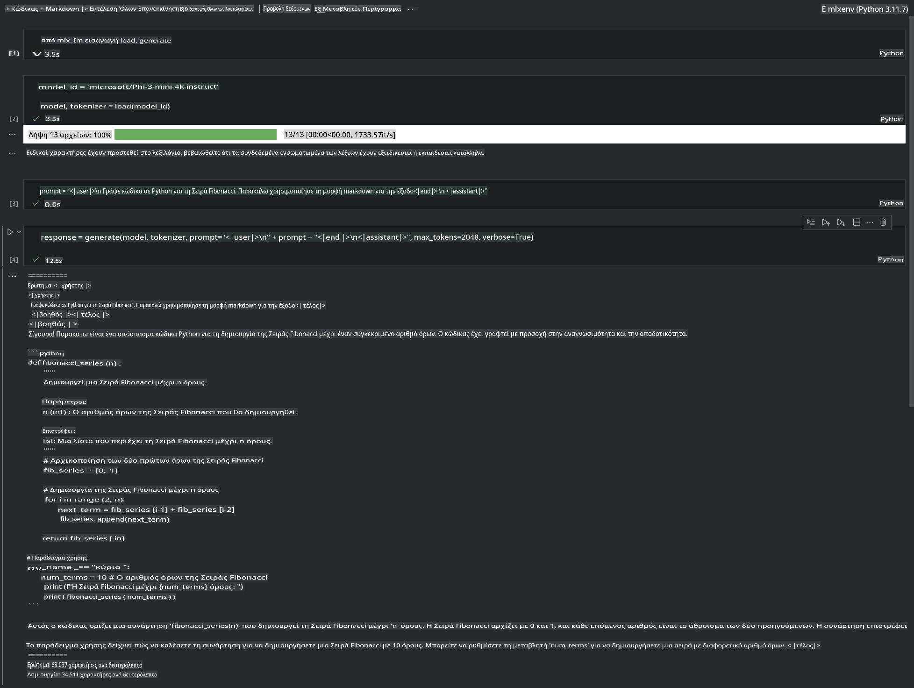

# **Εκτέλεση του Phi-3 με το Apple MLX Framework**

## **Τι είναι το MLX Framework**

Το MLX είναι ένα πλαίσιο για έρευνα μηχανικής μάθησης που έχει αναπτυχθεί από την Apple, ειδικά για συσκευές με Apple Silicon.

Το MLX έχει σχεδιαστεί από ερευνητές μηχανικής μάθησης για ερευνητές μηχανικής μάθησης. Το πλαίσιο είναι φιλικό προς τον χρήστη, αλλά παραμένει αποδοτικό τόσο για την εκπαίδευση όσο και για την ανάπτυξη μοντέλων. Ο σχεδιασμός του είναι απλός σε επίπεδο εννοιών, με στόχο να διευκολύνει τους ερευνητές να το επεκτείνουν και να το βελτιώσουν, επιτρέποντας την ταχύτερη εξερεύνηση νέων ιδεών.

Τα LLMs μπορούν να επιταχυνθούν σε συσκευές με Apple Silicon μέσω του MLX, ενώ τα μοντέλα μπορούν να εκτελούνται τοπικά με μεγάλη ευκολία.

## **Χρήση του MLX για εκτέλεση του Phi-3-mini**

### **1. Ρύθμιση του περιβάλλοντος MLX**

1. Python 3.11.x  
2. Εγκατάσταση της βιβλιοθήκης MLX  

```bash

pip install mlx-lm

```

### **2. Εκτέλεση του Phi-3-mini στο Terminal με το MLX**

```bash

python -m mlx_lm.generate --model microsoft/Phi-3-mini-4k-instruct --max-token 2048 --prompt  "<|user|>\nCan you introduce yourself<|end|>\n<|assistant|>"

```

Το αποτέλεσμα (στο περιβάλλον μου, Apple M1 Max, 64GB) είναι:


### **3. Κβαντοποίηση του Phi-3-mini με το MLX στο Terminal**

```bash

python -m mlx_lm.convert --hf-path microsoft/Phi-3-mini-4k-instruct

```

***Σημείωση:*** Το μοντέλο μπορεί να κβαντοποιηθεί μέσω της συνάρτησης mlx_lm.convert, με την προεπιλεγμένη κβαντοποίηση να είναι INT4. Σε αυτό το παράδειγμα, το Phi-3-mini κβαντοποιείται σε INT4.

Μετά την κβαντοποίηση, το μοντέλο αποθηκεύεται στον προεπιλεγμένο φάκελο ./mlx_model.

Μπορούμε να δοκιμάσουμε το κβαντοποιημένο μοντέλο με το MLX μέσω του terminal.

```bash

python -m mlx_lm.generate --model ./mlx_model/ --max-token 2048 --prompt  "<|user|>\nCan you introduce yourself<|end|>\n<|assistant|>"

```

Το αποτέλεσμα είναι:


### **4. Εκτέλεση του Phi-3-mini με το MLX σε Jupyter Notebook**



***Σημείωση:*** Παρακαλούμε διαβάστε αυτό το παράδειγμα [πατήστε εδώ](../../../../../code/03.Inference/MLX/MLX_DEMO.ipynb)

## **Πόροι**

1. Μάθετε περισσότερα για το Apple MLX Framework [https://ml-explore.github.io](https://ml-explore.github.io/mlx/build/html/index.html)  

2. Αποθετήριο GitHub του Apple MLX [https://github.com/ml-explore](https://github.com/ml-explore)  

**Αποποίηση ευθυνών**:  
Αυτό το έγγραφο έχει μεταφραστεί χρησιμοποιώντας υπηρεσίες μηχανικής μετάφρασης με τεχνητή νοημοσύνη. Παρόλο που καταβάλλουμε προσπάθειες για ακρίβεια, παρακαλούμε να έχετε υπόψη ότι οι αυτοματοποιημένες μεταφράσεις ενδέχεται να περιέχουν λάθη ή ανακρίβειες. Το πρωτότυπο έγγραφο στη μητρική του γλώσσα θα πρέπει να θεωρείται η αυθεντική πηγή. Για κρίσιμες πληροφορίες, συνιστάται επαγγελματική ανθρώπινη μετάφραση. Δεν φέρουμε ευθύνη για τυχόν παρεξηγήσεις ή εσφαλμένες ερμηνείες που προκύπτουν από τη χρήση αυτής της μετάφρασης.