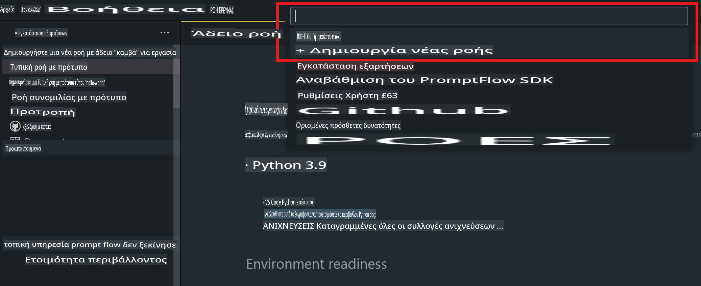

# **Εργαστήριο 2 - Εκτέλεση Prompt flow με Phi-3-mini σε AIPC**

## **Τι είναι το Prompt flow**

Το Prompt flow είναι ένα σύνολο εργαλείων ανάπτυξης που έχει σχεδιαστεί για να απλοποιεί τον πλήρη κύκλο ανάπτυξης εφαρμογών AI βασισμένων σε LLM, από τη σύλληψη της ιδέας, τον πρωτοτυπικό σχεδιασμό, τη δοκιμή, την αξιολόγηση, μέχρι την ανάπτυξη σε παραγωγή και την παρακολούθηση. Κάνει τη διαδικασία της δημιουργίας prompts πολύ πιο εύκολη και σας επιτρέπει να δημιουργείτε εφαρμογές LLM υψηλής ποιότητας για παραγωγή.

Με το Prompt flow, μπορείτε να:

- Δημιουργείτε ροές που συνδέουν LLMs, prompts, Python κώδικα και άλλα εργαλεία σε μια εκτελέσιμη ροή εργασίας.

- Εντοπίζετε και διορθώνετε σφάλματα στις ροές σας, ειδικά στις αλληλεπιδράσεις με τα LLMs, με ευκολία.

- Αξιολογείτε τις ροές σας και υπολογίζετε δείκτες ποιότητας και απόδοσης με μεγαλύτερα σύνολα δεδομένων.

- Ενσωματώνετε τη δοκιμή και την αξιολόγηση στο σύστημα CI/CD σας για να διασφαλίσετε την ποιότητα της ροής σας.

- Αναπτύσσετε τις ροές σας στην πλατφόρμα εξυπηρέτησης της επιλογής σας ή τις ενσωματώνετε εύκολα στον κώδικα της εφαρμογής σας.

- (Προαιρετικό αλλά συνιστάται θερμά) Συνεργάζεστε με την ομάδα σας χρησιμοποιώντας την έκδοση cloud του Prompt flow στο Azure AI.

## **Τι είναι το AIPC**

Ένας AI PC διαθέτει CPU, GPU και NPU, καθένα από τα οποία έχει συγκεκριμένες δυνατότητες επιτάχυνσης AI. Ένα NPU, ή μονάδα επεξεργασίας νευρωνικών δικτύων, είναι ένας εξειδικευμένος επιταχυντής που εκτελεί εργασίες τεχνητής νοημοσύνης (AI) και μηχανικής μάθησης (ML) απευθείας στον υπολογιστή σας, αντί να στέλνει δεδομένα για επεξεργασία στο cloud. Η GPU και η CPU μπορούν επίσης να επεξεργάζονται τέτοιες εργασίες, αλλά το NPU είναι ιδιαίτερα αποτελεσματικό σε υπολογισμούς AI με χαμηλή κατανάλωση ενέργειας. Ο AI PC αντιπροσωπεύει μια θεμελιώδη αλλαγή στον τρόπο λειτουργίας των υπολογιστών μας. Δεν είναι λύση για ένα πρόβλημα που δεν υπήρχε πριν, αλλά υπόσχεται σημαντική βελτίωση στις καθημερινές χρήσεις του υπολογιστή.

Πώς λειτουργεί; Σε σύγκριση με την γενετική AI και τα μεγάλα μοντέλα γλώσσας (LLMs) που εκπαιδεύονται σε τεράστια δημόσια δεδομένα, η AI που θα λειτουργεί στον υπολογιστή σας είναι πιο προσιτή σε κάθε επίπεδο. Η ιδέα είναι πιο εύκολα κατανοητή και, επειδή εκπαιδεύεται στα δικά σας δεδομένα χωρίς να χρειάζεται πρόσβαση στο cloud, τα οφέλη είναι πιο άμεσα ελκυστικά για ένα ευρύτερο κοινό.

Στο άμεσο μέλλον, ο κόσμος του AI PC περιλαμβάνει προσωπικούς βοηθούς και μικρότερα μοντέλα AI που λειτουργούν απευθείας στον υπολογιστή σας, χρησιμοποιώντας τα δεδομένα σας για να προσφέρουν προσωπικές, ιδιωτικές και πιο ασφαλείς βελτιώσεις AI για πράγματα που ήδη κάνετε καθημερινά – όπως τη λήψη πρακτικών συσκέψεων, την οργάνωση ενός πρωταθλήματος φανταστικού ποδοσφαίρου, την αυτοματοποίηση βελτιώσεων για επεξεργασία φωτογραφιών και βίντεο ή τη δημιουργία του τέλειου προγράμματος για μια οικογενειακή επανένωση βασισμένο στους χρόνους άφιξης και αναχώρησης όλων.

## **Δημιουργία ροών κώδικα γενετικής στο AIPC**

***Σημείωση***: Εάν δεν έχετε ολοκληρώσει την εγκατάσταση του περιβάλλοντος, επισκεφθείτε [Lab 0 - Εγκαταστάσεις](./01.Installations.md)

1. Ανοίξτε το Prompt flow Extension στο Visual Studio Code και δημιουργήστε ένα κενό έργο ροής.



2. Προσθέστε παραμέτρους Εισόδου και Εξόδου και προσθέστε Python κώδικα ως νέα ροή.


Μπορείτε να ανατρέξετε σε αυτήν τη δομή (flow.dag.yaml) για να κατασκευάσετε τη ροή σας.

```yaml

inputs:
  question:
    type: string
    default: how to write Bubble Algorithm
outputs:
  answer:
    type: string
    reference: ${Chat_With_Phi3.output}
nodes:
- name: Chat_With_Phi3
  type: python
  source:
    type: code
    path: Chat_With_Phi3.py
  inputs:
    question: ${inputs.question}


```

3. Προσθέστε κώδικα στο ***Chat_With_Phi3.py***

```python


from promptflow.core import tool

# import torch
from transformers import AutoTokenizer, pipeline,TextStreamer
import intel_npu_acceleration_library as npu_lib

import warnings

import asyncio
import platform

class Phi3CodeAgent:
    
    model = None
    tokenizer = None
    text_streamer = None
    
    model_id = "microsoft/Phi-3-mini-4k-instruct"

    @staticmethod
    def init_phi3():
        
        if Phi3CodeAgent.model is None or Phi3CodeAgent.tokenizer is None or Phi3CodeAgent.text_streamer is None:
            Phi3CodeAgent.model = npu_lib.NPUModelForCausalLM.from_pretrained(
                                    Phi3CodeAgent.model_id,
                                    torch_dtype="auto",
                                    dtype=npu_lib.int4,
                                    trust_remote_code=True
                                )
            Phi3CodeAgent.tokenizer = AutoTokenizer.from_pretrained(Phi3CodeAgent.model_id)
            Phi3CodeAgent.text_streamer = TextStreamer(Phi3CodeAgent.tokenizer, skip_prompt=True)

    

    @staticmethod
    def chat_with_phi3(prompt):
        
        Phi3CodeAgent.init_phi3()

        messages = "<|system|>You are a AI Python coding assistant. Please help me to generate code in Python.The answer only genertated Python code, but any comments and instructions do not need to be generated<|end|><|user|>" + prompt +"<|end|><|assistant|>"


        generation_args = {
            "max_new_tokens": 1024,
            "return_full_text": False,
            "temperature": 0.3,
            "do_sample": False,
            "streamer": Phi3CodeAgent.text_streamer,
        }

        pipe = pipeline(
            "text-generation",
            model=Phi3CodeAgent.model,
            tokenizer=Phi3CodeAgent.tokenizer,
            # **generation_args
        )

        result = ''

        with warnings.catch_warnings():
            warnings.simplefilter("ignore")
            response = pipe(messages, **generation_args)
            result =response[0]['generated_text']
            return result


@tool
def my_python_tool(question: str) -> str:
    if platform.system() == 'Windows':
        asyncio.set_event_loop_policy(asyncio.WindowsSelectorEventLoopPolicy())
    return Phi3CodeAgent.chat_with_phi3(question)


```

4. Μπορείτε να δοκιμάσετε τη ροή από το Debug ή Run για να ελέγξετε αν ο κώδικας γενετικής λειτουργεί σωστά.


5. Εκτελέστε τη ροή ως API ανάπτυξης στο τερματικό.

```

pf flow serve --source ./ --port 8080 --host localhost   

```

Μπορείτε να το δοκιμάσετε στο Postman / Thunder Client.

### **Σημειώσεις**

1. Η πρώτη εκτέλεση διαρκεί αρκετό χρόνο. Συνιστάται να κατεβάσετε το μοντέλο phi-3 από το Hugging Face CLI.

2. Λόγω της περιορισμένης υπολογιστικής ισχύος του Intel NPU, συνιστάται η χρήση του Phi-3-mini-4k-instruct.

3. Χρησιμοποιούμε την επιτάχυνση Intel NPU για μετατροπή INT4, αλλά εάν εκτελέσετε ξανά την υπηρεσία, πρέπει να διαγράψετε τους φακέλους cache και nc_workshop.

## **Πόροι**

1. Μάθετε για το Promptflow [https://microsoft.github.io/promptflow/](https://microsoft.github.io/promptflow/)

2. Μάθετε για την επιτάχυνση Intel NPU [https://github.com/intel/intel-npu-acceleration-library](https://github.com/intel/intel-npu-acceleration-library)

3. Δείγμα κώδικα, κατεβάστε [Τοπικό δείγμα κώδικα NPU Agent](../../../../../../../../../code/07.Lab/01/AIPC)

**Αποποίηση ευθύνης**:  
Αυτό το έγγραφο έχει μεταφραστεί χρησιμοποιώντας υπηρεσίες αυτόματης μετάφρασης με τεχνητή νοημοσύνη. Παρόλο που καταβάλλουμε προσπάθειες για ακρίβεια, παρακαλούμε να έχετε υπόψη ότι οι αυτόματες μεταφράσεις ενδέχεται να περιέχουν λάθη ή ανακρίβειες. Το αρχικό έγγραφο στη μητρική του γλώσσα θα πρέπει να θεωρείται η αυθεντική πηγή. Για κρίσιμες πληροφορίες, συνιστάται επαγγελματική μετάφραση από άνθρωπο. Δεν φέρουμε καμία ευθύνη για τυχόν παρανοήσεις ή παρερμηνείες που προκύπτουν από τη χρήση αυτής της μετάφρασης.