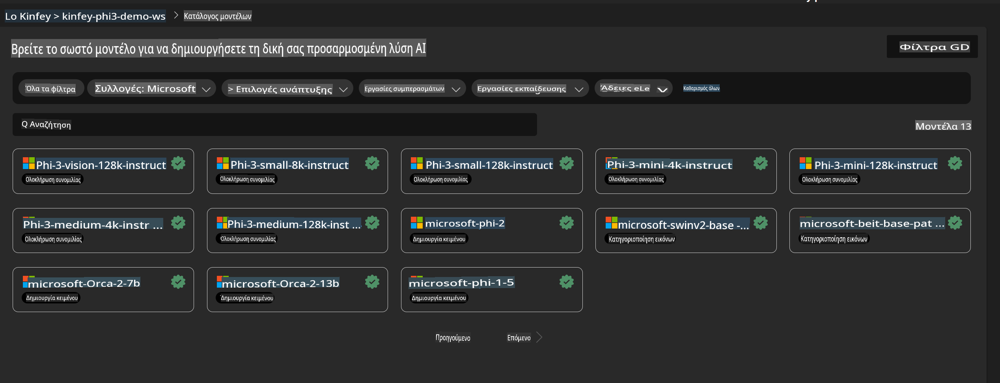
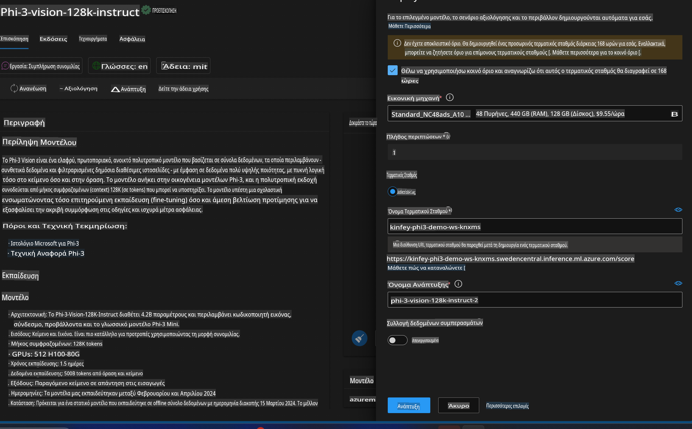
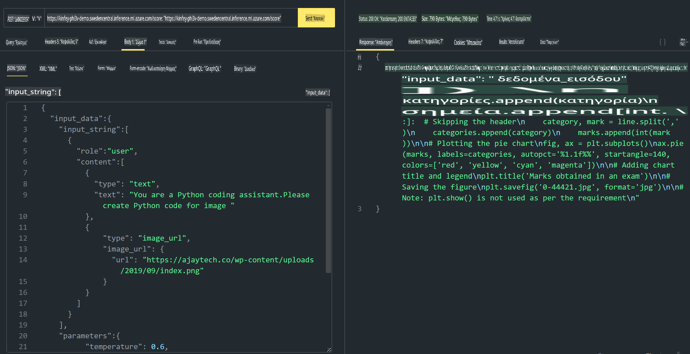

# **Lab 3 - Εγκατάσταση του Phi-3-Vision στην Υπηρεσία Azure Machine Learning**

Χρησιμοποιούμε NPU για να ολοκληρώσουμε την παραγωγική εγκατάσταση του τοπικού κώδικα, και στη συνέχεια θέλουμε να εισαγάγουμε τη δυνατότητα του PHI-3-VISION για να μετατρέπουμε εικόνες σε κώδικα.

Σε αυτή την εισαγωγή, μπορούμε γρήγορα να δημιουργήσουμε μια υπηρεσία Model As Service Phi-3 Vision στην Υπηρεσία Azure Machine Learning.

***Σημείωση***: Το Phi-3 Vision απαιτεί υπολογιστική ισχύ για να δημιουργεί περιεχόμενο με μεγαλύτερη ταχύτητα. Χρειαζόμαστε υπολογιστική ισχύ από το cloud για να το επιτύχουμε.

### **1. Δημιουργία της Υπηρεσίας Azure Machine Learning**

Πρέπει να δημιουργήσουμε την Υπηρεσία Azure Machine Learning στο Azure Portal. Αν θέλετε να μάθετε πώς, επισκεφθείτε αυτόν τον σύνδεσμο [https://learn.microsoft.com/azure/machine-learning/quickstart-create-resources?view=azureml-api-2](https://learn.microsoft.com/azure/machine-learning/quickstart-create-resources?view=azureml-api-2)

### **2. Επιλογή του Phi-3 Vision στην Υπηρεσία Azure Machine Learning**



### **3. Εγκατάσταση του Phi-3-Vision στο Azure**



### **4. Δοκιμή του Endpoint στο Postman**



***Σημείωση***

1. Οι παράμετροι που πρέπει να μεταδοθούν πρέπει να περιλαμβάνουν Authorization, azureml-model-deployment, και Content-Type. Πρέπει να ελέγξετε τις πληροφορίες εγκατάστασης για να τις αποκτήσετε.

2. Για τη μετάδοση παραμέτρων, το Phi-3-Vision χρειάζεται έναν σύνδεσμο εικόνας. Παρακαλούμε ανατρέξτε στη μέθοδο GPT-4-Vision για τη μετάδοση παραμέτρων, όπως

```json

{
  "input_data":{
    "input_string":[
      {
        "role":"user",
        "content":[ 
          {
            "type": "text",
            "text": "You are a Python coding assistant.Please create Python code for image "
          },
          {
              "type": "image_url",
              "image_url": {
                "url": "https://ajaytech.co/wp-content/uploads/2019/09/index.png"
              }
          }
        ]
      }
    ],
    "parameters":{
          "temperature": 0.6,
          "top_p": 0.9,
          "do_sample": false,
          "max_new_tokens": 2048
    }
  }
}

```

3. Κάντε κλήση στο **/score** χρησιμοποιώντας τη μέθοδο Post.

**Συγχαρητήρια**! Ολοκληρώσατε τη γρήγορη εγκατάσταση του PHI-3-VISION και δοκιμάσατε πώς να χρησιμοποιείτε εικόνες για να δημιουργείτε κώδικα. Στη συνέχεια, μπορούμε να χτίσουμε εφαρμογές συνδυάζοντας NPUs και cloud.

**Αποποίηση ευθύνης**:  
Αυτό το έγγραφο έχει μεταφραστεί χρησιμοποιώντας υπηρεσίες αυτόματης μετάφρασης με τεχνητή νοημοσύνη. Παρόλο που καταβάλλουμε προσπάθειες για ακρίβεια, παρακαλούμε να έχετε υπόψη ότι οι αυτόματες μεταφράσεις ενδέχεται να περιέχουν λάθη ή ανακρίβειες. Το πρωτότυπο έγγραφο στη μητρική του γλώσσα θα πρέπει να θεωρείται η αυθεντική πηγή. Για κρίσιμες πληροφορίες, συνιστάται επαγγελματική ανθρώπινη μετάφραση. Δεν φέρουμε ευθύνη για τυχόν παρανοήσεις ή παρερμηνείες που προκύπτουν από τη χρήση αυτής της μετάφρασης.