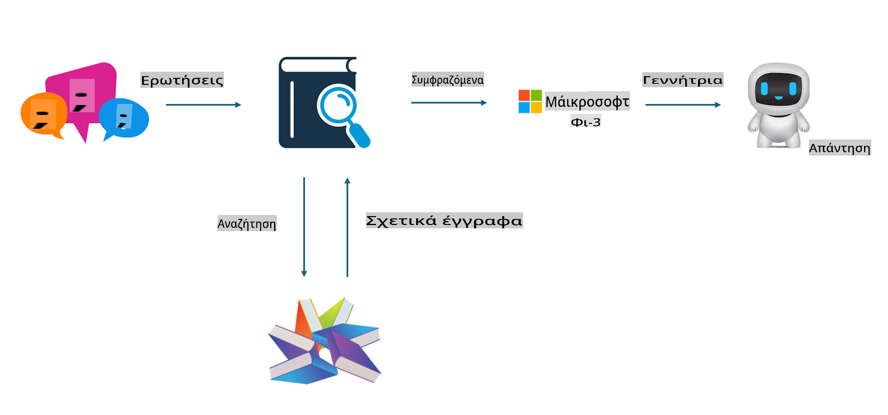

## Finetuning vs RAG

## Retrieval Augmented Generation

Το RAG συνδυάζει την ανάκτηση δεδομένων με τη δημιουργία κειμένου. Τα δομημένα και μη δομημένα δεδομένα της επιχείρησης αποθηκεύονται σε μια βάση δεδομένων διανυσμάτων. Κατά την αναζήτηση σχετικού περιεχομένου, εντοπίζονται οι σχετικές περιλήψεις και το περιεχόμενο για να σχηματίσουν ένα πλαίσιο, και στη συνέχεια συνδυάζεται η ικανότητα ολοκλήρωσης κειμένου του LLM/SLM για τη δημιουργία περιεχομένου.

## Διαδικασία RAG

## Fine-tuning
Το Fine-tuning βασίζεται στη βελτίωση ενός συγκεκριμένου μοντέλου. Δεν απαιτείται να ξεκινήσει από τον αλγόριθμο του μοντέλου, αλλά απαιτείται συνεχής συσσώρευση δεδομένων. Εάν θέλετε πιο ακριβή ορολογία και γλωσσική έκφραση σε βιομηχανικές εφαρμογές, το fine-tuning είναι η καλύτερη επιλογή σας. Ωστόσο, αν τα δεδομένα σας αλλάζουν συχνά, το fine-tuning μπορεί να γίνει περίπλοκο.

## Πώς να επιλέξετε
Εάν η απάντησή μας απαιτεί την εισαγωγή εξωτερικών δεδομένων, το RAG είναι η καλύτερη επιλογή.

Εάν χρειάζεστε σταθερή και ακριβή εξειδικευμένη γνώση, το fine-tuning θα είναι μια καλή επιλογή. Το RAG δίνει προτεραιότητα στην ανάκτηση σχετικού περιεχομένου, αλλά μπορεί να μην αποδίδει πάντα τις εξειδικευμένες λεπτομέρειες.

Το fine-tuning απαιτεί ένα σύνολο δεδομένων υψηλής ποιότητας, και αν πρόκειται για δεδομένα περιορισμένης κλίμακας, δεν θα έχει μεγάλη διαφορά. Το RAG είναι πιο ευέλικτο.  
Το fine-tuning είναι ένα "μαύρο κουτί", μια μεταφυσική διαδικασία, και είναι δύσκολο να κατανοηθεί ο εσωτερικός του μηχανισμός. Αντίθετα, το RAG διευκολύνει την εύρεση της πηγής των δεδομένων, καθιστώντας πιο αποτελεσματική την προσαρμογή ψευδαισθήσεων ή λαθών περιεχομένου και παρέχοντας μεγαλύτερη διαφάνεια.

**Αποποίηση ευθυνών**:  
Αυτό το έγγραφο έχει μεταφραστεί χρησιμοποιώντας υπηρεσίες αυτόματης μετάφρασης με τεχνητή νοημοσύνη. Ενώ καταβάλλουμε προσπάθειες για ακρίβεια, παρακαλούμε να γνωρίζετε ότι οι αυτόματες μεταφράσεις ενδέχεται να περιέχουν λάθη ή ανακρίβειες. Το πρωτότυπο έγγραφο στη μητρική του γλώσσα θα πρέπει να θεωρείται η έγκυρη πηγή. Για κρίσιμες πληροφορίες, συνιστάται επαγγελματική ανθρώπινη μετάφραση. Δεν φέρουμε ευθύνη για τυχόν παρεξηγήσεις ή παρερμηνείες που προκύπτουν από τη χρήση αυτής της μετάφρασης.