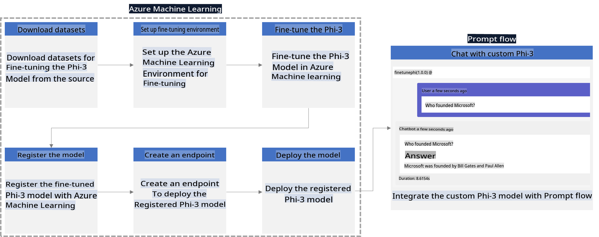
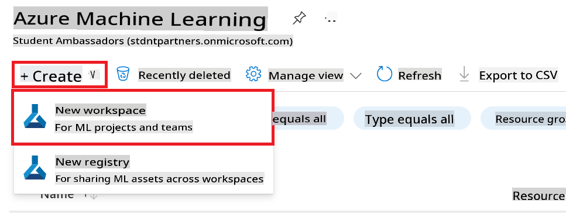
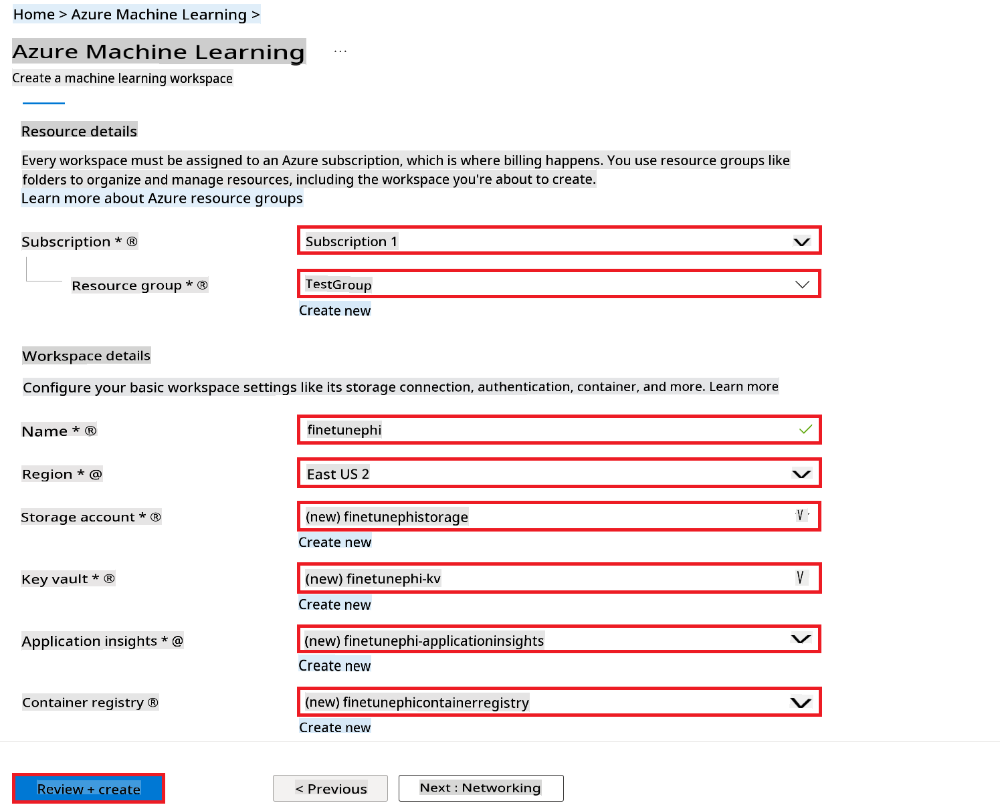
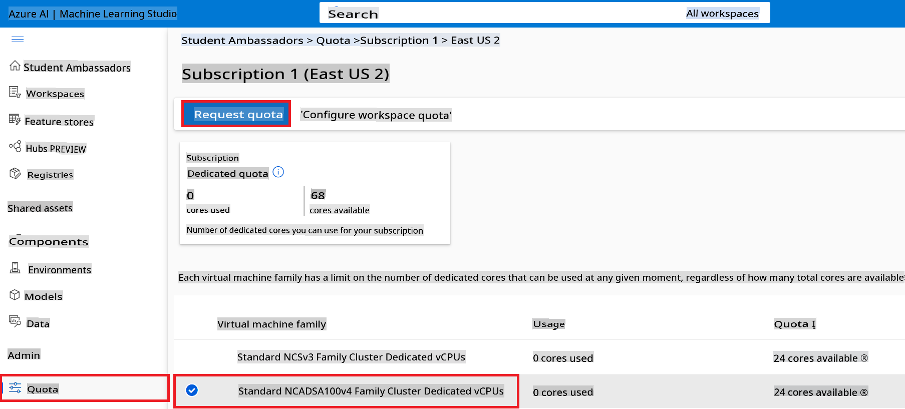
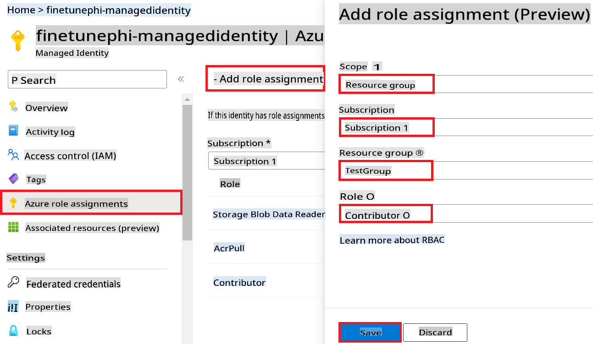
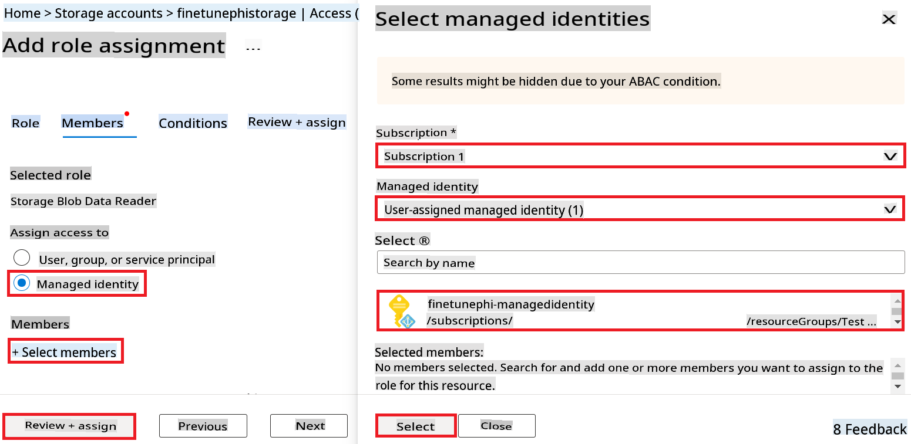
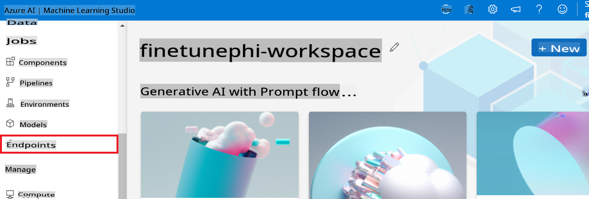
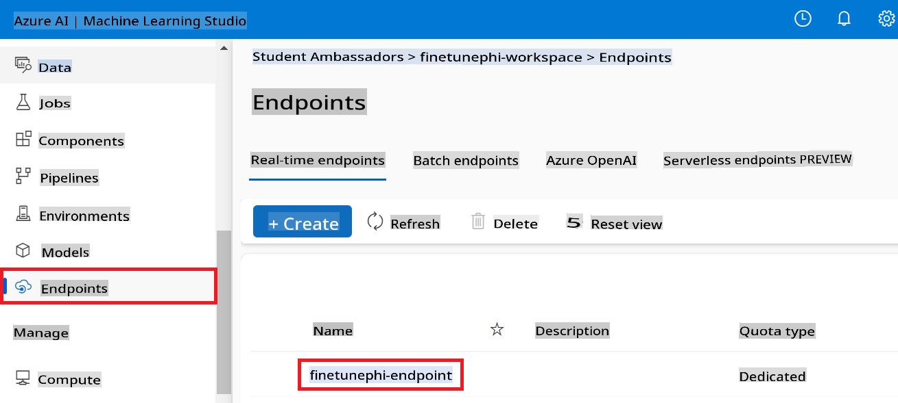
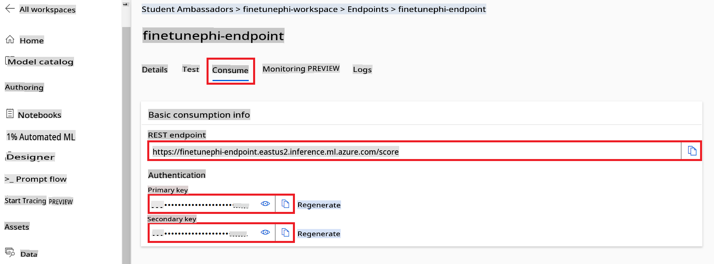
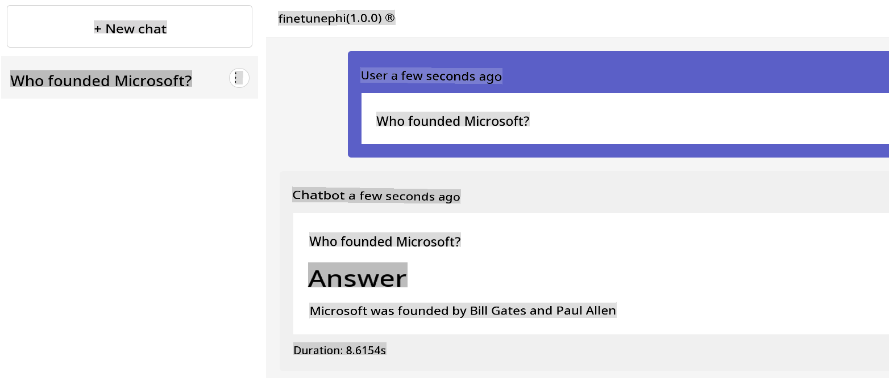

# Fine-tune and Integrate Custom Phi-3 Models with Prompt Flow

This end-to-end (E2E) sample is based on the guide "[Fine-Tune and Integrate Custom Phi-3 Models with Prompt Flow: Step-by-Step Guide](https://techcommunity.microsoft.com/t5/educator-developer-blog/fine-tune-and-integrate-custom-phi-3-models-with-prompt-flow/ba-p/4178612?WT.mc_id=aiml-137032-kinfeylo)" from the Microsoft Tech Community. It walks you through the processes of fine-tuning, deploying, and integrating custom Phi-3 models with Prompt Flow.

## Overview

In this E2E sample, you'll learn how to fine-tune the Phi-3 model and integrate it with Prompt Flow. By leveraging Azure Machine Learning and Prompt Flow, you'll establish a workflow for deploying and utilizing custom AI models. This E2E sample is divided into three scenarios:

**Scenario 1: Set up Azure resources and prepare for fine-tuning**

**Scenario 2: Fine-tune the Phi-3 model and deploy it in Azure Machine Learning Studio**

**Scenario 3: Integrate with Prompt Flow and interact with your custom model**

Here's an overview of this E2E sample:



### Table of Contents

1. **[Scenario 1: Set up Azure resources and prepare for fine-tuning](../../../../../../md/02.Application/01.TextAndChat/Phi3)**
    - [Create an Azure Machine Learning Workspace](../../../../../../md/02.Application/01.TextAndChat/Phi3)
    - [Request GPU quotas in Azure Subscription](../../../../../../md/02.Application/01.TextAndChat/Phi3)
    - [Add role assignment](../../../../../../md/02.Application/01.TextAndChat/Phi3)
    - [Set up project](../../../../../../md/02.Application/01.TextAndChat/Phi3)
    - [Prepare dataset for fine-tuning](../../../../../../md/02.Application/01.TextAndChat/Phi3)

2. **[Scenario 2: Fine-tune the Phi-3 model and deploy it in Azure Machine Learning Studio](../../../../../../md/02.Application/01.TextAndChat/Phi3)**
    - [Set up Azure CLI](../../../../../../md/02.Application/01.TextAndChat/Phi3)
    - [Fine-tune the Phi-3 model](../../../../../../md/02.Application/01.TextAndChat/Phi3)
    - [Deploy the fine-tuned model](../../../../../../md/02.Application/01.TextAndChat/Phi3)

3. **[Scenario 3: Integrate with Prompt Flow and interact with your custom model](../../../../../../md/02.Application/01.TextAndChat/Phi3)**
    - [Integrate the custom Phi-3 model with Prompt Flow](../../../../../../md/02.Application/01.TextAndChat/Phi3)
    - [Interact with your custom model](../../../../../../md/02.Application/01.TextAndChat/Phi3)

## Scenario 1: Set up Azure resources and prepare for fine-tuning

### Create an Azure Machine Learning Workspace

1. Type *azure machine learning* in the **search bar** at the top of the Azure portal page and select **Azure Machine Learning** from the options that appear.

    

2. Select **+ Create** from the navigation menu.

3. Select **New workspace** from the navigation menu.

    

4. Complete the following steps:

    - Select your Azure **Subscription**.
    - Choose the **Resource group** to use (create a new one if needed).
    - Enter a **Workspace Name** (must be unique).
    - Select the **Region** you'd like to use.
    - Choose the **Storage account** to use (create a new one if needed).
    - Select the **Key vault** to use (create a new one if needed).
    - Select the **Application insights** to use (create a new one if needed).
    - Choose the **Container registry** to use (create a new one if needed).

    

5. Click **Review + Create**.

6. Click **Create**.

### Request GPU quotas in Azure Subscription

In this E2E sample, you'll use the *Standard_NC24ads_A100_v4 GPU* for fine-tuning, which requires a quota request, and the *Standard_E4s_v3* CPU for deployment, which does not require a quota request.

> [!NOTE]
>
> Only Pay-As-You-Go subscriptions (the standard subscription type) are eligible for GPU allocation; benefit subscriptions are not currently supported.
>
> For users with benefit subscriptions (such as Visual Studio Enterprise Subscription) or those seeking to quickly test the fine-tuning and deployment process, this tutorial also provides guidance for fine-tuning with a minimal dataset using a CPU. However, note that fine-tuning results are significantly better when using a GPU with larger datasets.

1. Visit [Azure ML Studio](https://ml.azure.com/home?wt.mc_id=studentamb_279723).

2. Follow these steps to request a *Standard NCADSA100v4 Family* quota:

    - Select **Quota** from the left-side menu.
    - Choose the **Virtual machine family** to use. For example, select **Standard NCADSA100v4 Family Cluster Dedicated vCPUs**, which includes the *Standard_NC24ads_A100_v4* GPU.
    - Click **Request quota** from the navigation menu.

        

    - On the Request quota page, enter the **New cores limit** you'd like to use (e.g., 24).
    - Click **Submit** to request the GPU quota.

> [!NOTE]
> Refer to [Sizes for Virtual Machines in Azure](https://learn.microsoft.com/azure/virtual-machines/sizes/overview?tabs=breakdownseries%2Cgeneralsizelist%2Ccomputesizelist%2Cmemorysizelist%2Cstoragesizelist%2Cgpusizelist%2Cfpgasizelist%2Chpcsizelist) for details on selecting the appropriate GPU or CPU for your needs.

### Add role assignment

To fine-tune and deploy your models, you need to create a User Assigned Managed Identity (UAI) and assign it the appropriate permissions. This UAI will be used for authentication during deployment.

#### Create User Assigned Managed Identity (UAI)

1. Type *managed identities* in the **search bar** at the top of the Azure portal page and select **Managed Identities** from the options that appear.

    

2. Click **+ Create**.

    

3. Complete the following steps:

    - Select your Azure **Subscription**.
    - Choose the **Resource group** to use (create a new one if needed).
    - Select the **Region** you'd like to use.
    - Enter a **Name** (must be unique).

4. Click **Review + Create**.

5. Click **Create**.

#### Add Contributor role assignment to Managed Identity

1. Navigate to the Managed Identity resource you created.

2. Select **Azure role assignments** from the left-side menu.

3. Click **+ Add role assignment** from the navigation menu.

4. On the Add role assignment page, complete the following steps:
    - Set **Scope** to **Resource group**.
    - Select your Azure **Subscription**.
    - Choose the **Resource group** to use.
    - Set **Role** to **Contributor**.

    

5. Click **Save**.

#### Add Storage Blob Data Reader role assignment to Managed Identity

1. Type *storage accounts* in the **search bar** at the top of the Azure portal page and select **Storage accounts** from the options that appear.

    

2. Select the storage account associated with the Azure Machine Learning workspace you created (e.g., *finetunephistorage*).

3. Follow these steps to navigate to the Add role assignment page:

    - Go to the Azure Storage account you created.
    - Select **Access Control (IAM)** from the left-side menu.
    - Click **+ Add** from the navigation menu.
    - Select **Add role assignment**.

    

4. On the Add role assignment page, complete the following steps:

    - On the Role page, type *Storage Blob Data Reader* in the **search bar** and select **Storage Blob Data Reader** from the options.
    - Click **Next**.
    - On the Members page, set **Assign access to** to **Managed identity**.
    - Click **+ Select members**.
    - On the Select managed identities page, choose your Azure **Subscription**.
    - Select the **Managed identity** you created (e.g., *finetunephi-managedidentity*).
    - Click **Select**.

    

5. Click **Review + assign**.

#### Add AcrPull role assignment to Managed Identity

1. Type *container registries* in the **search bar** at the top of the Azure portal page and select **Container registries** from the options that appear.

    

2. Select the container registry associated with the Azure Machine Learning workspace (e.g., *finetunephicontainerregistries*).

3. Follow these steps to navigate to the Add role assignment page:

    - Select **Access Control (IAM)** from the left-side menu.
    - Click **+ Add** from the navigation menu.
    - Select **Add role assignment**.

4. On the Add role assignment page, complete the following steps:

    - On the Role page, type *AcrPull* in the **search bar** and select **AcrPull** from the options.
    - Click **Next**.
    - On the Members page, set **Assign access to** to **Managed identity**.
    - Click **+ Select members**.
    - On the Select managed identities page, choose your Azure **Subscription**.
    - Select the **Managed identity** you created (e.g., *finetunephi-managedidentity*).
    - Click **Select**.
    - Click **Review + assign**.

### Set up project

Now, you'll create a folder for your work and set up a virtual environment to develop a program that interacts with users and uses stored chat history from Azure Cosmos DB to inform its responses.

#### Create a folder for your project

1. Open a terminal and type the following command to create a folder named *finetune-phi* in the default path:

    ```console
    mkdir finetune-phi
    ```

2. Navigate to the *finetune-phi* folder by typing:

    ```console
    cd finetune-phi
    ```

#### Create a virtual environment

1. Create a virtual environment named *.venv* by typing:

    ```console
    python -m venv .venv
    ```

2. Activate the virtual environment by typing:

    ```console
    .venv\Scripts\activate.bat
    ```

> [!NOTE]
>
> If successful, you'll see *(.venv)* before the command prompt.

#### Install required packages

1. Install the required packages by typing:

    ```console
    pip install datasets==2.19.1
    pip install transformers==4.41.1
    pip install azure-ai-ml==1.16.0
    pip install torch==2.3.1
    pip install trl==0.9.4
    pip install promptflow==1.12.0
    ```

#### Create project files

In this step, you'll create the essential files for your project, including scripts for downloading the dataset, setting up the Azure Machine Learning environment, fine-tuning the Phi-3 model, and deploying the fine-tuned model. You'll also create a *conda.yml* file for the fine-tuning environment.

Tasks include:

- Creating a *download_dataset.py* file for downloading the dataset.
- Creating a *setup_ml.py* file to set up the Azure Machine Learning environment.
- Creating a *fine_tune.py* file in the *finetuning_dir* folder for fine-tuning the Phi-3 model using the dataset.
- Creating a *conda.yml* file for the fine-tuning environment.
- Creating a *deploy_model.py* file to deploy the fine-tuned model.
- Creating an *integrate_with_promptflow.py* file to integrate the fine-tuned model and execute it using Prompt Flow.
- Creating a *flow.dag.yml* file to set up the workflow structure for Prompt Flow.
- Creating a *config.py* file to store Azure information.

> [!NOTE]
>
> Final folder structure:
>
> ```text
> └── YourUserName
> .    └── finetune-phi
> .        ├── finetuning_dir
> .        │      └── fine_tune.py
> .        ├── conda.yml
> .        ├── config.py
> .        ├── deploy_model.py
> .        ├── download_dataset.py
> .        ├── flow.dag.yml
> .        ├── integrate_with_promptflow.py
> .        └── setup_ml.py
> ```

1. Open **Visual Studio Code**.

2. From the menu bar, select **File** > **Open Folder**.

3. Select the *finetune-phi* folder you created (e.g., *C:\Users\yourUserName\finetune-phi*).

    

4. In the left pane of Visual Studio Code, right-click and select **New File** to create a file named *download_dataset.py*.

5. Repeat the process to create files named *setup_ml.py* and *deploy_model.py*.

    

6. Right-click in the left pane and select **New Folder** to create a folder named *finetuning_dir*.

7. Inside the *finetuning_dir* folder, create a file named *fine_tune.py*.

#### Create and configure the *conda.yml* file

1. In the left pane of Visual Studio Code, create a file named *conda.yml*.

2. Add the following code to the *conda.yml* file to set up the fine-tuning environment:

    ```yml
    name: phi-3-training-env
    channels:
      - defaults
      - conda-forge
    dependencies:
      - python=3.10
      - pip
      - numpy<2.0
      - pip:
          - torch==2.4.0
          - torchvision==0.19.0
          - trl==0.8.6
          - transformers==4.41
          - datasets==2.21.0
          - azureml-core==1.57.0
          - azure-storage-blob==12.19.0
          - azure-ai-ml==1.16
          - azure-identity==1.17.1
          - accelerate==0.33.0
          - mlflow==2.15.1
          - azureml-mlflow==1.57.0
    ```

#### Create and configure the *config.py* file

1. In the left pane of Visual Studio Code, create a file named *config.py*.

2. Add the following code to the *config.py* file to include your Azure information:

    ```python
    # Azure settings
    AZURE_SUBSCRIPTION_ID = "your_subscription_id"
    AZURE_RESOURCE_GROUP_NAME = "your_resource_group_name" # "TestGroup"

    # Azure Machine Learning settings
    AZURE_ML_WORKSPACE_NAME = "your_workspace_name" # "finetunephi-workspace"

    # Azure Managed Identity settings
    AZURE_MANAGED_IDENTITY_CLIENT_ID = "your_azure_managed_identity_client_id"
    AZURE_MANAGED_IDENTITY_NAME = "your_azure_managed_identity_name" # "finetunephi-mangedidentity"
    AZURE_MANAGED_IDENTITY_RESOURCE_ID = f"/subscriptions/{AZURE_SUBSCRIPTION_ID}/resourceGroups/{AZURE_RESOURCE_GROUP_NAME}/providers/Microsoft.ManagedIdentity/userAssignedIdentities/{AZURE_MANAGED_IDENTITY_NAME}"

    # Dataset file paths
    TRAIN_DATA_PATH = "data/train_data.jsonl"
    TEST_DATA_PATH = "data/test_data.jsonl"

    # Fine-tuned model settings
    AZURE_MODEL_NAME = "your_fine_tuned_model_name" # "finetune-phi-model"
    AZURE_ENDPOINT_NAME = "your_fine_tuned_model_endpoint_name" # "finetune-phi-endpoint"
    AZURE_DEPLOYMENT_NAME = "your_fine_tuned_model_deployment_name" # "finetune-phi-deployment"

    AZURE_ML_API_KEY = "your_fine_tuned_model_api_key"
    AZURE_ML_ENDPOINT = "your_fine_tuned_model_endpoint_uri" # "https://{your-endpoint-name}.{your-region}.inference.ml.azure.com/score"
    ```

#### Add Azure environment variables

1. Add the Azure Subscription ID by completing the following steps:

    - Type *subscriptions* in the **search bar** at the top of the Azure portal and select **Subscriptions**.
    - Select the Azure Subscription you're using.
    - Copy the Subscription ID and paste it into the *config.py* file.


1. Follow these steps to add the Azure Workspace Name:

    - Go to the Azure Machine Learning resource you created.
    - Copy and paste your account name into the *config.py* file.

    

1. Follow these steps to add the Azure Resource Group Name:

    - Go to the Azure Machine Learning resource you created.
    - Copy and paste your Azure Resource Group Name into the *config.py* file.

    

2. Follow these steps to add the Azure Managed Identity name:

    - Go to the Managed Identities resource you created.
    - Copy and paste your Azure Managed Identity name into the *config.py* file.

    

### Prepare dataset for fine-tuning

In this exercise, you will run the *download_dataset.py* file to download the *ULTRACHAT_200k* dataset to your local environment. You will then use this dataset to fine-tune the Phi-3 model in Azure Machine Learning.

#### Download your dataset using *download_dataset.py*

1. Open the *download_dataset.py* file in Visual Studio Code.

1. Add the following code to *download_dataset.py*.

    ```python
    import json
    import os
    from datasets import load_dataset
    from config import (
        TRAIN_DATA_PATH,
        TEST_DATA_PATH)

    def load_and_split_dataset(dataset_name, config_name, split_ratio):
        """
        Load and split a dataset.
        """
        # Load the dataset with the specified name, configuration, and split ratio
        dataset = load_dataset(dataset_name, config_name, split=split_ratio)
        print(f"Original dataset size: {len(dataset)}")
        
        # Split the dataset into train and test sets (80% train, 20% test)
        split_dataset = dataset.train_test_split(test_size=0.2)
        print(f"Train dataset size: {len(split_dataset['train'])}")
        print(f"Test dataset size: {len(split_dataset['test'])}")
        
        return split_dataset

    def save_dataset_to_jsonl(dataset, filepath):
        """
        Save a dataset to a JSONL file.
        """
        # Create the directory if it does not exist
        os.makedirs(os.path.dirname(filepath), exist_ok=True)
        
        # Open the file in write mode
        with open(filepath, 'w', encoding='utf-8') as f:
            # Iterate over each record in the dataset
            for record in dataset:
                # Dump the record as a JSON object and write it to the file
                json.dump(record, f)
                # Write a newline character to separate records
                f.write('\n')
        
        print(f"Dataset saved to {filepath}")

    def main():
        """
        Main function to load, split, and save the dataset.
        """
        # Load and split the ULTRACHAT_200k dataset with a specific configuration and split ratio
        dataset = load_and_split_dataset("HuggingFaceH4/ultrachat_200k", 'default', 'train_sft[:1%]')
        
        # Extract the train and test datasets from the split
        train_dataset = dataset['train']
        test_dataset = dataset['test']

        # Save the train dataset to a JSONL file
        save_dataset_to_jsonl(train_dataset, TRAIN_DATA_PATH)
        
        # Save the test dataset to a separate JSONL file
        save_dataset_to_jsonl(test_dataset, TEST_DATA_PATH)

    if __name__ == "__main__":
        main()

    ```

> [!TIP]
>
> **Guidance for fine-tuning with a minimal dataset using a CPU**
>
> If you're using a CPU for fine-tuning, this approach is ideal for those with benefit subscriptions (like a Visual Studio Enterprise Subscription) or for quickly testing the fine-tuning and deployment process.
>
> Replace `dataset = load_and_split_dataset("HuggingFaceH4/ultrachat_200k", 'default', 'train_sft[:1%]')` with `dataset = load_and_split_dataset("HuggingFaceH4/ultrachat_200k", 'default', 'train_sft[:10]')`
>

1. Run the following command in your terminal to execute the script and download the dataset to your local environment.

    ```console
    python download_data.py
    ```

1. Confirm that the dataset was saved successfully to your local *finetune-phi/data* directory.

> [!NOTE]
>
> **Dataset size and fine-tuning time**
>
> In this end-to-end (E2E) sample, only 1% of the dataset (`train_sft[:1%]`) is used. This reduces the data size significantly, speeding up both the upload and fine-tuning processes. You can adjust the percentage to balance training time and model performance. Using a smaller subset of the dataset minimizes the time required for fine-tuning, making the process more manageable for an E2E sample.

## Scenario 2: Fine-tune the Phi-3 model and Deploy in Azure Machine Learning Studio

### Set up Azure CLI

You need to set up Azure CLI to authenticate your environment. Azure CLI enables you to manage Azure resources directly from the command line and provides the credentials needed for Azure Machine Learning to access these resources. Install [Azure CLI](https://learn.microsoft.com/cli/azure/install-azure-cli) to get started.

1. Open a terminal window and run the following command to log in to your Azure account.

    ```console
    az login
    ```

1. Select the Azure account you want to use.

1. Select the Azure subscription you want to use.

    

> [!TIP]
>
> If you're having trouble signing in to Azure, try using a device code. Open a terminal window and run the following command to sign in to your Azure account:
>
> ```console
> az login --use-device-code
> ```
>

### Fine-tune the Phi-3 model

In this exercise, you will fine-tune the Phi-3 model using the provided dataset. First, you will define the fine-tuning process in the *fine_tune.py* file. Then, you will configure the Azure Machine Learning environment and start the fine-tuning process by running the *setup_ml.py* file. This script ensures the fine-tuning occurs in the Azure Machine Learning environment.

By running *setup_ml.py*, you will initiate the fine-tuning process in Azure Machine Learning.

#### Add code to the *fine_tune.py* file

1. Navigate to the *finetuning_dir* folder and open the *fine_tune.py* file in Visual Studio Code.

1. Add the following code to *fine_tune.py*.

    ```python
    import argparse
    import sys
    import logging
    import os
    from datasets import load_dataset
    import torch
    import mlflow
    from transformers import AutoModelForCausalLM, AutoTokenizer, TrainingArguments
    from trl import SFTTrainer

    # To avoid the INVALID_PARAMETER_VALUE error in MLflow, disable MLflow integration
    os.environ["DISABLE_MLFLOW_INTEGRATION"] = "True"

    # Logging setup
    logging.basicConfig(
        format="%(asctime)s - %(levelname)s - %(name)s - %(message)s",
        datefmt="%Y-%m-%d %H:%M:%S",
        handlers=[logging.StreamHandler(sys.stdout)],
        level=logging.WARNING
    )
    logger = logging.getLogger(__name__)

    def initialize_model_and_tokenizer(model_name, model_kwargs):
        """
        Initialize the model and tokenizer with the given pretrained model name and arguments.
        """
        model = AutoModelForCausalLM.from_pretrained(model_name, **model_kwargs)
        tokenizer = AutoTokenizer.from_pretrained(model_name)
        tokenizer.model_max_length = 2048
        tokenizer.pad_token = tokenizer.unk_token
        tokenizer.pad_token_id = tokenizer.convert_tokens_to_ids(tokenizer.pad_token)
        tokenizer.padding_side = 'right'
        return model, tokenizer

    def apply_chat_template(example, tokenizer):
        """
        Apply a chat template to tokenize messages in the example.
        """
        messages = example["messages"]
        if messages[0]["role"] != "system":
            messages.insert(0, {"role": "system", "content": ""})
        example["text"] = tokenizer.apply_chat_template(
            messages, tokenize=False, add_generation_prompt=False
        )
        return example

    def load_and_preprocess_data(train_filepath, test_filepath, tokenizer):
        """
        Load and preprocess the dataset.
        """
        train_dataset = load_dataset('json', data_files=train_filepath, split='train')
        test_dataset = load_dataset('json', data_files=test_filepath, split='train')
        column_names = list(train_dataset.features)

        train_dataset = train_dataset.map(
            apply_chat_template,
            fn_kwargs={"tokenizer": tokenizer},
            num_proc=10,
            remove_columns=column_names,
            desc="Applying chat template to train dataset",
        )

        test_dataset = test_dataset.map(
            apply_chat_template,
            fn_kwargs={"tokenizer": tokenizer},
            num_proc=10,
            remove_columns=column_names,
            desc="Applying chat template to test dataset",
        )

        return train_dataset, test_dataset

    def train_and_evaluate_model(train_dataset, test_dataset, model, tokenizer, output_dir):
        """
        Train and evaluate the model.
        """
        training_args = TrainingArguments(
            bf16=True,
            do_eval=True,
            output_dir=output_dir,
            eval_strategy="epoch",
            learning_rate=5.0e-06,
            logging_steps=20,
            lr_scheduler_type="cosine",
            num_train_epochs=3,
            overwrite_output_dir=True,
            per_device_eval_batch_size=4,
            per_device_train_batch_size=4,
            remove_unused_columns=True,
            save_steps=500,
            seed=0,
            gradient_checkpointing=True,
            gradient_accumulation_steps=1,
            warmup_ratio=0.2,
        )

        trainer = SFTTrainer(
            model=model,
            args=training_args,
            train_dataset=train_dataset,
            eval_dataset=test_dataset,
            max_seq_length=2048,
            dataset_text_field="text",
            tokenizer=tokenizer,
            packing=True
        )

        train_result = trainer.train()
        trainer.log_metrics("train", train_result.metrics)

        mlflow.transformers.log_model(
            transformers_model={"model": trainer.model, "tokenizer": tokenizer},
            artifact_path=output_dir,
        )

        tokenizer.padding_side = 'left'
        eval_metrics = trainer.evaluate()
        eval_metrics["eval_samples"] = len(test_dataset)
        trainer.log_metrics("eval", eval_metrics)

    def main(train_file, eval_file, model_output_dir):
        """
        Main function to fine-tune the model.
        """
        model_kwargs = {
            "use_cache": False,
            "trust_remote_code": True,
            "torch_dtype": torch.bfloat16,
            "device_map": None,
            "attn_implementation": "eager"
        }

        # pretrained_model_name = "microsoft/Phi-3-mini-4k-instruct"
        pretrained_model_name = "microsoft/Phi-3.5-mini-instruct"

        with mlflow.start_run():
            model, tokenizer = initialize_model_and_tokenizer(pretrained_model_name, model_kwargs)
            train_dataset, test_dataset = load_and_preprocess_data(train_file, eval_file, tokenizer)
            train_and_evaluate_model(train_dataset, test_dataset, model, tokenizer, model_output_dir)

    if __name__ == "__main__":
        parser = argparse.ArgumentParser()
        parser.add_argument("--train-file", type=str, required=True, help="Path to the training data")
        parser.add_argument("--eval-file", type=str, required=True, help="Path to the evaluation data")
        parser.add_argument("--model_output_dir", type=str, required=True, help="Directory to save the fine-tuned model")
        args = parser.parse_args()
        main(args.train_file, args.eval_file, args.model_output_dir)

    ```

1. Save and close the *fine_tune.py* file.

> [!TIP]
> **You can fine-tune the Phi-3.5 model**
>
> In the *fine_tune.py* file, you can change the `pretrained_model_name` from `"microsoft/Phi-3-mini-4k-instruct"` to any model you want to fine-tune. For example, if you change it to `"microsoft/Phi-3.5-mini-instruct"`, you'll be using the Phi-3.5-mini-instruct model for fine-tuning. To find and use the model name you prefer, visit [Hugging Face](https://huggingface.co/), search for the model you're interested in, and then copy and paste its name into the `pretrained_model_name` field in your script.
>
> :::image type="content" source="../../imgs/03/FineTuning-PromptFlow/finetunephi3.5.png" alt-text="Fine tune Phi-3.5.":::
>

#### Add code to the *setup_ml.py* file

1. Open the *setup_ml.py* file in Visual Studio Code.

1. Add the following code to *setup_ml.py*.

    ```python
    import logging
    from azure.ai.ml import MLClient, command, Input
    from azure.ai.ml.entities import Environment, AmlCompute
    from azure.identity import AzureCliCredential
    from config import (
        AZURE_SUBSCRIPTION_ID,
        AZURE_RESOURCE_GROUP_NAME,
        AZURE_ML_WORKSPACE_NAME,
        TRAIN_DATA_PATH,
        TEST_DATA_PATH
    )

    # Constants

    # Uncomment the following lines to use a CPU instance for training
    # COMPUTE_INSTANCE_TYPE = "Standard_E16s_v3" # cpu
    # COMPUTE_NAME = "cpu-e16s-v3"
    # DOCKER_IMAGE_NAME = "mcr.microsoft.com/azureml/openmpi4.1.0-ubuntu20.04:latest"

    # Uncomment the following lines to use a GPU instance for training
    COMPUTE_INSTANCE_TYPE = "Standard_NC24ads_A100_v4"
    COMPUTE_NAME = "gpu-nc24s-a100-v4"
    DOCKER_IMAGE_NAME = "mcr.microsoft.com/azureml/curated/acft-hf-nlp-gpu:59"

    CONDA_FILE = "conda.yml"
    LOCATION = "eastus2" # Replace with the location of your compute cluster
    FINETUNING_DIR = "./finetuning_dir" # Path to the fine-tuning script
    TRAINING_ENV_NAME = "phi-3-training-environment" # Name of the training environment
    MODEL_OUTPUT_DIR = "./model_output" # Path to the model output directory in azure ml

    # Logging setup to track the process
    logger = logging.getLogger(__name__)
    logging.basicConfig(
        format="%(asctime)s - %(levelname)s - %(name)s - %(message)s",
        datefmt="%Y-%m-%d %H:%M:%S",
        level=logging.WARNING
    )

    def get_ml_client():
        """
        Initialize the ML Client using Azure CLI credentials.
        """
        credential = AzureCliCredential()
        return MLClient(credential, AZURE_SUBSCRIPTION_ID, AZURE_RESOURCE_GROUP_NAME, AZURE_ML_WORKSPACE_NAME)

    def create_or_get_environment(ml_client):
        """
        Create or update the training environment in Azure ML.
        """
        env = Environment(
            image=DOCKER_IMAGE_NAME,  # Docker image for the environment
            conda_file=CONDA_FILE,  # Conda environment file
            name=TRAINING_ENV_NAME,  # Name of the environment
        )
        return ml_client.environments.create_or_update(env)

    def create_or_get_compute_cluster(ml_client, compute_name, COMPUTE_INSTANCE_TYPE, location):
        """
        Create or update the compute cluster in Azure ML.
        """
        try:
            compute_cluster = ml_client.compute.get(compute_name)
            logger.info(f"Compute cluster '{compute_name}' already exists. Reusing it for the current run.")
        except Exception:
            logger.info(f"Compute cluster '{compute_name}' does not exist. Creating a new one with size {COMPUTE_INSTANCE_TYPE}.")
            compute_cluster = AmlCompute(
                name=compute_name,
                size=COMPUTE_INSTANCE_TYPE,
                location=location,
                tier="Dedicated",  # Tier of the compute cluster
                min_instances=0,  # Minimum number of instances
                max_instances=1  # Maximum number of instances
            )
            ml_client.compute.begin_create_or_update(compute_cluster).wait()  # Wait for the cluster to be created
        return compute_cluster

    def create_fine_tuning_job(env, compute_name):
        """
        Set up the fine-tuning job in Azure ML.
        """
        return command(
            code=FINETUNING_DIR,  # Path to fine_tune.py
            command=(
                "python fine_tune.py "
                "--train-file ${{inputs.train_file}} "
                "--eval-file ${{inputs.eval_file}} "
                "--model_output_dir ${{inputs.model_output}}"
            ),
            environment=env,  # Training environment
            compute=compute_name,  # Compute cluster to use
            inputs={
                "train_file": Input(type="uri_file", path=TRAIN_DATA_PATH),  # Path to the training data file
                "eval_file": Input(type="uri_file", path=TEST_DATA_PATH),  # Path to the evaluation data file
                "model_output": MODEL_OUTPUT_DIR
            }
        )

    def main():
        """
        Main function to set up and run the fine-tuning job in Azure ML.
        """
        # Initialize ML Client
        ml_client = get_ml_client()

        # Create Environment
        env = create_or_get_environment(ml_client)
        
        # Create or get existing compute cluster
        create_or_get_compute_cluster(ml_client, COMPUTE_NAME, COMPUTE_INSTANCE_TYPE, LOCATION)

        # Create and Submit Fine-Tuning Job
        job = create_fine_tuning_job(env, COMPUTE_NAME)
        returned_job = ml_client.jobs.create_or_update(job)  # Submit the job
        ml_client.jobs.stream(returned_job.name)  # Stream the job logs
        
        # Capture the job name
        job_name = returned_job.name
        print(f"Job name: {job_name}")

    if __name__ == "__main__":
        main()

    ```

1. Replace `COMPUTE_INSTANCE_TYPE`, `COMPUTE_NAME`, and `LOCATION` with your specific details.

    ```python
   # Uncomment the following lines to use a GPU instance for training
    COMPUTE_INSTANCE_TYPE = "Standard_NC24ads_A100_v4"
    COMPUTE_NAME = "gpu-nc24s-a100-v4"
    ...
    LOCATION = "eastus2" # Replace with the location of your compute cluster
    ```

> [!TIP]
>
> **Guidance for fine-tuning with a minimal dataset using a CPU**
>
> If you're using a CPU for fine-tuning, this approach is ideal for those with benefit subscriptions (like a Visual Studio Enterprise Subscription) or for quickly testing the fine-tuning and deployment process.
>
> 1. Open the *setup_ml* file.
> 1. Replace `COMPUTE_INSTANCE_TYPE`, `COMPUTE_NAME`, and `DOCKER_IMAGE_NAME` with the following. If you do not have access to *Standard_E16s_v3*, you can use an equivalent CPU instance or request a new quota.
> 1. Replace `LOCATION` with your specific details.
>
>    ```python
>    # Uncomment the following lines to use a CPU instance for training
>    COMPUTE_INSTANCE_TYPE = "Standard_E16s_v3" # cpu
>    COMPUTE_NAME = "cpu-e16s-v3"
>    DOCKER_IMAGE_NAME = "mcr.microsoft.com/azureml/openmpi4.1.0-ubuntu20.04:latest"
>    LOCATION = "eastus2" # Replace with the location of your compute cluster
>    ```
>

1. Run the following command to execute the *setup_ml.py* script and start the fine-tuning process in Azure Machine Learning.

    ```python
    python setup_ml.py
    ```

1. In this exercise, you successfully fine-tuned the Phi-3 model using Azure Machine Learning. By running the *setup_ml.py* script, you set up the Azure Machine Learning environment and initiated the fine-tuning process defined in the *fine_tune.py* file. Note that the fine-tuning process can take a significant amount of time. After running the `python setup_ml.py` command, you need to wait for the process to complete. You can monitor the status of the fine-tuning job by following the link provided in the terminal to the Azure Machine Learning portal.

    

### Deploy the fine-tuned model

To integrate the fine-tuned Phi-3 model with Prompt Flow, you need to deploy the model to make it accessible for real-time inference. This process involves registering the model, creating an online endpoint, and deploying the model.

#### Set the model name, endpoint name, and deployment name for deployment

1. Open *config.py* file.

1. Replace `AZURE_MODEL_NAME = "your_fine_tuned_model_name"` with the desired name for your model.

1. Replace `AZURE_ENDPOINT_NAME = "your_fine_tuned_model_endpoint_name"` with the desired name for your endpoint.

1. Replace `AZURE_DEPLOYMENT_NAME = "your_fine_tuned_model_deployment_name"` with the desired name for your deployment.

#### Add code to the *deploy_model.py* file

Running the *deploy_model.py* file automates the entire deployment process. It registers the model, creates an endpoint, and executes the deployment based on the settings specified in the config.py file, which includes the model name, endpoint name, and deployment name.

1. Open the *deploy_model.py* file in Visual Studio Code.

1. Add the following code to *deploy_model.py*.

    ```python
    import logging
    from azure.identity import AzureCliCredential
    from azure.ai.ml import MLClient
    from azure.ai.ml.entities import Model, ProbeSettings, ManagedOnlineEndpoint, ManagedOnlineDeployment, IdentityConfiguration, ManagedIdentityConfiguration, OnlineRequestSettings
    from azure.ai.ml.constants import AssetTypes

    # Configuration imports
    from config import (
        AZURE_SUBSCRIPTION_ID,
        AZURE_RESOURCE_GROUP_NAME,
        AZURE_ML_WORKSPACE_NAME,
        AZURE_MANAGED_IDENTITY_RESOURCE_ID,
        AZURE_MANAGED_IDENTITY_CLIENT_ID,
        AZURE_MODEL_NAME,
        AZURE_ENDPOINT_NAME,
        AZURE_DEPLOYMENT_NAME
    )

    # Constants
    JOB_NAME = "your-job-name"
    COMPUTE_INSTANCE_TYPE = "Standard_E4s_v3"

    deployment_env_vars = {
        "SUBSCRIPTION_ID": AZURE_SUBSCRIPTION_ID,
        "RESOURCE_GROUP_NAME": AZURE_RESOURCE_GROUP_NAME,
        "UAI_CLIENT_ID": AZURE_MANAGED_IDENTITY_CLIENT_ID,
    }

    # Logging setup
    logging.basicConfig(
        format="%(asctime)s - %(levelname)s - %(name)s - %(message)s",
        datefmt="%Y-%m-%d %H:%M:%S",
        level=logging.DEBUG
    )
    logger = logging.getLogger(__name__)

    def get_ml_client():
        """Initialize and return the ML Client."""
        credential = AzureCliCredential()
        return MLClient(credential, AZURE_SUBSCRIPTION_ID, AZURE_RESOURCE_GROUP_NAME, AZURE_ML_WORKSPACE_NAME)

    def register_model(ml_client, model_name, job_name):
        """Register a new model."""
        model_path = f"azureml://jobs/{job_name}/outputs/artifacts/paths/model_output"
        logger.info(f"Registering model {model_name} from job {job_name} at path {model_path}.")
        run_model = Model(
            path=model_path,
            name=model_name,
            description="Model created from run.",
            type=AssetTypes.MLFLOW_MODEL,
        )
        model = ml_client.models.create_or_update(run_model)
        logger.info(f"Registered model ID: {model.id}")
        return model

    def delete_existing_endpoint(ml_client, endpoint_name):
        """Delete existing endpoint if it exists."""
        try:
            endpoint_result = ml_client.online_endpoints.get(name=endpoint_name)
            logger.info(f"Deleting existing endpoint {endpoint_name}.")
            ml_client.online_endpoints.begin_delete(name=endpoint_name).result()
            logger.info(f"Deleted existing endpoint {endpoint_name}.")
        except Exception as e:
            logger.info(f"No existing endpoint {endpoint_name} found to delete: {e}")

    def create_or_update_endpoint(ml_client, endpoint_name, description=""):
        """Create or update an endpoint."""
        delete_existing_endpoint(ml_client, endpoint_name)
        logger.info(f"Creating new endpoint {endpoint_name}.")
        endpoint = ManagedOnlineEndpoint(
            name=endpoint_name,
            description=description,
            identity=IdentityConfiguration(
                type="user_assigned",
                user_assigned_identities=[ManagedIdentityConfiguration(resource_id=AZURE_MANAGED_IDENTITY_RESOURCE_ID)]
            )
        )
        endpoint_result = ml_client.online_endpoints.begin_create_or_update(endpoint).result()
        logger.info(f"Created new endpoint {endpoint_name}.")
        return endpoint_result

    def create_or_update_deployment(ml_client, endpoint_name, deployment_name, model):
        """Create or update a deployment."""

        logger.info(f"Creating deployment {deployment_name} for endpoint {endpoint_name}.")
        deployment = ManagedOnlineDeployment(
            name=deployment_name,
            endpoint_name=endpoint_name,
            model=model.id,
            instance_type=COMPUTE_INSTANCE_TYPE,
            instance_count=1,
            environment_variables=deployment_env_vars,
            request_settings=OnlineRequestSettings(
                max_concurrent_requests_per_instance=3,
                request_timeout_ms=180000,
                max_queue_wait_ms=120000
            ),
            liveness_probe=ProbeSettings(
                failure_threshold=30,
                success_threshold=1,
                period=100,
                initial_delay=500,
            ),
            readiness_probe=ProbeSettings(
                failure_threshold=30,
                success_threshold=1,
                period=100,
                initial_delay=500,
            ),
        )
        deployment_result = ml_client.online_deployments.begin_create_or_update(deployment).result()
        logger.info(f"Created deployment {deployment.name} for endpoint {endpoint_name}.")
        return deployment_result

    def set_traffic_to_deployment(ml_client, endpoint_name, deployment_name):
        """Set traffic to the specified deployment."""
        try:
            # Fetch the current endpoint details
            endpoint = ml_client.online_endpoints.get(name=endpoint_name)
            
            # Log the current traffic allocation for debugging
            logger.info(f"Current traffic allocation: {endpoint.traffic}")
            
            # Set the traffic allocation for the deployment
            endpoint.traffic = {deployment_name: 100}
            
            # Update the endpoint with the new traffic allocation
            endpoint_poller = ml_client.online_endpoints.begin_create_or_update(endpoint)
            updated_endpoint = endpoint_poller.result()
            
            # Log the updated traffic allocation for debugging
            logger.info(f"Updated traffic allocation: {updated_endpoint.traffic}")
            logger.info(f"Set traffic to deployment {deployment_name} at endpoint {endpoint_name}.")
            return updated_endpoint
        except Exception as e:
            # Log any errors that occur during the process
            logger.error(f"Failed to set traffic to deployment: {e}")
            raise


    def main():
        ml_client = get_ml_client()

        registered_model = register_model(ml_client, AZURE_MODEL_NAME, JOB_NAME)
        logger.info(f"Registered model ID: {registered_model.id}")

        endpoint = create_or_update_endpoint(ml_client, AZURE_ENDPOINT_NAME, "Endpoint for finetuned Phi-3 model")
        logger.info(f"Endpoint {AZURE_ENDPOINT_NAME} is ready.")

        try:
            deployment = create_or_update_deployment(ml_client, AZURE_ENDPOINT_NAME, AZURE_DEPLOYMENT_NAME, registered_model)
            logger.info(f"Deployment {AZURE_DEPLOYMENT_NAME} is created for endpoint {AZURE_ENDPOINT_NAME}.")

            set_traffic_to_deployment(ml_client, AZURE_ENDPOINT_NAME, AZURE_DEPLOYMENT_NAME)
            logger.info(f"Traffic is set to deployment {AZURE_DEPLOYMENT_NAME} at endpoint {AZURE_ENDPOINT_NAME}.")
        except Exception as e:
            logger.error(f"Failed to create or update deployment: {e}")

    if __name__ == "__main__":
        main()

    ```

1. Perform the following tasks to get the `JOB_NAME`:

    - Navigate to Azure Machine Learning resource that you created.
    - Select **Studio web URL** to open the Azure Machine Learning workspace.
    - Select **Jobs** from the left side tab.
    - Select the experiment for fine-tuning. For example, *finetunephi*.
    - Select the job that you created.
    - Copy and paste your job Name into the `JOB_NAME = "your-job-name"` in *deploy_model.py* file.

1. Replace `COMPUTE_INSTANCE_TYPE` with your specific details.

1. Run the following command to execute the *deploy_model.py* script and start the deployment process in Azure Machine Learning.

    ```python
    python deploy_model.py
    ```

> [!WARNING]
> To avoid additional charges to your account, make sure to delete the endpoint you created in the Azure Machine Learning workspace.
>

#### Check deployment status in Azure Machine Learning Workspace

1. Visit [Azure ML Studio](https://ml.azure.com/home?wt.mc_id=studentamb_279723).

1. Navigate to the Azure Machine Learning workspace you created.

1. Select **Studio web URL** to open the Azure Machine Learning workspace.

1. Select **Endpoints** from the left-side tab.

    

2. Select the endpoint you created.

    

3. On this page, you can manage the endpoints created during the deployment process.

## Scenario 3: Integrate with Prompt flow and Chat with your custom model

### Integrate the custom Phi-3 model with Prompt flow

After successfully deploying your fine-tuned model, you can now integrate it with Prompt flow to use your model in real-time applications, enabling a variety of interactive tasks with your custom Phi-3 model.

#### Set API key and endpoint URI of the fine-tuned Phi-3 model

1. Navigate to the Azure Machine Learning workspace you created.
1. Select **Endpoints** from the left-side tab.
1. Select the endpoint you created.
1. Select **Consume** from the navigation menu.
1. Copy and paste your **REST endpoint** into the *config.py* file, replacing `AZURE_ML_ENDPOINT = "your_fine_tuned_model_endpoint_uri"` with your **REST endpoint**.
1. Copy and paste your **Primary key** into the *config.py* file, replacing `AZURE_ML_API_KEY = "your_fine_tuned_model_api_key"` with your **Primary key**.

    

#### Add code to the *flow.dag.yml* file

1. Open the *flow.dag.yml* file in Visual Studio Code.

1. Add the following code to *flow.dag.yml*.

    ```yml
    inputs:
      input_data:
        type: string
        default: "Who founded Microsoft?"

    outputs:
      answer:
        type: string
        reference: ${integrate_with_promptflow.output}

    nodes:
    - name: integrate_with_promptflow
      type: python
      source:
        type: code
        path: integrate_with_promptflow.py
      inputs:
        input_data: ${inputs.input_data}
    ```

#### Add code to the *integrate_with_promptflow.py* file

1. Open the *integrate_with_promptflow.py* file in Visual Studio Code.

1. Add the following code to *integrate_with_promptflow.py*.

    ```python
    import logging
    import requests
    from promptflow.core import tool
    import asyncio
    import platform
    from config import (
        AZURE_ML_ENDPOINT,
        AZURE_ML_API_KEY
    )

    # Logging setup
    logging.basicConfig(
        format="%(asctime)s - %(levelname)s - %(name)s - %(message)s",
        datefmt="%Y-%m-%d %H:%M:%S",
        level=logging.DEBUG
    )
    logger = logging.getLogger(__name__)

    def query_azml_endpoint(input_data: list, endpoint_url: str, api_key: str) -> str:
        """
        Send a request to the Azure ML endpoint with the given input data.
        """
        headers = {
            "Content-Type": "application/json",
            "Authorization": f"Bearer {api_key}"
        }
        data = {
            "input_data": [input_data],
            "params": {
                "temperature": 0.7,
                "max_new_tokens": 128,
                "do_sample": True,
                "return_full_text": True
            }
        }
        try:
            response = requests.post(endpoint_url, json=data, headers=headers)
            response.raise_for_status()
            result = response.json()[0]
            logger.info("Successfully received response from Azure ML Endpoint.")
            return result
        except requests.exceptions.RequestException as e:
            logger.error(f"Error querying Azure ML Endpoint: {e}")
            raise

    def setup_asyncio_policy():
        """
        Setup asyncio event loop policy for Windows.
        """
        if platform.system() == 'Windows':
            asyncio.set_event_loop_policy(asyncio.WindowsSelectorEventLoopPolicy())
            logger.info("Set Windows asyncio event loop policy.")

    @tool
    def my_python_tool(input_data: str) -> str:
        """
        Tool function to process input data and query the Azure ML endpoint.
        """
        setup_asyncio_policy()
        return query_azml_endpoint(input_data, AZURE_ML_ENDPOINT, AZURE_ML_API_KEY)

    ```

### Chat with your custom model

1. Run the following command to execute the *deploy_model.py* script and start the deployment process in Azure Machine Learning.

    ```python
    pf flow serve --source ./ --port 8080 --host localhost
    ```

1. Here's an example of the results: You can now chat with your custom Phi-3 model. It's recommended to ask questions based on the data used for fine-tuning.

    

**Disclaimer**:  
This document has been translated using machine-based AI translation services. While we strive for accuracy, please be aware that automated translations may contain errors or inaccuracies. The original document in its native language should be considered the authoritative source. For critical information, professional human translation is recommended. We are not liable for any misunderstandings or misinterpretations arising from the use of this translation.