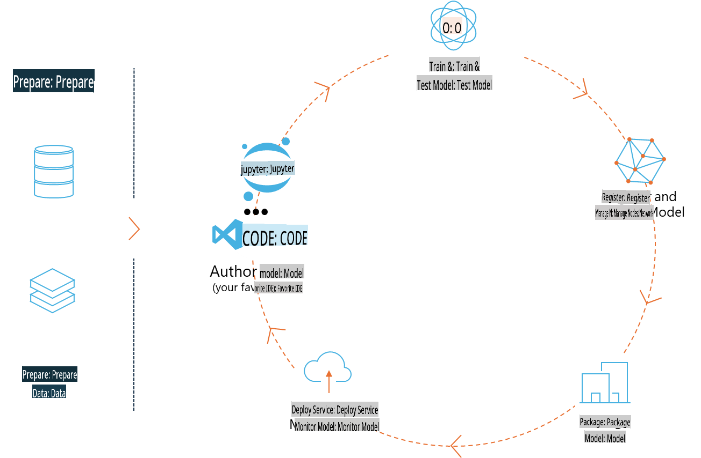
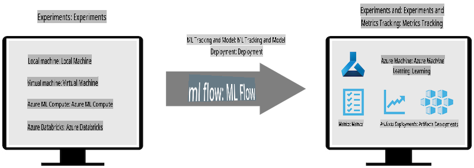
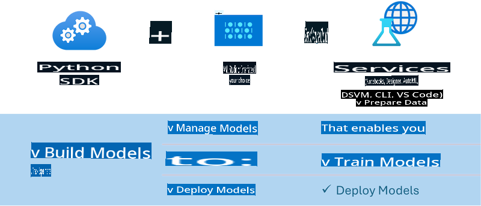

# MLflow

[MLflow](https://mlflow.org/) is an open-source platform designed to manage the complete machine learning lifecycle.



MLFlow is used to handle the ML lifecycle, including experimentation, reproducibility, deployment, and maintaining a central model registry. It currently offers four key components:

- **MLflow Tracking:** Record and query experiments, code, data configurations, and results.
- **MLflow Projects:** Package data science code in a format that allows reproducibility on any platform.
- **MLflow Models:** Deploy machine learning models in various serving environments.
- **Model Registry:** Store, annotate, and manage models in a centralized repository.

MLFlow provides features for tracking experiments, packaging code into reproducible runs, and sharing and deploying models. It is integrated with Databricks and supports a wide range of ML libraries, making it library-agnostic. It can be used with any machine learning library and programming language, thanks to its REST API and CLI.



Key features of MLFlow include:

- **Experiment Tracking:** Log and compare parameters and results.
- **Model Management:** Deploy models to various serving and inference platforms.
- **Model Registry:** Collaboratively manage the lifecycle of MLflow Models, including versioning and annotations.
- **Projects:** Package ML code for sharing or production purposes.

MLFlow also supports the MLOps workflow, which includes data preparation, model registration and management, model packaging for execution, service deployment, and model monitoring. Its goal is to streamline the transition from prototype to production workflows, especially in cloud and edge environments.

## E2E Scenario - Building a wrapper and using Phi-3 as an MLFlow model

In this end-to-end example, we will demonstrate two different approaches to building a wrapper around the Phi-3 small language model (SLM) and running it as an MLFlow model, either locally or in the cloud, such as in an Azure Machine Learning workspace.



| Project | Description | Location |
| ------------ | ----------- | -------- |
| Transformer Pipeline | The Transformer Pipeline is the simplest way to build a wrapper if you want to use a HuggingFace model with MLFlow’s experimental transformers flavor. | [**TransformerPipeline.ipynb**](../../../../../../code/06.E2E/E2E_Phi-3-MLflow_TransformerPipeline.ipynb) |
| Custom Python Wrapper | At the time of writing, the transformer pipeline did not support generating MLFlow wrappers for HuggingFace models in ONNX format, even with the experimental optimum Python package. In such cases, you can create a custom Python wrapper for MLFlow. | [**CustomPythonWrapper.ipynb**](../../../../../../code/06.E2E/E2E_Phi-3-MLflow_CustomPythonWrapper.ipynb) |

## Project: Transformer Pipeline

1. You will need the relevant Python packages from MLFlow and HuggingFace:

    ``` Python
    import mlflow
    import transformers
    ```

2. Next, initialize a transformer pipeline by referencing the target Phi-3 model in the HuggingFace registry. As indicated in the _Phi-3-mini-4k-instruct_ model card, its task is of the “Text Generation” type:

    ``` Python
    pipeline = transformers.pipeline(
        task = "text-generation",
        model = "microsoft/Phi-3-mini-4k-instruct"
    )
    ```

3. You can now save the Phi-3 model’s transformer pipeline in MLFlow format and provide additional details such as the target artifacts path, specific model configuration settings, and the inference API type:

    ``` Python
    model_info = mlflow.transformers.log_model(
        transformers_model = pipeline,
        artifact_path = "phi3-mlflow-model",
        model_config = model_config,
        task = "llm/v1/chat"
    )
    ```

## Project: Custom Python Wrapper

1. For this approach, you can use Microsoft's [ONNX Runtime generate() API](https://github.com/microsoft/onnxruntime-genai) for the ONNX model's inference and token encoding/decoding. Choose the _onnxruntime_genai_ package suitable for your target compute, as shown below for a CPU:

    ``` Python
    import mlflow
    from mlflow.models import infer_signature
    import onnxruntime_genai as og
    ```

2. The custom class implements two methods: _load_context()_ to initialize the **ONNX model** of Phi-3 Mini 4K Instruct, **generator parameters**, and **tokenizer**; and _predict()_ to generate output tokens for the given prompt:

    ``` Python
    class Phi3Model(mlflow.pyfunc.PythonModel):
        def load_context(self, context):
            # Retrieving model from the artifacts
            model_path = context.artifacts["phi3-mini-onnx"]
            model_options = {
                 "max_length": 300,
                 "temperature": 0.2,         
            }
        
            # Defining the model
            self.phi3_model = og.Model(model_path)
            self.params = og.GeneratorParams(self.phi3_model)
            self.params.set_search_options(**model_options)
            
            # Defining the tokenizer
            self.tokenizer = og.Tokenizer(self.phi3_model)
    
        def predict(self, context, model_input):
            # Retrieving prompt from the input
            prompt = model_input["prompt"][0]
            self.params.input_ids = self.tokenizer.encode(prompt)
    
            # Generating the model's response
            response = self.phi3_model.generate(self.params)
    
            return self.tokenizer.decode(response[0][len(self.params.input_ids):])
    ```

3. You can now use the _mlflow.pyfunc.log_model()_ function to create a custom Python wrapper (in pickle format) for the Phi-3 model, along with the original ONNX model and necessary dependencies:

    ``` Python
    model_info = mlflow.pyfunc.log_model(
        artifact_path = artifact_path,
        python_model = Phi3Model(),
        artifacts = {
            "phi3-mini-onnx": "cpu_and_mobile/cpu-int4-rtn-block-32-acc-level-4",
        },
        input_example = input_example,
        signature = infer_signature(input_example, ["Run"]),
        extra_pip_requirements = ["torch", "onnxruntime_genai", "numpy"],
    )
    ```

## Signatures of generated MLFlow models

1. In step 3 of the Transformer Pipeline project above, we set the MLFlow model’s task to “_llm/v1/chat_”. This instruction generates an API wrapper for the model, compatible with OpenAI’s Chat API, as shown below:

    ``` Python
    {inputs: 
      ['messages': Array({content: string (required), name: string (optional), role: string (required)}) (required), 'temperature': double (optional), 'max_tokens': long (optional), 'stop': Array(string) (optional), 'n': long (optional), 'stream': boolean (optional)],
    outputs: 
      ['id': string (required), 'object': string (required), 'created': long (required), 'model': string (required), 'choices': Array({finish_reason: string (required), index: long (required), message: {content: string (required), name: string (optional), role: string (required)} (required)}) (required), 'usage': {completion_tokens: long (required), prompt_tokens: long (required), total_tokens: long (required)} (required)],
    params: 
      None}
    ```

2. Consequently, you can submit your prompt in the following format:

    ``` Python
    messages = [{"role": "user", "content": "What is the capital of Spain?"}]
    ```

3. Use OpenAI API-compatible post-processing, such as _response[0][‘choices’][0][‘message’][‘content’]_, to refine the output into something like this:

    ``` JSON
    Question: What is the capital of Spain?
    
    Answer: The capital of Spain is Madrid. It is the largest city in Spain and serves as the political, economic, and cultural center of the country. Madrid is located in the center of the Iberian Peninsula and is known for its rich history, art, and architecture, including the Royal Palace, the Prado Museum, and the Plaza Mayor.
    
    Usage: {'prompt_tokens': 11, 'completion_tokens': 73, 'total_tokens': 84}
    ```

4. In step 3 of the Custom Python Wrapper project above, we allow the MLFlow package to generate the model’s signature based on a given input example. The MLFlow wrapper's signature will look like this:

    ``` Python
    {inputs: 
      ['prompt': string (required)],
    outputs: 
      [string (required)],
    params: 
      None}
    ```

5. As a result, your prompt needs to include the "prompt" dictionary key, similar to this:

    ``` Python
    {"prompt": "<|system|>You are a stand-up comedian.<|end|><|user|>Tell me a joke about atom<|end|><|assistant|>",}
    ```

6. The model's output will then be provided in string format:

    ``` JSON
    Alright, here's a little atom-related joke for you!
    
    Why don't electrons ever play hide and seek with protons?
    
    Because good luck finding them when they're always "sharing" their electrons!
    
    Remember, this is all in good fun, and we're just having a little atomic-level humor!
    ```

**Disclaimer**:  
This document has been translated using machine-based AI translation services. While we strive for accuracy, please note that automated translations may contain errors or inaccuracies. The original document in its native language should be regarded as the authoritative source. For critical information, professional human translation is recommended. We are not responsible for any misunderstandings or misinterpretations resulting from the use of this translation.