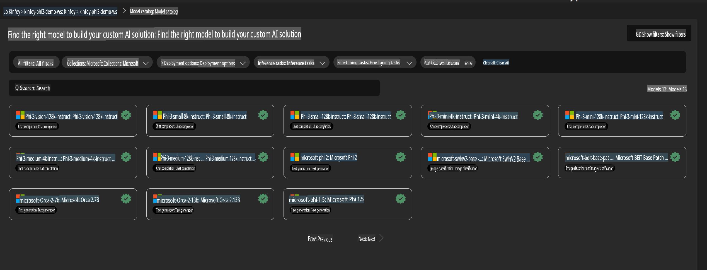
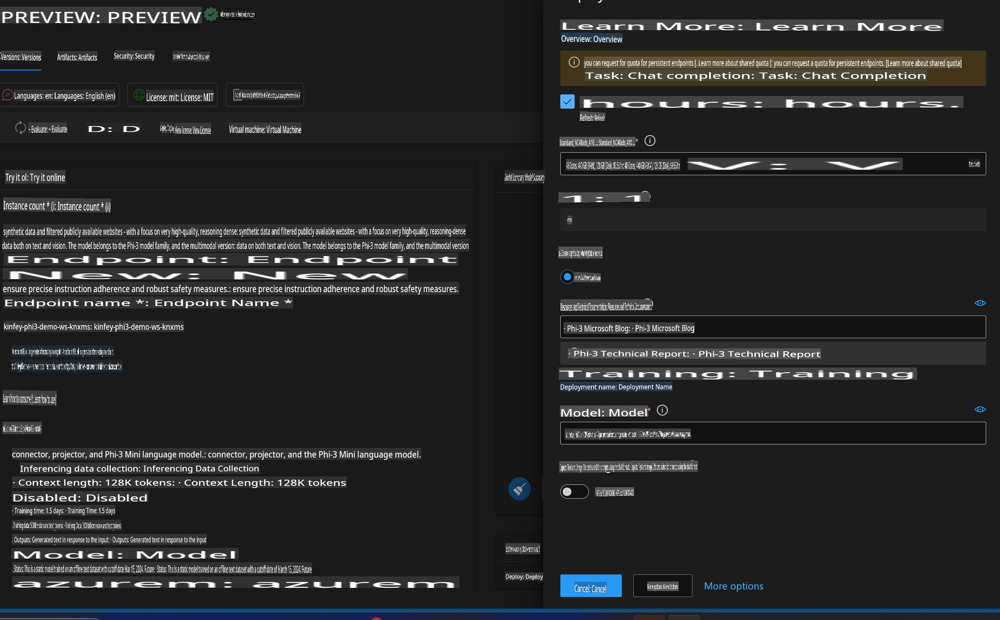
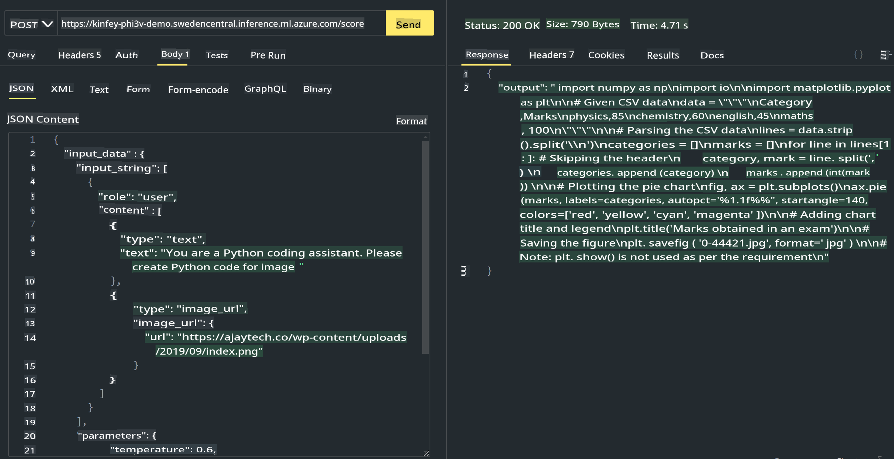

# **Lab 3 - Deploy Phi-3-Vision on Azure Machine Learning Service**

We use an NPU to complete the production deployment of local code, and then leverage it to introduce PHI-3-VISION for generating code from images.

In this guide, we will quickly build a Model-as-a-Service Phi-3 Vision solution using Azure Machine Learning Service.

***Note***: Phi-3 Vision requires significant computational resources to generate content efficiently. Cloud computing power is essential to achieve this.

### **1. Create Azure Machine Learning Service**

First, create an Azure Machine Learning Service in the Azure Portal. For detailed instructions, visit this link: [https://learn.microsoft.com/azure/machine-learning/quickstart-create-resources?view=azureml-api-2](https://learn.microsoft.com/azure/machine-learning/quickstart-create-resources?view=azureml-api-2)

### **2. Select Phi-3 Vision in Azure Machine Learning Service**



### **3. Deploy Phi-3-Vision on Azure**



### **4. Test the Endpoint in Postman**



***Note***

1. The transmitted parameters must include Authorization, azureml-model-deployment, and Content-Type. You will need to review the deployment details to retrieve this information.

2. When transmitting parameters, Phi-3-Vision requires an image link. Refer to the GPT-4-Vision method for parameter transmission, such as:

```json

{
  "input_data":{
    "input_string":[
      {
        "role":"user",
        "content":[ 
          {
            "type": "text",
            "text": "You are a Python coding assistant.Please create Python code for image "
          },
          {
              "type": "image_url",
              "image_url": {
                "url": "https://ajaytech.co/wp-content/uploads/2019/09/index.png"
              }
          }
        ]
      }
    ],
    "parameters":{
          "temperature": 0.6,
          "top_p": 0.9,
          "do_sample": false,
          "max_new_tokens": 2048
    }
  }
}

```

3. Use the **/score** endpoint with the POST method.

**Congratulations!** You have successfully deployed PHI-3-VISION and experimented with generating code from images. Moving forward, you can explore building applications by combining NPUs with cloud capabilities.

**Disclaimer**:  
This document has been translated using machine-based AI translation services. While we strive for accuracy, please note that automated translations may contain errors or inaccuracies. The original document in its native language should be regarded as the authoritative source. For critical information, professional human translation is recommended. We are not responsible for any misunderstandings or misinterpretations resulting from the use of this translation.