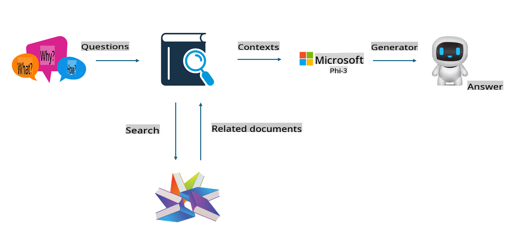

## Finetuning vs RAG

## Retrieval Augmented Generation

RAG combines data retrieval with text generation. The enterprise's structured and unstructured data are stored in a vector database. When searching for relevant content, it retrieves summaries and content to create a context, then uses the text generation capabilities of LLM/SLM to produce output.

## RAG Process

## Fine-tuning
Fine-tuning involves improving an existing model. It doesn’t require starting from scratch with the model algorithm but does require continuous accumulation of data. If precise terminology and tailored language expressions are needed for industry-specific applications, fine-tuning is the better option. However, if your data changes frequently, fine-tuning can become challenging.

## How to choose
If the answer requires incorporating external data, RAG is the optimal choice.

If you need to deliver consistent and precise industry-specific knowledge, fine-tuning is a better fit. RAG focuses on retrieving relevant content but may not always capture specialized nuances.

Fine-tuning requires a high-quality dataset, and if the dataset is limited in scope, the impact may be minimal. RAG offers greater flexibility.  
Fine-tuning operates as a black box and is somewhat opaque, making it difficult to understand the internal mechanisms. In contrast, RAG allows easier identification of data sources, which helps in addressing hallucinations or content errors and provides better transparency.

**Disclaimer**:  
This document has been translated using machine-based AI translation services. While we strive for accuracy, please note that automated translations may contain errors or inaccuracies. The original document in its native language should be regarded as the authoritative source. For critical information, professional human translation is recommended. We are not responsible for any misunderstandings or misinterpretations resulting from the use of this translation.