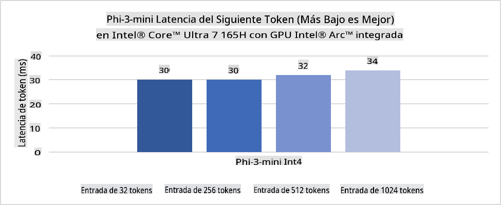
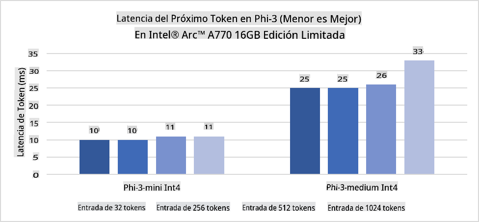
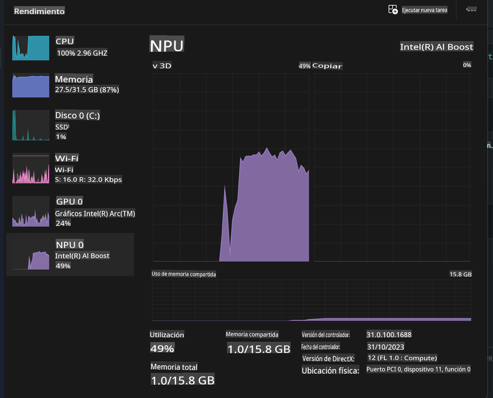
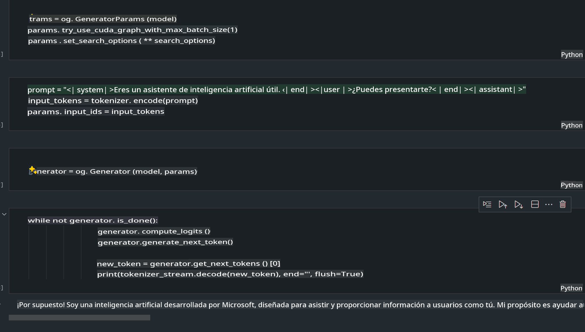
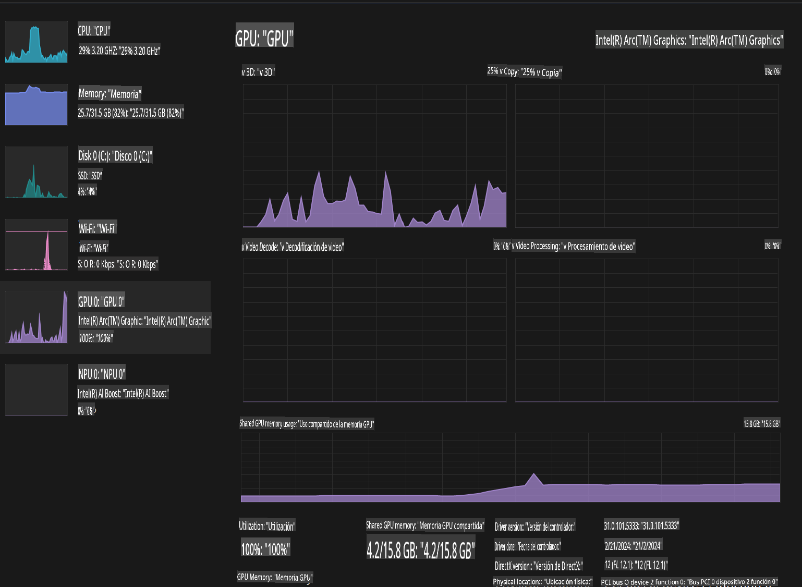

# **Inferencia de Phi-3 en AI PC**

Con el avance de la inteligencia artificial generativa y la mejora en las capacidades de hardware de los dispositivos periféricos, un número cada vez mayor de modelos de IA generativa puede integrarse en los dispositivos BYOD (Bring Your Own Device) de los usuarios. Las AI PCs están entre estos modelos. A partir de 2024, Intel, AMD y Qualcomm han colaborado con fabricantes de PCs para introducir AI PCs que facilitan el despliegue de modelos de IA generativa localizados mediante modificaciones de hardware. En esta discusión, nos centraremos en las AI PCs de Intel y exploraremos cómo implementar Phi-3 en una AI PC de Intel.

### ¿Qué es una NPU?

Una NPU (Unidad de Procesamiento Neural) es un procesador o unidad de procesamiento dedicada dentro de un SoC más grande, diseñada específicamente para acelerar operaciones de redes neuronales y tareas de IA. A diferencia de las CPUs y GPUs de propósito general, las NPUs están optimizadas para un procesamiento paralelo orientado a datos, lo que las hace altamente eficientes al manejar grandes cantidades de datos multimedia como videos e imágenes, y al procesar datos para redes neuronales. Son especialmente hábiles en tareas relacionadas con la IA, como reconocimiento de voz, desenfoque de fondo en videollamadas y procesos de edición de fotos o videos como la detección de objetos.

## NPU vs GPU

Aunque muchas cargas de trabajo de IA y aprendizaje automático se ejecutan en GPUs, existe una diferencia crucial entre GPUs y NPUs.  
Las GPUs son conocidas por sus capacidades de computación paralela, pero no todas las GPUs son igualmente eficientes más allá del procesamiento gráfico. Por otro lado, las NPUs están diseñadas específicamente para los cálculos complejos que implican las operaciones de redes neuronales, lo que las hace altamente efectivas para tareas de IA.

En resumen, las NPUs son los genios matemáticos que aceleran los cálculos de IA, ¡y juegan un papel clave en la emergente era de las AI PCs!

***Este ejemplo se basa en el último procesador Intel Core Ultra***

## **1. Usar NPU para ejecutar el modelo Phi-3**

El dispositivo Intel® NPU es un acelerador de inferencia de IA integrado en las CPUs cliente de Intel, comenzando con la generación Intel® Core™ Ultra (anteriormente conocida como Meteor Lake). Permite la ejecución energéticamente eficiente de tareas de redes neuronales artificiales.





**Biblioteca de Aceleración NPU de Intel**

La Biblioteca de Aceleración NPU de Intel [https://github.com/intel/intel-npu-acceleration-library](https://github.com/intel/intel-npu-acceleration-library) es una biblioteca de Python diseñada para mejorar la eficiencia de tus aplicaciones aprovechando la potencia de la Unidad de Procesamiento Neural (NPU) de Intel para realizar cálculos de alta velocidad en hardware compatible.

Ejemplo de Phi-3-mini en una AI PC con procesadores Intel® Core™ Ultra.


Instala la biblioteca de Python con pip

```bash

   pip install intel-npu-acceleration-library

```

***Nota*** El proyecto aún está en desarrollo, pero el modelo de referencia ya es muy completo.

### **Ejecutar Phi-3 con la Biblioteca de Aceleración NPU de Intel**

Usando la aceleración NPU de Intel, esta biblioteca no afecta el proceso de codificación tradicional. Solo necesitas usar esta biblioteca para cuantificar el modelo Phi-3 original, como FP16, INT8, INT4, por ejemplo: 

```python
from transformers import AutoTokenizer, pipeline,TextStreamer
from intel_npu_acceleration_library import NPUModelForCausalLM, int4
from intel_npu_acceleration_library.compiler import CompilerConfig
import warnings

model_id = "microsoft/Phi-3-mini-4k-instruct"

compiler_conf = CompilerConfig(dtype=int4)
model = NPUModelForCausalLM.from_pretrained(
    model_id, use_cache=True, config=compiler_conf, attn_implementation="sdpa"
).eval()

tokenizer = AutoTokenizer.from_pretrained(model_id)

text_streamer = TextStreamer(tokenizer, skip_prompt=True)
```

Una vez que la cuantificación es exitosa, continúa la ejecución para llamar a la NPU y ejecutar el modelo Phi-3.

```python
generation_args = {
   "max_new_tokens": 1024,
   "return_full_text": False,
   "temperature": 0.3,
   "do_sample": False,
   "streamer": text_streamer,
}

pipe = pipeline(
   "text-generation",
   model=model,
   tokenizer=tokenizer,
)

query = "<|system|>You are a helpful AI assistant.<|end|><|user|>Can you introduce yourself?<|end|><|assistant|>"

with warnings.catch_warnings():
    warnings.simplefilter("ignore")
    pipe(query, **generation_args)
```

Al ejecutar el código, podemos ver el estado de funcionamiento de la NPU a través del Administrador de Tareas.



***Ejemplos*** : [AIPC_NPU_DEMO.ipynb](../../../../../code/03.Inference/AIPC/AIPC_NPU_DEMO.ipynb)

## **2. Usar DirectML + ONNX Runtime para ejecutar el modelo Phi-3**

### **¿Qué es DirectML?**

[DirectML](https://github.com/microsoft/DirectML) es una biblioteca de DirectX 12 de alto rendimiento y acelerada por hardware para aprendizaje automático. DirectML proporciona aceleración por GPU para tareas comunes de aprendizaje automático en una amplia gama de hardware y controladores compatibles, incluidos todos los GPUs capaces de DirectX 12 de proveedores como AMD, Intel, NVIDIA y Qualcomm.

Cuando se usa de forma independiente, la API de DirectML es una biblioteca de DirectX 12 de bajo nivel adecuada para aplicaciones de alto rendimiento y baja latencia como frameworks, juegos y otras aplicaciones en tiempo real. La interoperabilidad fluida de DirectML con Direct3D 12, así como su bajo overhead y conformidad entre hardware, hacen que DirectML sea ideal para acelerar el aprendizaje automático cuando se desean tanto un alto rendimiento como resultados confiables y predecibles en distintos hardware.

***Nota*** : La versión más reciente de DirectML ya soporta NPU(https://devblogs.microsoft.com/directx/introducing-neural-processor-unit-npu-support-in-directml-developer-preview/)

### DirectML y CUDA en términos de capacidades y rendimiento:

**DirectML** es una biblioteca de aprendizaje automático desarrollada por Microsoft. Está diseñada para acelerar las cargas de trabajo de aprendizaje automático en dispositivos Windows, incluidos PCs de escritorio, laptops y dispositivos periféricos.
- Basado en DX12: DirectML está construido sobre DirectX 12 (DX12), lo que proporciona una amplia compatibilidad de hardware en GPUs, incluidas NVIDIA y AMD.
- Compatibilidad Amplia: Al aprovechar DX12, DirectML puede trabajar con cualquier GPU que soporte DX12, incluso GPUs integrados.
- Procesamiento de Imágenes: DirectML procesa imágenes y otros datos utilizando redes neuronales, lo que lo hace adecuado para tareas como reconocimiento de imágenes, detección de objetos, y más.
- Facilidad de Configuración: Configurar DirectML es sencillo y no requiere SDKs o bibliotecas específicas de los fabricantes de GPUs.
- Rendimiento: En algunos casos, DirectML ofrece un buen rendimiento y puede ser más rápido que CUDA, especialmente para ciertas cargas de trabajo.
- Limitaciones: Sin embargo, hay casos en los que DirectML puede ser más lento, particularmente con tamaños de lote grandes en float16.

**CUDA** es la plataforma de computación paralela y modelo de programación de NVIDIA. Permite a los desarrolladores aprovechar el poder de las GPUs de NVIDIA para la computación de propósito general, incluido el aprendizaje automático y las simulaciones científicas.
- Específico de NVIDIA: CUDA está estrechamente integrado con las GPUs de NVIDIA y está diseñado específicamente para ellas.
- Altamente Optimizado: Ofrece un rendimiento excelente para tareas aceleradas por GPU, especialmente al usar GPUs de NVIDIA.
- Uso Extendido: Muchos frameworks y bibliotecas de aprendizaje automático (como TensorFlow y PyTorch) tienen soporte para CUDA.
- Personalización: Los desarrolladores pueden ajustar configuraciones de CUDA para tareas específicas, lo que puede llevar a un rendimiento óptimo.
- Limitaciones: Sin embargo, la dependencia de CUDA en el hardware de NVIDIA puede ser limitante si se busca una compatibilidad más amplia entre diferentes GPUs.

### Elegir entre DirectML y CUDA

La elección entre DirectML y CUDA depende de tu caso de uso específico, disponibilidad de hardware y preferencias.  
Si buscas una mayor compatibilidad y facilidad de configuración, DirectML podría ser una buena opción. Sin embargo, si tienes GPUs de NVIDIA y necesitas un rendimiento altamente optimizado, CUDA sigue siendo una opción sólida. En resumen, ambos tienen sus fortalezas y debilidades, así que considera tus requisitos y el hardware disponible al tomar una decisión.

### **IA Generativa con ONNX Runtime**

En la era de la IA, la portabilidad de los modelos de IA es muy importante. ONNX Runtime permite implementar fácilmente modelos entrenados en diferentes dispositivos. Los desarrolladores no necesitan preocuparse por el framework de inferencia y pueden usar una API unificada para completar la inferencia del modelo. En la era de la IA generativa, ONNX Runtime también ha realizado optimizaciones de código (https://onnxruntime.ai/docs/genai/). Con el ONNX Runtime optimizado, el modelo de IA generativa cuantificado puede inferirse en diferentes terminales. En Generative AI con ONNX Runtime, puedes inferir el modelo de IA a través de APIs en Python, C#, C / C++. Por supuesto, el despliegue en iPhone puede aprovechar la API de Generative AI con ONNX Runtime en C++.

[Código de Ejemplo](https://github.com/Azure-Samples/Phi-3MiniSamples/tree/main/onnx)

***Compilar IA generativa con la biblioteca ONNX Runtime***

```bash

winget install --id=Kitware.CMake  -e

git clone https://github.com/microsoft/onnxruntime.git

cd .\onnxruntime\

./build.bat --build_shared_lib --skip_tests --parallel --use_dml --config Release

cd ../

git clone https://github.com/microsoft/onnxruntime-genai.git

cd .\onnxruntime-genai\

mkdir ort

cd ort

mkdir include

mkdir lib

copy ..\onnxruntime\include\onnxruntime\core\providers\dml\dml_provider_factory.h ort\include

copy ..\onnxruntime\include\onnxruntime\core\session\onnxruntime_c_api.h ort\include

copy ..\onnxruntime\build\Windows\Release\Release\*.dll ort\lib

copy ..\onnxruntime\build\Windows\Release\Release\onnxruntime.lib ort\lib

python build.py --use_dml


```

**Instalar la biblioteca**

```bash

pip install .\onnxruntime_genai_directml-0.3.0.dev0-cp310-cp310-win_amd64.whl

```

Este es el resultado de ejecución 



***Ejemplos*** : [AIPC_DirectML_DEMO.ipynb](../../../../../code/03.Inference/AIPC/AIPC_DirectML_DEMO.ipynb)

## **3. Usar Intel OpenVINO para ejecutar el modelo Phi-3**

### **¿Qué es OpenVINO?**

[OpenVINO](https://github.com/openvinotoolkit/openvino) es un toolkit de código abierto para optimizar e implementar modelos de aprendizaje profundo. Proporciona un rendimiento mejorado para modelos de visión, audio y lenguaje de frameworks populares como TensorFlow, PyTorch, y más. Comienza con OpenVINO. OpenVINO también puede usarse en combinación con CPU y GPU para ejecutar el modelo Phi-3.

***Nota***: Actualmente, OpenVINO no soporta NPU.

### **Instalar la Biblioteca OpenVINO**

```bash

 pip install git+https://github.com/huggingface/optimum-intel.git

 pip install git+https://github.com/openvinotoolkit/nncf.git

 pip install openvino-nightly

```

### **Ejecutar Phi-3 con OpenVINO**

Al igual que con la NPU, OpenVINO completa la ejecución de modelos de IA generativa al ejecutar modelos cuantificados. Necesitamos cuantificar primero el modelo Phi-3 y completar la cuantificación del modelo en la línea de comandos usando optimum-cli.

**INT4**

```bash

optimum-cli export openvino --model "microsoft/Phi-3-mini-4k-instruct" --task text-generation-with-past --weight-format int4 --group-size 128 --ratio 0.6  --sym  --trust-remote-code ./openvinomodel/phi3/int4

```

**FP16**

```bash

optimum-cli export openvino --model "microsoft/Phi-3-mini-4k-instruct" --task text-generation-with-past --weight-format fp16 --trust-remote-code ./openvinomodel/phi3/fp16

```

El formato convertido, como este:


Carga las rutas del modelo (model_dir), las configuraciones relacionadas (ov_config = {"PERFORMANCE_HINT": "LATENCY", "NUM_STREAMS": "1", "CACHE_DIR": ""}) y los dispositivos acelerados por hardware (GPU.0) a través de OVModelForCausalLM.

```python

ov_model = OVModelForCausalLM.from_pretrained(
     model_dir,
     device='GPU.0',
     ov_config=ov_config,
     config=AutoConfig.from_pretrained(model_dir, trust_remote_code=True),
     trust_remote_code=True,
)

```

Al ejecutar el código, podemos ver el estado de funcionamiento de la GPU a través del Administrador de Tareas.



***Ejemplos*** : [AIPC_OpenVino_Demo.ipynb](../../../../../code/03.Inference/AIPC/AIPC_OpenVino_Demo.ipynb)

### ***Nota*** : Los tres métodos anteriores tienen sus propias ventajas, pero se recomienda usar la aceleración NPU para la inferencia en AI PCs.

**Descargo de responsabilidad**:  
Este documento ha sido traducido utilizando servicios de traducción automática basados en inteligencia artificial. Si bien nos esforzamos por garantizar la precisión, tenga en cuenta que las traducciones automatizadas pueden contener errores o imprecisiones. El documento original en su idioma nativo debe considerarse como la fuente autorizada. Para información crítica, se recomienda una traducción profesional realizada por humanos. No nos hacemos responsables de malentendidos o interpretaciones erróneas que puedan surgir del uso de esta traducción.