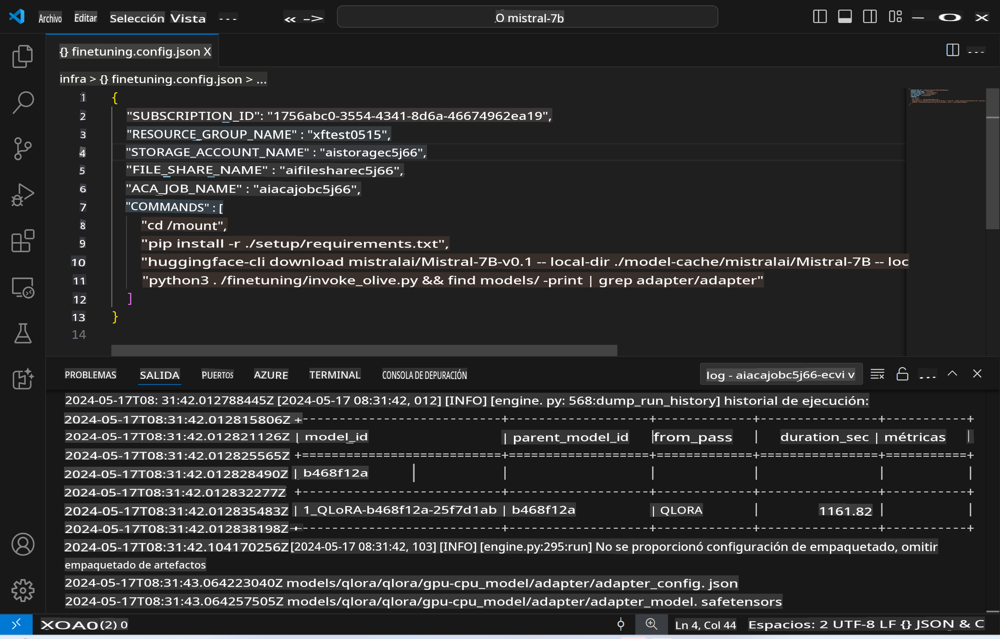
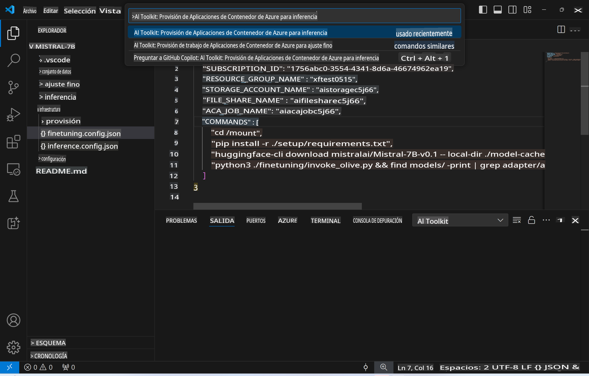
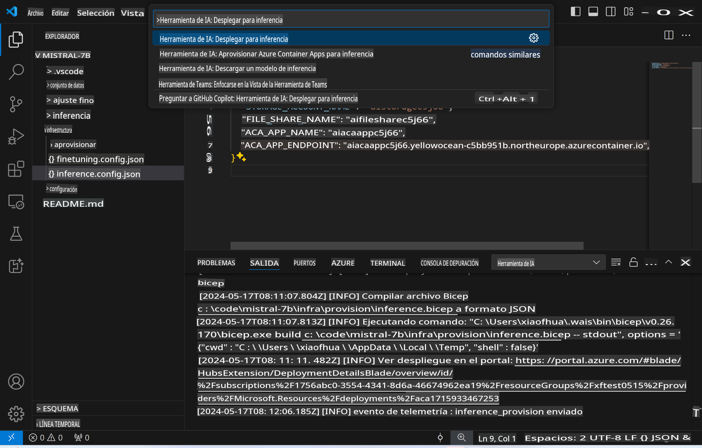
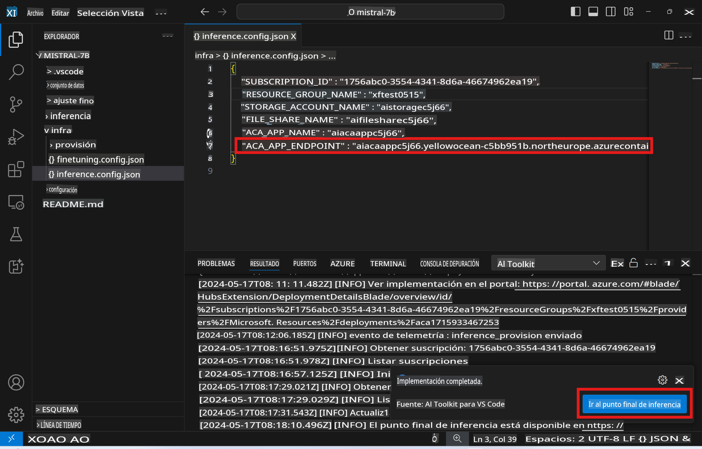

# Inferencia Remota con el modelo ajustado

Después de entrenar los adaptadores en el entorno remoto, utiliza una aplicación sencilla de Gradio para interactuar con el modelo.



### Provisión de Recursos de Azure
Es necesario configurar los recursos de Azure para la inferencia remota ejecutando el comando `AI Toolkit: Provision Azure Container Apps for inference` desde el panel de comandos. Durante esta configuración, se te pedirá seleccionar tu suscripción de Azure y el grupo de recursos.  

   
Por defecto, la suscripción y el grupo de recursos para la inferencia deben coincidir con los utilizados para el ajuste fino. La inferencia utilizará el mismo entorno de Azure Container App y accederá al modelo y al adaptador del modelo almacenados en Azure Files, los cuales se generaron durante el paso de ajuste fino.

## Uso de AI Toolkit

### Despliegue para Inferencia  
Si deseas modificar el código de inferencia o recargar el modelo de inferencia, ejecuta el comando `AI Toolkit: Deploy for inference`. Esto sincronizará tu código más reciente con ACA y reiniciará la réplica.  



Tras completar exitosamente el despliegue, el modelo estará listo para ser evaluado usando este endpoint.

### Acceso a la API de Inferencia

Puedes acceder a la API de inferencia haciendo clic en el botón "*Ir al Endpoint de Inferencia*" que aparece en la notificación de VSCode. Alternativamente, el endpoint web de la API se encuentra bajo `ACA_APP_ENDPOINT` en `./infra/inference.config.json` y en el panel de salida.



> **Nota:** El endpoint de inferencia puede tardar unos minutos en estar completamente operativo.

## Componentes de Inferencia Incluidos en la Plantilla
 
| Carpeta | Contenido |
| ------- |---------- |
| `infra` | Contiene todas las configuraciones necesarias para las operaciones remotas. |
| `infra/provision/inference.parameters.json` | Almacena los parámetros para las plantillas bicep, utilizadas para la provisión de recursos de Azure para la inferencia. |
| `infra/provision/inference.bicep` | Contiene las plantillas para la provisión de recursos de Azure para la inferencia. |
| `infra/inference.config.json` | El archivo de configuración, generado por el comando `AI Toolkit: Provision Azure Container Apps for inference`. Se utiliza como entrada para otros comandos del panel remoto. |

### Uso de AI Toolkit para configurar la Provisión de Recursos de Azure
Configura el [AI Toolkit](https://marketplace.visualstudio.com/items?itemName=ms-windows-ai-studio.windows-ai-studio).

Provisiona las Azure Container Apps para inferencia` command.

You can find configuration parameters in `./infra/provision/inference.parameters.json` file. Here are the details:
| Parameter | Description |
| --------- |------------ |
| `defaultCommands` | This is the commands to initiate a web API. |
| `maximumInstanceCount` | This parameter sets the maximum capacity of GPU instances. |
| `location` | This is the location where Azure resources are provisioned. The default value is the same as the chosen resource group's location. |
| `storageAccountName`, `fileShareName` `acaEnvironmentName`, `acaEnvironmentStorageName`, `acaAppName`,  `acaLogAnalyticsName` | These parameters are used to name the Azure resources for provision. By default, they will be same to the fine-tuning resource name. You can input a new, unused resource name to create your own custom-named resources, or you can input the name of an already existing Azure resource if you'd prefer to use that. For details, refer to the section [Using existing Azure Resources](../../../../../md/01.Introduction/03). |

### Using Existing Azure Resources

By default, the inference provision use the same Azure Container App Environment, Storage Account, Azure File Share, and Azure Log Analytics that were used for fine-tuning. A separate Azure Container App is created solely for the inference API. 

If you have customized the Azure resources during the fine-tuning step or want to use your own existing Azure resources for inference, specify their names in the `./infra/inference.parameters.json`. Luego, ejecuta el comando `AI Toolkit: Provision Azure Container Apps for inference` desde el panel de comandos. Esto actualizará cualquier recurso especificado y creará aquellos que falten.

Por ejemplo, si tienes un entorno de contenedor de Azure existente, tu archivo `./infra/finetuning.parameters.json` debería verse así:

```json
{
    "$schema": "https://schema.management.azure.com/schemas/2019-04-01/deploymentParameters.json#",
    "contentVersion": "1.0.0.0",
    "parameters": {
      ...
      "acaEnvironmentName": {
        "value": "<your-aca-env-name>"
      },
      "acaEnvironmentStorageName": {
        "value": null
      },
      ...
    }
  }
```

### Provisión Manual  
Si prefieres configurar manualmente los recursos de Azure, puedes usar los archivos bicep proporcionados en el directorio `./infra/provision` folders. If you have already set up and configured all the Azure resources without using the AI Toolkit command palette, you can simply enter the resource names in the `inference.config.json`.

Por ejemplo:

```json
{
  "SUBSCRIPTION_ID": "<your-subscription-id>",
  "RESOURCE_GROUP_NAME": "<your-resource-group-name>",
  "STORAGE_ACCOUNT_NAME": "<your-storage-account-name>",
  "FILE_SHARE_NAME": "<your-file-share-name>",
  "ACA_APP_NAME": "<your-aca-name>",
  "ACA_APP_ENDPOINT": "<your-aca-endpoint>"
}
```

**Descargo de responsabilidad**:  
Este documento ha sido traducido utilizando servicios de traducción basados en inteligencia artificial. Si bien nos esforzamos por lograr precisión, tenga en cuenta que las traducciones automatizadas pueden contener errores o inexactitudes. El documento original en su idioma nativo debe considerarse la fuente autorizada. Para información crítica, se recomienda una traducción profesional realizada por humanos. No nos hacemos responsables de malentendidos o interpretaciones erróneas que surjan del uso de esta traducción.