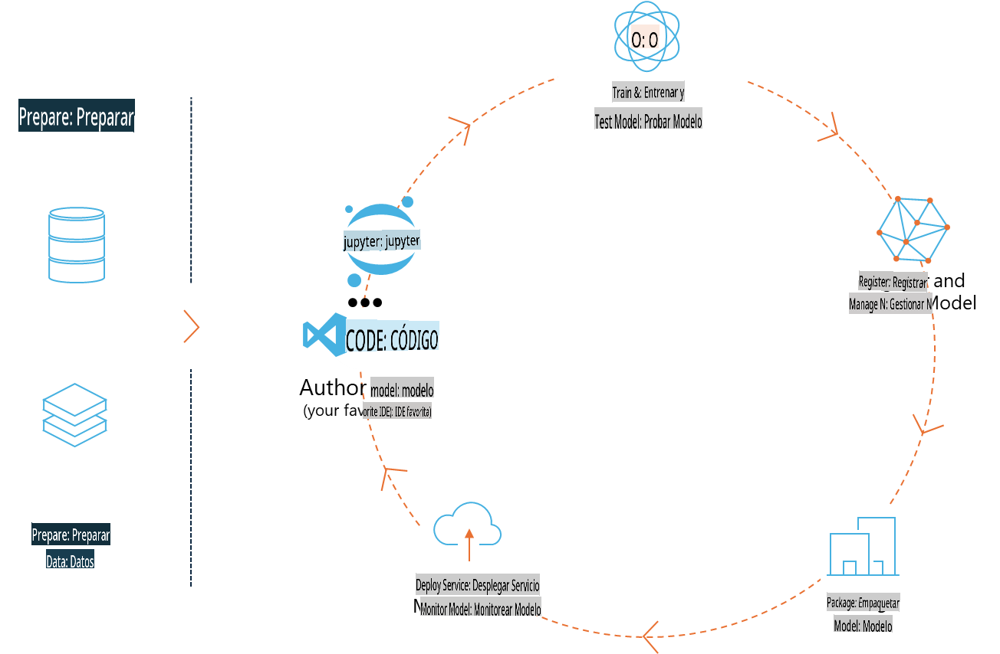
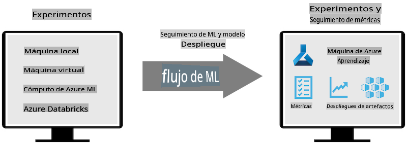
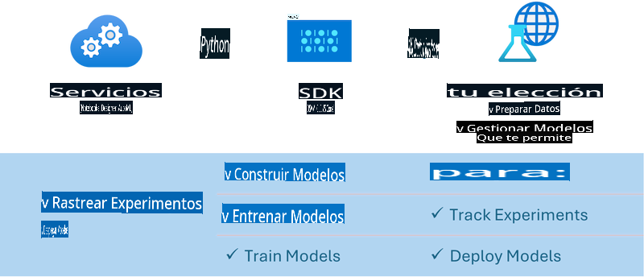

# MLflow

[MLflow](https://mlflow.org/) es una plataforma de código abierto diseñada para gestionar el ciclo de vida completo del aprendizaje automático.



MLFlow se utiliza para gestionar el ciclo de vida del aprendizaje automático, incluyendo experimentación, reproducibilidad, despliegue y un registro central de modelos. Actualmente, MLFlow ofrece cuatro componentes principales:

- **MLflow Tracking:** Registra y consulta experimentos, código, configuraciones de datos y resultados.
- **MLflow Projects:** Empaqueta el código de ciencia de datos en un formato que permite reproducir ejecuciones en cualquier plataforma.
- **Mlflow Models:** Despliega modelos de aprendizaje automático en diversos entornos de servicio.
- **Model Registry:** Almacena, anota y gestiona modelos en un repositorio central.

Incluye funcionalidades para rastrear experimentos, empaquetar código en ejecuciones reproducibles, y compartir y desplegar modelos. MLFlow está integrado en Databricks y es compatible con una variedad de bibliotecas de aprendizaje automático, lo que lo hace independiente de la biblioteca utilizada. Puede emplearse con cualquier biblioteca de aprendizaje automático y en cualquier lenguaje de programación, ya que ofrece una API REST y CLI para mayor comodidad.



Las características clave de MLFlow incluyen:

- **Seguimiento de Experimentos:** Registra y compara parámetros y resultados.
- **Gestión de Modelos:** Despliega modelos en diversas plataformas de servicio e inferencia.
- **Registro de Modelos:** Gestiona colaborativamente el ciclo de vida de los modelos de MLFlow, incluyendo versiones y anotaciones.
- **Proyectos:** Empaqueta código de aprendizaje automático para compartir o usar en producción.

MLFlow también respalda el ciclo de MLOps, que incluye preparar datos, registrar y gestionar modelos, empaquetar modelos para su ejecución, desplegar servicios y monitorear modelos. Su objetivo es simplificar el proceso de pasar de un prototipo a un flujo de trabajo en producción, especialmente en entornos de nube y de borde.

## Escenario de Extremo a Extremo (E2E) - Construyendo un wrapper y usando Phi-3 como un modelo de MLFlow

En este ejemplo E2E, demostraremos dos enfoques diferentes para construir un wrapper alrededor del modelo de lenguaje pequeño (SLM) Phi-3 y luego ejecutarlo como un modelo de MLFlow, ya sea localmente o en la nube, por ejemplo, en un espacio de trabajo de Azure Machine Learning.



| Proyecto | Descripción | Ubicación |
| ------------ | ----------- | -------- |
| Transformer Pipeline | Transformer Pipeline es la opción más sencilla para construir un wrapper si deseas usar un modelo de HuggingFace con el formato experimental de transformadores de MLFlow. | [**TransformerPipeline.ipynb**](../../../../../../code/06.E2E/E2E_Phi-3-MLflow_TransformerPipeline.ipynb) |
| Custom Python Wrapper | En el momento de escribir esto, el pipeline de transformadores no soportaba la generación de wrappers de MLFlow para modelos de HuggingFace en formato ONNX, incluso con el paquete experimental optimum de Python. Para casos como este, puedes construir tu propio wrapper personalizado en Python para el modo MLFlow. | [**CustomPythonWrapper.ipynb**](../../../../../../code/06.E2E/E2E_Phi-3-MLflow_CustomPythonWrapper.ipynb) |

## Proyecto: Transformer Pipeline

1. Necesitarás los paquetes de Python relevantes de MLFlow y HuggingFace:

    ``` Python
    import mlflow
    import transformers
    ```

2. A continuación, deberías iniciar un pipeline de transformadores refiriéndote al modelo Phi-3 objetivo en el registro de HuggingFace. Como se puede observar en la tarjeta del modelo _Phi-3-mini-4k-instruct_, su tarea es del tipo "Generación de Texto":

    ``` Python
    pipeline = transformers.pipeline(
        task = "text-generation",
        model = "microsoft/Phi-3-mini-4k-instruct"
    )
    ```

3. Ahora puedes guardar el pipeline de transformadores de tu modelo Phi-3 en formato MLFlow y proporcionar detalles adicionales como la ruta de los artefactos objetivo, configuraciones específicas del modelo y el tipo de API de inferencia:

    ``` Python
    model_info = mlflow.transformers.log_model(
        transformers_model = pipeline,
        artifact_path = "phi3-mlflow-model",
        model_config = model_config,
        task = "llm/v1/chat"
    )
    ```

## Proyecto: Custom Python Wrapper

1. Aquí podemos utilizar la [API generate() de ONNX Runtime](https://github.com/microsoft/onnxruntime-genai) de Microsoft para la inferencia del modelo ONNX y la codificación/decodificación de tokens. Debes elegir el paquete _onnxruntime_genai_ para tu equipo objetivo, con el siguiente ejemplo dirigido a CPU:

    ``` Python
    import mlflow
    from mlflow.models import infer_signature
    import onnxruntime_genai as og
    ```

2. Nuestra clase personalizada implementa dos métodos: _load_context()_ para inicializar el **modelo ONNX** de Phi-3 Mini 4K Instruct, los **parámetros del generador** y el **tokenizador**; y _predict()_ para generar tokens de salida para el prompt proporcionado:

    ``` Python
    class Phi3Model(mlflow.pyfunc.PythonModel):
        def load_context(self, context):
            # Retrieving model from the artifacts
            model_path = context.artifacts["phi3-mini-onnx"]
            model_options = {
                 "max_length": 300,
                 "temperature": 0.2,         
            }
        
            # Defining the model
            self.phi3_model = og.Model(model_path)
            self.params = og.GeneratorParams(self.phi3_model)
            self.params.set_search_options(**model_options)
            
            # Defining the tokenizer
            self.tokenizer = og.Tokenizer(self.phi3_model)
    
        def predict(self, context, model_input):
            # Retrieving prompt from the input
            prompt = model_input["prompt"][0]
            self.params.input_ids = self.tokenizer.encode(prompt)
    
            # Generating the model's response
            response = self.phi3_model.generate(self.params)
    
            return self.tokenizer.decode(response[0][len(self.params.input_ids):])
    ```

3. Ahora puedes usar la función _mlflow.pyfunc.log_model()_ para generar un wrapper personalizado en Python (en formato pickle) para el modelo Phi-3, junto con el modelo ONNX original y las dependencias necesarias:

    ``` Python
    model_info = mlflow.pyfunc.log_model(
        artifact_path = artifact_path,
        python_model = Phi3Model(),
        artifacts = {
            "phi3-mini-onnx": "cpu_and_mobile/cpu-int4-rtn-block-32-acc-level-4",
        },
        input_example = input_example,
        signature = infer_signature(input_example, ["Run"]),
        extra_pip_requirements = ["torch", "onnxruntime_genai", "numpy"],
    )
    ```

## Firmas de los modelos generados por MLFlow

1. En el paso 3 del proyecto Transformer Pipeline mencionado anteriormente, configuramos la tarea del modelo MLFlow como "_llm/v1/chat_". Esta instrucción genera un wrapper de API del modelo compatible con la API de Chat de OpenAI, como se muestra a continuación:

    ``` Python
    {inputs: 
      ['messages': Array({content: string (required), name: string (optional), role: string (required)}) (required), 'temperature': double (optional), 'max_tokens': long (optional), 'stop': Array(string) (optional), 'n': long (optional), 'stream': boolean (optional)],
    outputs: 
      ['id': string (required), 'object': string (required), 'created': long (required), 'model': string (required), 'choices': Array({finish_reason: string (required), index: long (required), message: {content: string (required), name: string (optional), role: string (required)} (required)}) (required), 'usage': {completion_tokens: long (required), prompt_tokens: long (required), total_tokens: long (required)} (required)],
    params: 
      None}
    ```

2. Como resultado, puedes enviar tu prompt en el siguiente formato:

    ``` Python
    messages = [{"role": "user", "content": "What is the capital of Spain?"}]
    ```

3. Luego, utiliza un post-procesamiento compatible con la API de OpenAI, por ejemplo, _response[0][‘choices’][0][‘message’][‘content’]_, para embellecer tu salida a algo como esto:

    ``` JSON
    Question: What is the capital of Spain?
    
    Answer: The capital of Spain is Madrid. It is the largest city in Spain and serves as the political, economic, and cultural center of the country. Madrid is located in the center of the Iberian Peninsula and is known for its rich history, art, and architecture, including the Royal Palace, the Prado Museum, and the Plaza Mayor.
    
    Usage: {'prompt_tokens': 11, 'completion_tokens': 73, 'total_tokens': 84}
    ```

4. En el paso 3 del proyecto Custom Python Wrapper mencionado anteriormente, permitimos que el paquete MLFlow genere la firma del modelo a partir de un ejemplo de entrada proporcionado. La firma del wrapper de MLFlow se verá así:

    ``` Python
    {inputs: 
      ['prompt': string (required)],
    outputs: 
      [string (required)],
    params: 
      None}
    ```

5. Por lo tanto, nuestro prompt necesitará contener la clave de diccionario "prompt", similar a esto:

    ``` Python
    {"prompt": "<|system|>You are a stand-up comedian.<|end|><|user|>Tell me a joke about atom<|end|><|assistant|>",}
    ```

6. La salida del modelo se proporcionará entonces en formato de cadena:

    ``` JSON
    Alright, here's a little atom-related joke for you!
    
    Why don't electrons ever play hide and seek with protons?
    
    Because good luck finding them when they're always "sharing" their electrons!
    
    Remember, this is all in good fun, and we're just having a little atomic-level humor!
    ```

**Descargo de responsabilidad**:  
Este documento ha sido traducido utilizando servicios de traducción automática basados en inteligencia artificial. Si bien nos esforzamos por lograr precisión, tenga en cuenta que las traducciones automáticas pueden contener errores o inexactitudes. El documento original en su idioma nativo debe considerarse como la fuente autorizada. Para información crítica, se recomienda una traducción profesional realizada por humanos. No nos hacemos responsables de malentendidos o interpretaciones erróneas que surjan del uso de esta traducción.