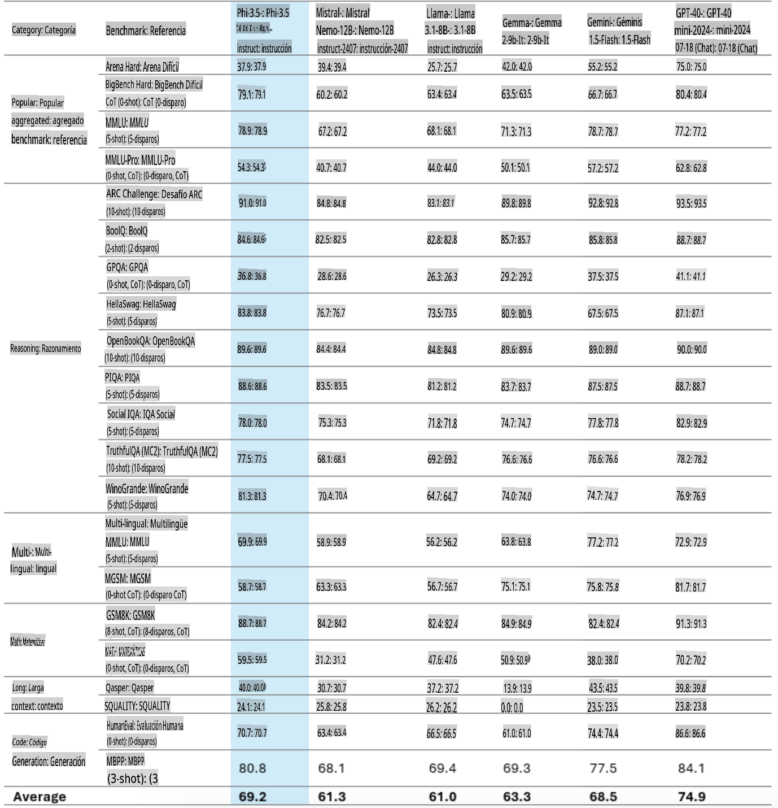
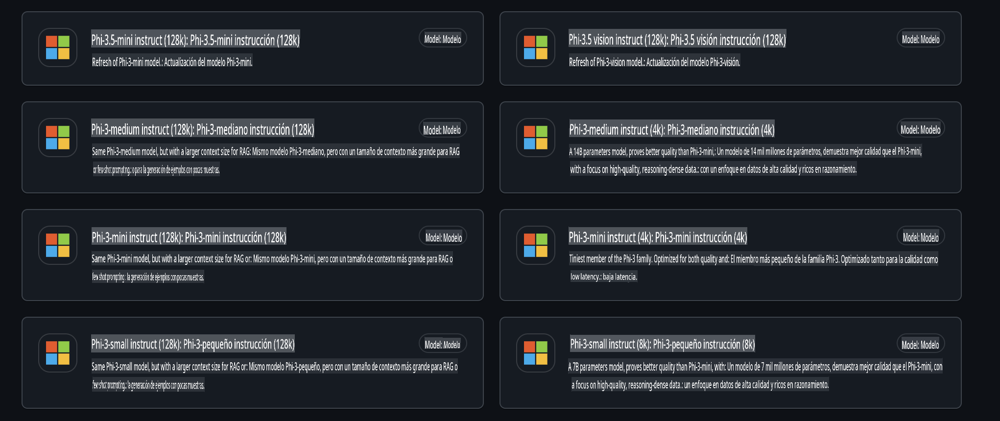
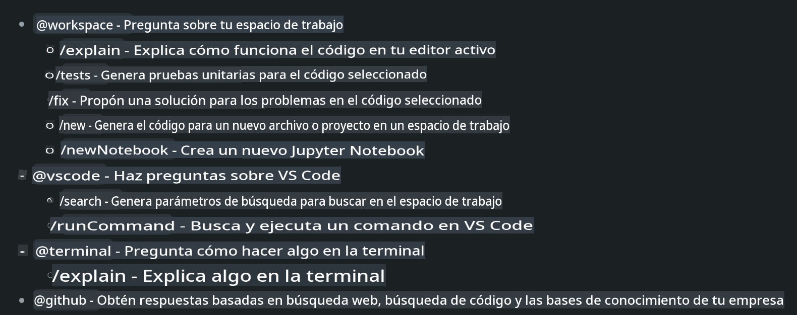
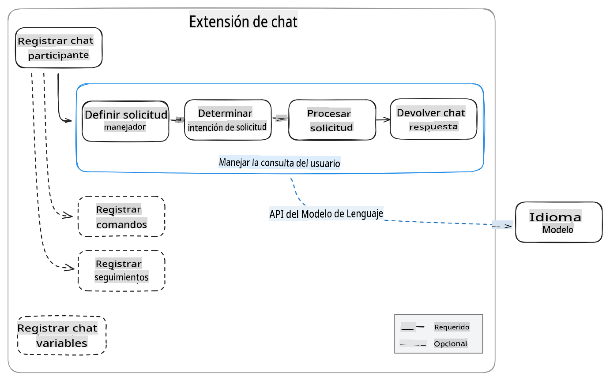
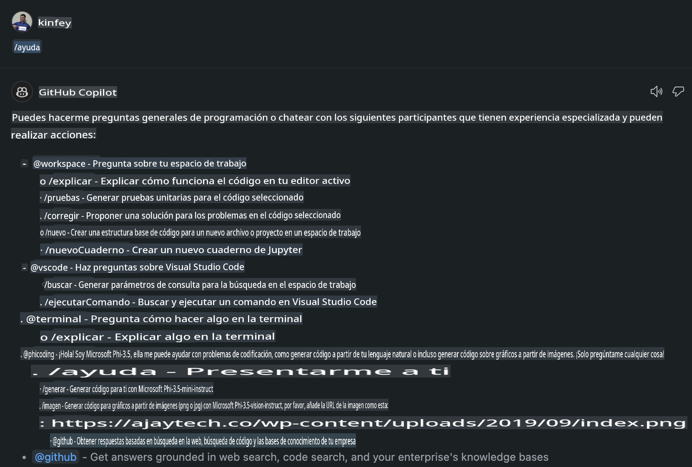
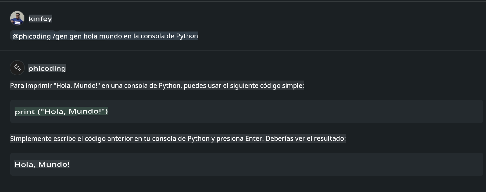
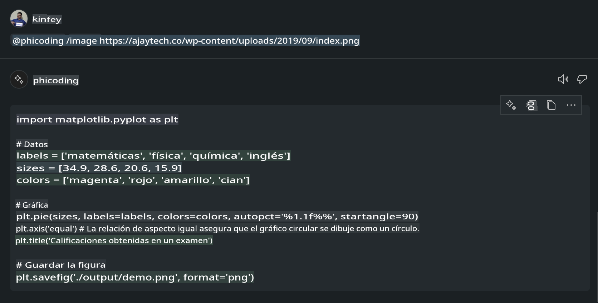

# **Crea tu propio agente Chat Copilot de Visual Studio Code con Phi-3.5 de GitHub Models**

¿Estás usando Visual Studio Code Copilot? Especialmente en Chat, puedes utilizar diferentes agentes para mejorar la capacidad de crear, escribir y mantener proyectos en Visual Studio Code. Visual Studio Code proporciona una API que permite a empresas e individuos crear diferentes agentes basados en sus necesidades para expandir sus capacidades en diversos campos específicos. En este artículo, nos enfocaremos en **Phi-3.5-mini-instruct (128k)** y **Phi-3.5-vision-instruct (128k)** de GitHub Models para crear tu propio agente de Visual Studio Code.

## **Acerca de Phi-3.5 en GitHub Models**

Sabemos que Phi-3/3.5-mini-instruct en la familia Phi-3/3.5 tiene fuertes capacidades de comprensión y generación de código, y tiene ventajas sobre Gemma-2-9b y Mistral-Nemo-12B-instruct-2407.



Los últimos GitHub Models ya proporcionan acceso a los modelos Phi-3.5-mini-instruct (128k) y Phi-3.5-vision-instruct (128k). Los desarrolladores pueden acceder a ellos a través del OpenAI SDK, Azure AI Inference SDK y REST API.



***Nota:*** Se recomienda usar Azure AI Inference SDK aquí, ya que permite una mejor integración con el Azure Model Catalog en un entorno de producción.

A continuación, se presentan los resultados de **Phi-3.5-mini-instruct (128k)** y **Phi-3.5-vision-instruct (128k)** en escenarios de generación de código después de conectarse con GitHub Models, lo que también sirve como preparación para los siguientes ejemplos.

**Demo: GitHub Models Phi-3.5-mini-instruct (128k) genera código a partir de un Prompt** ([haz clic en este enlace](../../../../../../code/09.UpdateSamples/Aug/ghmodel_phi35_instruct_demo.ipynb))

**Demo: GitHub Models Phi-3.5-vision-instruct (128k) genera código a partir de una imagen** ([haz clic en este enlace](../../../../../../code/09.UpdateSamples/Aug/ghmodel_phi35_vision_demo.ipynb))


## **Acerca del agente Chat Copilot de GitHub**

El agente Chat Copilot de GitHub puede completar diferentes tareas en diversos escenarios de proyectos basándose en el código. El sistema cuenta con cuatro agentes: workspace, github, terminal, vscode.



Agregando el nombre del agente con '@', puedes completar rápidamente el trabajo correspondiente. Para las empresas, si añades contenido relacionado con tu negocio, como requisitos, codificación, especificaciones de prueba y lanzamiento, puedes tener funciones privadas empresariales más potentes basadas en GitHub Copilot.

El agente Chat de Visual Studio Code ya ha lanzado oficialmente su API, permitiendo a empresas o desarrolladores empresariales crear agentes basados en diferentes ecosistemas de software. Basado en el método de desarrollo de extensiones de Visual Studio Code, puedes acceder fácilmente a la interfaz de la API del agente Chat de Visual Studio Code. Podemos desarrollar siguiendo este proceso:



El escenario de desarrollo puede soportar el acceso a APIs de modelos de terceros (como GitHub Models, Azure Model Catalog y servicios autogestionados basados en modelos de código abierto) y también puede utilizar los modelos gpt-35-turbo, gpt-4 y gpt-4o proporcionados por GitHub Copilot.

## **Añadir un agente @phicoding basado en Phi-3.5**

Intentamos integrar las capacidades de programación de Phi-3.5 para completar tareas como escritura de código y generación de código a partir de imágenes. Creamos un agente basado en Phi-3.5 - @PHI. A continuación, se presentan algunas de sus funciones:

1. Generar una auto-presentación utilizando GPT-4o proporcionado por GitHub Copilot mediante el comando **@phicoding /help**.

2. Generar código en diferentes lenguajes de programación utilizando **Phi-3.5-mini-instruct (128k)** mediante el comando **@phicoding /gen**.

3. Generar código basado en **Phi-3.5-vision-instruct (128k)** y completar imágenes mediante el comando **@phicoding /image**.


## **Pasos relacionados**

1. Instala el soporte para desarrollo de extensiones de Visual Studio Code usando npm.

```bash

npm install --global yo generator-code 

```
2. Crea un plugin de extensión para Visual Studio Code (usando el modo de desarrollo con Typescript, llamado phiext).

```bash

yo code 

```

3. Abre el proyecto creado y modifica package.json. Aquí se incluyen las instrucciones y configuraciones relacionadas, así como la configuración de GitHub Models. Nota: necesitas añadir tu token de GitHub Models aquí.

```json

{
  "name": "phiext",
  "displayName": "phiext",
  "description": "",
  "version": "0.0.1",
  "engines": {
    "vscode": "^1.93.0"
  },
  "categories": [
    "AI",
    "Chat"
  ],
  "activationEvents": [],
  "enabledApiProposals": [
      "chatVariableResolver"
  ],
  "main": "./dist/extension.js",
  "contributes": {
    "chatParticipants": [
        {
            "id": "chat.phicoding",
            "name": "phicoding",
            "description": "Hey! I am Microsoft Phi-3.5, She can help me with coding problems, such as generation code with your natural language, or even generation code about chart from images. Just ask me anything!",
            "isSticky": true,
            "commands": [
                {
                    "name": "help",
                    "description": "Introduce myself to you"
                },
                {
                    "name": "gen",
                    "description": "Generate code for you with Microsoft Phi-3.5-mini-instruct"
                },
                {
                    "name": "image",
                    "description": "Generate code for chart from image(png or jpg) with Microsoft Phi-3.5-vision-instruct, please add image url like this : https://ajaytech.co/wp-content/uploads/2019/09/index.png"
                }
            ]
        }
    ],
    "commands": [
        {
            "command": "phicoding.namesInEditor",
            "title": "Use Microsoft Phi 3.5 in Editor"
        }
    ],
    "configuration": {
      "type": "object",
      "title": "githubmodels",
      "properties": {
        "githubmodels.endpoint": {
          "type": "string",
          "default": "https://models.inference.ai.azure.com",
          "description": "Your GitHub Models Endpoint",
          "order": 0
        },
        "githubmodels.api_key": {
          "type": "string",
          "default": "Your GitHub Models Token",
          "description": "Your GitHub Models Token",
          "order": 1
        },
        "githubmodels.phi35instruct": {
          "type": "string",
          "default": "Phi-3.5-mini-instruct",
          "description": "Your Phi-35-Instruct Model",
          "order": 2
        },
        "githubmodels.phi35vision": {
          "type": "string",
          "default": "Phi-3.5-vision-instruct",
          "description": "Your Phi-35-Vision Model",
          "order": 3
        }
      }
    }
  },
  "scripts": {
    "vscode:prepublish": "npm run package",
    "compile": "webpack",
    "watch": "webpack --watch",
    "package": "webpack --mode production --devtool hidden-source-map",
    "compile-tests": "tsc -p . --outDir out",
    "watch-tests": "tsc -p . -w --outDir out",
    "pretest": "npm run compile-tests && npm run compile && npm run lint",
    "lint": "eslint src",
    "test": "vscode-test"
  },
  "devDependencies": {
    "@types/vscode": "^1.93.0",
    "@types/mocha": "^10.0.7",
    "@types/node": "20.x",
    "@typescript-eslint/eslint-plugin": "^8.3.0",
    "@typescript-eslint/parser": "^8.3.0",
    "eslint": "^9.9.1",
    "typescript": "^5.5.4",
    "ts-loader": "^9.5.1",
    "webpack": "^5.94.0",
    "webpack-cli": "^5.1.4",
    "@vscode/test-cli": "^0.0.10",
    "@vscode/test-electron": "^2.4.1"
  },
  "dependencies": {
    "@types/node-fetch": "^2.6.11",
    "node-fetch": "^3.3.2",
    "@azure-rest/ai-inference": "latest",
    "@azure/core-auth": "latest",
    "@azure/core-sse": "latest"
  }
}


```

4. Modifica src/extension.ts.

```typescript

// The module 'vscode' contains the VS Code extensibility API
// Import the module and reference it with the alias vscode in your code below
import * as vscode from 'vscode';
import ModelClient from "@azure-rest/ai-inference";
import { AzureKeyCredential } from "@azure/core-auth";


interface IPhiChatResult extends vscode.ChatResult {
    metadata: {
        command: string;
    };
}


const MODEL_SELECTOR: vscode.LanguageModelChatSelector = { vendor: 'copilot', family: 'gpt-4o' };

function isValidImageUrl(url: string): boolean {
    const regex = /^(https?:\/\/.*\.(?:png|jpg))$/i;
    return regex.test(url);
}
  

// This method is called when your extension is activated
// Your extension is activated the very first time the command is executed
export function activate(context: vscode.ExtensionContext) {

    const codinghandler: vscode.ChatRequestHandler = async (request: vscode.ChatRequest, context: vscode.ChatContext, stream: vscode.ChatResponseStream, token: vscode.CancellationToken): Promise<IPhiChatResult> => {


        const config : any = vscode.workspace.getConfiguration('githubmodels');
        const endPoint: string = config.get('endpoint');
        const apiKey: string = config.get('api_key');
        const phi35instruct: string = config.get('phi35instruct');
        const phi35vision: string = config.get('phi35vision');
        
        if (request.command === 'help') {

            const content = "Welcome to Coding assistant with Microsoft Phi-3.5"; 
            stream.progress(content);


            try {
                const [model] = await vscode.lm.selectChatModels(MODEL_SELECTOR);
                if (model) {
                    const messages = [
                        vscode.LanguageModelChatMessage.User("Please help me express this content in a humorous way: I am a programming assistant who can help you convert natural language into code and generate code based on the charts in the images. output format like this : Hey I am Phi ......")
                    ];
                    const chatResponse = await model.sendRequest(messages, {}, token);
                    for await (const fragment of chatResponse.text) {
                        stream.markdown(fragment);
                    }
                }
            } catch(err) {
                console.log(err);
            }


            return { metadata: { command: 'help' } };

        }

        
        if (request.command === 'gen') {

            const content = "Welcome to use phi-3.5 to generate code";

            stream.progress(content);

            const client = new ModelClient(endPoint, new AzureKeyCredential(apiKey));

            const response = await client.path("/chat/completions").post({
              body: {
                messages: [
                  { role:"system", content: "You are a coding assistant.Help answer all code generation questions." },
                  { role:"user", content: request.prompt }
                ],
                model: phi35instruct,
                temperature: 0.4,
                max_tokens: 1000,
                top_p: 1.
              }
            });

            stream.markdown(response.body.choices[0].message.content);

            return { metadata: { command: 'gen' } };

        }


        
        if (request.command === 'image') {


            const content = "Welcome to use phi-3.5 to generate code from image(png or jpg),image url like this:https://ajaytech.co/wp-content/uploads/2019/09/index.png";

            stream.progress(content);

            if (!isValidImageUrl(request.prompt)) {
                stream.markdown('Please provide a valid image URL');
                return { metadata: { command: 'image' } };
            }
            else
            {

                const client = new ModelClient(endPoint, new AzureKeyCredential(apiKey));
    
                const response = await client.path("/chat/completions").post({
                    body: {
                      messages: [
                        { role: "system", content: "You are a helpful assistant that describes images in details." },
                        { role: "user", content: [
                            { type: "text", text: "Please generate code according to the chart in the picture according to the following requirements\n1. Keep all information in the chart, including data and text\n2. Do not generate additional information that is not included in the chart\n3. Please extract data from the picture, do not generate it from csv\n4. Please save the regenerated chart as a chart and save it to ./output/demo.png"},
                            { type: "image_url", image_url: {url: request.prompt}
                            }
                          ]
                        }
                      ],
                      model: phi35vision,
                      temperature: 0.4,
                      max_tokens: 2048,
                      top_p: 1.
                    }
                  });
    
                
                stream.markdown(response.body.choices[0].message.content);
    
                return { metadata: { command: 'image' } };
            }


        }


        return { metadata: { command: '' } };
    };


    const phi_ext = vscode.chat.createChatParticipant("chat.phicoding", codinghandler);

    phi_ext.iconPath = new vscode.ThemeIcon('sparkle');


    phi_ext.followupProvider = {
        provideFollowups(result: IPhiChatResult, context: vscode.ChatContext, token: vscode.CancellationToken) {
            return [{
                prompt: 'Let us coding with Phi-3.5 😋😋😋😋',
                label: vscode.l10n.t('Enjoy coding with Phi-3.5'),
                command: 'help'
            } satisfies vscode.ChatFollowup];
        }
    };

    context.subscriptions.push(phi_ext);
}

// This method is called when your extension is deactivated
export function deactivate() {}


```

6. Ejecución.

***/help***



***@phicoding /help***


***@phicoding /gen***



***@phicoding /image***



Puedes descargar el código de ejemplo: [haz clic aquí](../../../../../../code/09.UpdateSamples/Aug/vscode)

## **Recursos**

1. Regístrate en GitHub Models [https://gh.io/models](https://gh.io/models)

2. Aprende sobre el desarrollo de extensiones para Visual Studio Code [https://code.visualstudio.com/api/get-started/your-first-extension](https://code.visualstudio.com/api/get-started/your-first-extension)

3. Aprende sobre la API de Chat de Visual Studio Code Copilot [https://code.visualstudio.com/api/extension-guides/chat](https://code.visualstudio.com/api/extension-guides/chat)

**Descargo de responsabilidad**:  
Este documento ha sido traducido utilizando servicios de traducción automática basados en inteligencia artificial. Si bien nos esforzamos por lograr precisión, tenga en cuenta que las traducciones automatizadas pueden contener errores o imprecisiones. El documento original en su idioma nativo debe considerarse la fuente autorizada. Para información crítica, se recomienda una traducción profesional realizada por humanos. No nos hacemos responsables de malentendidos o interpretaciones erróneas que surjan del uso de esta traducción.