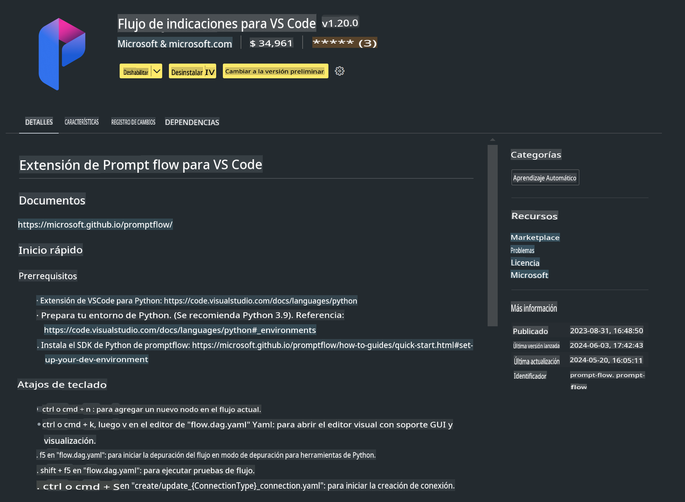

# **Lab 0 - Instalación**

Cuando ingresamos al laboratorio, necesitamos configurar el entorno correspondiente:

### **1. Python 3.11+**

Se recomienda usar miniforge para configurar tu entorno de Python.

Para configurar miniforge, consulta [https://github.com/conda-forge/miniforge](https://github.com/conda-forge/miniforge)

Después de configurar miniforge, ejecuta el siguiente comando en Power Shell:

```bash

conda create -n pyenv python==3.11.8 -y

conda activate pyenv

```

### **2. Instalar Prompt flow SDK**

En el Lab 1 utilizamos Prompt flow, por lo que necesitas configurar el Prompt flow SDK.

```bash

pip install promptflow --upgrade

```

Puedes verificar el SDK de promptflow con este comando:

```bash

pf --version

```

### **3. Instalar la Extensión de Visual Studio Code para Prompt flow**



### **4. Framework MLX de Apple**

MLX es un framework de arrays para la investigación en aprendizaje automático en Apple silicon, desarrollado por el equipo de investigación de aprendizaje automático de Apple. Puedes usar el **framework Apple MLX** para acelerar LLM / SLM con Apple Silicon. Si deseas más información, puedes leer [https://github.com/microsoft/PhiCookBook/blob/main/md/01.Introduction/03/MLX_Inference.md](https://github.com/microsoft/PhiCookBook/blob/main/md/01.Introduction/03/MLX_Inference.md).

Instala la biblioteca del framework MLX en bash:

```bash

pip install mlx-lm

```

### **5. Otras bibliotecas de Python**

Crea un archivo requirements.txt y añade este contenido:

```txt

notebook
numpy 
scipy 
scikit-learn 
matplotlib 
pandas 
pillow 
graphviz

```

### **6. Instalar NVM**

Instala nvm en Powershell:

```bash

brew install nvm

```

Instala nodejs 18.20:

```bash

nvm install 18.20.0

nvm use 18.20.0

```

### **7. Instalar Soporte de Desarrollo para Visual Studio Code**

```bash

npm install --global yo generator-code

```

¡Felicidades! Has configurado exitosamente el SDK. Ahora, procede a los pasos prácticos.

**Descargo de responsabilidad**:  
Este documento ha sido traducido utilizando servicios de traducción automática basados en inteligencia artificial. Si bien nos esforzamos por garantizar la precisión, tenga en cuenta que las traducciones automatizadas pueden contener errores o imprecisiones. El documento original en su idioma nativo debe considerarse como la fuente autorizada. Para información crítica, se recomienda una traducción profesional realizada por humanos. No nos hacemos responsables de malentendidos o interpretaciones erróneas que puedan surgir del uso de esta traducción.