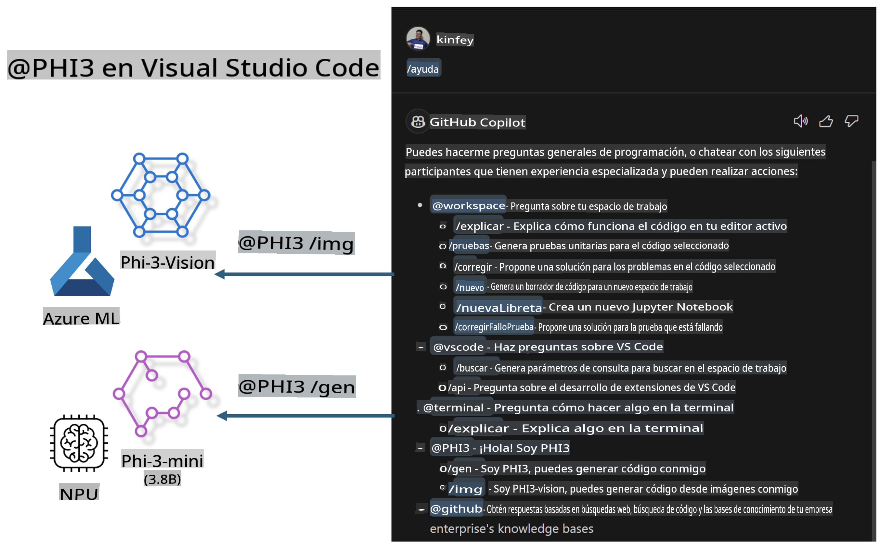

# **Crea tu propio Chat de GitHub Copilot en Visual Studio Code con Microsoft Phi-3 Family**

¿Has utilizado el agente de espacio de trabajo en GitHub Copilot Chat? ¿Quieres construir el agente de código para tu equipo? Este laboratorio práctico busca combinar el modelo de código abierto para crear un agente empresarial de código.

## **Fundamentos**

### **Por qué elegir Microsoft Phi-3**

Phi-3 es una familia de modelos que incluye phi-3-mini, phi-3-small y phi-3-medium, basados en diferentes parámetros de entrenamiento para generación de texto, finalización de diálogos y generación de código. También está phi-3-vision, basado en visión. Es adecuado para que empresas o equipos creen soluciones de IA generativa sin conexión.

Recomendado leer este enlace [https://github.com/microsoft/PhiCookBook/blob/main/md/01.Introduction/01/01.PhiFamily.md](https://github.com/microsoft/PhiCookBook/blob/main/md/01.Introduction/01/01.PhiFamily.md)

### **Microsoft GitHub Copilot Chat**

La extensión GitHub Copilot Chat te proporciona una interfaz de chat que te permite interactuar con GitHub Copilot y recibir respuestas a preguntas relacionadas con la programación directamente en VS Code, sin necesidad de navegar por documentación o buscar en foros en línea.

Copilot Chat puede utilizar resaltado de sintaxis, indentación y otras características de formato para dar claridad a las respuestas generadas. Dependiendo del tipo de pregunta del usuario, el resultado puede incluir enlaces al contexto que Copilot utilizó para generar la respuesta, como archivos de código fuente o documentación, o botones para acceder a funcionalidades de VS Code.

- Copilot Chat se integra en tu flujo de desarrollo y te brinda asistencia donde la necesitas:

- Inicia una conversación de chat en línea directamente desde el editor o la terminal para obtener ayuda mientras programas.

- Usa la vista de Chat para tener un asistente de IA a tu lado en cualquier momento.

- Lanza Quick Chat para hacer una pregunta rápida y volver a lo que estabas haciendo.

Puedes usar GitHub Copilot Chat en diversos escenarios, tales como:

- Responder preguntas de programación sobre cómo resolver un problema de la mejor manera.

- Explicar el código de otra persona y sugerir mejoras.

- Proponer correcciones de código.

- Generar casos de prueba unitarios.

- Generar documentación de código.

Recomendado leer este enlace [https://code.visualstudio.com/docs/copilot/copilot-chat](https://code.visualstudio.com/docs/copilot/copilot-chat?WT.mc_id=aiml-137032-kinfeylo)

### **Microsoft GitHub Copilot Chat @workspace**

Referenciar **@workspace** en Copilot Chat te permite hacer preguntas sobre toda tu base de código. Según la pregunta, Copilot recupera inteligentemente archivos y símbolos relevantes, que luego referencia en su respuesta como enlaces y ejemplos de código.

Para responder a tu pregunta, **@workspace** busca en las mismas fuentes que un desarrollador usaría al navegar por una base de código en VS Code:

- Todos los archivos en el espacio de trabajo, excepto aquellos ignorados por un archivo .gitignore.

- La estructura del directorio con carpetas anidadas y nombres de archivos.

- El índice de búsqueda de código de GitHub, si el espacio de trabajo es un repositorio de GitHub e indexado por búsqueda de código.

- Símbolos y definiciones en el espacio de trabajo.

- Texto seleccionado actualmente o texto visible en el editor activo.

Nota: .gitignore se omite si tienes un archivo abierto o texto seleccionado dentro de un archivo ignorado.

Recomendado leer este enlace [[https://code.visualstudio.com/docs/copilot/copilot-chat](https://code.visualstudio.com/docs/copilot/workspace-context?WT.mc_id=aiml-137032-kinfeylo)]

## **Conoce más sobre este laboratorio**

GitHub Copilot ha mejorado enormemente la eficiencia en la programación de las empresas, y cada empresa desea personalizar las funciones relevantes de GitHub Copilot. Muchas empresas han personalizado extensiones similares a GitHub Copilot basándose en sus propios escenarios empresariales y modelos de código abierto. Para las empresas, las extensiones personalizadas son más fáciles de controlar, pero esto también afecta la experiencia del usuario. Después de todo, GitHub Copilot tiene funciones más sólidas para manejar escenarios generales y profesionales. Si la experiencia puede mantenerse consistente, sería mejor personalizar la propia extensión de la empresa. GitHub Copilot Chat proporciona APIs relevantes para que las empresas amplíen la experiencia de Chat. Mantener una experiencia consistente y tener funciones personalizadas ofrece una mejor experiencia de usuario.

Este laboratorio utiliza principalmente el modelo Phi-3 combinado con el NPU local y Azure híbrido para construir un agente personalizado en GitHub Copilot Chat ***@PHI3*** que ayude a los desarrolladores empresariales a completar la generación de código ***(@PHI3 /gen)*** y generar código basado en imágenes ***(@PHI3 /img)***.

### ***Nota:*** 

Este laboratorio se implementa actualmente en el AIPC de CPU Intel y Apple Silicon. Seguiremos actualizando la versión de NPU de Qualcomm.

## **Laboratorio**

| Nombre | Descripción | AIPC | Apple |
| ------------ | ----------- | -------- |-------- |
| Lab0 - Instalaciones(✅) | Configura e instala entornos y herramientas relacionadas | [Ir](./HOL/AIPC/01.Installations.md) |[Ir](./HOL/Apple/01.Installations.md) |
| Lab1 - Ejecuta Prompt flow con Phi-3-mini (✅) | Combinado con AIPC / Apple Silicon, utiliza el NPU local para crear generación de código a través de Phi-3-mini | [Ir](./HOL/AIPC/02.PromptflowWithNPU.md) |  [Ir](./HOL/Apple/02.PromptflowWithMLX.md) |
| Lab2 - Despliega Phi-3-vision en Azure Machine Learning Service(✅) | Genera código desplegando Phi-3-vision en el Catálogo de Modelos de Azure Machine Learning Service | [Ir](./HOL/AIPC/03.DeployPhi3VisionOnAzure.md) |[Ir](./HOL/Apple/03.DeployPhi3VisionOnAzure.md) |
| Lab3 - Crea un agente @phi-3 en GitHub Copilot Chat(✅)  | Crea un agente personalizado Phi-3 en GitHub Copilot Chat para completar generación de código, generación de gráficos, RAG, etc. | [Ir](./HOL/AIPC/04.CreatePhi3AgentInVSCode.md) | [Ir](./HOL/Apple/04.CreatePhi3AgentInVSCode.md) |
| Código de Ejemplo (✅)  | Descarga código de ejemplo | [Ir](../../../../../../../code/07.Lab/01/AIPC) | [Ir](../../../../../../../code/07.Lab/01/Apple) |

## **Recursos**

1. Phi-3 Cookbook [https://github.com/microsoft/Phi-3CookBook](https://github.com/microsoft/Phi-3CookBook)

2. Aprende más sobre GitHub Copilot [https://learn.microsoft.com/training/paths/copilot/](https://learn.microsoft.com/training/paths/copilot/?WT.mc_id=aiml-137032-kinfeylo)

3. Aprende más sobre GitHub Copilot Chat [https://learn.microsoft.com/training/paths/accelerate-app-development-using-github-copilot/](https://learn.microsoft.com/training/paths/accelerate-app-development-using-github-copilot/?WT.mc_id=aiml-137032-kinfeylo)

4. Aprende más sobre la API de GitHub Copilot Chat [https://code.visualstudio.com/api/extension-guides/chat](https://code.visualstudio.com/api/extension-guides/chat?WT.mc_id=aiml-137032-kinfeylo)

5. Aprende más sobre Azure AI Foundry [https://learn.microsoft.com/training/paths/create-custom-copilots-ai-studio/](https://learn.microsoft.com/training/paths/create-custom-copilots-ai-studio/?WT.mc_id=aiml-137032-kinfeylo)

6. Aprende más sobre el Catálogo de Modelos de Azure AI Foundry [https://learn.microsoft.com/azure/ai-studio/how-to/model-catalog-overview](https://learn.microsoft.com/azure/ai-studio/how-to/model-catalog-overview)

**Descargo de responsabilidad**:  
Este documento ha sido traducido utilizando servicios de traducción automática basados en inteligencia artificial. Si bien nos esforzamos por lograr precisión, tenga en cuenta que las traducciones automáticas pueden contener errores o imprecisiones. El documento original en su idioma nativo debe considerarse como la fuente autorizada. Para información crítica, se recomienda una traducción profesional realizada por humanos. No nos hacemos responsables de malentendidos o interpretaciones erróneas que surjan del uso de esta traducción.