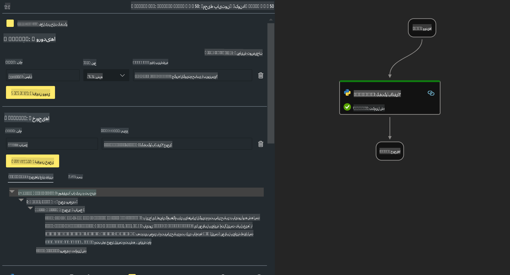

# **آزمایش ۲ - اجرای Prompt flow با Phi-3-mini در AIPC**

## **Prompt flow چیست؟**

Prompt flow مجموعه‌ای از ابزارهای توسعه است که برای ساده‌سازی چرخه کامل توسعه برنامه‌های هوش مصنوعی مبتنی بر مدل‌های زبانی بزرگ (LLM) طراحی شده است؛ از ایده‌پردازی، نمونه‌سازی، تست، ارزیابی تا استقرار در تولید و نظارت. این ابزار مهندسی پرسش‌ها را بسیار آسان‌تر می‌کند و به شما امکان می‌دهد برنامه‌های LLM با کیفیت تولید بسازید.

با استفاده از Prompt flow می‌توانید:

- جریان‌هایی ایجاد کنید که LLMها، پرسش‌ها، کدهای Python و ابزارهای دیگر را در یک جریان کاری اجرایی به هم متصل کند.

- جریان‌های خود را دیباگ و تکرار کنید، به‌ویژه تعامل با LLMها را با سهولت بیشتری مدیریت کنید.

- جریان‌های خود را ارزیابی کنید، معیارهای کیفیت و عملکرد را با استفاده از مجموعه داده‌های بزرگ‌تر محاسبه کنید.

- تست و ارزیابی را در سیستم CI/CD خود ادغام کنید تا از کیفیت جریان‌های خود اطمینان حاصل کنید.

- جریان‌های خود را به پلتفرم سرویس‌دهی دلخواه خود مستقر کنید یا به‌راحتی در پایگاه کد برنامه خود ادغام کنید.

- (اختیاری اما به‌شدت توصیه می‌شود) با استفاده از نسخه ابری Prompt flow در Azure AI با تیم خود همکاری کنید.

## **AIPC چیست؟**

یک کامپیوتر هوش مصنوعی (AI PC) دارای CPU، GPU و NPU است که هرکدام قابلیت‌های خاصی برای تسریع وظایف هوش مصنوعی دارند. NPU یا واحد پردازش عصبی، یک شتاب‌دهنده تخصصی است که وظایف هوش مصنوعی (AI) و یادگیری ماشین (ML) را مستقیماً روی کامپیوتر شما اجرا می‌کند، به‌جای ارسال داده‌ها به ابر برای پردازش. اگرچه GPU و CPU نیز می‌توانند این وظایف را انجام دهند، NPU به‌طور ویژه برای محاسبات کم‌مصرف هوش مصنوعی مناسب است. کامپیوتر هوش مصنوعی نمایانگر یک تغییر اساسی در نحوه عملکرد کامپیوترهای ما است. این راه‌حلی برای مشکلی که قبلاً وجود نداشت نیست، بلکه نویدبخش بهبود بزرگی برای استفاده‌های روزمره از کامپیوتر است.

چگونه کار می‌کند؟ در مقایسه با هوش مصنوعی تولیدی و مدل‌های زبانی بزرگ (LLMs) که بر اساس حجم زیادی از داده‌های عمومی آموزش دیده‌اند، هوش مصنوعی که روی کامپیوتر شما اجرا می‌شود در هر سطحی در دسترس‌تر است. این مفهوم ساده‌تر قابل درک است و چون بر اساس داده‌های شما آموزش دیده است و نیازی به دسترسی به ابر ندارد، مزایای آن برای طیف وسیع‌تری از کاربران جذاب‌تر است.

در کوتاه‌مدت، دنیای کامپیوترهای هوش مصنوعی شامل دستیارهای شخصی و مدل‌های کوچک‌تر هوش مصنوعی است که مستقیماً روی کامپیوتر شما اجرا می‌شوند و از داده‌های شما برای ارائه بهبودهای شخصی، خصوصی و امن‌تر در فعالیت‌های روزمره‌تان استفاده می‌کنند – مانند نوشتن صورت‌جلسه‌های جلسات، سازمان‌دهی لیگ فوتبال فانتزی، خودکارسازی بهبودهای ویرایش عکس و ویدیو، یا برنامه‌ریزی یک برنامه سفر ایده‌آل برای یک گردهمایی خانوادگی بر اساس زمان‌های ورود و خروج همه افراد.

## **ساخت جریان‌های کد تولیدی در AIPC**

***توجه***: اگر نصب محیط را تکمیل نکرده‌اید، لطفاً به [آزمایش ۰ - نصب‌ها](./01.Installations.md) مراجعه کنید.

1. افزونه Prompt flow را در Visual Studio Code باز کرده و یک پروژه جریان خالی ایجاد کنید.


2. پارامترهای ورودی و خروجی اضافه کرده و کد Python را به‌عنوان یک جریان جدید اضافه کنید.



می‌توانید از این ساختار (flow.dag.yaml) برای ساخت جریان خود استفاده کنید:

```yaml

inputs:
  question:
    type: string
    default: how to write Bubble Algorithm
outputs:
  answer:
    type: string
    reference: ${Chat_With_Phi3.output}
nodes:
- name: Chat_With_Phi3
  type: python
  source:
    type: code
    path: Chat_With_Phi3.py
  inputs:
    question: ${inputs.question}


```

3. کد را در فایل ***Chat_With_Phi3.py*** اضافه کنید.

```python


from promptflow.core import tool

# import torch
from transformers import AutoTokenizer, pipeline,TextStreamer
import intel_npu_acceleration_library as npu_lib

import warnings

import asyncio
import platform

class Phi3CodeAgent:
    
    model = None
    tokenizer = None
    text_streamer = None
    
    model_id = "microsoft/Phi-3-mini-4k-instruct"

    @staticmethod
    def init_phi3():
        
        if Phi3CodeAgent.model is None or Phi3CodeAgent.tokenizer is None or Phi3CodeAgent.text_streamer is None:
            Phi3CodeAgent.model = npu_lib.NPUModelForCausalLM.from_pretrained(
                                    Phi3CodeAgent.model_id,
                                    torch_dtype="auto",
                                    dtype=npu_lib.int4,
                                    trust_remote_code=True
                                )
            Phi3CodeAgent.tokenizer = AutoTokenizer.from_pretrained(Phi3CodeAgent.model_id)
            Phi3CodeAgent.text_streamer = TextStreamer(Phi3CodeAgent.tokenizer, skip_prompt=True)

    

    @staticmethod
    def chat_with_phi3(prompt):
        
        Phi3CodeAgent.init_phi3()

        messages = "<|system|>You are a AI Python coding assistant. Please help me to generate code in Python.The answer only genertated Python code, but any comments and instructions do not need to be generated<|end|><|user|>" + prompt +"<|end|><|assistant|>"


        generation_args = {
            "max_new_tokens": 1024,
            "return_full_text": False,
            "temperature": 0.3,
            "do_sample": False,
            "streamer": Phi3CodeAgent.text_streamer,
        }

        pipe = pipeline(
            "text-generation",
            model=Phi3CodeAgent.model,
            tokenizer=Phi3CodeAgent.tokenizer,
            # **generation_args
        )

        result = ''

        with warnings.catch_warnings():
            warnings.simplefilter("ignore")
            response = pipe(messages, **generation_args)
            result =response[0]['generated_text']
            return result


@tool
def my_python_tool(question: str) -> str:
    if platform.system() == 'Windows':
        asyncio.set_event_loop_policy(asyncio.WindowsSelectorEventLoopPolicy())
    return Phi3CodeAgent.chat_with_phi3(question)


```

4. می‌توانید جریان را از طریق Debug یا Run آزمایش کنید تا بررسی کنید آیا کد تولیدی درست کار می‌کند یا خیر.


5. جریان را به‌عنوان API توسعه‌ای در ترمینال اجرا کنید.

```

pf flow serve --source ./ --port 8080 --host localhost   

```

می‌توانید آن را در Postman یا Thunder Client آزمایش کنید.

### **توجه**

1. اجرای اولیه زمان زیادی می‌برد. پیشنهاد می‌شود مدل phi-3 را از طریق Hugging Face CLI دانلود کنید.

2. با توجه به محدودیت قدرت محاسباتی Intel NPU، توصیه می‌شود از Phi-3-mini-4k-instruct استفاده کنید.

3. ما از شتاب‌دهی Intel NPU برای تبدیل کوانتایز INT4 استفاده می‌کنیم، اما اگر سرویس را دوباره اجرا کنید، نیاز است که پوشه‌های cache و nc_workshop را حذف کنید.

## **منابع**

1. یادگیری Promptflow [https://microsoft.github.io/promptflow/](https://microsoft.github.io/promptflow/)

2. یادگیری شتاب‌دهی Intel NPU [https://github.com/intel/intel-npu-acceleration-library](https://github.com/intel/intel-npu-acceleration-library)

3. کد نمونه، دانلود [کد نمونه عامل محلی NPU](../../../../../../../../../code/07.Lab/01/AIPC)

**سلب مسئولیت**:  
این سند با استفاده از خدمات ترجمه ماشینی مبتنی بر هوش مصنوعی ترجمه شده است. در حالی که ما برای دقت تلاش می‌کنیم، لطفاً توجه داشته باشید که ترجمه‌های خودکار ممکن است حاوی خطاها یا نواقصی باشند. سند اصلی به زبان اصلی آن باید به عنوان منبع معتبر در نظر گرفته شود. برای اطلاعات حساس، ترجمه حرفه‌ای انسانی توصیه می‌شود. ما هیچ مسئولیتی در قبال سوءتفاهم‌ها یا برداشت‌های نادرست ناشی از استفاده از این ترجمه نداریم.