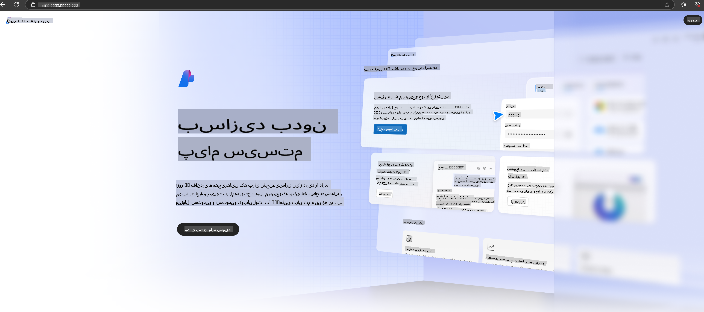

# **استفاده از Phi-3 در Azure AI Foundry**

با توسعه هوش مصنوعی مولد، امیدواریم از یک پلتفرم یکپارچه برای مدیریت مدل‌های زبانی بزرگ (LLM) و مدل‌های زبانی کوچک (SLM)، یکپارچه‌سازی داده‌های سازمانی، عملیات تنظیم دقیق/RAG، و ارزیابی کسب‌وکارهای مختلف سازمانی پس از ادغام LLM و SLM و موارد دیگر استفاده کنیم، تا کاربردهای هوشمند هوش مصنوعی مولد بهتر پیاده‌سازی شوند. [Azure AI Foundry](https://ai.azure.com) یک پلتفرم کاربردی هوش مصنوعی مولد در سطح سازمانی است.

با Azure AI Foundry، می‌توانید پاسخ‌های مدل‌های زبانی بزرگ (LLM) را ارزیابی کرده و اجزای کاربردی اعلان‌ها را با استفاده از جریان اعلان (Prompt Flow) برای عملکرد بهتر هماهنگ کنید. این پلتفرم امکان مقیاس‌پذیری را برای تبدیل نمونه‌های مفهومی به تولید کامل و حرفه‌ای فراهم می‌کند. پایش و بهینه‌سازی مستمر نیز موفقیت بلندمدت را تضمین می‌کند.

ما می‌توانیم مدل Phi-3 را با مراحل ساده‌ای به سرعت در Azure AI Foundry پیاده‌سازی کنیم و سپس از Azure AI Foundry برای انجام کارهای مرتبط با Phi-3 مانند Playground/Chat، تنظیم دقیق، ارزیابی و سایر فعالیت‌های مرتبط استفاده کنیم.

## **1. آماده‌سازی**

اگر [Azure Developer CLI](https://learn.microsoft.com/azure/developer/azure-developer-cli/overview?WT.mc_id=aiml-138114-kinfeylo) را قبلاً روی سیستم خود نصب کرده‌اید، استفاده از این قالب به سادگی اجرای این دستور در یک دایرکتوری جدید است.

## ایجاد دستی

ایجاد یک پروژه و هاب در Microsoft Azure AI Foundry راهی عالی برای سازماندهی و مدیریت کارهای هوش مصنوعی شماست. در اینجا یک راهنمای گام‌به‌گام آورده شده است:

### ایجاد یک پروژه در Azure AI Foundry

1. **به Azure AI Foundry بروید**: وارد پورتال Azure AI Foundry شوید.
2. **ایجاد پروژه**:
   - اگر در یک پروژه هستید، گزینه "Azure AI Foundry" را در بالای سمت چپ صفحه انتخاب کنید تا به صفحه اصلی بروید.
   - گزینه "+ Create project" را انتخاب کنید.
   - یک نام برای پروژه وارد کنید.
   - اگر هاب دارید، به طور پیش‌فرض انتخاب می‌شود. اگر به بیش از یک هاب دسترسی دارید، می‌توانید یکی دیگر را از منوی کشویی انتخاب کنید. اگر می‌خواهید یک هاب جدید ایجاد کنید، گزینه "Create new hub" را انتخاب کرده و یک نام وارد کنید.
   - گزینه "Create" را انتخاب کنید.

### ایجاد یک هاب در Azure AI Foundry

1. **به Azure AI Foundry بروید**: با حساب Azure خود وارد شوید.
2. **ایجاد هاب**:
   - از منوی سمت چپ، مرکز مدیریت (Management center) را انتخاب کنید.
   - گزینه "All resources" را انتخاب کرده، سپس فلش کنار "+ New project" را زده و "+ New hub" را انتخاب کنید.
   - در کادر گفتگوی "Create a new hub"، یک نام برای هاب خود وارد کنید (مثلاً contoso-hub) و سایر فیلدها را به دلخواه تغییر دهید.
   - گزینه "Next" را انتخاب کنید، اطلاعات را مرور کرده و سپس "Create" را بزنید.

برای دستورالعمل‌های دقیق‌تر، می‌توانید به [مستندات رسمی مایکروسافت](https://learn.microsoft.com/azure/ai-studio/how-to/create-projects) مراجعه کنید.

پس از ایجاد موفقیت‌آمیز، می‌توانید به استودیوی ایجاد شده خود از طریق [ai.azure.com](https://ai.azure.com/) دسترسی داشته باشید.

می‌توان چندین پروژه را روی یک AI Foundry ایجاد کرد. یک پروژه در AI Foundry ایجاد کنید تا آماده شوید.

ایجاد [QuickStarts](https://learn.microsoft.com/azure/ai-studio/quickstarts/get-started-code) در Azure AI Foundry

## **2. پیاده‌سازی مدل Phi در Azure AI Foundry**

گزینه Explore پروژه را کلیک کرده، به کاتالوگ مدل بروید و Phi-3 را انتخاب کنید.

مدل Phi-3-mini-4k-instruct را انتخاب کنید.

روی 'Deploy' کلیک کنید تا مدل Phi-3-mini-4k-instruct پیاده‌سازی شود.

> [!NOTE]
>
> هنگام پیاده‌سازی می‌توانید قدرت محاسباتی را انتخاب کنید.

## **3. Playground Chat Phi در Azure AI Foundry**

به صفحه پیاده‌سازی بروید، Playground را انتخاب کنید و با Phi-3 در Azure AI Foundry گفتگو کنید.

## **4. پیاده‌سازی مدل از Azure AI Foundry**

برای پیاده‌سازی یک مدل از کاتالوگ مدل Azure، می‌توانید مراحل زیر را دنبال کنید:

- وارد Azure AI Foundry شوید.
- مدلی را که می‌خواهید پیاده‌سازی کنید از کاتالوگ مدل Azure AI Foundry انتخاب کنید.
- در صفحه جزئیات مدل، گزینه Deploy را انتخاب کرده و سپس Serverless API with Azure AI Content Safety را انتخاب کنید.
- پروژه‌ای را که می‌خواهید مدل‌های خود را در آن پیاده‌سازی کنید انتخاب کنید. برای استفاده از گزینه Serverless API، فضای کاری شما باید متعلق به منطقه East US 2 یا Sweden Central باشد. می‌توانید نام پیاده‌سازی را سفارشی کنید.
- در جادوگر پیاده‌سازی، گزینه Pricing and terms را انتخاب کنید تا درباره قیمت‌گذاری و شرایط استفاده اطلاعات کسب کنید.
- گزینه Deploy را انتخاب کنید. منتظر بمانید تا پیاده‌سازی آماده شود و به صفحه Deployments هدایت شوید.
- گزینه Open in playground را انتخاب کنید تا تعامل با مدل را آغاز کنید.
- می‌توانید به صفحه Deployments بازگردید، پیاده‌سازی را انتخاب کرده و آدرس هدف (Target URL) و کلید مخفی (Secret Key) را مشاهده کنید که می‌توانید از آن‌ها برای فراخوانی پیاده‌سازی و تولید پاسخ‌ها استفاده کنید.
- همیشه می‌توانید جزئیات آدرس، URL، و کلیدهای دسترسی را با رفتن به تب Build و انتخاب Deployments از بخش Components پیدا کنید.

> [!NOTE]
> لطفاً توجه داشته باشید که حساب شما باید مجوزهای نقش توسعه‌دهنده Azure AI را در گروه منابع داشته باشد تا این مراحل را انجام دهید.

## **5. استفاده از API Phi در Azure AI Foundry**

می‌توانید از طریق Postman با ارسال درخواست GET به آدرس https://{Your project name}.region.inference.ml.azure.com/swagger.json و ترکیب آن با کلید، درباره رابط‌های ارائه‌شده اطلاعات کسب کنید.

به راحتی می‌توانید پارامترهای درخواست و همچنین پارامترهای پاسخ را دریافت کنید.

**سلب مسئولیت**:  
این سند با استفاده از خدمات ترجمه ماشینی مبتنی بر هوش مصنوعی ترجمه شده است. در حالی که ما برای دقت تلاش می‌کنیم، لطفاً توجه داشته باشید که ترجمه‌های خودکار ممکن است شامل اشتباهات یا نادقتی‌ها باشد. سند اصلی به زبان اصلی آن باید به عنوان منبع معتبر در نظر گرفته شود. برای اطلاعات حساس، توصیه می‌شود از ترجمه انسانی حرفه‌ای استفاده کنید. ما مسئول هیچ‌گونه سوءتفاهم یا تفسیر نادرست ناشی از استفاده از این ترجمه نیستیم.