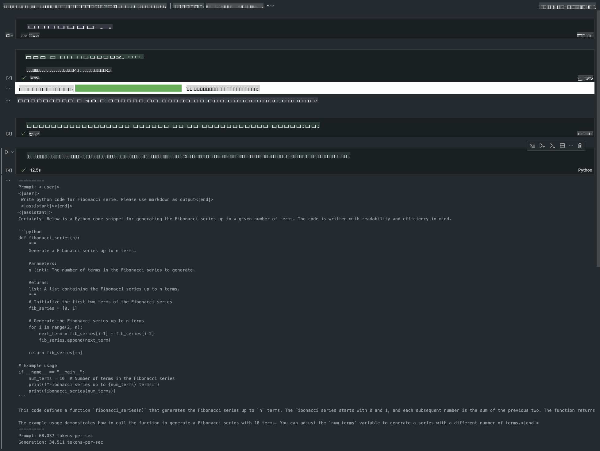

# **استنتاج Phi-3 با استفاده از فریم‌ورک Apple MLX**

## **فریم‌ورک MLX چیست**

MLX یک فریم‌ورک آرایه‌ای برای تحقیقات یادگیری ماشین بر روی تراشه‌های سیلیکونی اپل است که توسط تیم تحقیقات یادگیری ماشین اپل ارائه شده است.

MLX توسط محققان یادگیری ماشین و برای محققان یادگیری ماشین طراحی شده است. این فریم‌ورک به گونه‌ای طراحی شده که کاربرپسند باشد، اما همچنان بتواند مدل‌ها را به صورت کارآمد آموزش داده و اجرا کند. طراحی این فریم‌ورک از نظر مفهومی نیز ساده است. هدف ما این است که محققان بتوانند به راحتی MLX را گسترش داده و بهبود دهند تا ایده‌های جدید را به سرعت بررسی کنند.

مدل‌های زبانی بزرگ (LLMs) می‌توانند از طریق MLX بر روی دستگاه‌های سیلیکونی اپل شتاب بگیرند و مدل‌ها به راحتی به صورت محلی اجرا شوند.

## **استفاده از MLX برای استنتاج Phi-3-mini**

### **1. تنظیم محیط MLX**

1. پایتون نسخه 3.11.x  
2. نصب کتابخانه MLX  

```bash

pip install mlx-lm

```

### **2. اجرای Phi-3-mini در ترمینال با استفاده از MLX**

```bash

python -m mlx_lm.generate --model microsoft/Phi-3-mini-4k-instruct --max-token 2048 --prompt  "<|user|>\nCan you introduce yourself<|end|>\n<|assistant|>"

```

نتیجه (محیط من Apple M1 Max، با 64 گیگابایت رم) به صورت زیر است:


### **3. کوانتایز کردن Phi-3-mini با MLX در ترمینال**

```bash

python -m mlx_lm.convert --hf-path microsoft/Phi-3-mini-4k-instruct

```

***توجه:*** مدل می‌تواند از طریق mlx_lm.convert کوانتایز شود و کوانتایز پیش‌فرض INT4 است. این مثال، Phi-3-mini را به INT4 کوانتایز می‌کند.

مدل می‌تواند از طریق mlx_lm.convert کوانتایز شود و کوانتایز پیش‌فرض INT4 است. این مثال Phi-3-mini را به INT4 کوانتایز می‌کند. پس از کوانتایز شدن، مدل در دایرکتوری پیش‌فرض ./mlx_model ذخیره خواهد شد.

ما می‌توانیم مدل کوانتایز شده با MLX را از طریق ترمینال تست کنیم.

```bash

python -m mlx_lm.generate --model ./mlx_model/ --max-token 2048 --prompt  "<|user|>\nCan you introduce yourself<|end|>\n<|assistant|>"

```

نتیجه به صورت زیر است:


### **4. اجرای Phi-3-mini با MLX در Jupyter Notebook**



***توجه:*** لطفاً این نمونه را بخوانید [روی این لینک کلیک کنید](../../../../../code/03.Inference/MLX/MLX_DEMO.ipynb)

## **منابع**

1. درباره فریم‌ورک Apple MLX بیشتر بدانید [https://ml-explore.github.io](https://ml-explore.github.io/mlx/build/html/index.html)

2. مخزن GitHub مربوط به Apple MLX [https://github.com/ml-explore](https://github.com/ml-explore)

**سلب مسئولیت**:  
این سند با استفاده از خدمات ترجمه ماشینی مبتنی بر هوش مصنوعی ترجمه شده است. در حالی که ما تلاش می‌کنیم دقت را حفظ کنیم، لطفاً توجه داشته باشید که ترجمه‌های خودکار ممکن است حاوی خطاها یا نادرستی‌هایی باشند. سند اصلی به زبان اصلی آن باید به عنوان منبع معتبر در نظر گرفته شود. برای اطلاعات حساس، ترجمه حرفه‌ای انسانی توصیه می‌شود. ما هیچ‌گونه مسئولیتی در قبال سوءتفاهم‌ها یا تفسیرهای نادرست ناشی از استفاده از این ترجمه نداریم.