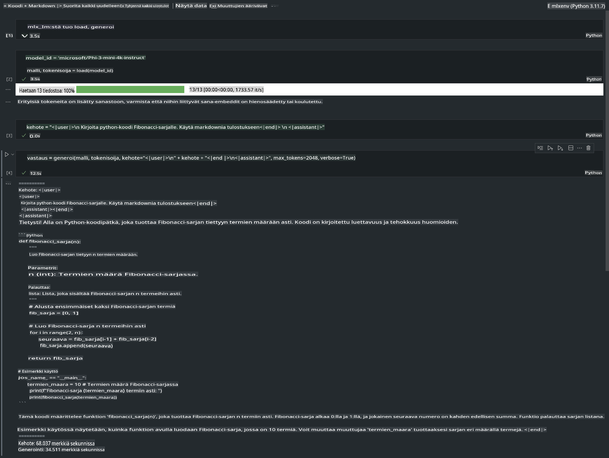

# **Inference Phi-3 Apple MLX -kehyksellä**

## **Mikä on MLX-kehys**

MLX on Apple Siliconille suunnattu koneoppimisen tutkimuksen array-kehys, jonka Apple Machine Learning Research on luonut.

MLX on suunniteltu koneoppimisen tutkijoilta koneoppimisen tutkijoille. Kehys on käyttäjäystävällinen, mutta samalla tehokas mallien kouluttamiseen ja käyttöönottoon. Kehyksen rakenne on myös käsitteellisesti yksinkertainen. Tarkoituksena on tehdä MLX:n laajentamisesta ja parantamisesta helppoa, jotta uusia ideoita voidaan tutkia nopeasti.

LLM-malleja voidaan kiihdyttää Apple Silicon -laitteilla MLX:n avulla, ja malleja voidaan ajaa paikallisesti erittäin kätevästi.

## **Phi-3-mini:n inferenssi MLX:llä**

### **1. MLX-ympäristön asettaminen**

1. Python 3.11.x
2. Asenna MLX-kirjasto

```bash

pip install mlx-lm

```

### **2. Phi-3-mini:n suorittaminen terminaalissa MLX:llä**

```bash

python -m mlx_lm.generate --model microsoft/Phi-3-mini-4k-instruct --max-token 2048 --prompt  "<|user|>\nCan you introduce yourself<|end|>\n<|assistant|>"

```

Tulos (minun ympäristöni on Apple M1 Max, 64GB) on


### **3. Phi-3-mini:n kvantisointi MLX:llä terminaalissa**

```bash

python -m mlx_lm.convert --hf-path microsoft/Phi-3-mini-4k-instruct

```

***Huom:*** Malli voidaan kvantisoida mlx_lm.convert-komennolla, ja oletuskvantisointi on INT4. Tässä esimerkissä kvantisoidaan Phi-3-mini INT4-muotoon.

Malli voidaan kvantisoida mlx_lm.convert-komennolla, ja oletuskvantisointi on INT4. Tässä esimerkissä Phi-3-mini kvantisoidaan INT4-muotoon. Kvantisoinnin jälkeen se tallennetaan oletushakemistoon ./mlx_model.

Voimme testata MLX:llä kvantisoitua mallia terminaalista.

```bash

python -m mlx_lm.generate --model ./mlx_model/ --max-token 2048 --prompt  "<|user|>\nCan you introduce yourself<|end|>\n<|assistant|>"

```

Tulos on


### **4. Phi-3-mini:n suorittaminen MLX:llä Jupyter Notebookissa**



***Huom:*** Ole hyvä ja lue tämä esimerkki [klikkaa tätä linkkiä](../../../../../code/03.Inference/MLX/MLX_DEMO.ipynb)

## **Resurssit**

1. Lisätietoja Apple MLX -kehyksestä [https://ml-explore.github.io](https://ml-explore.github.io/mlx/build/html/index.html)

2. Apple MLX GitHub Repo [https://github.com/ml-explore](https://github.com/ml-explore)

**Vastuuvapauslauseke**:  
Tämä asiakirja on käännetty konepohjaisia tekoälyyn perustuvia käännöspalveluja käyttäen. Vaikka pyrimme tarkkuuteen, on hyvä olla tietoinen siitä, että automaattiset käännökset voivat sisältää virheitä tai epätarkkuuksia. Alkuperäistä asiakirjaa sen alkuperäisellä kielellä tulisi pitää ensisijaisena lähteenä. Kriittisen tiedon osalta suositellaan ammattimaista ihmisen tekemää käännöstä. Emme ole vastuussa tämän käännöksen käytöstä johtuvista väärinkäsityksistä tai tulkintavirheistä.