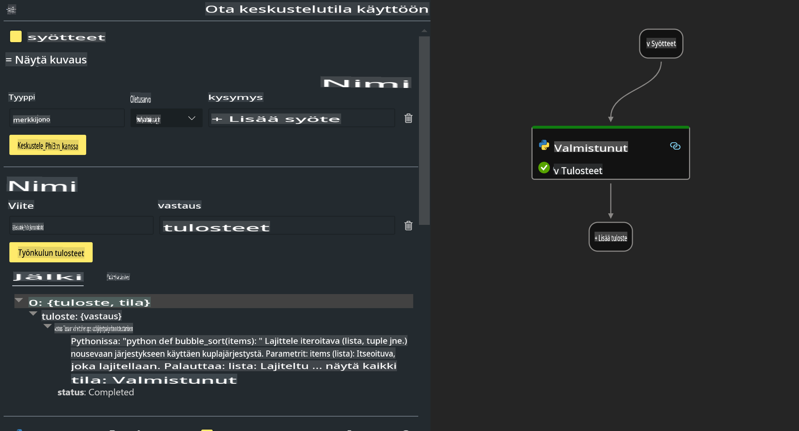

# **Labra 2 - Suorita Prompt flow Phi-3-mini:llä AIPC:ssä**

## **Mikä on Prompt flow**

Prompt flow on kehitystyökalujen kokonaisuus, joka on suunniteltu helpottamaan LLM-pohjaisten tekoälysovellusten koko kehityssykliä ideoinnista, prototypoinnista, testaamisesta ja arvioinnista aina tuotantoon siirtämiseen ja valvontaan asti. Se tekee promptien suunnittelusta huomattavasti helpompaa ja mahdollistaa tuotantotasoisten LLM-sovellusten rakentamisen.

Prompt flow'n avulla voit:

- Luoda työnkulkuja, jotka yhdistävät LLM:t, promptit, Python-koodin ja muut työkalut suoritettavaksi kokonaisuudeksi.

- Virheenkorjata ja iteroida työnkulkujasi, erityisesti LLM:ien kanssa tapahtuvaa vuorovaikutusta, vaivattomasti.

- Arvioida työnkulkujasi ja laskea laadun ja suorituskyvyn mittareita suuremmilla tietoaineistoilla.

- Integroida testauksen ja arvioinnin CI/CD-järjestelmääsi varmistaaksesi työnkulun laadun.

- Ottaa työnkulut käyttöön valitsemallasi palvelualustalla tai helposti integroida ne sovelluksesi koodiin.

- (Valinnainen, mutta erittäin suositeltava) Tehdä yhteistyötä tiimisi kanssa hyödyntämällä Prompt flow'n pilviversiota Azure AI:ssa.

## **Mikä on AIPC**

AI PC:ssä on CPU, GPU ja NPU, joilla kaikilla on erityisiä tekoälyn kiihdytysominaisuuksia. NPU, eli neuroprosessoriyksikkö, on erikoistunut kiihdytin, joka käsittelee tekoälyyn (AI) ja koneoppimiseen (ML) liittyviä tehtäviä suoraan tietokoneellasi ilman, että dataa tarvitsee lähettää pilveen käsiteltäväksi. Vaikka GPU ja CPU voivat myös käsitellä näitä tehtäviä, NPU on erityisen hyvä vähävirtaisessa tekoälylaskennassa. AI PC edustaa perustavanlaatuista muutosta siinä, miten tietokoneemme toimivat. Se ei ole ratkaisu olemattomaan ongelmaan, vaan merkittävä parannus päivittäisiin tietokoneen käyttötapoihin.

Miten se siis toimii? Verrattuna generatiiviseen tekoälyyn ja valtaviin LLM-malleihin, jotka on koulutettu suurella määrällä julkista dataa, tietokoneellasi tapahtuva tekoäly on saavutettavampaa lähes kaikilla tasoilla. Konsepti on helpompi ymmärtää, ja koska se koulutetaan sinun datallasi ilman pilvipalveluiden käyttöä, hyödyt ovat välittömästi houkuttelevampia laajemmalle yleisölle.

Lyhyellä aikavälillä AI PC -maailmaan kuuluu henkilökohtaisia assistentteja ja pienempiä tekoälymalleja, jotka toimivat suoraan tietokoneellasi, hyödyntäen dataasi tarjotakseen henkilökohtaisia, yksityisiä ja turvallisempia tekoälyparannuksia päivittäisiin tehtäviisi – kuten kokousmuistioiden tekeminen, fantasiapalloliigan järjestäminen, valokuvien ja videoiden muokkauksen automaattiset parannukset tai täydellisen perhejuhlan aikataulun suunnittelu kaikkien saapumis- ja lähtöaikojen perusteella.

## **Rakennetaan koodin generointityönkulkuja AIPC:ssä**

***Huomio***: Jos et ole vielä suorittanut ympäristön asennusta, käy osoitteessa [Labra 0 - Asennukset](./01.Installations.md)

1. Avaa Prompt flow -laajennus Visual Studio Codessa ja luo tyhjä työnkulkuprojekti.


2. Lisää Syöte- ja Tuloste-parametrit sekä Python-koodi uudeksi työnkuluksi.



Voit viitata tähän rakenteeseen (flow.dag.yaml) rakentaessasi työnkulkuasi:

```yaml

inputs:
  question:
    type: string
    default: how to write Bubble Algorithm
outputs:
  answer:
    type: string
    reference: ${Chat_With_Phi3.output}
nodes:
- name: Chat_With_Phi3
  type: python
  source:
    type: code
    path: Chat_With_Phi3.py
  inputs:
    question: ${inputs.question}


```

3. Lisää koodi tiedostoon ***Chat_With_Phi3.py***.

```python


from promptflow.core import tool

# import torch
from transformers import AutoTokenizer, pipeline,TextStreamer
import intel_npu_acceleration_library as npu_lib

import warnings

import asyncio
import platform

class Phi3CodeAgent:
    
    model = None
    tokenizer = None
    text_streamer = None
    
    model_id = "microsoft/Phi-3-mini-4k-instruct"

    @staticmethod
    def init_phi3():
        
        if Phi3CodeAgent.model is None or Phi3CodeAgent.tokenizer is None or Phi3CodeAgent.text_streamer is None:
            Phi3CodeAgent.model = npu_lib.NPUModelForCausalLM.from_pretrained(
                                    Phi3CodeAgent.model_id,
                                    torch_dtype="auto",
                                    dtype=npu_lib.int4,
                                    trust_remote_code=True
                                )
            Phi3CodeAgent.tokenizer = AutoTokenizer.from_pretrained(Phi3CodeAgent.model_id)
            Phi3CodeAgent.text_streamer = TextStreamer(Phi3CodeAgent.tokenizer, skip_prompt=True)

    

    @staticmethod
    def chat_with_phi3(prompt):
        
        Phi3CodeAgent.init_phi3()

        messages = "<|system|>You are a AI Python coding assistant. Please help me to generate code in Python.The answer only genertated Python code, but any comments and instructions do not need to be generated<|end|><|user|>" + prompt +"<|end|><|assistant|>"


        generation_args = {
            "max_new_tokens": 1024,
            "return_full_text": False,
            "temperature": 0.3,
            "do_sample": False,
            "streamer": Phi3CodeAgent.text_streamer,
        }

        pipe = pipeline(
            "text-generation",
            model=Phi3CodeAgent.model,
            tokenizer=Phi3CodeAgent.tokenizer,
            # **generation_args
        )

        result = ''

        with warnings.catch_warnings():
            warnings.simplefilter("ignore")
            response = pipe(messages, **generation_args)
            result =response[0]['generated_text']
            return result


@tool
def my_python_tool(question: str) -> str:
    if platform.system() == 'Windows':
        asyncio.set_event_loop_policy(asyncio.WindowsSelectorEventLoopPolicy())
    return Phi3CodeAgent.chat_with_phi3(question)


```

4. Voit testata työnkulkua Debug- tai Run-toiminnolla tarkistaaksesi, toimiiko koodin generointi oikein.


5. Suorita työnkulku kehitys-API:na terminaalissa.

```

pf flow serve --source ./ --port 8080 --host localhost   

```

Voit testata sitä Postmanilla tai Thunder Clientilla.

### **Huomio**

1. Ensimmäinen suoritus vie paljon aikaa. On suositeltavaa ladata phi-3-malli Hugging Face CLI:n kautta.

2. Ottaen huomioon Intel NPU:n rajallisen laskentatehon, suositellaan käyttämään Phi-3-mini-4k-instruct-mallia.

3. Käytämme Intel NPU -kiihdytystä INT4-muunnoksen kvantisointiin, mutta jos suoritat palvelun uudelleen, sinun täytyy poistaa cache- ja nc_workshop-kansiot.

## **Resurssit**

1. Opi Promptflow'sta [https://microsoft.github.io/promptflow/](https://microsoft.github.io/promptflow/)

2. Opi Intel NPU -kiihdytyksestä [https://github.com/intel/intel-npu-acceleration-library](https://github.com/intel/intel-npu-acceleration-library)

3. Lataa esimerkkikoodi [Paikallinen NPU-agentin esimerkkikoodi](../../../../../../../../../code/07.Lab/01/AIPC)

**Vastuuvapauslauseke**:  
Tämä asiakirja on käännetty konepohjaisia tekoälykäännöspalveluita käyttäen. Vaikka pyrimme tarkkuuteen, huomioithan, että automaattiset käännökset voivat sisältää virheitä tai epätarkkuuksia. Alkuperäistä asiakirjaa sen alkuperäisellä kielellä tulisi pitää ensisijaisena lähteenä. Kriittisen tiedon osalta suositellaan ammattimaista ihmiskääntäjää. Emme ole vastuussa tämän käännöksen käytöstä johtuvista väärinkäsityksistä tai virhetulkinnoista.