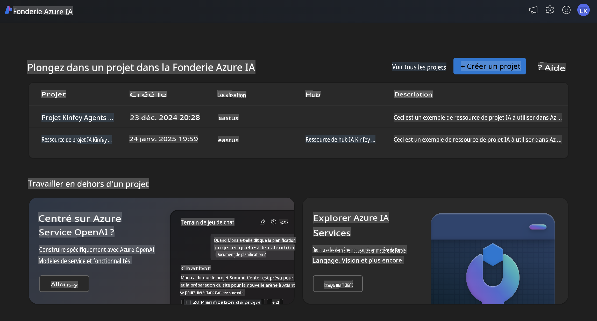
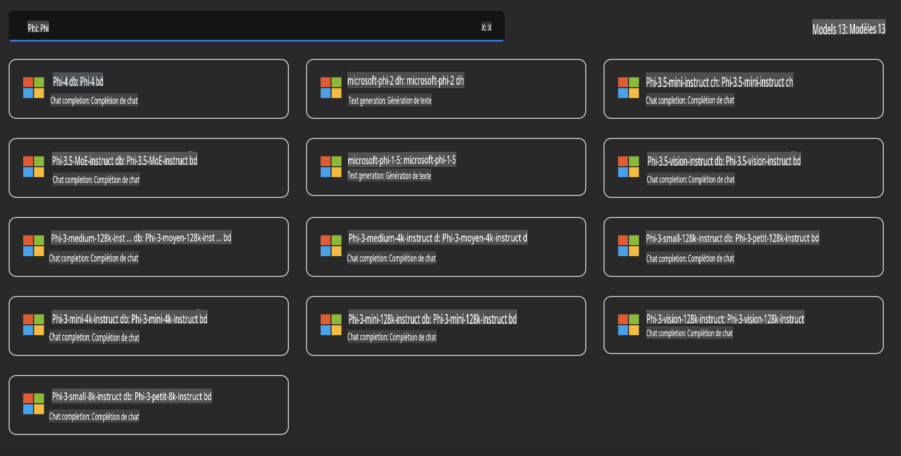
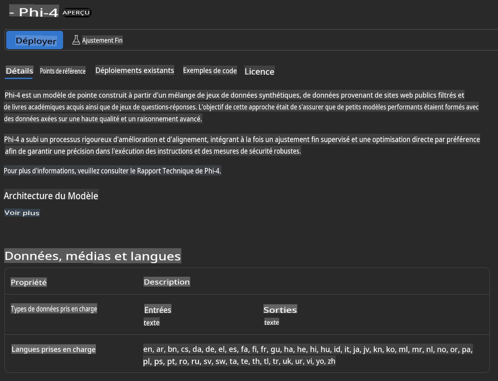
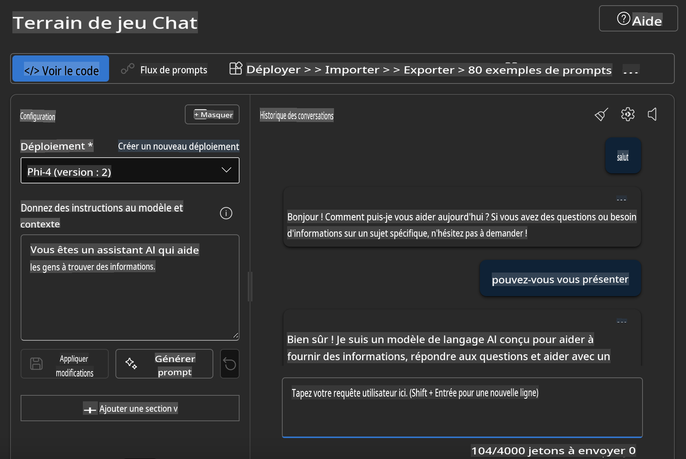

## Famille Phi dans Azure AI Foundry

[Azure AI Foundry](https://ai.azure.com) est une plateforme de confiance qui permet aux développeurs de stimuler l'innovation et de façonner l'avenir avec l'IA de manière sûre, sécurisée et responsable.

[Azure AI Foundry](https://ai.azure.com) est conçu pour permettre aux développeurs de :

- Créer des applications d'IA générative sur une plateforme de niveau entreprise.
- Explorer, construire, tester et déployer en utilisant des outils d'IA de pointe et des modèles d'apprentissage automatique, tout en respectant les pratiques d'IA responsable.
- Collaborer avec une équipe tout au long du cycle de vie du développement des applications.

Avec Azure AI Foundry, vous pouvez explorer une grande variété de modèles, services et fonctionnalités, et commencer à créer des applications d'IA qui répondent au mieux à vos objectifs. La plateforme Azure AI Foundry facilite l'évolution des concepts de preuve en applications de production complètes, et ce, en toute simplicité. Une surveillance et un ajustement continus soutiennent le succès à long terme.



En plus d'utiliser le service Azure AOAI dans Azure AI Foundry, vous pouvez également utiliser des modèles tiers dans le catalogue de modèles d'Azure AI Foundry. C'est une excellente option si vous souhaitez utiliser Azure AI Foundry comme plateforme pour vos solutions d'IA.

Nous pouvons déployer rapidement les modèles de la famille Phi via le catalogue de modèles dans Azure AI Foundry.



### **Déployer Phi-4 dans Azure AI Foundry**



### **Tester Phi-4 dans le Playground d'Azure AI Foundry**



### **Exécuter du code Python pour appeler Phi-4 dans Azure AI Foundry**

```python

import os  
import base64
from openai import AzureOpenAI  
from azure.identity import DefaultAzureCredential, get_bearer_token_provider  
        
endpoint = os.getenv("ENDPOINT_URL", "Your Azure AOAI Service Endpoint")  
deployment = os.getenv("DEPLOYMENT_NAME", "Phi-4")  
      
token_provider = get_bearer_token_provider(  
    DefaultAzureCredential(),  
    "https://cognitiveservices.azure.com/.default"  
)  
  
client = AzureOpenAI(  
    azure_endpoint=endpoint,  
    azure_ad_token_provider=token_provider,  
    api_version="2024-05-01-preview",  
)  
  

chat_prompt = [
    {
        "role": "system",
        "content": "You are an AI assistant that helps people find information."
    },
    {
        "role": "user",
        "content": "can you introduce yourself"
    }
] 
    
# Include speech result if speech is enabled  
messages = chat_prompt 

completion = client.chat.completions.create(  
    model=deployment,  
    messages=messages,
    max_tokens=800,  
    temperature=0.7,  
    top_p=0.95,  
    frequency_penalty=0,  
    presence_penalty=0,
    stop=None,  
    stream=False  
)  
  
print(completion.to_json())  

```

**Avertissement** :  
Ce document a été traduit à l'aide de services de traduction automatisée basés sur l'intelligence artificielle. Bien que nous nous efforcions d'assurer l'exactitude, veuillez noter que les traductions automatisées peuvent contenir des erreurs ou des inexactitudes. Le document original dans sa langue d'origine doit être considéré comme la source faisant autorité. Pour des informations critiques, il est recommandé de recourir à une traduction professionnelle humaine. Nous déclinons toute responsabilité en cas de malentendus ou d'interprétations erronées résultant de l'utilisation de cette traduction.