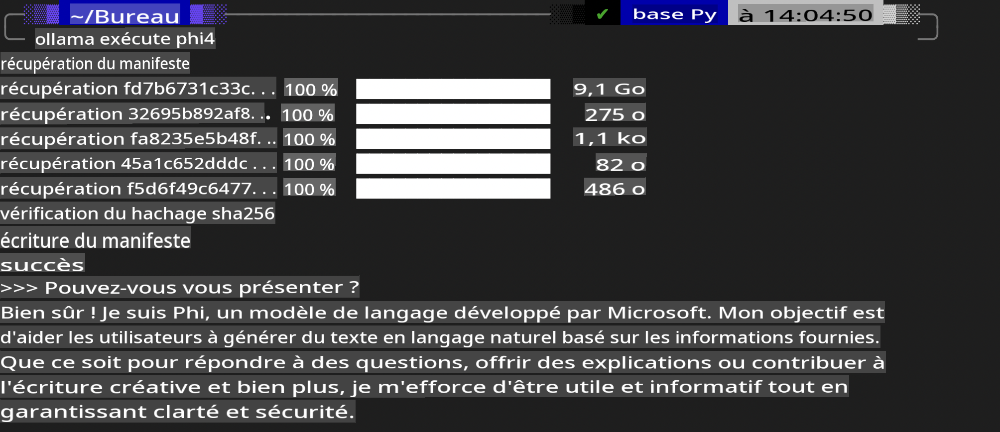

## Famille Phi dans Ollama

[Ollama](https://ollama.com) permet à un plus grand nombre de personnes de déployer directement des LLM ou SLM open source via de simples scripts, et peut également créer des API pour faciliter les scénarios d'application locaux de type Copilot.

## **1. Installation**

Ollama est compatible avec Windows, macOS et Linux. Vous pouvez installer Ollama via ce lien ([https://ollama.com/download](https://ollama.com/download)). Une fois l'installation réussie, vous pouvez utiliser directement le script Ollama pour appeler Phi-3 via une fenêtre de terminal. Vous pouvez consulter toutes les [bibliothèques disponibles dans Ollama](https://ollama.com/library). Si vous ouvrez ce dépôt dans un Codespace, Ollama y sera déjà installé.

```bash

ollama run phi4

```

> [!NOTE]
> Le modèle sera téléchargé lors de sa première exécution. Bien sûr, vous pouvez également spécifier directement le modèle Phi-4 déjà téléchargé. Prenons WSL comme exemple pour exécuter la commande. Une fois le modèle téléchargé avec succès, vous pourrez interagir directement dans le terminal.



## **2. Appeler l'API phi-4 depuis Ollama**

Si vous souhaitez appeler l'API Phi-4 générée par Ollama, vous pouvez utiliser cette commande dans le terminal pour démarrer le serveur Ollama.

```bash

ollama serve

```

> [!NOTE]
> Si vous utilisez macOS ou Linux, vous pourriez rencontrer l'erreur suivante **"Error: listen tcp 127.0.0.1:11434: bind: address already in use"** lors de l'exécution de la commande. Cette erreur indique généralement que le serveur est déjà en cours d'exécution. Vous pouvez soit ignorer cette erreur, soit arrêter et redémarrer Ollama :

**macOS**

```bash

brew services restart ollama

```

**Linux**

```bash

sudo systemctl stop ollama

```

Ollama prend en charge deux API : generate et chat. Vous pouvez appeler l'API du modèle fournie par Ollama en fonction de vos besoins, en envoyant des requêtes au service local fonctionnant sur le port 11434.

**Chat**

```bash

curl http://127.0.0.1:11434/api/chat -d '{
  "model": "phi3",
  "messages": [
    {
      "role": "system",
      "content": "Your are a python developer."
    },
    {
      "role": "user",
      "content": "Help me generate a bubble algorithm"
    }
  ],
  "stream": false
  
}'

This is the result in Postman


## Additional Resources

Check the list of available models in Ollama in [their library](https://ollama.com/library).

Pull your model from the Ollama server using this command

```bash
ollama pull phi4
```

Run the model using this command

```bash
ollama run phi4
```

***Note:*** Visit this link [https://github.com/ollama/ollama/blob/main/docs/api.md](https://github.com/ollama/ollama/blob/main/docs/api.md) to learn more

## Calling Ollama from Python

You can use `requests` or `urllib3` to make requests to the local server endpoints used above. However, a popular way to use Ollama in Python is via the [openai](https://pypi.org/project/openai/) SDK, since Ollama provides OpenAI-compatible server endpoints as well.

Here is an example for phi3-mini:

```python
import openai

client = openai.OpenAI(
    base_url="http://localhost:11434/v1",
    api_key="nokeyneeded",
)

response = client.chat.completions.create(
    model="phi4",
    temperature=0.7,
    n=1,
    messages=[
        {"role": "system", "content": "Vous êtes un assistant utile."},
        {"role": "user", "content": "Écrivez un haïku sur un chat affamé"},
    ],
)

print("Réponse :")
print(response.choices[0].message.content)
```

## Calling Ollama from JavaScript 

```javascript
// Exemple de résumé d'un fichier avec Phi-4
script({
    model: "ollama:phi4",
    title: "Résumé avec Phi-4",
    system: ["system"],
})

// Exemple de résumé
const file = def("FILE", env.files)
$`Résumé de ${file} en un seul paragraphe.`
```

## Calling Ollama from C#

Create a new C# Console application and add the following NuGet package:

```bash
dotnet add package Microsoft.SemanticKernel --version 1.34.0
```

Then replace this code in the `Program.cs` file

```csharp
using Microsoft.SemanticKernel;
using Microsoft.SemanticKernel.ChatCompletion;

// ajouter un service de chat via le point de terminaison local du serveur Ollama
#pragma warning disable SKEXP0001, SKEXP0003, SKEXP0010, SKEXP0011, SKEXP0050, SKEXP0052
builder.AddOpenAIChatCompletion(
    modelId: "phi4",
    endpoint: new Uri("http://localhost:11434/"),
    apiKey: "non requis");

// invoquer une simple invite au service de chat
string prompt = "Racontez une blague sur les chatons";
var response = await kernel.InvokePromptAsync(prompt);
Console.WriteLine(response.GetValue<string>());
```

Run the app with the command:

```bash
dotnet run

**Avertissement** :  
Ce document a été traduit à l'aide de services de traduction automatique basés sur l'intelligence artificielle. Bien que nous nous efforcions d'assurer l'exactitude, veuillez noter que les traductions automatisées peuvent contenir des erreurs ou des inexactitudes. Le document original dans sa langue d'origine doit être considéré comme la source faisant autorité. Pour des informations critiques, il est recommandé de recourir à une traduction humaine professionnelle. Nous déclinons toute responsabilité en cas de malentendus ou d'interprétations erronées résultant de l'utilisation de cette traduction.