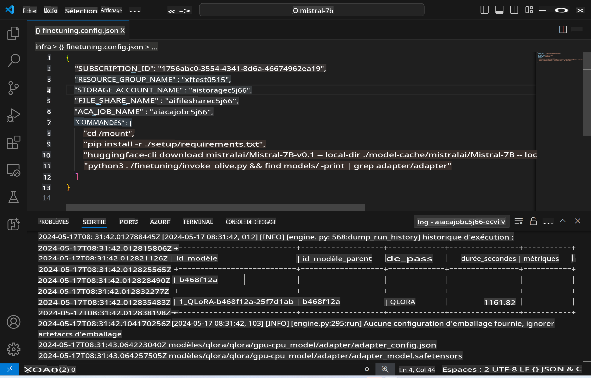
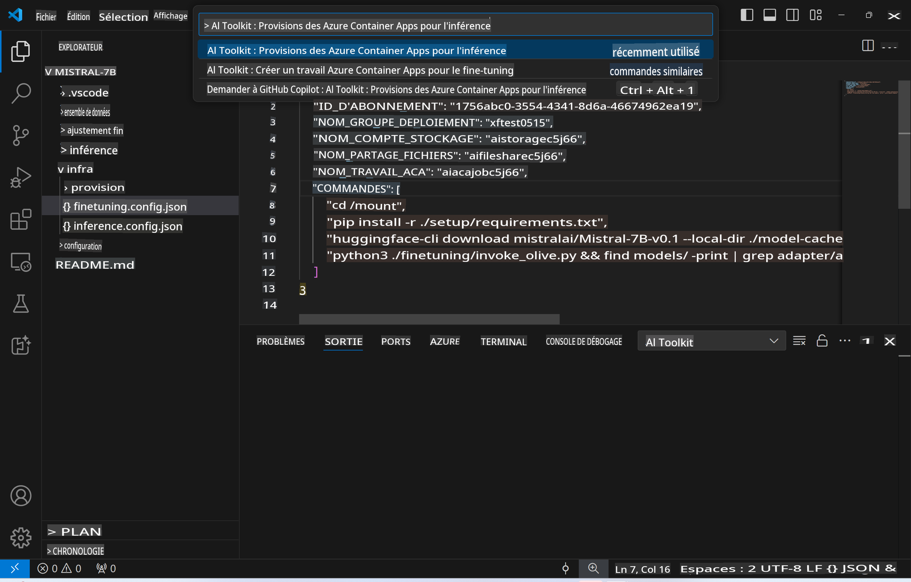
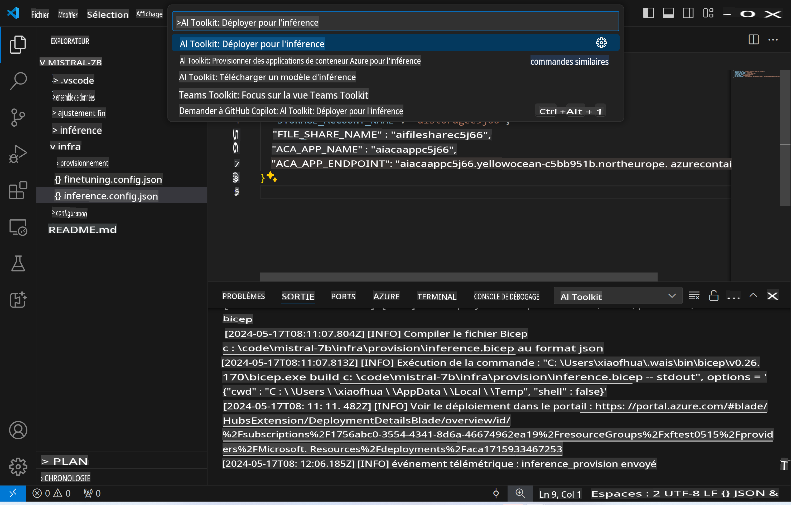
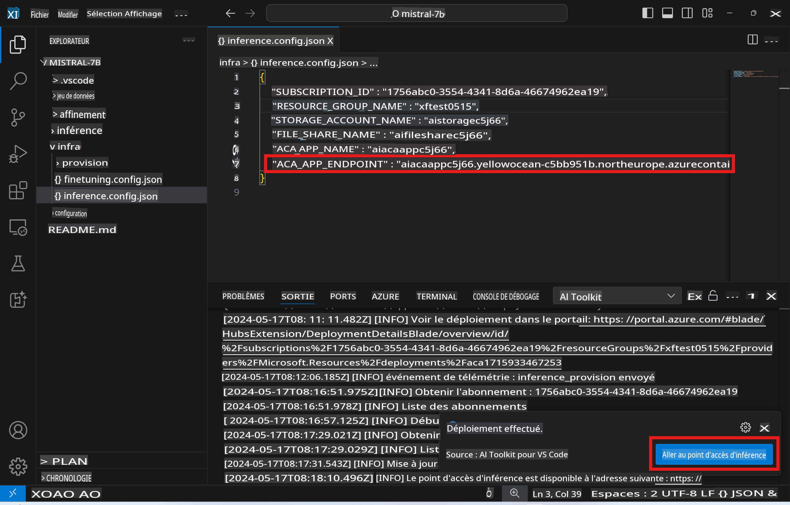

# Inférence à distance avec le modèle ajusté

Une fois que les adaptateurs sont entraînés dans l'environnement distant, utilisez une application Gradio simple pour interagir avec le modèle.



### Provisionner les ressources Azure
Vous devez configurer les ressources Azure pour l'inférence à distance en exécutant la commande `AI Toolkit: Provision Azure Container Apps for inference` depuis la palette de commandes. Pendant cette configuration, il vous sera demandé de sélectionner votre abonnement Azure et votre groupe de ressources.  

   
Par défaut, l'abonnement et le groupe de ressources pour l'inférence devraient correspondre à ceux utilisés pour l'ajustement. L'inférence utilisera le même environnement Azure Container App et accédera au modèle et à l'adaptateur de modèle stockés dans Azure Files, qui ont été générés lors de l'étape d'ajustement.

## Utilisation de l'AI Toolkit 

### Déploiement pour l'inférence  
Si vous souhaitez modifier le code d'inférence ou recharger le modèle d'inférence, veuillez exécuter la commande `AI Toolkit: Deploy for inference`. Cela synchronisera votre code le plus récent avec ACA et redémarrera la réplique.  



Une fois le déploiement terminé avec succès, le modèle est prêt à être évalué via cet endpoint.

### Accéder à l'API d'inférence

Vous pouvez accéder à l'API d'inférence en cliquant sur le bouton "*Go to Inference Endpoint*" affiché dans la notification de VSCode. Alternativement, l'endpoint web de l'API peut être trouvé sous `ACA_APP_ENDPOINT` dans `./infra/inference.config.json` et dans le panneau de sortie.



> **Remarque :** L'endpoint d'inférence peut nécessiter quelques minutes pour être pleinement opérationnel.

## Composants d'inférence inclus dans le modèle
 
| Dossier | Contenu |
| ------ |--------- |
| `infra` | Contient toutes les configurations nécessaires pour les opérations distantes. |
| `infra/provision/inference.parameters.json` | Contient les paramètres pour les templates Bicep, utilisés pour provisionner les ressources Azure pour l'inférence. |
| `infra/provision/inference.bicep` | Contient les templates pour provisionner les ressources Azure pour l'inférence. |
| `infra/inference.config.json` | Le fichier de configuration, généré par la commande `AI Toolkit: Provision Azure Container Apps for inference`. Il est utilisé comme entrée pour d'autres palettes de commandes distantes. |

### Utilisation de l'AI Toolkit pour configurer le provisionnement des ressources Azure
Configurez le [AI Toolkit](https://marketplace.visualstudio.com/items?itemName=ms-windows-ai-studio.windows-ai-studio)

Provisionnez des Azure Container Apps pour l'inférence` command.

You can find configuration parameters in `./infra/provision/inference.parameters.json` file. Here are the details:
| Parameter | Description |
| --------- |------------ |
| `defaultCommands` | This is the commands to initiate a web API. |
| `maximumInstanceCount` | This parameter sets the maximum capacity of GPU instances. |
| `location` | This is the location where Azure resources are provisioned. The default value is the same as the chosen resource group's location. |
| `storageAccountName`, `fileShareName` `acaEnvironmentName`, `acaEnvironmentStorageName`, `acaAppName`,  `acaLogAnalyticsName` | These parameters are used to name the Azure resources for provision. By default, they will be same to the fine-tuning resource name. You can input a new, unused resource name to create your own custom-named resources, or you can input the name of an already existing Azure resource if you'd prefer to use that. For details, refer to the section [Using existing Azure Resources](../../../../../md/01.Introduction/03). |

### Using Existing Azure Resources

By default, the inference provision use the same Azure Container App Environment, Storage Account, Azure File Share, and Azure Log Analytics that were used for fine-tuning. A separate Azure Container App is created solely for the inference API. 

If you have customized the Azure resources during the fine-tuning step or want to use your own existing Azure resources for inference, specify their names in the `./infra/inference.parameters.json`. Ensuite, exécutez la commande `AI Toolkit: Provision Azure Container Apps for inference` depuis la palette de commandes. Cela mettra à jour les ressources spécifiées et créera celles qui manquent.

Par exemple, si vous avez un environnement Azure Container existant, votre fichier `./infra/finetuning.parameters.json` devrait ressembler à ceci :

```json
{
    "$schema": "https://schema.management.azure.com/schemas/2019-04-01/deploymentParameters.json#",
    "contentVersion": "1.0.0.0",
    "parameters": {
      ...
      "acaEnvironmentName": {
        "value": "<your-aca-env-name>"
      },
      "acaEnvironmentStorageName": {
        "value": null
      },
      ...
    }
  }
```

### Provisionnement manuel  
Si vous préférez configurer manuellement les ressources Azure, vous pouvez utiliser les fichiers Bicep fournis dans le dossier `./infra/provision` folders. If you have already set up and configured all the Azure resources without using the AI Toolkit command palette, you can simply enter the resource names in the `inference.config.json`.

Par exemple :

```json
{
  "SUBSCRIPTION_ID": "<your-subscription-id>",
  "RESOURCE_GROUP_NAME": "<your-resource-group-name>",
  "STORAGE_ACCOUNT_NAME": "<your-storage-account-name>",
  "FILE_SHARE_NAME": "<your-file-share-name>",
  "ACA_APP_NAME": "<your-aca-name>",
  "ACA_APP_ENDPOINT": "<your-aca-endpoint>"
}
```

**Avertissement** :  
Ce document a été traduit à l'aide de services de traduction automatisée basés sur l'IA. Bien que nous nous efforcions d'assurer l'exactitude, veuillez noter que les traductions automatiques peuvent contenir des erreurs ou des inexactitudes. Le document original dans sa langue d'origine doit être considéré comme la source faisant autorité. Pour des informations critiques, il est recommandé de recourir à une traduction professionnelle réalisée par un humain. Nous déclinons toute responsabilité en cas de malentendus ou d'interprétations erronées résultant de l'utilisation de cette traduction.