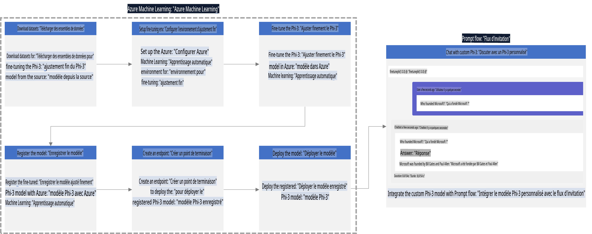
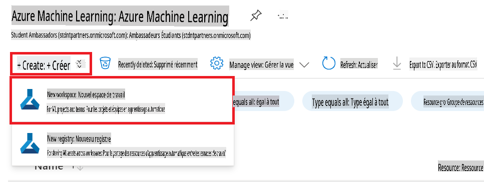
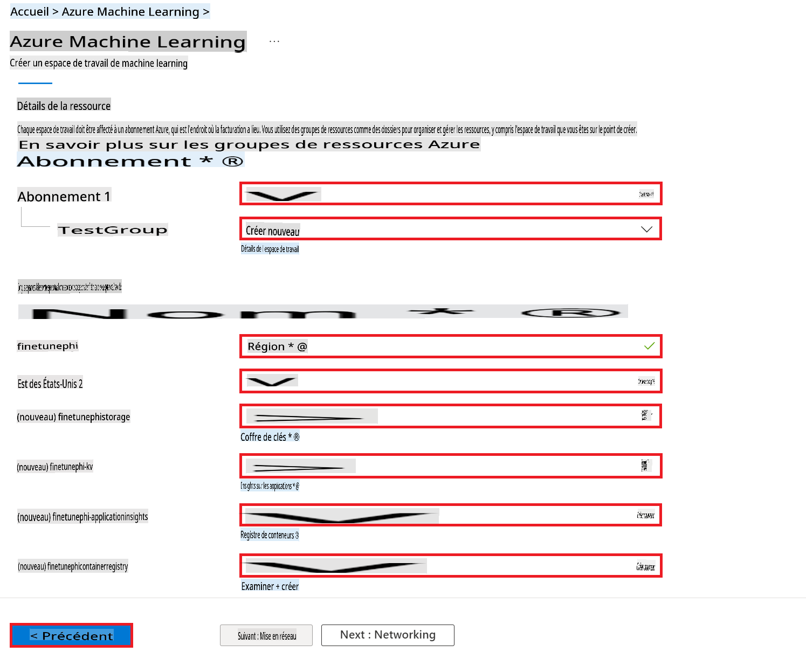
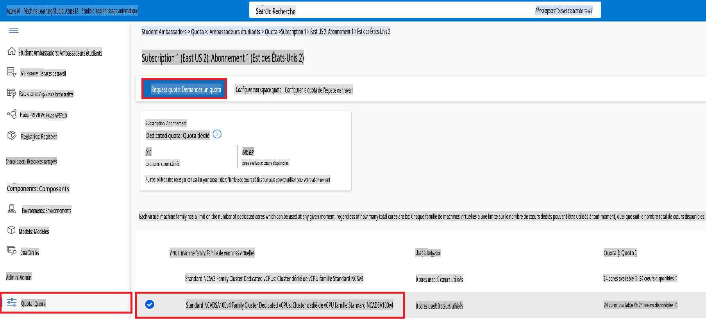
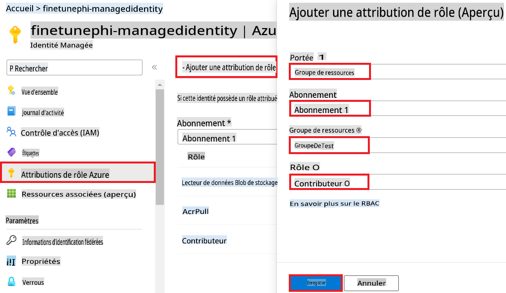
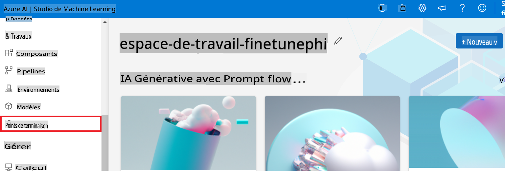
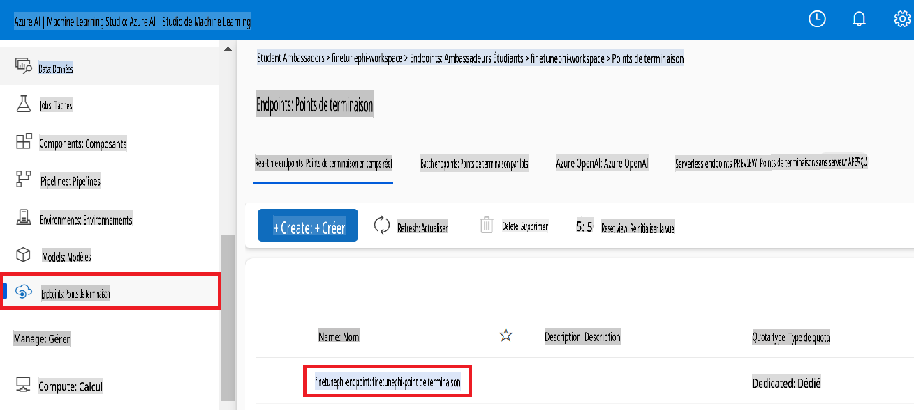
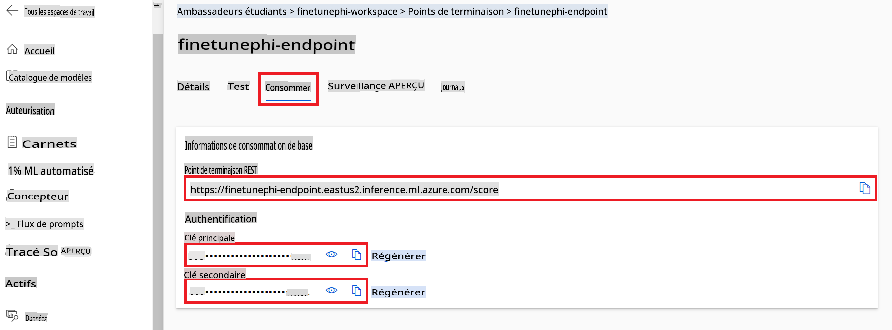
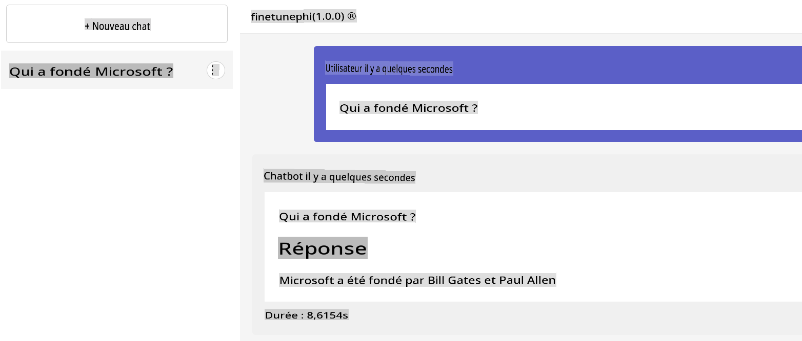

# Affiner et intégrer des modèles personnalisés Phi-3 avec Prompt Flow

Cet exemple de bout en bout (E2E) est basé sur le guide "[Affiner et intégrer des modèles personnalisés Phi-3 avec Prompt Flow : Guide étape par étape](https://techcommunity.microsoft.com/t5/educator-developer-blog/fine-tune-and-integrate-custom-phi-3-models-with-prompt-flow/ba-p/4178612?WT.mc_id=aiml-137032-kinfeylo)" de la communauté technique de Microsoft. Il présente les processus d'affinement, de déploiement et d'intégration des modèles personnalisés Phi-3 avec Prompt Flow.

## Vue d'ensemble

Dans cet exemple E2E, vous apprendrez à affiner le modèle Phi-3 et à l'intégrer avec Prompt Flow. En utilisant Azure Machine Learning et Prompt Flow, vous établirez un flux de travail pour déployer et utiliser des modèles d'IA personnalisés. Cet exemple E2E est divisé en trois scénarios :

**Scénario 1 : Configurer les ressources Azure et préparer l'affinement**

**Scénario 2 : Affiner le modèle Phi-3 et le déployer dans Azure Machine Learning Studio**

**Scénario 3 : Intégrer avec Prompt Flow et interagir avec votre modèle personnalisé**

Voici un aperçu de cet exemple E2E.



### Table des matières

1. **[Scénario 1 : Configurer les ressources Azure et préparer l'affinement](../../../../../../md/02.Application/01.TextAndChat/Phi3)**
    - [Créer un espace de travail Azure Machine Learning](../../../../../../md/02.Application/01.TextAndChat/Phi3)
    - [Demander des quotas GPU dans l'abonnement Azure](../../../../../../md/02.Application/01.TextAndChat/Phi3)
    - [Ajouter une attribution de rôle](../../../../../../md/02.Application/01.TextAndChat/Phi3)
    - [Configurer le projet](../../../../../../md/02.Application/01.TextAndChat/Phi3)
    - [Préparer l'ensemble de données pour l'affinement](../../../../../../md/02.Application/01.TextAndChat/Phi3)

1. **[Scénario 2 : Affiner le modèle Phi-3 et le déployer dans Azure Machine Learning Studio](../../../../../../md/02.Application/01.TextAndChat/Phi3)**
    - [Configurer Azure CLI](../../../../../../md/02.Application/01.TextAndChat/Phi3)
    - [Affiner le modèle Phi-3](../../../../../../md/02.Application/01.TextAndChat/Phi3)
    - [Déployer le modèle affiné](../../../../../../md/02.Application/01.TextAndChat/Phi3)

1. **[Scénario 3 : Intégrer avec Prompt Flow et interagir avec votre modèle personnalisé](../../../../../../md/02.Application/01.TextAndChat/Phi3)**
    - [Intégrer le modèle Phi-3 personnalisé avec Prompt Flow](../../../../../../md/02.Application/01.TextAndChat/Phi3)
    - [Interagir avec votre modèle personnalisé](../../../../../../md/02.Application/01.TextAndChat/Phi3)

## Scénario 1 : Configurer les ressources Azure et préparer l'affinement

### Créer un espace de travail Azure Machine Learning

1. Tapez *azure machine learning* dans la **barre de recherche** en haut de la page du portail et sélectionnez **Azure Machine Learning** parmi les options qui apparaissent.

    

1. Sélectionnez **+ Créer** dans le menu de navigation.

1. Sélectionnez **Nouvel espace de travail** dans le menu de navigation.

    

1. Effectuez les tâches suivantes :

    - Sélectionnez votre **Abonnement Azure**.
    - Sélectionnez le **Groupe de ressources** à utiliser (créez-en un nouveau si nécessaire).
    - Entrez le **Nom de l'espace de travail**. Il doit être une valeur unique.
    - Sélectionnez la **Région** que vous souhaitez utiliser.
    - Sélectionnez le **Compte de stockage** à utiliser (créez-en un nouveau si nécessaire).
    - Sélectionnez le **Key vault** à utiliser (créez-en un nouveau si nécessaire).
    - Sélectionnez **Application Insights** à utiliser (créez-en un nouveau si nécessaire).
    - Sélectionnez le **Registre de conteneurs** à utiliser (créez-en un nouveau si nécessaire).

    

1. Sélectionnez **Revoir + Créer**.

1. Sélectionnez **Créer**.

### Demander des quotas GPU dans l'abonnement Azure

Dans cet exemple E2E, vous utiliserez le GPU *Standard_NC24ads_A100_v4* pour l'affinement, ce qui nécessite une demande de quota, et le CPU *Standard_E4s_v3* pour le déploiement, ce qui ne nécessite pas de demande de quota.

> [!NOTE]
>
> Seuls les abonnements Pay-As-You-Go (le type d'abonnement standard) sont éligibles pour l'allocation GPU ; les abonnements bénéficiant d'avantages ne sont actuellement pas pris en charge.
>
> Pour ceux qui utilisent des abonnements bénéficiant d'avantages (comme l'abonnement Visual Studio Enterprise) ou ceux qui souhaitent tester rapidement le processus d'affinement et de déploiement, ce tutoriel fournit également des instructions pour affiner avec un ensemble de données minimal en utilisant un CPU. Cependant, il est important de noter que les résultats d'affinement sont nettement meilleurs lorsqu'un GPU est utilisé avec des ensembles de données plus volumineux.

1. Visitez [Azure ML Studio](https://ml.azure.com/home?wt.mc_id=studentamb_279723).

1. Effectuez les tâches suivantes pour demander un quota pour la famille *Standard NCADSA100v4* :

    - Sélectionnez **Quota** dans l'onglet de gauche.
    - Sélectionnez la **Famille de machines virtuelles** à utiliser. Par exemple, sélectionnez **Standard NCADSA100v4 Family Cluster Dedicated vCPUs**, qui inclut le GPU *Standard_NC24ads_A100_v4*.
    - Sélectionnez **Demander un quota** dans le menu de navigation.

        

    - Sur la page de demande de quota, entrez la **Nouvelle limite de cœurs** que vous souhaitez utiliser. Par exemple, 24.
    - Sur la page de demande de quota, sélectionnez **Soumettre** pour demander le quota GPU.

> [!NOTE]
> Vous pouvez sélectionner le GPU ou le CPU approprié en fonction de vos besoins en consultant le document [Tailles des machines virtuelles dans Azure](https://learn.microsoft.com/azure/virtual-machines/sizes/overview?tabs=breakdownseries%2Cgeneralsizelist%2Ccomputesizelist%2Cmemorysizelist%2Cstoragesizelist%2Cgpusizelist%2Cfpgasizelist%2Chpcsizelist).

### Ajouter une attribution de rôle

Pour affiner et déployer vos modèles, vous devez d'abord créer une identité managée affectée par l'utilisateur (UAI) et lui attribuer les autorisations appropriées. Cette UAI sera utilisée pour l'authentification pendant le déploiement.

#### Créer une identité managée affectée par l'utilisateur (UAI)

1. Tapez *managed identities* dans la **barre de recherche** en haut de la page du portail et sélectionnez **Managed Identities** parmi les options qui apparaissent.

    

1. Sélectionnez **+ Créer**.

    

1. Effectuez les tâches suivantes :

    - Sélectionnez votre **Abonnement Azure**.
    - Sélectionnez le **Groupe de ressources** à utiliser (créez-en un nouveau si nécessaire).
    - Sélectionnez la **Région** que vous souhaitez utiliser.
    - Entrez le **Nom**. Il doit être une valeur unique.

1. Sélectionnez **Revoir + créer**.

1. Sélectionnez **+ Créer**.

#### Ajouter un rôle de contributeur à l'identité managée

1. Accédez à la ressource d'identité managée que vous avez créée.

1. Sélectionnez **Attributions de rôle Azure** dans l'onglet de gauche.

1. Sélectionnez **+ Ajouter une attribution de rôle** dans le menu de navigation.

1. Sur la page Ajouter une attribution de rôle, effectuez les tâches suivantes :
    - Sélectionnez la **Portée** sur **Groupe de ressources**.
    - Sélectionnez votre **Abonnement Azure**.
    - Sélectionnez le **Groupe de ressources** à utiliser.
    - Sélectionnez le **Rôle** sur **Contributeur**.

    

1. Sélectionnez **Enregistrer**.

#### Ajouter un rôle de lecteur de données Blob de stockage à l'identité managée

1. Tapez *comptes de stockage* dans la **barre de recherche** en haut de la page du portail et sélectionnez **Comptes de stockage** parmi les options qui apparaissent.

    

1. Sélectionnez le compte de stockage associé à l'espace de travail Azure Machine Learning que vous avez créé. Par exemple, *finetunephistorage*.

1. Effectuez les tâches suivantes pour accéder à la page Ajouter une attribution de rôle :

    - Accédez au compte de stockage Azure que vous avez créé.
    - Sélectionnez **Contrôle d'accès (IAM)** dans l'onglet de gauche.
    - Sélectionnez **+ Ajouter** dans le menu de navigation.
    - Sélectionnez **Ajouter une attribution de rôle** dans le menu de navigation.

    

1. Sur la page Ajouter une attribution de rôle, effectuez les tâches suivantes :

    - Sur la page Rôle, tapez *Lecteur de données Blob de stockage* dans la **barre de recherche** et sélectionnez **Lecteur de données Blob de stockage** parmi les options qui apparaissent.
    - Sur la page Rôle, sélectionnez **Suivant**.
    - Sur la page Membres, sélectionnez **Attribuer l'accès à** **Identité managée**.
    - Sur la page Membres, sélectionnez **+ Sélectionner des membres**.
    - Sur la page Sélectionner des identités managées, sélectionnez votre **Abonnement Azure**.
    - Sur la page Sélectionner des identités managées, sélectionnez l'**Identité managée** sur **Identité managée**.
    - Sur la page Sélectionner des identités managées, sélectionnez l'identité managée que vous avez créée. Par exemple, *finetunephi-managedidentity*.
    - Sur la page Sélectionner des identités managées, sélectionnez **Sélectionner**.

    

1. Sélectionnez **Revoir + attribuer**.

#### Ajouter un rôle AcrPull à l'identité managée

1. Tapez *registres de conteneurs* dans la **barre de recherche** en haut de la page du portail et sélectionnez **Registres de conteneurs** parmi les options qui apparaissent.

    

1. Sélectionnez le registre de conteneurs associé à l'espace de travail Azure Machine Learning. Par exemple, *finetunephicontainerregistries*.

1. Effectuez les tâches suivantes pour accéder à la page Ajouter une attribution de rôle :

    - Sélectionnez **Contrôle d'accès (IAM)** dans l'onglet de gauche.
    - Sélectionnez **+ Ajouter** dans le menu de navigation.
    - Sélectionnez **Ajouter une attribution de rôle** dans le menu de navigation.

1. Sur la page Ajouter une attribution de rôle, effectuez les tâches suivantes :

    - Sur la page Rôle, tapez *AcrPull* dans la **barre de recherche** et sélectionnez **AcrPull** parmi les options qui apparaissent.
    - Sur la page Rôle, sélectionnez **Suivant**.
    - Sur la page Membres, sélectionnez **Attribuer l'accès à** **Identité managée**.
    - Sur la page Membres, sélectionnez **+ Sélectionner des membres**.
    - Sur la page Sélectionner des identités managées, sélectionnez votre **Abonnement Azure**.
    - Sur la page Sélectionner des identités managées, sélectionnez l'**Identité managée** sur **Identité managée**.
    - Sur la page Sélectionner des identités managées, sélectionnez l'identité managée que vous avez créée. Par exemple, *finetunephi-managedidentity*.
    - Sur la page Sélectionner des identités managées, sélectionnez **Sélectionner**.
    - Sélectionnez **Revoir + attribuer**.

### Configurer le projet

Vous allez maintenant créer un dossier de travail et configurer un environnement virtuel pour développer un programme qui interagit avec les utilisateurs et utilise l'historique des discussions stocké dans Azure Cosmos DB pour informer ses réponses.

#### Créer un dossier de travail

1. Ouvrez une fenêtre de terminal et tapez la commande suivante pour créer un dossier nommé *finetune-phi* dans le chemin par défaut.

    ```console
    mkdir finetune-phi
    ```

1. Tapez la commande suivante dans votre terminal pour naviguer vers le dossier *finetune-phi* que vous avez créé.

    ```console
    cd finetune-phi
    ```

#### Créer un environnement virtuel

1. Tapez la commande suivante dans votre terminal pour créer un environnement virtuel nommé *.venv*.

    ```console
    python -m venv .venv
    ```

1. Tapez la commande suivante dans votre terminal pour activer l'environnement virtuel.

    ```console
    .venv\Scripts\activate.bat
    ```

> [!NOTE]
>
> Si cela a fonctionné, vous devriez voir *(.venv)* avant l'invite de commande.

#### Installer les packages requis

1. Tapez les commandes suivantes dans votre terminal pour installer les packages requis.

    ```console
    pip install datasets==2.19.1
    pip install transformers==4.41.1
    pip install azure-ai-ml==1.16.0
    pip install torch==2.3.1
    pip install trl==0.9.4
    pip install promptflow==1.12.0
    ```

#### Créer les fichiers du projet

Dans cet exercice, vous allez créer les fichiers essentiels pour notre projet. Ces fichiers incluent des scripts pour télécharger l'ensemble de données, configurer l'environnement Azure Machine Learning, affiner le modèle Phi-3 et déployer le modèle affiné. Vous allez également créer un fichier *conda.yml* pour configurer l'environnement d'affinement.

Dans cet exercice, vous allez :

- Créer un fichier *download_dataset.py* pour télécharger l'ensemble de données.
- Créer un fichier *setup_ml.py* pour configurer l'environnement Azure Machine Learning.
- Créer un fichier *fine_tune.py* dans le dossier *finetuning_dir* pour affiner le modèle Phi-3 à l'aide de l'ensemble de données.
- Créer un fichier *conda.yml* pour configurer l'environnement d'affinement.
- Créer un fichier *deploy_model.py* pour déployer le modèle affiné.
- Créer un fichier *integrate_with_promptflow.py* pour intégrer le modèle affiné et exécuter le modèle à l'aide de Prompt Flow.
- Créer un fichier flow.dag.yml pour configurer la structure du flux de travail pour Prompt Flow.
- Créer un fichier *config.py* pour entrer les informations Azure.

> [!NOTE]
>
> Structure complète du dossier :
>
> ```text
> └── YourUserName
> .    └── finetune-phi
> .        ├── finetuning_dir
> .        │      └── fine_tune.py
> .        ├── conda.yml
> .        ├── config.py
> .        ├── deploy_model.py
> .        ├── download_dataset.py
> .        ├── flow.dag.yml
> .        ├── integrate_with_promptflow.py
> .        └── setup_ml.py
> ```

1. Ouvrez **Visual Studio Code**.

1. Sélectionnez **Fichier** dans la barre de menu.

1. Sélectionnez **Ouvrir un dossier**.

1. Sélectionnez le dossier *finetune-phi* que vous avez créé, situé à *C:\Users\yourUserName\finetune-phi*.

    

1. Dans le volet de gauche de Visual Studio Code, cliquez avec le bouton droit et sélectionnez **Nouveau fichier** pour créer un nouveau fichier nommé *download_dataset.py*.

1. Dans le volet de gauche de Visual Studio Code, cliquez avec le bouton droit et sélectionnez **Nouveau fichier** pour créer un nouveau fichier nommé *setup_ml.py*.

1. Dans le volet de gauche de Visual Studio Code, cliquez avec le bouton droit et sélectionnez **Nouveau fichier** pour créer un nouveau fichier nommé *deploy_model.py*.

    

1. Dans le volet de gauche de Visual Studio Code, cliquez avec le bouton droit et sélectionnez **Nouveau dossier** pour créer un nouveau dossier nommé *finetuning_dir*.

1. Dans le dossier *finetuning_dir*, créez un nouveau fichier nommé *fine_tune.py*.

#### Créer et configurer le fichier *conda.yml*

1. Dans le volet de gauche de Visual Studio Code, cliquez avec le bouton droit et sélectionnez **Nouveau fichier** pour créer un nouveau fichier nommé *conda.yml*.

1. Ajoutez le code suivant au fichier *conda.yml* pour configurer l'environnement d'affinement pour le modèle Phi-3.

    ```yml
    name: phi-3-training-env
    channels:
      - defaults
      - conda-forge
    dependencies:
      - python=3.10
      - pip
      - numpy<2.0
      - pip:
          - torch==2.4.0
          - torchvision==0.19.0
          - trl==0.8.6
          - transformers==4.41
          - datasets==2.21.0
          - azureml-core==1.57.0
          - azure-storage-blob==12.19.0
          - azure-ai-ml==1.16
          - azure-identity==1.17.1
          - accelerate==0.33.0
          - mlflow==2.15.1
          - azureml-mlflow==1.57.0
    ```

#### Créer et configurer le fichier *config.py*

1. Dans le volet de gauche de Visual Studio Code, cliquez avec le bouton droit et sélectionnez **Nouveau fichier** pour créer un nouveau fichier nommé *config.py*.

1. Ajoutez le code suivant au fichier *config.py* pour inclure vos informations Azure.

    ```python
    # Azure settings
    AZURE_SUBSCRIPTION_ID = "your_subscription_id"
    AZURE_RESOURCE_GROUP_NAME = "your_resource_group_name" # "TestGroup"

    # Azure Machine Learning settings
    AZURE_ML_WORKSPACE_NAME = "your_workspace_name" # "finetunephi-workspace"

    # Azure Managed Identity settings
    AZURE_MANAGED_IDENTITY_CLIENT_ID = "your_azure_managed_identity_client_id"
    AZURE_MANAGED_IDENTITY_NAME = "your_azure_managed_identity_name" # "finetunephi-mangedidentity"
    AZURE_MANAGED_IDENTITY_RESOURCE_ID = f"/subscriptions/{AZURE_SUBSCRIPTION_ID}/resourceGroups/{AZURE_RESOURCE_GROUP_NAME}/providers/Microsoft.ManagedIdentity/userAssignedIdentities/{AZURE_MANAGED_IDENTITY_NAME}"

    # Dataset file paths
    TRAIN_DATA_PATH = "data/train_data.jsonl"
    TEST_DATA_PATH = "data/test_data.jsonl"

    # Fine-tuned model settings
    AZURE_MODEL_NAME = "your_fine_tuned_model_name" # "finetune-phi-model"
    AZURE_ENDPOINT_NAME = "your_fine_tuned_model_endpoint_name" # "finetune-phi-endpoint"
    AZURE_DEPLOYMENT_NAME = "your_fine_tuned_model_deployment_name" # "finetune-phi-deployment"

    AZURE_ML_API_KEY = "your_fine_tuned_model_api_key"
    AZURE_ML_ENDPOINT = "your_fine_tuned_model_endpoint_uri" # "https://{your-endpoint-name}.{your-region}.inference.ml.azure.com/score"
    ```

#### Ajouter des variables d'environnement Azure

1


1. Effectuez les tâches suivantes pour ajouter le nom de l’espace de travail Azure :

    - Accédez à la ressource Azure Machine Learning que vous avez créée.
    - Copiez et collez le nom de votre compte dans le fichier *config.py*.

    

1. Effectuez les tâches suivantes pour ajouter le nom du groupe de ressources Azure :

    - Accédez à la ressource Azure Machine Learning que vous avez créée.
    - Copiez et collez le nom de votre groupe de ressources Azure dans le fichier *config.py*.

    

2. Effectuez les tâches suivantes pour ajouter le nom de l’identité managée Azure :

    - Accédez à la ressource d’identités managées que vous avez créée.
    - Copiez et collez le nom de votre identité managée Azure dans le fichier *config.py*.

    

### Préparer un jeu de données pour l’ajustement

Dans cet exercice, vous allez exécuter le fichier *download_dataset.py* pour télécharger les jeux de données *ULTRACHAT_200k* dans votre environnement local. Vous utiliserez ensuite ces jeux de données pour ajuster le modèle Phi-3 dans Azure Machine Learning.

#### Télécharger votre jeu de données avec *download_dataset.py*

1. Ouvrez le fichier *download_dataset.py* dans Visual Studio Code.

1. Ajoutez le code suivant dans *download_dataset.py*.

    ```python
    import json
    import os
    from datasets import load_dataset
    from config import (
        TRAIN_DATA_PATH,
        TEST_DATA_PATH)

    def load_and_split_dataset(dataset_name, config_name, split_ratio):
        """
        Load and split a dataset.
        """
        # Load the dataset with the specified name, configuration, and split ratio
        dataset = load_dataset(dataset_name, config_name, split=split_ratio)
        print(f"Original dataset size: {len(dataset)}")
        
        # Split the dataset into train and test sets (80% train, 20% test)
        split_dataset = dataset.train_test_split(test_size=0.2)
        print(f"Train dataset size: {len(split_dataset['train'])}")
        print(f"Test dataset size: {len(split_dataset['test'])}")
        
        return split_dataset

    def save_dataset_to_jsonl(dataset, filepath):
        """
        Save a dataset to a JSONL file.
        """
        # Create the directory if it does not exist
        os.makedirs(os.path.dirname(filepath), exist_ok=True)
        
        # Open the file in write mode
        with open(filepath, 'w', encoding='utf-8') as f:
            # Iterate over each record in the dataset
            for record in dataset:
                # Dump the record as a JSON object and write it to the file
                json.dump(record, f)
                # Write a newline character to separate records
                f.write('\n')
        
        print(f"Dataset saved to {filepath}")

    def main():
        """
        Main function to load, split, and save the dataset.
        """
        # Load and split the ULTRACHAT_200k dataset with a specific configuration and split ratio
        dataset = load_and_split_dataset("HuggingFaceH4/ultrachat_200k", 'default', 'train_sft[:1%]')
        
        # Extract the train and test datasets from the split
        train_dataset = dataset['train']
        test_dataset = dataset['test']

        # Save the train dataset to a JSONL file
        save_dataset_to_jsonl(train_dataset, TRAIN_DATA_PATH)
        
        # Save the test dataset to a separate JSONL file
        save_dataset_to_jsonl(test_dataset, TEST_DATA_PATH)

    if __name__ == "__main__":
        main()

    ```

> [!TIP]
>
> **Conseils pour l’ajustement avec un jeu de données minimal en utilisant un CPU**
>
> Si vous souhaitez utiliser un CPU pour l’ajustement, cette approche est idéale pour ceux disposant d’abonnements avantageux (comme l’abonnement Visual Studio Enterprise) ou pour tester rapidement le processus d’ajustement et de déploiement.
>
> Remplacez `dataset = load_and_split_dataset("HuggingFaceH4/ultrachat_200k", 'default', 'train_sft[:1%]')` with `dataset = load_and_split_dataset("HuggingFaceH4/ultrachat_200k", 'default', 'train_sft[:10]')`
>

1. Tapez la commande suivante dans votre terminal pour exécuter le script et télécharger le jeu de données dans votre environnement local.

    ```console
    python download_data.py
    ```

1. Vérifiez que les jeux de données ont été correctement enregistrés dans le répertoire local *finetune-phi/data*.

> [!NOTE]
>
> **Taille du jeu de données et durée d’ajustement**
>
> Dans cet exemple E2E, vous utilisez seulement 1 % du jeu de données (`train_sft[:1%]`). Cela réduit considérablement la quantité de données, accélérant ainsi les processus de téléchargement et d’ajustement. Vous pouvez ajuster le pourcentage pour trouver le bon équilibre entre le temps d’entraînement et les performances du modèle. Utiliser un sous-ensemble plus petit du jeu de données réduit le temps nécessaire à l’ajustement, rendant le processus plus gérable pour un exemple E2E.

## Scénario 2 : Ajuster le modèle Phi-3 et le déployer dans Azure Machine Learning Studio

### Configurer Azure CLI

Vous devez configurer Azure CLI pour authentifier votre environnement. Azure CLI vous permet de gérer les ressources Azure directement depuis la ligne de commande et fournit les informations d’identification nécessaires pour qu’Azure Machine Learning accède à ces ressources. Pour commencer, installez [Azure CLI](https://learn.microsoft.com/cli/azure/install-azure-cli).

1. Ouvrez une fenêtre de terminal et tapez la commande suivante pour vous connecter à votre compte Azure.

    ```console
    az login
    ```

1. Sélectionnez le compte Azure que vous souhaitez utiliser.

1. Sélectionnez l’abonnement Azure que vous souhaitez utiliser.

    

> [!TIP]
>
> Si vous rencontrez des difficultés pour vous connecter à Azure, essayez d’utiliser un code de périphérique. Ouvrez une fenêtre de terminal et tapez la commande suivante pour vous connecter à votre compte Azure :
>
> ```console
> az login --use-device-code
> ```
>

### Ajuster le modèle Phi-3

Dans cet exercice, vous ajusterez le modèle Phi-3 à l’aide du jeu de données fourni. Tout d’abord, vous définirez le processus d’ajustement dans le fichier *fine_tune.py*. Ensuite, vous configurerez l’environnement Azure Machine Learning et lancerez le processus d’ajustement en exécutant le fichier *setup_ml.py*. Ce script garantit que l’ajustement s’effectue dans l’environnement Azure Machine Learning.

En exécutant *setup_ml.py*, vous lancerez le processus d’ajustement dans l’environnement Azure Machine Learning.

#### Ajouter du code au fichier *fine_tune.py*

1. Accédez au dossier *finetuning_dir* et ouvrez le fichier *fine_tune.py* dans Visual Studio Code.

1. Ajoutez le code suivant dans *fine_tune.py*.

    ```python
    import argparse
    import sys
    import logging
    import os
    from datasets import load_dataset
    import torch
    import mlflow
    from transformers import AutoModelForCausalLM, AutoTokenizer, TrainingArguments
    from trl import SFTTrainer

    # To avoid the INVALID_PARAMETER_VALUE error in MLflow, disable MLflow integration
    os.environ["DISABLE_MLFLOW_INTEGRATION"] = "True"

    # Logging setup
    logging.basicConfig(
        format="%(asctime)s - %(levelname)s - %(name)s - %(message)s",
        datefmt="%Y-%m-%d %H:%M:%S",
        handlers=[logging.StreamHandler(sys.stdout)],
        level=logging.WARNING
    )
    logger = logging.getLogger(__name__)

    def initialize_model_and_tokenizer(model_name, model_kwargs):
        """
        Initialize the model and tokenizer with the given pretrained model name and arguments.
        """
        model = AutoModelForCausalLM.from_pretrained(model_name, **model_kwargs)
        tokenizer = AutoTokenizer.from_pretrained(model_name)
        tokenizer.model_max_length = 2048
        tokenizer.pad_token = tokenizer.unk_token
        tokenizer.pad_token_id = tokenizer.convert_tokens_to_ids(tokenizer.pad_token)
        tokenizer.padding_side = 'right'
        return model, tokenizer

    def apply_chat_template(example, tokenizer):
        """
        Apply a chat template to tokenize messages in the example.
        """
        messages = example["messages"]
        if messages[0]["role"] != "system":
            messages.insert(0, {"role": "system", "content": ""})
        example["text"] = tokenizer.apply_chat_template(
            messages, tokenize=False, add_generation_prompt=False
        )
        return example

    def load_and_preprocess_data(train_filepath, test_filepath, tokenizer):
        """
        Load and preprocess the dataset.
        """
        train_dataset = load_dataset('json', data_files=train_filepath, split='train')
        test_dataset = load_dataset('json', data_files=test_filepath, split='train')
        column_names = list(train_dataset.features)

        train_dataset = train_dataset.map(
            apply_chat_template,
            fn_kwargs={"tokenizer": tokenizer},
            num_proc=10,
            remove_columns=column_names,
            desc="Applying chat template to train dataset",
        )

        test_dataset = test_dataset.map(
            apply_chat_template,
            fn_kwargs={"tokenizer": tokenizer},
            num_proc=10,
            remove_columns=column_names,
            desc="Applying chat template to test dataset",
        )

        return train_dataset, test_dataset

    def train_and_evaluate_model(train_dataset, test_dataset, model, tokenizer, output_dir):
        """
        Train and evaluate the model.
        """
        training_args = TrainingArguments(
            bf16=True,
            do_eval=True,
            output_dir=output_dir,
            eval_strategy="epoch",
            learning_rate=5.0e-06,
            logging_steps=20,
            lr_scheduler_type="cosine",
            num_train_epochs=3,
            overwrite_output_dir=True,
            per_device_eval_batch_size=4,
            per_device_train_batch_size=4,
            remove_unused_columns=True,
            save_steps=500,
            seed=0,
            gradient_checkpointing=True,
            gradient_accumulation_steps=1,
            warmup_ratio=0.2,
        )

        trainer = SFTTrainer(
            model=model,
            args=training_args,
            train_dataset=train_dataset,
            eval_dataset=test_dataset,
            max_seq_length=2048,
            dataset_text_field="text",
            tokenizer=tokenizer,
            packing=True
        )

        train_result = trainer.train()
        trainer.log_metrics("train", train_result.metrics)

        mlflow.transformers.log_model(
            transformers_model={"model": trainer.model, "tokenizer": tokenizer},
            artifact_path=output_dir,
        )

        tokenizer.padding_side = 'left'
        eval_metrics = trainer.evaluate()
        eval_metrics["eval_samples"] = len(test_dataset)
        trainer.log_metrics("eval", eval_metrics)

    def main(train_file, eval_file, model_output_dir):
        """
        Main function to fine-tune the model.
        """
        model_kwargs = {
            "use_cache": False,
            "trust_remote_code": True,
            "torch_dtype": torch.bfloat16,
            "device_map": None,
            "attn_implementation": "eager"
        }

        # pretrained_model_name = "microsoft/Phi-3-mini-4k-instruct"
        pretrained_model_name = "microsoft/Phi-3.5-mini-instruct"

        with mlflow.start_run():
            model, tokenizer = initialize_model_and_tokenizer(pretrained_model_name, model_kwargs)
            train_dataset, test_dataset = load_and_preprocess_data(train_file, eval_file, tokenizer)
            train_and_evaluate_model(train_dataset, test_dataset, model, tokenizer, model_output_dir)

    if __name__ == "__main__":
        parser = argparse.ArgumentParser()
        parser.add_argument("--train-file", type=str, required=True, help="Path to the training data")
        parser.add_argument("--eval-file", type=str, required=True, help="Path to the evaluation data")
        parser.add_argument("--model_output_dir", type=str, required=True, help="Directory to save the fine-tuned model")
        args = parser.parse_args()
        main(args.train_file, args.eval_file, args.model_output_dir)

    ```

1. Enregistrez et fermez le fichier *fine_tune.py*.

> [!TIP]
> **Vous pouvez ajuster le modèle Phi-3.5**
>
> Dans le fichier *fine_tune.py*, vous pouvez modifier le champ `pretrained_model_name` from `"microsoft/Phi-3-mini-4k-instruct"` to any model you want to fine-tune. For example, if you change it to `"microsoft/Phi-3.5-mini-instruct"`, you'll be using the Phi-3.5-mini-instruct model for fine-tuning. To find and use the model name you prefer, visit [Hugging Face](https://huggingface.co/), search for the model you're interested in, and then copy and paste its name into the `pretrained_model_name` dans votre script.
>
> :::image type="content" source="../../imgs/03/FineTuning-PromptFlow/finetunephi3.5.png" alt-text="Ajuster Phi-3.5.":::
>

#### Ajouter du code au fichier *setup_ml.py*

1. Ouvrez le fichier *setup_ml.py* dans Visual Studio Code.

1. Ajoutez le code suivant dans *setup_ml.py*.

    ```python
    import logging
    from azure.ai.ml import MLClient, command, Input
    from azure.ai.ml.entities import Environment, AmlCompute
    from azure.identity import AzureCliCredential
    from config import (
        AZURE_SUBSCRIPTION_ID,
        AZURE_RESOURCE_GROUP_NAME,
        AZURE_ML_WORKSPACE_NAME,
        TRAIN_DATA_PATH,
        TEST_DATA_PATH
    )

    # Constants

    # Uncomment the following lines to use a CPU instance for training
    # COMPUTE_INSTANCE_TYPE = "Standard_E16s_v3" # cpu
    # COMPUTE_NAME = "cpu-e16s-v3"
    # DOCKER_IMAGE_NAME = "mcr.microsoft.com/azureml/openmpi4.1.0-ubuntu20.04:latest"

    # Uncomment the following lines to use a GPU instance for training
    COMPUTE_INSTANCE_TYPE = "Standard_NC24ads_A100_v4"
    COMPUTE_NAME = "gpu-nc24s-a100-v4"
    DOCKER_IMAGE_NAME = "mcr.microsoft.com/azureml/curated/acft-hf-nlp-gpu:59"

    CONDA_FILE = "conda.yml"
    LOCATION = "eastus2" # Replace with the location of your compute cluster
    FINETUNING_DIR = "./finetuning_dir" # Path to the fine-tuning script
    TRAINING_ENV_NAME = "phi-3-training-environment" # Name of the training environment
    MODEL_OUTPUT_DIR = "./model_output" # Path to the model output directory in azure ml

    # Logging setup to track the process
    logger = logging.getLogger(__name__)
    logging.basicConfig(
        format="%(asctime)s - %(levelname)s - %(name)s - %(message)s",
        datefmt="%Y-%m-%d %H:%M:%S",
        level=logging.WARNING
    )

    def get_ml_client():
        """
        Initialize the ML Client using Azure CLI credentials.
        """
        credential = AzureCliCredential()
        return MLClient(credential, AZURE_SUBSCRIPTION_ID, AZURE_RESOURCE_GROUP_NAME, AZURE_ML_WORKSPACE_NAME)

    def create_or_get_environment(ml_client):
        """
        Create or update the training environment in Azure ML.
        """
        env = Environment(
            image=DOCKER_IMAGE_NAME,  # Docker image for the environment
            conda_file=CONDA_FILE,  # Conda environment file
            name=TRAINING_ENV_NAME,  # Name of the environment
        )
        return ml_client.environments.create_or_update(env)

    def create_or_get_compute_cluster(ml_client, compute_name, COMPUTE_INSTANCE_TYPE, location):
        """
        Create or update the compute cluster in Azure ML.
        """
        try:
            compute_cluster = ml_client.compute.get(compute_name)
            logger.info(f"Compute cluster '{compute_name}' already exists. Reusing it for the current run.")
        except Exception:
            logger.info(f"Compute cluster '{compute_name}' does not exist. Creating a new one with size {COMPUTE_INSTANCE_TYPE}.")
            compute_cluster = AmlCompute(
                name=compute_name,
                size=COMPUTE_INSTANCE_TYPE,
                location=location,
                tier="Dedicated",  # Tier of the compute cluster
                min_instances=0,  # Minimum number of instances
                max_instances=1  # Maximum number of instances
            )
            ml_client.compute.begin_create_or_update(compute_cluster).wait()  # Wait for the cluster to be created
        return compute_cluster

    def create_fine_tuning_job(env, compute_name):
        """
        Set up the fine-tuning job in Azure ML.
        """
        return command(
            code=FINETUNING_DIR,  # Path to fine_tune.py
            command=(
                "python fine_tune.py "
                "--train-file ${{inputs.train_file}} "
                "--eval-file ${{inputs.eval_file}} "
                "--model_output_dir ${{inputs.model_output}}"
            ),
            environment=env,  # Training environment
            compute=compute_name,  # Compute cluster to use
            inputs={
                "train_file": Input(type="uri_file", path=TRAIN_DATA_PATH),  # Path to the training data file
                "eval_file": Input(type="uri_file", path=TEST_DATA_PATH),  # Path to the evaluation data file
                "model_output": MODEL_OUTPUT_DIR
            }
        )

    def main():
        """
        Main function to set up and run the fine-tuning job in Azure ML.
        """
        # Initialize ML Client
        ml_client = get_ml_client()

        # Create Environment
        env = create_or_get_environment(ml_client)
        
        # Create or get existing compute cluster
        create_or_get_compute_cluster(ml_client, COMPUTE_NAME, COMPUTE_INSTANCE_TYPE, LOCATION)

        # Create and Submit Fine-Tuning Job
        job = create_fine_tuning_job(env, COMPUTE_NAME)
        returned_job = ml_client.jobs.create_or_update(job)  # Submit the job
        ml_client.jobs.stream(returned_job.name)  # Stream the job logs
        
        # Capture the job name
        job_name = returned_job.name
        print(f"Job name: {job_name}")

    if __name__ == "__main__":
        main()

    ```

1. Remplacez `COMPUTE_INSTANCE_TYPE`, `COMPUTE_NAME`, and `LOCATION` par vos détails spécifiques.

    ```python
   # Uncomment the following lines to use a GPU instance for training
    COMPUTE_INSTANCE_TYPE = "Standard_NC24ads_A100_v4"
    COMPUTE_NAME = "gpu-nc24s-a100-v4"
    ...
    LOCATION = "eastus2" # Replace with the location of your compute cluster
    ```

> [!TIP]
>
> **Conseils pour l’ajustement avec un jeu de données minimal en utilisant un CPU**
>
> Si vous souhaitez utiliser un CPU pour l’ajustement, cette approche est idéale pour ceux disposant d’abonnements avantageux (comme l’abonnement Visual Studio Enterprise) ou pour tester rapidement le processus d’ajustement et de déploiement.
>
> 1. Ouvrez le fichier *setup_ml*.
> 1. Remplacez `COMPUTE_INSTANCE_TYPE`, `COMPUTE_NAME`, and `DOCKER_IMAGE_NAME` with the following. If you do not have access to *Standard_E16s_v3*, you can use an equivalent CPU instance or request a new quota.
> 1. Replace `LOCATION` par vos détails spécifiques.
>
>    ```python
>    # Uncomment the following lines to use a CPU instance for training
>    COMPUTE_INSTANCE_TYPE = "Standard_E16s_v3" # cpu
>    COMPUTE_NAME = "cpu-e16s-v3"
>    DOCKER_IMAGE_NAME = "mcr.microsoft.com/azureml/openmpi4.1.0-ubuntu20.04:latest"
>    LOCATION = "eastus2" # Replace with the location of your compute cluster
>    ```
>

1. Tapez la commande suivante pour exécuter le script *setup_ml.py* et démarrer le processus d’ajustement dans Azure Machine Learning.

    ```python
    python setup_ml.py
    ```

1. Dans cet exercice, vous avez ajusté avec succès le modèle Phi-3 à l’aide d’Azure Machine Learning. En exécutant le script *setup_ml.py*, vous avez configuré l’environnement Azure Machine Learning et initié le processus d’ajustement défini dans le fichier *fine_tune.py*. Veuillez noter que le processus d’ajustement peut prendre un temps considérable. Après avoir exécuté la commande `python setup_ml.py` command, you need to wait for the process to complete. You can monitor the status of the fine-tuning job by following the link provided in the terminal to the Azure Machine Learning portal.

    

### Deploy the fine-tuned model

To integrate the fine-tuned Phi-3 model with Prompt Flow, you need to deploy the model to make it accessible for real-time inference. This process involves registering the model, creating an online endpoint, and deploying the model.

#### Set the model name, endpoint name, and deployment name for deployment

1. Open *config.py* file.

1. Replace `AZURE_MODEL_NAME = "your_fine_tuned_model_name"` with the desired name for your model.

1. Replace `AZURE_ENDPOINT_NAME = "your_fine_tuned_model_endpoint_name"` with the desired name for your endpoint.

1. Replace `AZURE_DEPLOYMENT_NAME = "your_fine_tuned_model_deployment_name"` avec le nom souhaité pour votre déploiement.

#### Ajouter du code au fichier *deploy_model.py*

L’exécution du fichier *deploy_model.py* automatise l’ensemble du processus de déploiement. Il enregistre le modèle, crée un point de terminaison et exécute le déploiement en fonction des paramètres spécifiés dans le fichier config.py, qui inclut le nom du modèle, le nom du point de terminaison et le nom du déploiement.

1. Ouvrez le fichier *deploy_model.py* dans Visual Studio Code.

1. Ajoutez le code suivant dans *deploy_model.py*.

    ```python
    import logging
    from azure.identity import AzureCliCredential
    from azure.ai.ml import MLClient
    from azure.ai.ml.entities import Model, ProbeSettings, ManagedOnlineEndpoint, ManagedOnlineDeployment, IdentityConfiguration, ManagedIdentityConfiguration, OnlineRequestSettings
    from azure.ai.ml.constants import AssetTypes

    # Configuration imports
    from config import (
        AZURE_SUBSCRIPTION_ID,
        AZURE_RESOURCE_GROUP_NAME,
        AZURE_ML_WORKSPACE_NAME,
        AZURE_MANAGED_IDENTITY_RESOURCE_ID,
        AZURE_MANAGED_IDENTITY_CLIENT_ID,
        AZURE_MODEL_NAME,
        AZURE_ENDPOINT_NAME,
        AZURE_DEPLOYMENT_NAME
    )

    # Constants
    JOB_NAME = "your-job-name"
    COMPUTE_INSTANCE_TYPE = "Standard_E4s_v3"

    deployment_env_vars = {
        "SUBSCRIPTION_ID": AZURE_SUBSCRIPTION_ID,
        "RESOURCE_GROUP_NAME": AZURE_RESOURCE_GROUP_NAME,
        "UAI_CLIENT_ID": AZURE_MANAGED_IDENTITY_CLIENT_ID,
    }

    # Logging setup
    logging.basicConfig(
        format="%(asctime)s - %(levelname)s - %(name)s - %(message)s",
        datefmt="%Y-%m-%d %H:%M:%S",
        level=logging.DEBUG
    )
    logger = logging.getLogger(__name__)

    def get_ml_client():
        """Initialize and return the ML Client."""
        credential = AzureCliCredential()
        return MLClient(credential, AZURE_SUBSCRIPTION_ID, AZURE_RESOURCE_GROUP_NAME, AZURE_ML_WORKSPACE_NAME)

    def register_model(ml_client, model_name, job_name):
        """Register a new model."""
        model_path = f"azureml://jobs/{job_name}/outputs/artifacts/paths/model_output"
        logger.info(f"Registering model {model_name} from job {job_name} at path {model_path}.")
        run_model = Model(
            path=model_path,
            name=model_name,
            description="Model created from run.",
            type=AssetTypes.MLFLOW_MODEL,
        )
        model = ml_client.models.create_or_update(run_model)
        logger.info(f"Registered model ID: {model.id}")
        return model

    def delete_existing_endpoint(ml_client, endpoint_name):
        """Delete existing endpoint if it exists."""
        try:
            endpoint_result = ml_client.online_endpoints.get(name=endpoint_name)
            logger.info(f"Deleting existing endpoint {endpoint_name}.")
            ml_client.online_endpoints.begin_delete(name=endpoint_name).result()
            logger.info(f"Deleted existing endpoint {endpoint_name}.")
        except Exception as e:
            logger.info(f"No existing endpoint {endpoint_name} found to delete: {e}")

    def create_or_update_endpoint(ml_client, endpoint_name, description=""):
        """Create or update an endpoint."""
        delete_existing_endpoint(ml_client, endpoint_name)
        logger.info(f"Creating new endpoint {endpoint_name}.")
        endpoint = ManagedOnlineEndpoint(
            name=endpoint_name,
            description=description,
            identity=IdentityConfiguration(
                type="user_assigned",
                user_assigned_identities=[ManagedIdentityConfiguration(resource_id=AZURE_MANAGED_IDENTITY_RESOURCE_ID)]
            )
        )
        endpoint_result = ml_client.online_endpoints.begin_create_or_update(endpoint).result()
        logger.info(f"Created new endpoint {endpoint_name}.")
        return endpoint_result

    def create_or_update_deployment(ml_client, endpoint_name, deployment_name, model):
        """Create or update a deployment."""

        logger.info(f"Creating deployment {deployment_name} for endpoint {endpoint_name}.")
        deployment = ManagedOnlineDeployment(
            name=deployment_name,
            endpoint_name=endpoint_name,
            model=model.id,
            instance_type=COMPUTE_INSTANCE_TYPE,
            instance_count=1,
            environment_variables=deployment_env_vars,
            request_settings=OnlineRequestSettings(
                max_concurrent_requests_per_instance=3,
                request_timeout_ms=180000,
                max_queue_wait_ms=120000
            ),
            liveness_probe=ProbeSettings(
                failure_threshold=30,
                success_threshold=1,
                period=100,
                initial_delay=500,
            ),
            readiness_probe=ProbeSettings(
                failure_threshold=30,
                success_threshold=1,
                period=100,
                initial_delay=500,
            ),
        )
        deployment_result = ml_client.online_deployments.begin_create_or_update(deployment).result()
        logger.info(f"Created deployment {deployment.name} for endpoint {endpoint_name}.")
        return deployment_result

    def set_traffic_to_deployment(ml_client, endpoint_name, deployment_name):
        """Set traffic to the specified deployment."""
        try:
            # Fetch the current endpoint details
            endpoint = ml_client.online_endpoints.get(name=endpoint_name)
            
            # Log the current traffic allocation for debugging
            logger.info(f"Current traffic allocation: {endpoint.traffic}")
            
            # Set the traffic allocation for the deployment
            endpoint.traffic = {deployment_name: 100}
            
            # Update the endpoint with the new traffic allocation
            endpoint_poller = ml_client.online_endpoints.begin_create_or_update(endpoint)
            updated_endpoint = endpoint_poller.result()
            
            # Log the updated traffic allocation for debugging
            logger.info(f"Updated traffic allocation: {updated_endpoint.traffic}")
            logger.info(f"Set traffic to deployment {deployment_name} at endpoint {endpoint_name}.")
            return updated_endpoint
        except Exception as e:
            # Log any errors that occur during the process
            logger.error(f"Failed to set traffic to deployment: {e}")
            raise


    def main():
        ml_client = get_ml_client()

        registered_model = register_model(ml_client, AZURE_MODEL_NAME, JOB_NAME)
        logger.info(f"Registered model ID: {registered_model.id}")

        endpoint = create_or_update_endpoint(ml_client, AZURE_ENDPOINT_NAME, "Endpoint for finetuned Phi-3 model")
        logger.info(f"Endpoint {AZURE_ENDPOINT_NAME} is ready.")

        try:
            deployment = create_or_update_deployment(ml_client, AZURE_ENDPOINT_NAME, AZURE_DEPLOYMENT_NAME, registered_model)
            logger.info(f"Deployment {AZURE_DEPLOYMENT_NAME} is created for endpoint {AZURE_ENDPOINT_NAME}.")

            set_traffic_to_deployment(ml_client, AZURE_ENDPOINT_NAME, AZURE_DEPLOYMENT_NAME)
            logger.info(f"Traffic is set to deployment {AZURE_DEPLOYMENT_NAME} at endpoint {AZURE_ENDPOINT_NAME}.")
        except Exception as e:
            logger.error(f"Failed to create or update deployment: {e}")

    if __name__ == "__main__":
        main()

    ```

1. Effectuez les tâches suivantes pour obtenir le `JOB_NAME`:

    - Navigate to Azure Machine Learning resource that you created.
    - Select **Studio web URL** to open the Azure Machine Learning workspace.
    - Select **Jobs** from the left side tab.
    - Select the experiment for fine-tuning. For example, *finetunephi*.
    - Select the job that you created.
    - Copy and paste your job Name into the `JOB_NAME = "your-job-name"` in *deploy_model.py* file.

1. Replace `COMPUTE_INSTANCE_TYPE` avec vos détails spécifiques.

1. Tapez la commande suivante pour exécuter le script *deploy_model.py* et démarrer le processus de déploiement dans Azure Machine Learning.

    ```python
    python deploy_model.py
    ```

> [!WARNING]
> Pour éviter des frais supplémentaires sur votre compte, assurez-vous de supprimer le point de terminaison créé dans l’espace de travail Azure Machine Learning.
>

#### Vérifier le statut du déploiement dans l’espace de travail Azure Machine Learning

1. Visitez [Azure ML Studio](https://ml.azure.com/home?wt.mc_id=studentamb_279723).

1. Accédez à l’espace de travail Azure Machine Learning que vous avez créé.

1. Sélectionnez **Studio web URL** pour ouvrir l’espace de travail Azure Machine Learning.

1. Sélectionnez **Endpoints** dans le menu latéral gauche.

    

2. Sélectionnez le point de terminaison que vous avez créé.

    

3. Sur cette page, vous pouvez gérer les points de terminaison créés pendant le processus de déploiement.

## Scénario 3 : Intégrer avec Prompt flow et interagir avec votre modèle personnalisé

### Intégrer le modèle Phi-3 personnalisé avec Prompt flow

Après avoir déployé avec succès votre modèle ajusté, vous pouvez maintenant l’intégrer avec Prompt flow pour utiliser votre modèle dans des applications en temps réel, permettant une variété de tâches interactives avec votre modèle Phi-3 personnalisé.

#### Définir la clé API et l’URI du point de terminaison du modèle Phi-3 ajusté

1. Accédez à l’espace de travail Azure Machine Learning que vous avez créé.
1. Sélectionnez **Endpoints** dans le menu latéral gauche.
1. Sélectionnez le point de terminaison que vous avez créé.
1. Sélectionnez **Consume** dans le menu de navigation.
1. Copiez et collez votre **REST endpoint** dans le fichier *config.py*, en remplaçant `AZURE_ML_ENDPOINT = "your_fine_tuned_model_endpoint_uri"` with your **REST endpoint**.
1. Copy and paste your **Primary key** into the *config.py* file, replacing `AZURE_ML_API_KEY = "your_fine_tuned_model_api_key"` par votre **Primary key**.

    

#### Ajouter du code au fichier *flow.dag.yml*

1. Ouvrez le fichier *flow.dag.yml* dans Visual Studio Code.

1. Ajoutez le code suivant dans *flow.dag.yml*.

    ```yml
    inputs:
      input_data:
        type: string
        default: "Who founded Microsoft?"

    outputs:
      answer:
        type: string
        reference: ${integrate_with_promptflow.output}

    nodes:
    - name: integrate_with_promptflow
      type: python
      source:
        type: code
        path: integrate_with_promptflow.py
      inputs:
        input_data: ${inputs.input_data}
    ```

#### Ajouter du code au fichier *integrate_with_promptflow.py*

1. Ouvrez le fichier *integrate_with_promptflow.py* dans Visual Studio Code.

1. Ajoutez le code suivant dans *integrate_with_promptflow.py*.

    ```python
    import logging
    import requests
    from promptflow.core import tool
    import asyncio
    import platform
    from config import (
        AZURE_ML_ENDPOINT,
        AZURE_ML_API_KEY
    )

    # Logging setup
    logging.basicConfig(
        format="%(asctime)s - %(levelname)s - %(name)s - %(message)s",
        datefmt="%Y-%m-%d %H:%M:%S",
        level=logging.DEBUG
    )
    logger = logging.getLogger(__name__)

    def query_azml_endpoint(input_data: list, endpoint_url: str, api_key: str) -> str:
        """
        Send a request to the Azure ML endpoint with the given input data.
        """
        headers = {
            "Content-Type": "application/json",
            "Authorization": f"Bearer {api_key}"
        }
        data = {
            "input_data": [input_data],
            "params": {
                "temperature": 0.7,
                "max_new_tokens": 128,
                "do_sample": True,
                "return_full_text": True
            }
        }
        try:
            response = requests.post(endpoint_url, json=data, headers=headers)
            response.raise_for_status()
            result = response.json()[0]
            logger.info("Successfully received response from Azure ML Endpoint.")
            return result
        except requests.exceptions.RequestException as e:
            logger.error(f"Error querying Azure ML Endpoint: {e}")
            raise

    def setup_asyncio_policy():
        """
        Setup asyncio event loop policy for Windows.
        """
        if platform.system() == 'Windows':
            asyncio.set_event_loop_policy(asyncio.WindowsSelectorEventLoopPolicy())
            logger.info("Set Windows asyncio event loop policy.")

    @tool
    def my_python_tool(input_data: str) -> str:
        """
        Tool function to process input data and query the Azure ML endpoint.
        """
        setup_asyncio_policy()
        return query_azml_endpoint(input_data, AZURE_ML_ENDPOINT, AZURE_ML_API_KEY)

    ```

### Interagir avec votre modèle personnalisé

1. Tapez la commande suivante pour exécuter le script *deploy_model.py* et démarrer le processus de déploiement dans Azure Machine Learning.

    ```python
    pf flow serve --source ./ --port 8080 --host localhost
    ```

1. Voici un exemple des résultats : Vous pouvez maintenant interagir avec votre modèle Phi-3 personnalisé. Il est recommandé de poser des questions basées sur les données utilisées pour l’ajustement.

    

**Avertissement** :  
Ce document a été traduit à l'aide de services de traduction basés sur l'intelligence artificielle. Bien que nous fassions de notre mieux pour garantir l'exactitude, veuillez noter que les traductions automatiques peuvent contenir des erreurs ou des inexactitudes. Le document original dans sa langue d'origine doit être considéré comme la source faisant autorité. Pour des informations critiques, il est recommandé de recourir à une traduction humaine professionnelle. Nous déclinons toute responsabilité pour les malentendus ou les interprétations erronées résultant de l'utilisation de cette traduction.