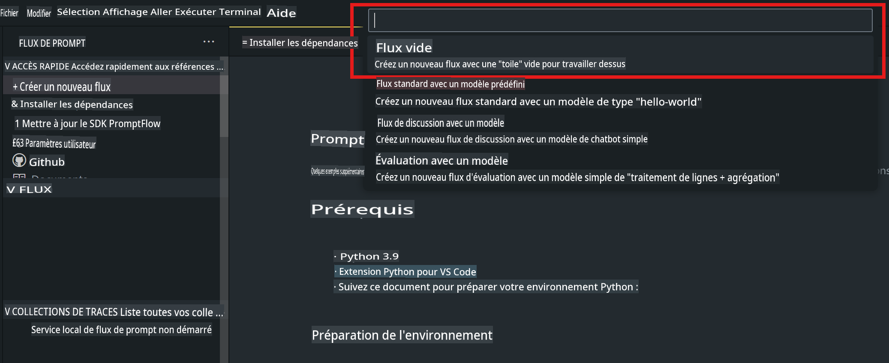
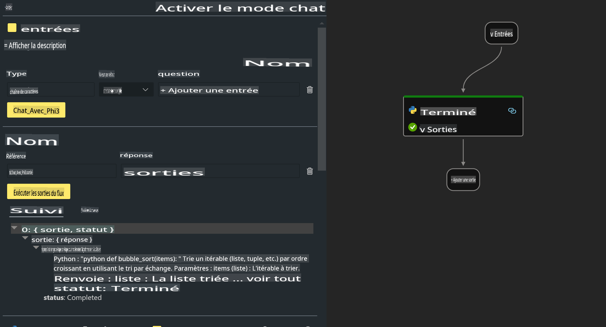

# **Lab 2 - Exécuter un flux Prompt avec Phi-3-mini dans AIPC**

## **Qu'est-ce que Prompt flow**

Prompt flow est une suite d'outils de développement conçue pour simplifier le cycle complet de développement des applications d'IA basées sur des modèles de langage (LLM), depuis l'idéation, le prototypage, les tests, l'évaluation jusqu'au déploiement en production et la surveillance. Il rend l'ingénierie des prompts beaucoup plus simple et vous permet de créer des applications LLM de qualité production.

Avec Prompt flow, vous pourrez :

- Créer des flux qui relient des LLM, des prompts, du code Python et d'autres outils dans un flux de travail exécutable.

- Déboguer et itérer vos flux, notamment l'interaction avec les LLM, en toute simplicité.

- Évaluer vos flux, calculer des métriques de qualité et de performance avec de grands ensembles de données.

- Intégrer les tests et évaluations dans votre système CI/CD pour garantir la qualité de votre flux.

- Déployer vos flux sur la plateforme de service de votre choix ou les intégrer facilement dans le code de votre application.

- (Optionnel mais fortement recommandé) Collaborer avec votre équipe en utilisant la version cloud de Prompt flow dans Azure AI.

## **Qu'est-ce qu'un AIPC**

Un PC IA est équipé d'un CPU, d'un GPU et d'un NPU, chacun disposant de capacités spécifiques d'accélération de l'IA. Un NPU, ou unité de traitement neuronal, est un accélérateur spécialisé qui gère les tâches d'intelligence artificielle (IA) et d'apprentissage automatique (ML) directement sur votre PC, au lieu d'envoyer les données à traiter dans le cloud. Le GPU et le CPU peuvent également traiter ces charges de travail, mais le NPU est particulièrement efficace pour les calculs IA à faible consommation d'énergie. Le PC IA représente un changement fondamental dans la manière dont nos ordinateurs fonctionnent. Ce n'est pas une solution à un problème qui n'existait pas auparavant. Il promet plutôt une amélioration significative des usages quotidiens des PC.

Alors, comment cela fonctionne-t-il ? Comparé à l'IA générative et aux grands modèles de langage (LLM) massifs entraînés sur d'énormes volumes de données publiques, l'IA qui fonctionnera sur votre PC est beaucoup plus accessible à presque tous les niveaux. Le concept est plus facile à comprendre, et comme il est entraîné sur vos données, sans besoin d'accéder au cloud, les avantages sont immédiatement plus attrayants pour un public plus large.

À court terme, le monde des PC IA implique des assistants personnels et de petits modèles IA fonctionnant directement sur votre PC, utilisant vos données pour offrir des améliorations IA personnelles, privées et plus sécurisées pour des tâches que vous effectuez déjà au quotidien – prendre des notes de réunion, organiser une ligue de football fantasy, automatiser des améliorations pour l'édition photo et vidéo, ou établir l'itinéraire parfait pour une réunion de famille en fonction des heures d'arrivée et de départ de chacun.

## **Créer des flux de génération de code sur AIPC**

***Note*** : Si vous n'avez pas terminé l'installation de l'environnement, veuillez consulter [Lab 0 - Installations](./01.Installations.md)

1. Ouvrez l'extension Prompt flow dans Visual Studio Code et créez un projet de flux vide.



2. Ajoutez des paramètres d'entrée et de sortie et ajoutez du code Python comme nouveau flux.



Vous pouvez vous référer à cette structure (flow.dag.yaml) pour construire votre flux :

```yaml

inputs:
  question:
    type: string
    default: how to write Bubble Algorithm
outputs:
  answer:
    type: string
    reference: ${Chat_With_Phi3.output}
nodes:
- name: Chat_With_Phi3
  type: python
  source:
    type: code
    path: Chat_With_Phi3.py
  inputs:
    question: ${inputs.question}


```

3. Ajoutez du code dans ***Chat_With_Phi3.py***.

```python


from promptflow.core import tool

# import torch
from transformers import AutoTokenizer, pipeline,TextStreamer
import intel_npu_acceleration_library as npu_lib

import warnings

import asyncio
import platform

class Phi3CodeAgent:
    
    model = None
    tokenizer = None
    text_streamer = None
    
    model_id = "microsoft/Phi-3-mini-4k-instruct"

    @staticmethod
    def init_phi3():
        
        if Phi3CodeAgent.model is None or Phi3CodeAgent.tokenizer is None or Phi3CodeAgent.text_streamer is None:
            Phi3CodeAgent.model = npu_lib.NPUModelForCausalLM.from_pretrained(
                                    Phi3CodeAgent.model_id,
                                    torch_dtype="auto",
                                    dtype=npu_lib.int4,
                                    trust_remote_code=True
                                )
            Phi3CodeAgent.tokenizer = AutoTokenizer.from_pretrained(Phi3CodeAgent.model_id)
            Phi3CodeAgent.text_streamer = TextStreamer(Phi3CodeAgent.tokenizer, skip_prompt=True)

    

    @staticmethod
    def chat_with_phi3(prompt):
        
        Phi3CodeAgent.init_phi3()

        messages = "<|system|>You are a AI Python coding assistant. Please help me to generate code in Python.The answer only genertated Python code, but any comments and instructions do not need to be generated<|end|><|user|>" + prompt +"<|end|><|assistant|>"


        generation_args = {
            "max_new_tokens": 1024,
            "return_full_text": False,
            "temperature": 0.3,
            "do_sample": False,
            "streamer": Phi3CodeAgent.text_streamer,
        }

        pipe = pipeline(
            "text-generation",
            model=Phi3CodeAgent.model,
            tokenizer=Phi3CodeAgent.tokenizer,
            # **generation_args
        )

        result = ''

        with warnings.catch_warnings():
            warnings.simplefilter("ignore")
            response = pipe(messages, **generation_args)
            result =response[0]['generated_text']
            return result


@tool
def my_python_tool(question: str) -> str:
    if platform.system() == 'Windows':
        asyncio.set_event_loop_policy(asyncio.WindowsSelectorEventLoopPolicy())
    return Phi3CodeAgent.chat_with_phi3(question)


```

4. Vous pouvez tester le flux via Debug ou Run pour vérifier si la génération de code fonctionne correctement.


5. Exécutez le flux comme une API de développement dans le terminal.

```

pf flow serve --source ./ --port 8080 --host localhost   

```

Vous pouvez le tester dans Postman / Thunder Client.

### **Remarque**

1. La première exécution prend beaucoup de temps. Il est recommandé de télécharger le modèle phi-3 depuis Hugging Face CLI.

2. Compte tenu de la puissance de calcul limitée du NPU Intel, il est recommandé d'utiliser Phi-3-mini-4k-instruct.

3. Nous utilisons l'accélération NPU Intel pour quantifier la conversion INT4, mais si vous relancez le service, vous devez supprimer les dossiers cache et nc_workshop.

## **Ressources**

1. Apprenez Promptflow [https://microsoft.github.io/promptflow/](https://microsoft.github.io/promptflow/)

2. Apprenez l'accélération NPU Intel [https://github.com/intel/intel-npu-acceleration-library](https://github.com/intel/intel-npu-acceleration-library)

3. Exemple de code, téléchargez [Exemple de code d'agent NPU local](../../../../../../../../../code/07.Lab/01/AIPC)

**Avertissement** :  
Ce document a été traduit à l'aide de services de traduction automatique basés sur l'intelligence artificielle. Bien que nous nous efforcions d'assurer l'exactitude, veuillez noter que les traductions automatisées peuvent contenir des erreurs ou des inexactitudes. Le document original dans sa langue d'origine doit être considéré comme la source faisant autorité. Pour des informations cruciales, il est recommandé de recourir à une traduction professionnelle effectuée par un humain. Nous déclinons toute responsabilité en cas de malentendus ou d'interprétations erronées résultant de l'utilisation de cette traduction.