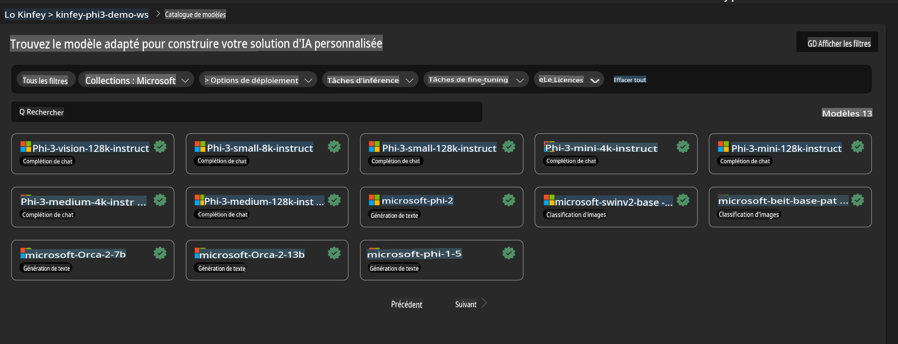
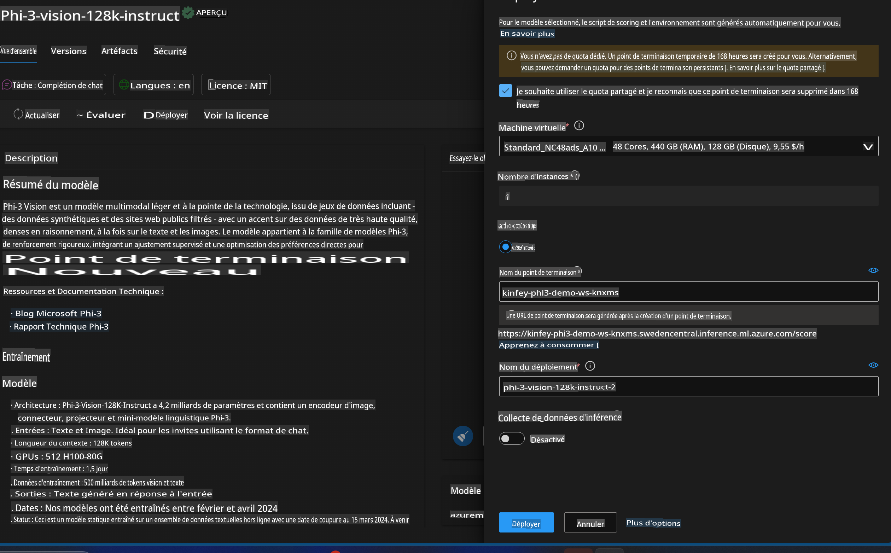
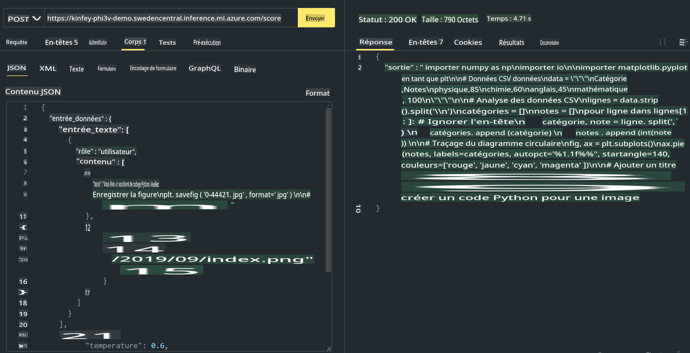

# **Lab 3 - Déployer Phi-3-Vision sur Azure Machine Learning Service**

Nous utilisons le NPU pour effectuer le déploiement en production du code local, puis nous souhaitons introduire la capacité de PHI-3-VISION afin de générer du code à partir d'images.

Dans cette introduction, nous allons rapidement construire un service Phi-3 Vision en tant que modèle en tant que service sur Azure Machine Learning Service.

***Note*** : Phi-3 Vision nécessite une puissance de calcul pour générer du contenu plus rapidement. Nous avons besoin de la puissance de calcul du cloud pour nous aider à atteindre cet objectif.

### **1. Créer un Azure Machine Learning Service**

Nous devons créer un Azure Machine Learning Service dans le portail Azure. Si vous souhaitez apprendre comment faire, veuillez consulter ce lien [https://learn.microsoft.com/azure/machine-learning/quickstart-create-resources?view=azureml-api-2](https://learn.microsoft.com/azure/machine-learning/quickstart-create-resources?view=azureml-api-2)

### **2. Choisir Phi-3 Vision dans Azure Machine Learning Service**



### **3. Déployer Phi-3-Vision sur Azure**



### **4. Tester l'Endpoint dans Postman**



***Note***

1. Les paramètres à transmettre doivent inclure Authorization, azureml-model-deployment et Content-Type. Vous devez vérifier les informations de déploiement pour les obtenir.

2. Pour transmettre des paramètres, Phi-3-Vision nécessite un lien d'image. Veuillez vous référer à la méthode GPT-4-Vision pour transmettre les paramètres, par exemple :

```json

{
  "input_data":{
    "input_string":[
      {
        "role":"user",
        "content":[ 
          {
            "type": "text",
            "text": "You are a Python coding assistant.Please create Python code for image "
          },
          {
              "type": "image_url",
              "image_url": {
                "url": "https://ajaytech.co/wp-content/uploads/2019/09/index.png"
              }
          }
        ]
      }
    ],
    "parameters":{
          "temperature": 0.6,
          "top_p": 0.9,
          "do_sample": false,
          "max_new_tokens": 2048
    }
  }
}

```

3. Appeler **/score** en utilisant la méthode Post.

**Félicitations** ! Vous avez terminé le déploiement rapide de PHI-3-VISION et expérimenté l'utilisation des images pour générer du code. Ensuite, nous pourrons construire des applications en combinant NPU et cloud.

**Avertissement** :  
Ce document a été traduit à l'aide de services de traduction automatique basés sur l'intelligence artificielle. Bien que nous nous efforcions d'assurer l'exactitude, veuillez noter que les traductions automatisées peuvent contenir des erreurs ou des inexactitudes. Le document original dans sa langue d'origine doit être considéré comme la source faisant autorité. Pour des informations critiques, il est recommandé de faire appel à une traduction humaine professionnelle. Nous déclinons toute responsabilité en cas de malentendus ou de mauvaises interprétations résultant de l'utilisation de cette traduction.