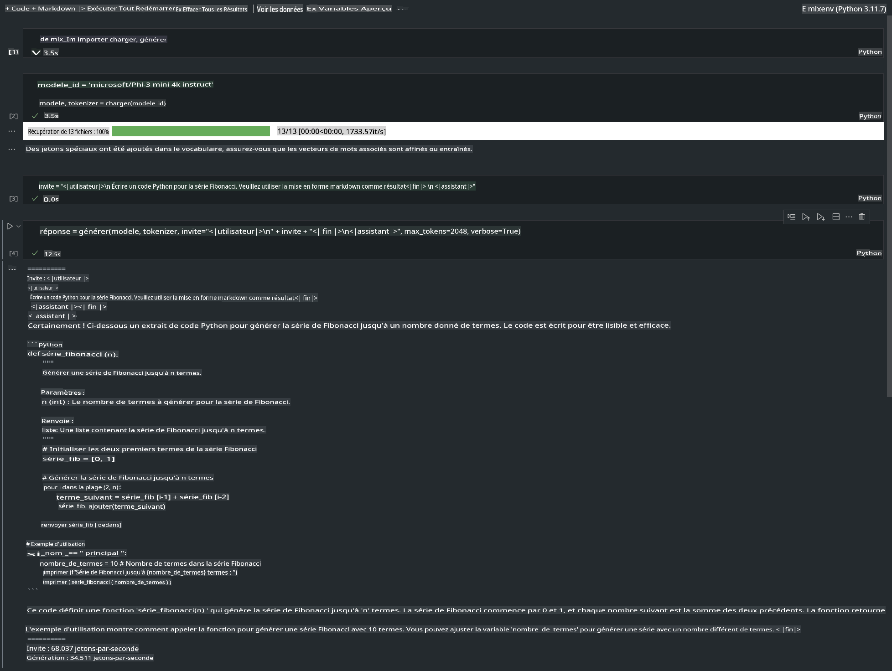

# **Inférence Phi-3 avec le framework Apple MLX**

## **Qu'est-ce que le framework MLX**

MLX est un framework dédié à la recherche en apprentissage automatique sur les puces Apple Silicon, développé par les équipes de recherche en apprentissage automatique d'Apple.

MLX a été conçu par des chercheurs en apprentissage automatique pour des chercheurs en apprentissage automatique. Le framework vise à être à la fois convivial et performant pour l'entraînement et le déploiement des modèles. Sa conception est également simple sur le plan conceptuel, afin de faciliter son extension et son amélioration par les chercheurs, avec pour objectif de tester rapidement de nouvelles idées.

Les modèles de langage de grande taille (LLMs) peuvent être accélérés sur les appareils Apple Silicon grâce à MLX, et les modèles peuvent être exécutés localement de manière très pratique.

## **Utiliser MLX pour inférer Phi-3-mini**

### **1. Configurez votre environnement MLX**

1. Python 3.11.x  
2. Installez la bibliothèque MLX  

```bash

pip install mlx-lm

```

### **2. Exécution de Phi-3-mini dans le Terminal avec MLX**

```bash

python -m mlx_lm.generate --model microsoft/Phi-3-mini-4k-instruct --max-token 2048 --prompt  "<|user|>\nCan you introduce yourself<|end|>\n<|assistant|>"

```

Le résultat (mon environnement est un Apple M1 Max, 64 Go) est :


### **3. Quantification de Phi-3-mini avec MLX dans le Terminal**

```bash

python -m mlx_lm.convert --hf-path microsoft/Phi-3-mini-4k-instruct

```

***Remarque :*** Le modèle peut être quantifié via mlx_lm.convert, et la quantification par défaut est en INT4. Cet exemple quantifie Phi-3-mini en INT4.

Le modèle peut être quantifié via mlx_lm.convert, et la quantification par défaut est en INT4. Cet exemple quantifie Phi-3-mini en INT4. Une fois quantifié, il sera stocké dans le répertoire par défaut ./mlx_model.

Nous pouvons tester le modèle quantifié avec MLX depuis le terminal.

```bash

python -m mlx_lm.generate --model ./mlx_model/ --max-token 2048 --prompt  "<|user|>\nCan you introduce yourself<|end|>\n<|assistant|>"

```

Le résultat est :


### **4. Exécution de Phi-3-mini avec MLX dans un Jupyter Notebook**



***Remarque :*** Veuillez consulter cet exemple [cliquez sur ce lien](../../../../../code/03.Inference/MLX/MLX_DEMO.ipynb)

## **Ressources**

1. Découvrez le framework Apple MLX [https://ml-explore.github.io](https://ml-explore.github.io/mlx/build/html/index.html)  

2. Dépôt GitHub Apple MLX [https://github.com/ml-explore](https://github.com/ml-explore)  

**Avertissement** :  
Ce document a été traduit à l'aide de services de traduction basés sur l'intelligence artificielle. Bien que nous nous efforcions d'assurer l'exactitude, veuillez noter que les traductions automatisées peuvent contenir des erreurs ou des inexactitudes. Le document original dans sa langue d'origine doit être considéré comme la source faisant autorité. Pour des informations critiques, il est recommandé de faire appel à une traduction humaine professionnelle. Nous déclinons toute responsabilité en cas de malentendus ou d'interprétations erronées résultant de l'utilisation de cette traduction.