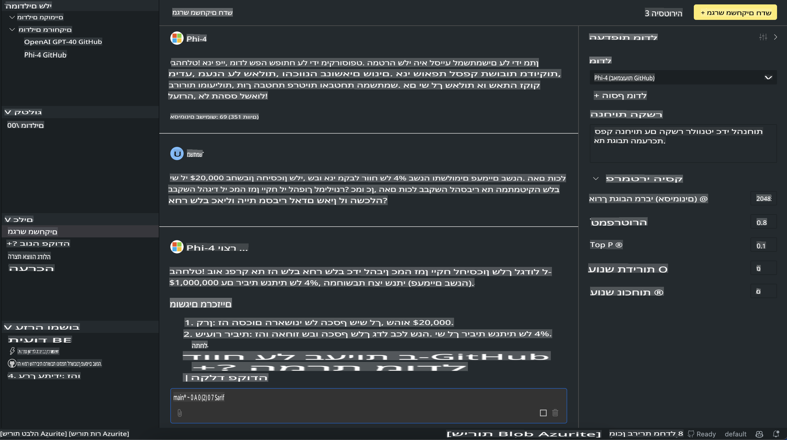

# משפחת Phi ב-AITK

[AI Toolkit for VS Code](https://marketplace.visualstudio.com/items?itemName=ms-windows-ai-studio.windows-ai-studio) מפשט את הפיתוח של אפליקציות AI גנרטיביות על ידי שילוב כלים מתקדמים לפיתוח AI ומודלים מתוך Azure AI Foundry Catalog וקטלוגים נוספים כמו Hugging Face. תוכלו לעיין בקטלוג המודלים של AI, להוריד אותם מקומית או מרחוק, לבצע כיוונון עדין, לבדוק ולהשתמש בהם באפליקציה שלכם.

גרסת התצוגה המקדימה של AI Toolkit פועלת מקומית. אינפרנס מקומי או כיוונון עדין תלויים במודל שתבחרו, וייתכן שתצטרכו GPU כמו NVIDIA CUDA GPU. תוכלו גם להריץ מודלים של GitHub ישירות עם AITK.

## התחלת עבודה

[למדו עוד כיצד להתקין את מערכת המשנה של Windows עבור Linux](https://learn.microsoft.com/windows/wsl/install?WT.mc_id=aiml-137032-kinfeylo)

וכן [כיצד לשנות את הפצת ברירת המחדל](https://learn.microsoft.com/windows/wsl/install#change-the-default-linux-distribution-installed).

[מאגר GitHub של AI Toolkit](https://github.com/microsoft/vscode-ai-toolkit/)

- Windows, Linux, macOS
  
- לצורך כיוונון עדין הן ב-Windows והן ב-Linux, תצטרכו GPU של Nvidia. בנוסף, **Windows** דורשת את מערכת המשנה עבור Linux עם הפצת Ubuntu 18.4 או גרסה חדשה יותר. [למדו עוד כיצד להתקין את מערכת המשנה של Windows עבור Linux](https://learn.microsoft.com/windows/wsl/install) וכן [כיצד לשנות את הפצת ברירת המחדל](https://learn.microsoft.com/windows/wsl/install#change-the-default-linux-distribution-installed).

### התקנת AI Toolkit

AI Toolkit מגיע כתוסף ל-[Visual Studio Code](https://code.visualstudio.com/docs/setup/additional-components#_vs-code-extensions), ולכן תחילה תצטרכו להתקין את [VS Code](https://code.visualstudio.com/docs/setup/windows?WT.mc_id=aiml-137032-kinfeylo) ולהוריד את AI Toolkit מ-[VS Marketplace](https://marketplace.visualstudio.com/items?itemName=ms-windows-ai-studio.windows-ai-studio).
[AI Toolkit זמין ב-Visual Studio Marketplace](https://marketplace.visualstudio.com/items?itemName=ms-windows-ai-studio.windows-ai-studio) וניתן להתקינו כמו כל תוסף אחר ל-VS Code.

אם אינכם מכירים את תהליך התקנת תוספי VS Code, בצעו את השלבים הבאים:

### התחברות

1. בסרגל הפעילות ב-VS Code בחרו **Extensions**  
1. בשורת החיפוש של התוספים הקלידו "AI Toolkit"  
1. בחרו את "AI Toolkit for Visual Studio code"  
1. בחרו **Install**  

כעת, אתם מוכנים להשתמש בתוסף!

תתבקשו להתחבר ל-GitHub, אנא לחצו "Allow" כדי להמשיך. תופנו לדף ההתחברות של GitHub.

התחברו ועקבו אחר שלבי התהליך. לאחר השלמתו בהצלחה, תופנו חזרה ל-VS Code.

לאחר התקנת התוסף, יופיע סמל AI Toolkit בסרגל הפעילות שלכם.

בואו נחקור את הפעולות הזמינות!

### פעולות זמינות

סרגל הצד הראשי של AI Toolkit מאורגן לקטגוריות הבאות:  

- **Models**  
- **Resources**  
- **Playground**  
- **Fine-tuning**  
- **Evaluation**

כל אלו זמינים תחת הקטגוריה Resources. כדי להתחיל, בחרו **Model Catalog**.

### הורדת מודל מהקטלוג

לאחר השקת AI Toolkit מתוך סרגל הצד של VS Code, תוכלו לבחור מתוך האפשרויות הבאות:


- מצאו מודל נתמך מתוך **Model Catalog** והורידו אותו מקומית  
- בדקו אינפרנס של מודל ב-**Model Playground**  
- בצעו כיוונון עדין למודל מקומית או מרחוק ב-**Model Fine-tuning**  
- פרסו מודלים שעברו כיוונון עדין לענן דרך Command Palette של AI Toolkit  
- בצעו הערכת מודלים  

> [!NOTE]
>
> **GPU מול CPU**
>
> תשימו לב שכרטיסי המודל מציגים את גודל המודל, הפלטפורמה וסוג המאיץ (CPU, GPU). לביצועים מיטביים על **מכשירי Windows עם לפחות GPU אחד**, בחרו גרסאות מודל שמיועדות ל-Windows בלבד.
>
> כך תבטיחו שיש לכם מודל מותאם למאיץ DirectML.
>
> שמות המודלים מופיעים בפורמט  
>
> - `{model_name}-{accelerator}-{quantization}-{format}`.  
>
>כדי לבדוק אם יש לכם GPU במכשיר Windows שלכם, פתחו את **מנהל המשימות** ואז בחרו בלשונית **ביצועים**. אם יש לכם GPU, הם יופיעו תחת שמות כמו "GPU 0" או "GPU 1".

### הרצת מודל ב-Playground

לאחר שכל הפרמטרים מוגדרים, לחצו על **Generate Project**.

לאחר הורדת המודל, בחרו **Load in Playground** בכרטיס המודל שבקטלוג:

- יזמו את הורדת המודל  
- התקינו את כל הדרישות והתלויות  
- צרו סביבת עבודה ב-VS Code  



### שימוש ב-REST API באפליקציה שלכם  

AI Toolkit מגיע עם שרת REST API מקומי **בפורט 5272** שמשתמש בפורמט [OpenAI chat completions](https://platform.openai.com/docs/api-reference/chat/create).  

זה מאפשר לכם לבדוק את האפליקציה שלכם מקומית מבלי להסתמך על שירות מודלים בענן. לדוגמה, קובץ JSON הבא מראה כיצד להגדיר את גוף הבקשה:

```json
{
    "model": "Phi-4",
    "messages": [
        {
            "role": "user",
            "content": "what is the golden ratio?"
        }
    ],
    "temperature": 0.7,
    "top_p": 1,
    "top_k": 10,
    "max_tokens": 100,
    "stream": true
}
```

תוכלו לבדוק את ה-REST API באמצעות (לדוגמה) [Postman](https://www.postman.com/) או כלי CURL:

```bash
curl -vX POST http://127.0.0.1:5272/v1/chat/completions -H 'Content-Type: application/json' -d @body.json
```

### שימוש בספריית OpenAI ל-Python

```python
from openai import OpenAI

client = OpenAI(
    base_url="http://127.0.0.1:5272/v1/", 
    api_key="x" # required for the API but not used
)

chat_completion = client.chat.completions.create(
    messages=[
        {
            "role": "user",
            "content": "what is the golden ratio?",
        }
    ],
    model="Phi-4",
)

print(chat_completion.choices[0].message.content)
```

### שימוש בספריית Azure OpenAI ל-.NET

הוסיפו את [ספריית Azure OpenAI ל-.NET](https://www.nuget.org/packages/Azure.AI.OpenAI/) לפרויקט שלכם באמצעות NuGet:

```bash
dotnet add {project_name} package Azure.AI.OpenAI --version 1.0.0-beta.17
```

הוסיפו קובץ C# בשם **OverridePolicy.cs** לפרויקט שלכם והדביקו את הקוד הבא:

```csharp
// OverridePolicy.cs
using Azure.Core.Pipeline;
using Azure.Core;

internal partial class OverrideRequestUriPolicy(Uri overrideUri)
    : HttpPipelineSynchronousPolicy
{
    private readonly Uri _overrideUri = overrideUri;

    public override void OnSendingRequest(HttpMessage message)
    {
        message.Request.Uri.Reset(_overrideUri);
    }
}
```

לאחר מכן, הדביקו את הקוד הבא בקובץ **Program.cs** שלכם:

```csharp
// Program.cs
using Azure.AI.OpenAI;

Uri localhostUri = new("http://localhost:5272/v1/chat/completions");

OpenAIClientOptions clientOptions = new();
clientOptions.AddPolicy(
    new OverrideRequestUriPolicy(localhostUri),
    Azure.Core.HttpPipelinePosition.BeforeTransport);
OpenAIClient client = new(openAIApiKey: "unused", clientOptions);

ChatCompletionsOptions options = new()
{
    DeploymentName = "Phi-4",
    Messages =
    {
        new ChatRequestSystemMessage("You are a helpful assistant. Be brief and succinct."),
        new ChatRequestUserMessage("What is the golden ratio?"),
    }
};

StreamingResponse<StreamingChatCompletionsUpdate> streamingChatResponse
    = await client.GetChatCompletionsStreamingAsync(options);

await foreach (StreamingChatCompletionsUpdate chatChunk in streamingChatResponse)
{
    Console.Write(chatChunk.ContentUpdate);
}
```

## כיוונון עדין עם AI Toolkit

- התחילו עם גילוי מודלים ו-Playground.  
- כיוונון עדין ואינפרנס באמצעות משאבי מחשוב מקומיים.  
- כיוונון עדין ואינפרנס מרחוק באמצעות משאבי Azure.  

[כיוונון עדין עם AI Toolkit](../../03.FineTuning/Finetuning_VSCodeaitoolkit.md)

## משאבי Q&A של AI Toolkit

אנא עיינו ב-[עמוד Q&A](https://github.com/microsoft/vscode-ai-toolkit/blob/main/archive/QA.md) שלנו עבור בעיות נפוצות ופתרונות.

**כתב ויתור**:  
מסמך זה תורגם באמצעות שירותי תרגום מבוססי בינה מלאכותית. למרות שאנו שואפים לדיוק, יש לקחת בחשבון שתרגומים אוטומטיים עלולים להכיל שגיאות או אי-דיוקים. המסמך המקורי בשפתו המקורית צריך להיחשב כמקור הסמכותי. למידע קריטי, מומלץ להשתמש בתרגום מקצועי על ידי בני אדם. איננו נושאים באחריות לאי-הבנות או לפרשנויות שגויות הנובעות משימוש בתרגום זה.