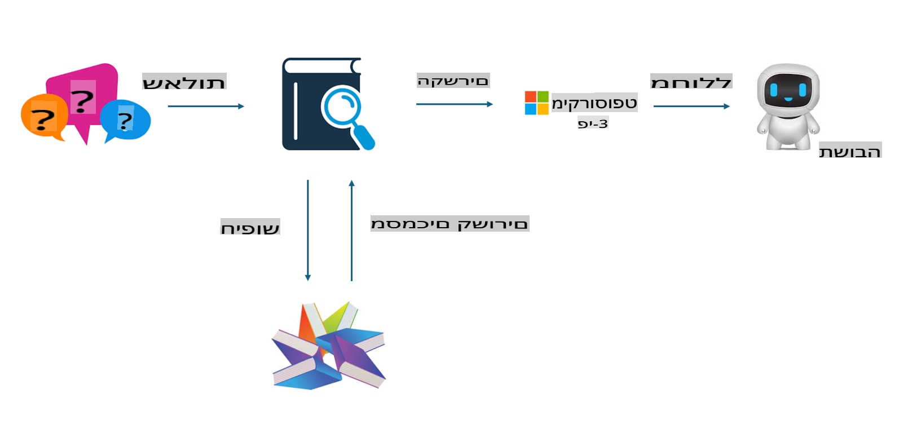

## כיוונון עדין לעומת RAG

## יצירת תוכן מוגברת על ידי שליפה

RAG הוא שילוב של שליפת נתונים ויצירת טקסט. הנתונים המובנים והלא-מובנים של הארגון מאוחסנים במסד נתונים וקטורי. בעת חיפוש תוכן רלוונטי, מסכמים ומוצאים תוכן מתאים כדי ליצור הקשר, ומשלבים את יכולות ההשלמה הטקסטואלית של LLM/SLM ליצירת תוכן.

## תהליך RAG

## כיוונון עדין
כיוונון עדין מבוסס על שיפור של מודל מסוים. אין צורך להתחיל מאלגוריתם המודל, אך יש לצבור נתונים באופן מתמשך. אם נדרשת טרמינולוגיה מדויקת יותר וביטויים מותאמים לשפה בתחום מסוים, כיוונון עדין הוא הבחירה הטובה יותר. עם זאת, אם הנתונים שלך משתנים לעיתים קרובות, כיוונון עדין עשוי להפוך למורכב.

## איך לבחור
אם התשובה שלנו דורשת שילוב נתונים חיצוניים, RAG הוא הבחירה הטובה ביותר.

אם נדרשת יציאה של ידע תעשייתי יציב ומדויק, כיוונון עדין יהיה בחירה טובה. RAG מתמקד בשליפת תוכן רלוונטי, אך ייתכן שלא תמיד יקלוט את הדקויות המיוחדות.

כיוונון עדין דורש מערך נתונים איכותי, ואם מדובר בטווח נתונים קטן בלבד, לא תהיה לכך השפעה רבה. RAG הוא גמיש יותר.  
כיוונון עדין הוא מעין "קופסה שחורה", קשה להבין את המנגנון הפנימי שלו. לעומת זאת, RAG מאפשר למצוא ביתר קלות את מקור הנתונים, מה שמסייע בתיקון טעויות או הזיות תוכן ומספק שקיפות טובה יותר.

**הצהרת אחריות**:  
מסמך זה תורגם באמצעות שירותי תרגום מבוססי בינה מלאכותית. בעוד שאנו שואפים לדיוק, יש לקחת בחשבון שתרגומים אוטומטיים עשויים להכיל שגיאות או אי-דיוקים. המסמך המקורי בשפתו המקורית הוא המקור הסמכותי שיש להתייחס אליו. עבור מידע קריטי, מומלץ להשתמש בשירותי תרגום מקצועיים על ידי בני אדם. איננו נושאים באחריות לאי-הבנות או לפרשנויות שגויות הנובעות משימוש בתרגום זה.