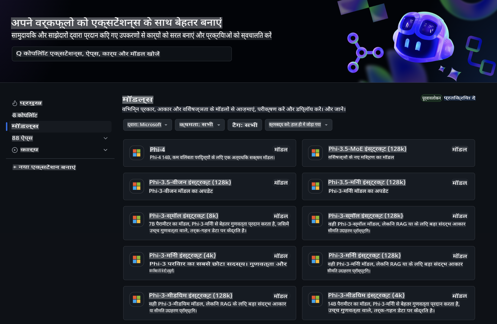
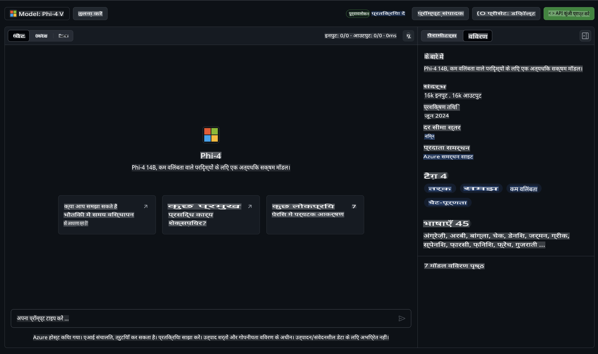
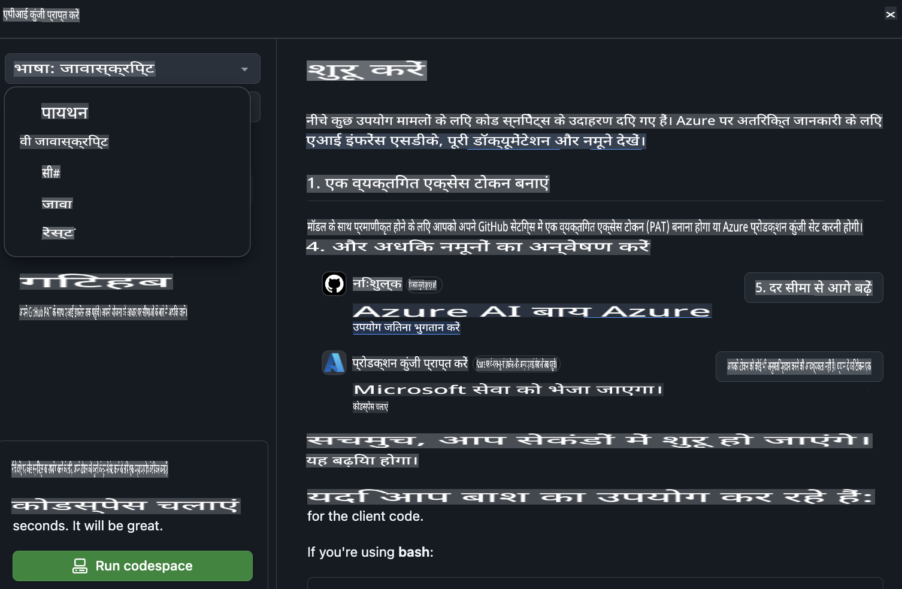
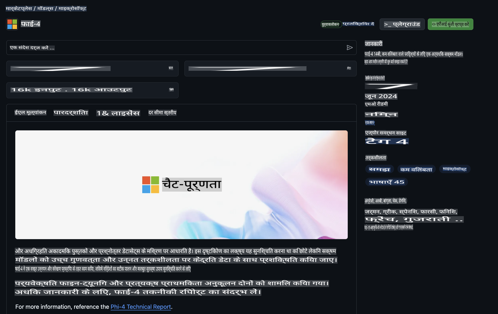

## GitHub मॉडल्स में Phi परिवार

[GitHub Models](https://github.com/marketplace/models) में आपका स्वागत है! हमने Azure AI पर होस्ट किए गए AI मॉडल्स को एक्सप्लोर करने के लिए सब कुछ तैयार कर दिया है।



GitHub Models पर उपलब्ध मॉडल्स के बारे में अधिक जानकारी के लिए [GitHub Model Marketplace](https://github.com/marketplace/models) देखें।

## उपलब्ध मॉडल्स

प्रत्येक मॉडल के लिए एक समर्पित प्लेग्राउंड और सैंपल कोड उपलब्ध है।



### GitHub Model Catalog में Phi परिवार

- [Phi-4](https://github.com/marketplace/models/azureml/Phi-4)

- [Phi-3.5-MoE instruct (128k)](https://github.com/marketplace/models/azureml/Phi-3-5-MoE-instruct)

- [Phi-3.5-vision instruct (128k)](https://github.com/marketplace/models/azureml/Phi-3-5-vision-instruct)

- [Phi-3.5-mini instruct (128k)](https://github.com/marketplace/models/azureml/Phi-3-5-mini-instruct)

- [Phi-3-Medium-128k-Instruct](https://github.com/marketplace/models/azureml/Phi-3-medium-128k-instruct)

- [Phi-3-medium-4k-instruct](https://github.com/marketplace/models/azureml/Phi-3-medium-4k-instruct)

- [Phi-3-mini-128k-instruct](https://github.com/marketplace/models/azureml/Phi-3-mini-128k-instruct)

- [Phi-3-mini-4k-instruct](https://github.com/marketplace/models/azureml/Phi-3-mini-4k-instruct)

- [Phi-3-small-128k-instruct](https://github.com/marketplace/models/azureml/Phi-3-small-128k-instruct)

- [Phi-3-small-8k-instruct](https://github.com/marketplace/models/azureml/Phi-3-small-8k-instruct)

## शुरुआत करें

हमने आपके लिए चलाने के लिए कुछ बेसिक उदाहरण तैयार किए हैं। आप इन्हें सैंपल्स डायरेक्टरी में पा सकते हैं। यदि आप सीधे अपनी पसंदीदा भाषा पर जाना चाहते हैं, तो आप निम्न भाषाओं में उदाहरण पा सकते हैं:

- Python  
- JavaScript  
- C#  
- Java  
- cURL  

सैंपल्स और मॉडल्स चलाने के लिए एक समर्पित Codespaces Environment भी उपलब्ध है।



## सैंपल कोड

नीचे कुछ उपयोग मामलों के लिए उदाहरण कोड स्निपेट दिए गए हैं। Azure AI Inference SDK के बारे में अतिरिक्त जानकारी के लिए, पूरी डाक्यूमेंटेशन और सैंपल्स देखें।

## सेटअप

1. एक व्यक्तिगत एक्सेस टोकन बनाएं  
आपको टोकन को किसी भी प्रकार की अनुमति देने की आवश्यकता नहीं है। ध्यान दें कि यह टोकन एक Microsoft सेवा को भेजा जाएगा।

नीचे दिए गए कोड स्निपेट्स का उपयोग करने के लिए, एक environment variable बनाएं और अपने टोकन को क्लाइंट कोड के लिए key के रूप में सेट करें।

यदि आप bash का उपयोग कर रहे हैं:  
```
export GITHUB_TOKEN="<your-github-token-goes-here>"
```  
यदि आप powershell में हैं:  

```
$Env:GITHUB_TOKEN="<your-github-token-goes-here>"
```  

यदि आप Windows command prompt का उपयोग कर रहे हैं:  

```
set GITHUB_TOKEN=<your-github-token-goes-here>
```  

## Python सैंपल

### डिपेंडेंसी इंस्टॉल करें  
pip का उपयोग करके Azure AI Inference SDK इंस्टॉल करें (आवश्यक: Python >=3.8):  

```
pip install azure-ai-inference
```  

### एक बेसिक कोड सैंपल चलाएं  

यह सैंपल chat completion API के लिए एक बेसिक कॉल को दर्शाता है। यह GitHub AI मॉडल inference endpoint और आपके GitHub टोकन का उपयोग कर रहा है। यह कॉल synchronous है।  

```python
import os
from azure.ai.inference import ChatCompletionsClient
from azure.ai.inference.models import SystemMessage, UserMessage
from azure.core.credentials import AzureKeyCredential

endpoint = "https://models.inference.ai.azure.com"
model_name = "Phi-4"
token = os.environ["GITHUB_TOKEN"]

client = ChatCompletionsClient(
    endpoint=endpoint,
    credential=AzureKeyCredential(token),
)

response = client.complete(
    messages=[
        UserMessage(content="I have $20,000 in my savings account, where I receive a 4% profit per year and payments twice a year. Can you please tell me how long it will take for me to become a millionaire? Also, can you please explain the math step by step as if you were explaining it to an uneducated person?"),
    ],
    temperature=0.4,
    top_p=1.0,
    max_tokens=2048,
    model=model_name
)

print(response.choices[0].message.content)
```  

### एक मल्टी-टर्न बातचीत चलाएं  

यह सैंपल chat completion API के साथ एक मल्टी-टर्न बातचीत को दर्शाता है। जब आप मॉडल का उपयोग एक चैट एप्लिकेशन के लिए करते हैं, तो आपको उस बातचीत का इतिहास प्रबंधित करना होगा और नवीनतम संदेश मॉडल को भेजने होंगे।  

```
import os
from azure.ai.inference import ChatCompletionsClient
from azure.ai.inference.models import AssistantMessage, SystemMessage, UserMessage
from azure.core.credentials import AzureKeyCredential

token = os.environ["GITHUB_TOKEN"]
endpoint = "https://models.inference.ai.azure.com"
# Replace Model_Name
model_name = "Phi-4"

client = ChatCompletionsClient(
    endpoint=endpoint,
    credential=AzureKeyCredential(token),
)

messages = [
    SystemMessage(content="You are a helpful assistant."),
    UserMessage(content="What is the capital of France?"),
    AssistantMessage(content="The capital of France is Paris."),
    UserMessage(content="What about Spain?"),
]

response = client.complete(messages=messages, model=model_name)

print(response.choices[0].message.content)
```  

### आउटपुट को स्ट्रीम करें  

बेहतर उपयोगकर्ता अनुभव के लिए, आप मॉडल की प्रतिक्रिया को स्ट्रीम करना चाहेंगे ताकि पहला टोकन जल्दी दिखाई दे और लंबे जवाबों का इंतजार न करना पड़े।  

```
import os
from azure.ai.inference import ChatCompletionsClient
from azure.ai.inference.models import SystemMessage, UserMessage
from azure.core.credentials import AzureKeyCredential

token = os.environ["GITHUB_TOKEN"]
endpoint = "https://models.inference.ai.azure.com"
# Replace Model_Name
model_name = "Phi-4"

client = ChatCompletionsClient(
    endpoint=endpoint,
    credential=AzureKeyCredential(token),
)

response = client.complete(
    stream=True,
    messages=[
        SystemMessage(content="You are a helpful assistant."),
        UserMessage(content="Give me 5 good reasons why I should exercise every day."),
    ],
    model=model_name,
)

for update in response:
    if update.choices:
        print(update.choices[0].delta.content or "", end="")

client.close()
```  

## GitHub Models के लिए मुफ्त उपयोग और दर सीमाएं  



[प्लेग्राउंड और मुफ्त API उपयोग के लिए दर सीमाएं](https://docs.github.com/en/github-models/prototyping-with-ai-models#rate-limits) आपको मॉडल्स के साथ प्रयोग करने और अपनी AI एप्लिकेशन को प्रोटोटाइप करने में मदद करने के लिए बनाई गई हैं। इन सीमाओं से आगे के उपयोग के लिए, और अपनी एप्लिकेशन को स्केल पर लाने के लिए, आपको Azure खाते से संसाधन प्रोविजन करना होगा और वहां से प्रमाणित करना होगा, बजाय अपने GitHub व्यक्तिगत एक्सेस टोकन के। आपको अपने कोड में और कुछ बदलने की आवश्यकता नहीं है। Azure AI में मुफ्त स्तर की सीमाओं से परे जाने के तरीके के बारे में जानने के लिए इस लिंक का उपयोग करें।  

### प्रकटीकरण  

याद रखें, जब आप किसी मॉडल के साथ इंटरैक्ट कर रहे हैं, तो आप AI के साथ प्रयोग कर रहे हैं, इसलिए सामग्री में गलतियाँ संभव हैं।  

यह फीचर विभिन्न सीमाओं (जैसे प्रति मिनट अनुरोध, प्रति दिन अनुरोध, प्रति अनुरोध टोकन, और समवर्ती अनुरोध) के अधीन है और प्रोडक्शन उपयोग के मामलों के लिए डिज़ाइन नहीं किया गया है।  

GitHub Models Azure AI Content Safety का उपयोग करता है। GitHub Models अनुभव के हिस्से के रूप में इन फ़िल्टरों को बंद नहीं किया जा सकता। यदि आप भुगतान सेवा के माध्यम से मॉडल्स का उपयोग करने का निर्णय लेते हैं, तो कृपया अपनी आवश्यकताओं को पूरा करने के लिए अपने सामग्री फ़िल्टर को कॉन्फ़िगर करें।  

यह सेवा GitHub की प्री-रिलीज़ शर्तों के अंतर्गत है।  

**अस्वीकरण**:  
यह दस्तावेज़ मशीन-आधारित एआई अनुवाद सेवाओं का उपयोग करके अनुवादित किया गया है। जबकि हम सटीकता के लिए प्रयास करते हैं, कृपया ध्यान दें कि स्वचालित अनुवाद में त्रुटियां या अशुद्धियां हो सकती हैं। मूल भाषा में मूल दस्तावेज़ को प्रामाणिक स्रोत माना जाना चाहिए। महत्वपूर्ण जानकारी के लिए, पेशेवर मानव अनुवाद की सिफारिश की जाती है। इस अनुवाद के उपयोग से उत्पन्न किसी भी गलतफहमी या गलत व्याख्या के लिए हम उत्तरदायी नहीं हैं।