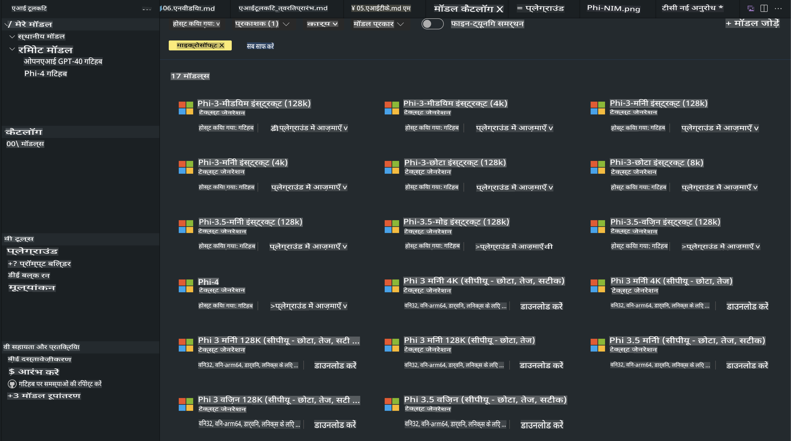
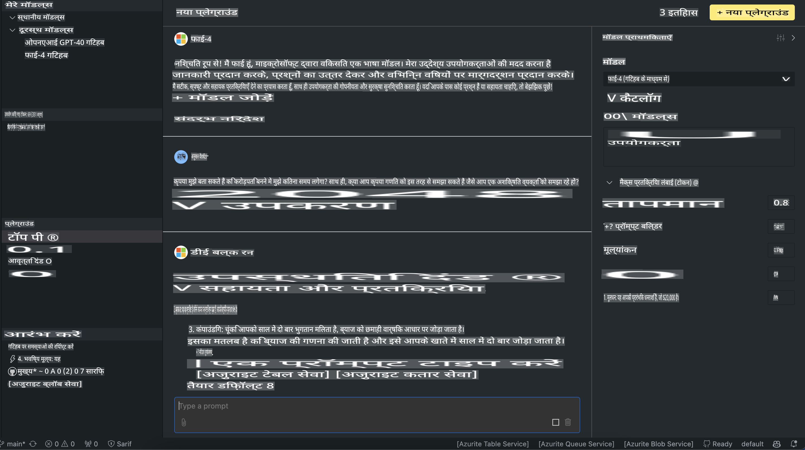

# AITK में Phi परिवार

[VS Code के लिए AI Toolkit](https://marketplace.visualstudio.com/items?itemName=ms-windows-ai-studio.windows-ai-studio) जेनरेटिव AI ऐप डेवलपमेंट को आसान बनाता है। यह Azure AI Foundry Catalog और Hugging Face जैसे अन्य कैटलॉग से अत्याधुनिक AI डेवलपमेंट टूल्स और मॉडल्स को एक साथ लाता है। आप GitHub Models और Azure AI Foundry Model Catalogs द्वारा संचालित AI मॉडल कैटलॉग ब्राउज़ कर सकते हैं, उन्हें लोकल या रिमोट डाउनलोड कर सकते हैं, फाइन-ट्यून कर सकते हैं, टेस्ट कर सकते हैं और अपने एप्लिकेशन में उपयोग कर सकते हैं।

AI Toolkit प्रीव्यू लोकल रूप से चलेगा। लोकल इंफरेंस या फाइन-ट्यून, आपके द्वारा चुने गए मॉडल पर निर्भर करता है। इसके लिए आपको NVIDIA CUDA GPU जैसे GPU की आवश्यकता हो सकती है। आप AITK के साथ GitHub Models को सीधे भी चला सकते हैं।

## शुरू करें

[Windows Subsystem for Linux को इंस्टॉल करने के बारे में और जानें](https://learn.microsoft.com/windows/wsl/install?WT.mc_id=aiml-137032-kinfeylo)

और [डिफ़ॉल्ट डिस्ट्रीब्यूशन बदलना](https://learn.microsoft.com/windows/wsl/install#change-the-default-linux-distribution-installed)।

[AI Toolkit GitHub Repo](https://github.com/microsoft/vscode-ai-toolkit/)

- Windows, Linux, macOS
  
- Windows और Linux दोनों पर फाइन-ट्यूनिंग के लिए, आपको Nvidia GPU की आवश्यकता होगी। इसके अलावा, **Windows** पर Ubuntu 18.4 या उससे अधिक के साथ Linux के लिए सबसिस्टम की आवश्यकता होती है। [Windows Subsystem for Linux को इंस्टॉल करने के बारे में और जानें](https://learn.microsoft.com/windows/wsl/install) और [डिफ़ॉल्ट डिस्ट्रीब्यूशन बदलना](https://learn.microsoft.com/windows/wsl/install#change-the-default-linux-distribution-installed)।

### AI Toolkit इंस्टॉल करें

AI Toolkit एक [Visual Studio Code Extension](https://code.visualstudio.com/docs/setup/additional-components#_vs-code-extensions) के रूप में आता है, इसलिए आपको पहले [VS Code](https://code.visualstudio.com/docs/setup/windows?WT.mc_id=aiml-137032-kinfeylo) इंस्टॉल करना होगा और फिर [VS Marketplace](https://marketplace.visualstudio.com/items?itemName=ms-windows-ai-studio.windows-ai-studio) से AI Toolkit डाउनलोड करना होगा।  
[AI Toolkit Visual Studio Marketplace में उपलब्ध है](https://marketplace.visualstudio.com/items?itemName=ms-windows-ai-studio.windows-ai-studio) और इसे किसी अन्य VS Code एक्सटेंशन की तरह इंस्टॉल किया जा सकता है।

अगर आप VS Code एक्सटेंशन्स इंस्टॉल करने से परिचित नहीं हैं, तो इन स्टेप्स का पालन करें:

### साइन इन करें

1. VS Code में **Activity Bar** में **Extensions** चुनें  
2. Extensions सर्च बार में "AI Toolkit" टाइप करें  
3. "AI Toolkit for Visual Studio code" चुनें  
4. **Install** चुनें  

अब, आप एक्सटेंशन का उपयोग करने के लिए तैयार हैं!

आपसे GitHub में साइन इन करने के लिए कहा जाएगा, कृपया "Allow" पर क्लिक करें। आपको GitHub साइनिंग पेज पर रीडायरेक्ट किया जाएगा।

कृपया साइन इन करें और प्रक्रिया के स्टेप्स को फॉलो करें। सफलतापूर्वक पूरा होने के बाद, आप VS Code पर रीडायरेक्ट हो जाएंगे।

एक्सटेंशन इंस्टॉल हो जाने के बाद, आप अपनी Activity Bar में AI Toolkit का आइकन देखेंगे।

चलिए उपलब्ध एक्शन्स को एक्सप्लोर करते हैं!

### उपलब्ध एक्शन्स

AI Toolkit का प्राइमरी साइडबार इस प्रकार व्यवस्थित है:

- **Models**  
- **Resources**  
- **Playground**  
- **Fine-tuning**  
- **Evaluation**  

Resources सेक्शन में उपलब्ध हैं। शुरू करने के लिए **Model Catalog** चुनें।

### कैटलॉग से मॉडल डाउनलोड करें

VS Code साइडबार से AI Toolkit लॉन्च करने पर, आप निम्नलिखित विकल्पों में से चुन सकते हैं:



- **Model Catalog** से एक समर्थित मॉडल खोजें और लोकल डाउनलोड करें  
- **Model Playground** में मॉडल इंफरेंस टेस्ट करें  
- **Model Fine-tuning** में लोकल या रिमोट मॉडल को फाइन-ट्यून करें  
- फाइन-ट्यून किए गए मॉडल को AI Toolkit के कमांड पैलेट के जरिए क्लाउड पर डिप्लॉय करें  
- मॉडल्स का मूल्यांकन करें  

> [!NOTE]
>
> **GPU बनाम CPU**
>
> आप देखेंगे कि मॉडल कार्ड में मॉडल का साइज, प्लेटफ़ॉर्म और एक्सेलेरेटर टाइप (CPU, GPU) दिखाया गया है। **Windows डिवाइस जिनमें कम से कम एक GPU है** पर ऑप्टिमाइज़्ड परफॉर्मेंस के लिए, केवल Windows को टारगेट करने वाले मॉडल वर्ज़न चुनें।
>
> यह सुनिश्चित करता है कि आपके पास DirectML एक्सेलेरेटर के लिए ऑप्टिमाइज़्ड मॉडल है।  
>
> मॉडल नाम इस फॉर्मेट में होते हैं:
>
> - `{model_name}-{accelerator}-{quantization}-{format}`।
>
> यह जांचने के लिए कि आपके Windows डिवाइस में GPU है या नहीं, **Task Manager** खोलें और फिर **Performance** टैब चुनें। यदि आपके पास GPU(s) हैं, तो वे "GPU 0" या "GPU 1" जैसे नामों के तहत सूचीबद्ध होंगे।

### प्लेग्राउंड में मॉडल चलाएं

सभी पैरामीटर्स सेट हो जाने के बाद, **Generate Project** पर क्लिक करें।

एक बार आपका मॉडल डाउनलोड हो जाने के बाद, कैटलॉग में मॉडल कार्ड पर **Load in Playground** चुनें:

- मॉडल डाउनलोड शुरू करें  
- सभी प्रीरेक्विज़िट्स और डिपेंडेंसीज़ इंस्टॉल करें  
- VS Code वर्कस्पेस बनाएं  



### अपने एप्लिकेशन में REST API का उपयोग करें

AI Toolkit एक लोकल REST API वेब सर्वर **पोर्ट 5272** पर प्रदान करता है जो [OpenAI चैट कम्प्लीशन फॉर्मेट](https://platform.openai.com/docs/api-reference/chat/create) का उपयोग करता है।  

यह आपको क्लाउड AI मॉडल सर्विस पर निर्भर हुए बिना अपने एप्लिकेशन का लोकल टेस्ट करने की सुविधा देता है। उदाहरण के लिए, निम्न JSON फ़ाइल दिखाती है कि अनुरोध के बॉडी को कैसे कॉन्फ़िगर किया जाए:

```json
{
    "model": "Phi-4",
    "messages": [
        {
            "role": "user",
            "content": "what is the golden ratio?"
        }
    ],
    "temperature": 0.7,
    "top_p": 1,
    "top_k": 10,
    "max_tokens": 100,
    "stream": true
}
```

आप REST API को (जैसे) [Postman](https://www.postman.com/) या CURL (Client URL) यूटिलिटी का उपयोग करके टेस्ट कर सकते हैं:

```bash
curl -vX POST http://127.0.0.1:5272/v1/chat/completions -H 'Content-Type: application/json' -d @body.json
```

### OpenAI क्लाइंट लाइब्रेरी का उपयोग करना (Python के लिए)

```python
from openai import OpenAI

client = OpenAI(
    base_url="http://127.0.0.1:5272/v1/", 
    api_key="x" # required for the API but not used
)

chat_completion = client.chat.completions.create(
    messages=[
        {
            "role": "user",
            "content": "what is the golden ratio?",
        }
    ],
    model="Phi-4",
)

print(chat_completion.choices[0].message.content)
```

### Azure OpenAI क्लाइंट लाइब्रेरी का उपयोग करना (.NET के लिए)

NuGet का उपयोग करके अपने प्रोजेक्ट में [Azure OpenAI क्लाइंट लाइब्रेरी .NET के लिए](https://www.nuget.org/packages/Azure.AI.OpenAI/) जोड़ें:

```bash
dotnet add {project_name} package Azure.AI.OpenAI --version 1.0.0-beta.17
```

अपने प्रोजेक्ट में **OverridePolicy.cs** नामक एक C# फ़ाइल जोड़ें और निम्न कोड पेस्ट करें:

```csharp
// OverridePolicy.cs
using Azure.Core.Pipeline;
using Azure.Core;

internal partial class OverrideRequestUriPolicy(Uri overrideUri)
    : HttpPipelineSynchronousPolicy
{
    private readonly Uri _overrideUri = overrideUri;

    public override void OnSendingRequest(HttpMessage message)
    {
        message.Request.Uri.Reset(_overrideUri);
    }
}
```

इसके बाद, अपने **Program.cs** फ़ाइल में निम्न कोड पेस्ट करें:

```csharp
// Program.cs
using Azure.AI.OpenAI;

Uri localhostUri = new("http://localhost:5272/v1/chat/completions");

OpenAIClientOptions clientOptions = new();
clientOptions.AddPolicy(
    new OverrideRequestUriPolicy(localhostUri),
    Azure.Core.HttpPipelinePosition.BeforeTransport);
OpenAIClient client = new(openAIApiKey: "unused", clientOptions);

ChatCompletionsOptions options = new()
{
    DeploymentName = "Phi-4",
    Messages =
    {
        new ChatRequestSystemMessage("You are a helpful assistant. Be brief and succinct."),
        new ChatRequestUserMessage("What is the golden ratio?"),
    }
};

StreamingResponse<StreamingChatCompletionsUpdate> streamingChatResponse
    = await client.GetChatCompletionsStreamingAsync(options);

await foreach (StreamingChatCompletionsUpdate chatChunk in streamingChatResponse)
{
    Console.Write(chatChunk.ContentUpdate);
}
```

## AI Toolkit के साथ फाइन-ट्यूनिंग

- मॉडल डिस्कवरी और प्लेग्राउंड से शुरुआत करें।  
- लोकल कंप्यूटिंग संसाधनों का उपयोग करके मॉडल फाइन-ट्यूनिंग और इंफरेंस।  
- Azure संसाधनों का उपयोग करके रिमोट फाइन-ट्यूनिंग और इंफरेंस।  

[AI Toolkit के साथ फाइन-ट्यूनिंग](../../03.FineTuning/Finetuning_VSCodeaitoolkit.md)

## AI Toolkit Q&A संसाधन

कृपया [Q&A पेज](https://github.com/microsoft/vscode-ai-toolkit/blob/main/archive/QA.md) पर सबसे सामान्य समस्याओं और उनके समाधान के लिए देखें।  

**अस्वीकरण**:  
यह दस्तावेज़ मशीन-आधारित एआई अनुवाद सेवाओं का उपयोग करके अनुवादित किया गया है। जबकि हम सटीकता के लिए प्रयास करते हैं, कृपया ध्यान दें कि स्वचालित अनुवाद में त्रुटियां या अशुद्धियां हो सकती हैं। मूल दस्तावेज़ को उसकी मूल भाषा में आधिकारिक स्रोत माना जाना चाहिए। महत्वपूर्ण जानकारी के लिए, पेशेवर मानव अनुवाद की सिफारिश की जाती है। इस अनुवाद के उपयोग से उत्पन्न किसी भी गलतफहमी या गलत व्याख्या के लिए हम उत्तरदायी नहीं हैं।