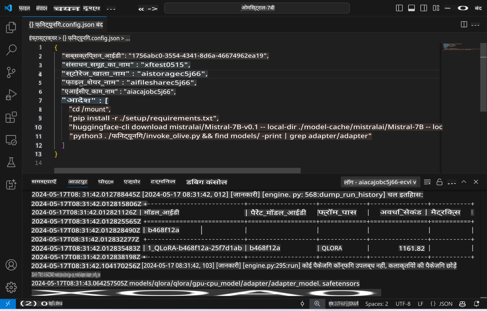
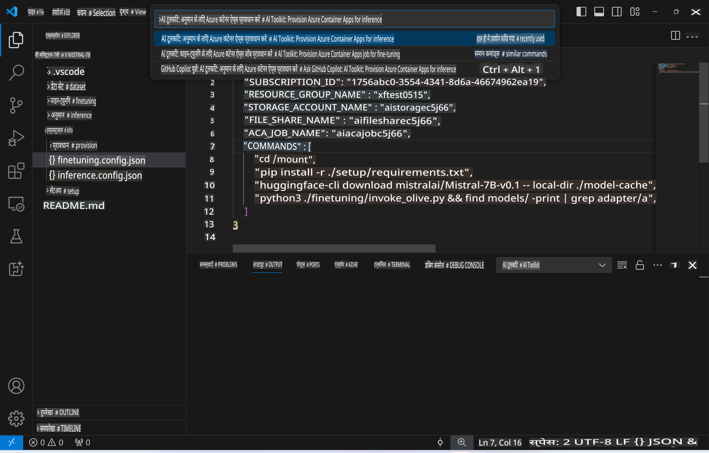
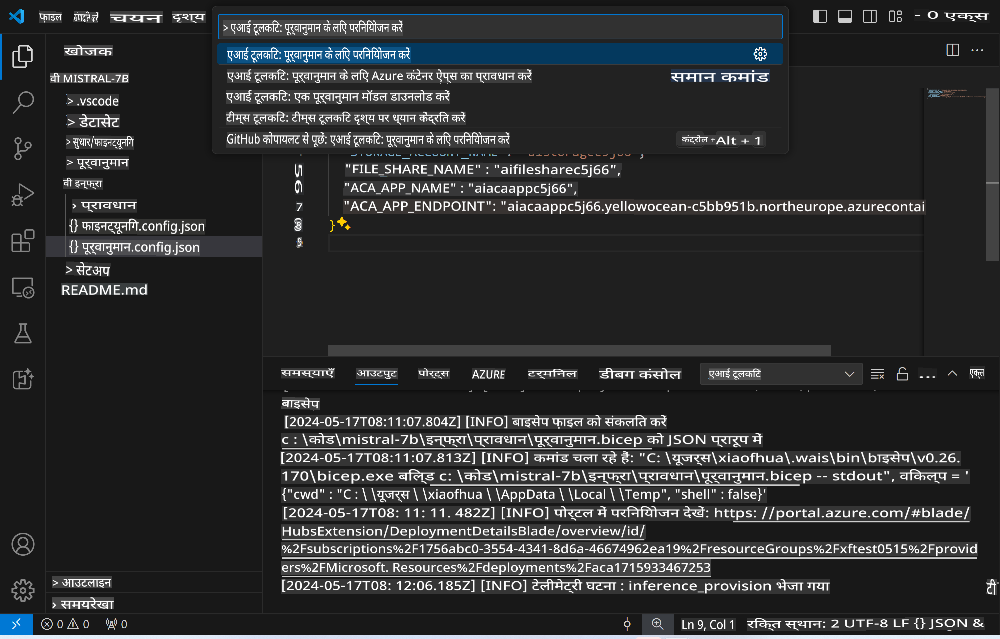

# फाइन-ट्यून किए गए मॉडल के साथ रिमोट इनफरेंसिंग

जब एडॉप्टर्स को रिमोट वातावरण में प्रशिक्षित कर लिया जाए, तो मॉडल के साथ इंटरैक्ट करने के लिए एक सरल Gradio एप्लिकेशन का उपयोग करें।



### Azure संसाधनों का प्रावधान करें
रिमोट इनफरेंसिंग के लिए Azure संसाधनों को सेटअप करने के लिए कमांड पैलेट से `AI Toolkit: Provision Azure Container Apps for inference` चलाएं। इस सेटअप के दौरान, आपको अपनी Azure सब्सक्रिप्शन और रिसोर्स ग्रुप चुनने के लिए कहा जाएगा।  

   
डिफ़ॉल्ट रूप से, इनफरेंस के लिए सब्सक्रिप्शन और रिसोर्स ग्रुप वही होना चाहिए जो फाइन-ट्यूनिंग के लिए उपयोग किए गए थे। इनफरेंसिंग Azure Container App Environment का उपयोग करेगा और Azure Files में संग्रहीत मॉडल और मॉडल एडॉप्टर तक पहुंच बनाएगा, जो फाइन-ट्यूनिंग चरण के दौरान उत्पन्न हुए थे।

## AI टूलकिट का उपयोग करना 

### इनफरेंस के लिए परिनियोजन  
यदि आप इनफरेंस कोड को संशोधित करना चाहते हैं या इनफरेंस मॉडल को फिर से लोड करना चाहते हैं, तो कृपया `AI Toolkit: Deploy for inference` कमांड चलाएं। यह आपके नवीनतम कोड को ACA के साथ सिंक करेगा और रेप्लिका को पुनः प्रारंभ करेगा।  



परिनियोजन के सफलतापूर्वक पूरा होने के बाद, मॉडल अब इस एंडपॉइंट का उपयोग करके मूल्यांकन के लिए तैयार है।

### इनफरेंस API तक पहुंच

आप VSCode नोटिफिकेशन में प्रदर्शित "*Go to Inference Endpoint*" बटन पर क्लिक करके इनफरेंस API तक पहुंच सकते हैं। वैकल्पिक रूप से, वेब API एंडपॉइंट `ACA_APP_ENDPOINT` में `./infra/inference.config.json` और आउटपुट पैनल में पाया जा सकता है।


> **नोट:** इनफरेंस एंडपॉइंट को पूरी तरह से कार्यात्मक होने में कुछ मिनट लग सकते हैं।

## टेम्पलेट में शामिल इनफरेंस घटक
 
| फ़ोल्डर | सामग्री |
| ------ |--------- |
| `infra` | रिमोट संचालन के लिए आवश्यक सभी कॉन्फ़िगरेशन शामिल करता है। |
| `infra/provision/inference.parameters.json` | बाइसप टेम्पलेट्स के लिए पैरामीटर रखता है, जो Azure संसाधनों के प्रावधान के लिए उपयोग किए जाते हैं। |
| `infra/provision/inference.bicep` | Azure संसाधनों के प्रावधान के लिए टेम्पलेट्स शामिल करता है। |
| `infra/inference.config.json` | कॉन्फ़िगरेशन फ़ाइल, जो `AI Toolkit: Provision Azure Container Apps for inference` कमांड द्वारा उत्पन्न होती है। यह अन्य रिमोट कमांड पैलेट्स के लिए इनपुट के रूप में उपयोग की जाती है। |

### Azure संसाधन प्रावधान को कॉन्फ़िगर करने के लिए AI टूलकिट का उपयोग
[AI टूलकिट](https://marketplace.visualstudio.com/items?itemName=ms-windows-ai-studio.windows-ai-studio) को कॉन्फ़िगर करें।

इनफरेंस के लिए Azure Container Apps को प्रावधान करें ` command.

You can find configuration parameters in `./infra/provision/inference.parameters.json` file. Here are the details:
| Parameter | Description |
| --------- |------------ |
| `defaultCommands` | This is the commands to initiate a web API. |
| `maximumInstanceCount` | This parameter sets the maximum capacity of GPU instances. |
| `location` | This is the location where Azure resources are provisioned. The default value is the same as the chosen resource group's location. |
| `storageAccountName`, `fileShareName` `acaEnvironmentName`, `acaEnvironmentStorageName`, `acaAppName`,  `acaLogAnalyticsName` | These parameters are used to name the Azure resources for provision. By default, they will be same to the fine-tuning resource name. You can input a new, unused resource name to create your own custom-named resources, or you can input the name of an already existing Azure resource if you'd prefer to use that. For details, refer to the section [Using existing Azure Resources](../../../../../md/01.Introduction/03). |

### Using Existing Azure Resources

By default, the inference provision use the same Azure Container App Environment, Storage Account, Azure File Share, and Azure Log Analytics that were used for fine-tuning. A separate Azure Container App is created solely for the inference API. 

If you have customized the Azure resources during the fine-tuning step or want to use your own existing Azure resources for inference, specify their names in the `./infra/inference.parameters.json` फ़ाइल। फिर, कमांड पैलेट से `AI Toolkit: Provision Azure Container Apps for inference` कमांड चलाएं। यह किसी भी निर्दिष्ट संसाधनों को अपडेट करता है और जो गायब हैं उन्हें बनाता है।

उदाहरण के लिए, यदि आपके पास एक मौजूदा Azure कंटेनर वातावरण है, तो आपका `./infra/finetuning.parameters.json` इस प्रकार दिखना चाहिए:

```json
{
    "$schema": "https://schema.management.azure.com/schemas/2019-04-01/deploymentParameters.json#",
    "contentVersion": "1.0.0.0",
    "parameters": {
      ...
      "acaEnvironmentName": {
        "value": "<your-aca-env-name>"
      },
      "acaEnvironmentStorageName": {
        "value": null
      },
      ...
    }
  }
```

### मैन्युअल प्रावधान  
यदि आप Azure संसाधनों को मैन्युअल रूप से कॉन्फ़िगर करना पसंद करते हैं, तो आप `./infra/provision` folders. If you have already set up and configured all the Azure resources without using the AI Toolkit command palette, you can simply enter the resource names in the `inference.config.json` फ़ाइल में दिए गए बाइसप फ़ाइलों का उपयोग कर सकते हैं।

उदाहरण के लिए:

```json
{
  "SUBSCRIPTION_ID": "<your-subscription-id>",
  "RESOURCE_GROUP_NAME": "<your-resource-group-name>",
  "STORAGE_ACCOUNT_NAME": "<your-storage-account-name>",
  "FILE_SHARE_NAME": "<your-file-share-name>",
  "ACA_APP_NAME": "<your-aca-name>",
  "ACA_APP_ENDPOINT": "<your-aca-endpoint>"
}
```

**अस्वीकरण**:  
यह दस्तावेज़ मशीन-आधारित एआई अनुवाद सेवाओं का उपयोग करके अनुवादित किया गया है। जबकि हम सटीकता सुनिश्चित करने का प्रयास करते हैं, कृपया ध्यान दें कि स्वचालित अनुवाद में त्रुटियां या गलतियां हो सकती हैं। मूल दस्तावेज़, जो इसकी मूल भाषा में है, को प्रामाणिक स्रोत माना जाना चाहिए। महत्वपूर्ण जानकारी के लिए, पेशेवर मानव अनुवाद की सिफारिश की जाती है। इस अनुवाद के उपयोग से उत्पन्न किसी भी गलतफहमी या गलत व्याख्या के लिए हम उत्तरदायी नहीं हैं।